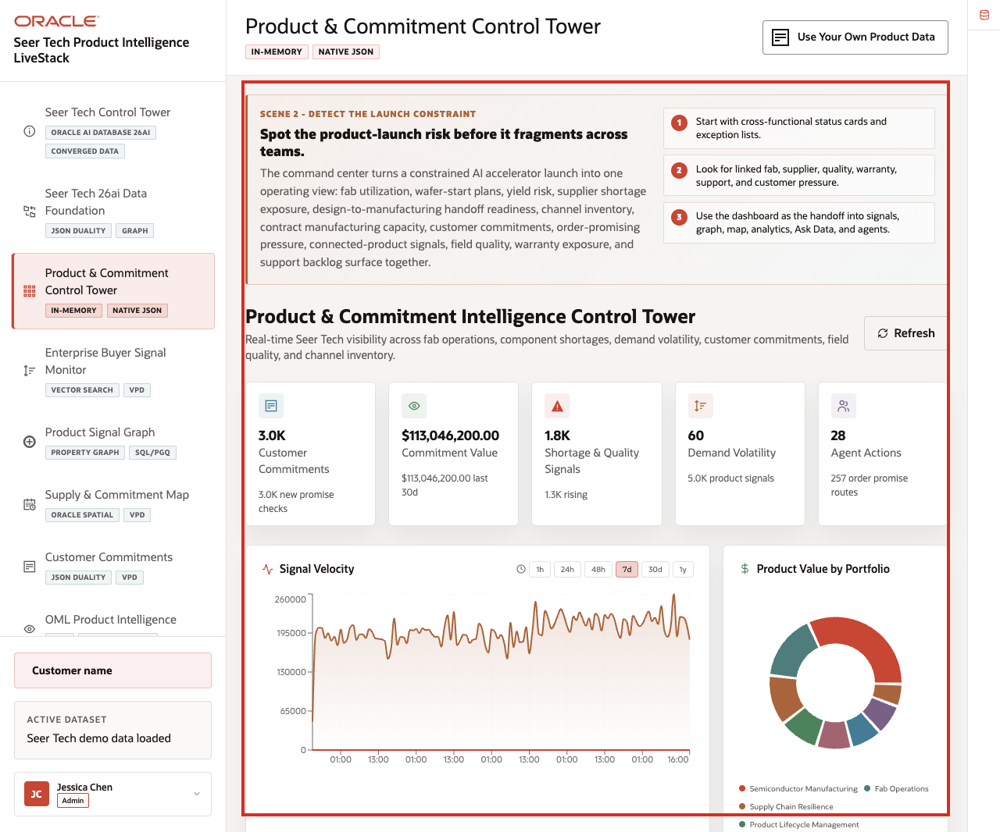
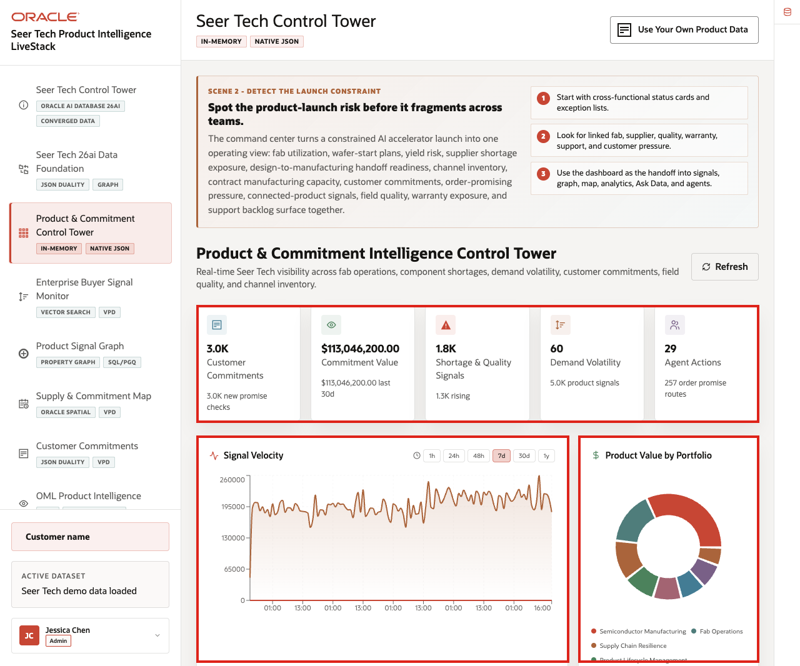
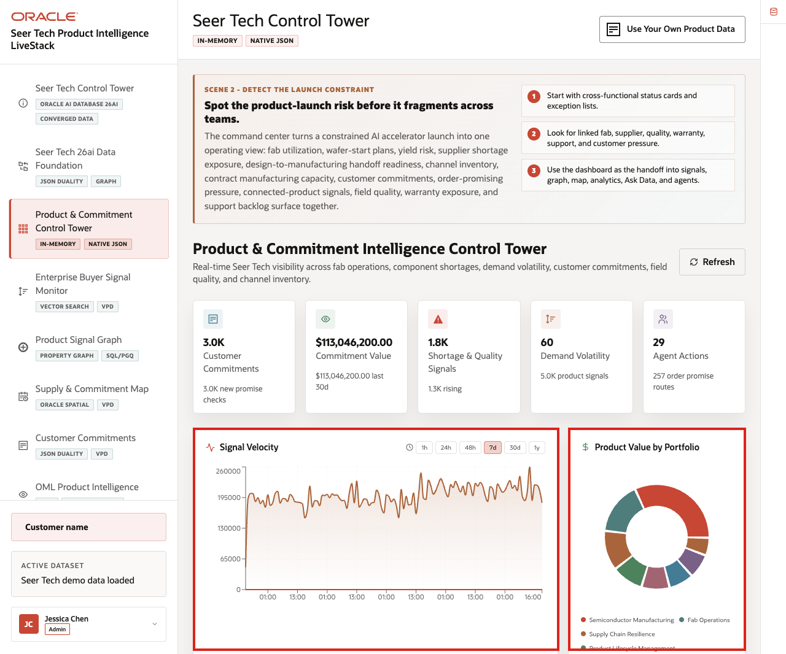
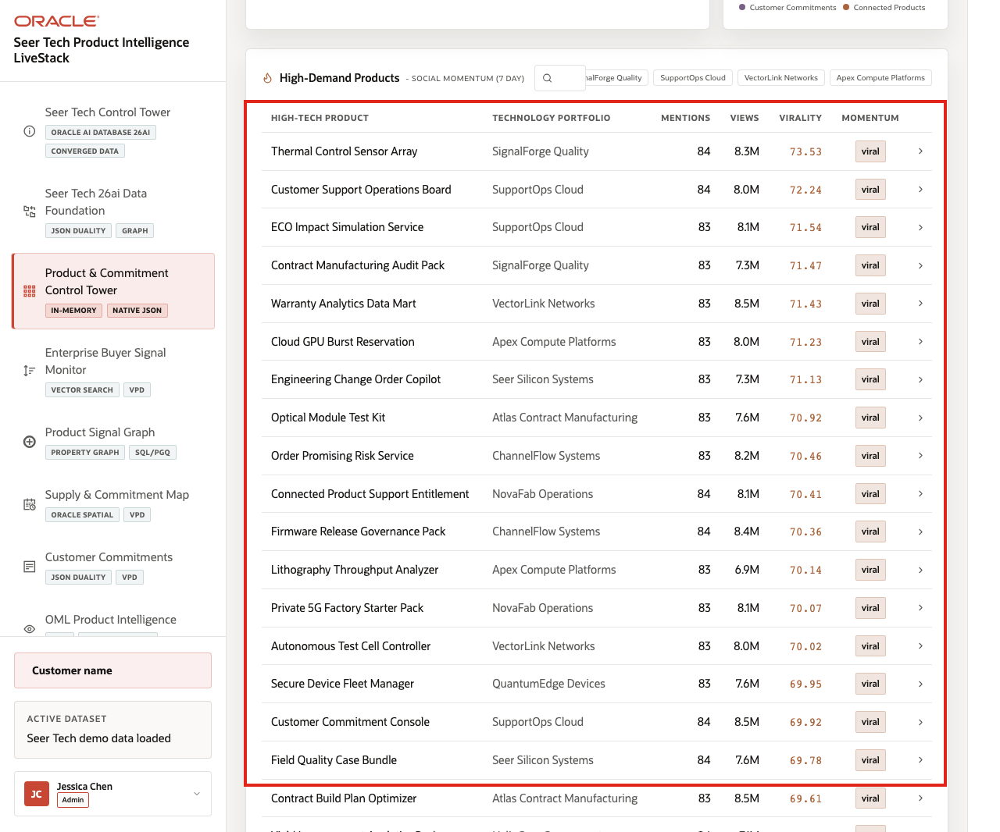

# Scene 3 Product & Commitment Control Tower

## Introduction

The **Product & Commitment Control Tower** helps product, supply, manufacturing, quality, and customer operations leaders answer the first launch-risk question: *Where does the product portfolio need attention right now?*

The page brings together customer commitments, commitment value, shortage and quality signals, demand volatility, signal velocity, product portfolio value, watched products, and agent activity so teams can decide where to investigate first.

Dashboards like this are difficult when customer commitments, product signals, supplier risk, fab capacity, warranty indicators, field quality, and agent actions live in different systems. Oracle AI Database helps keep operational, analytical, JSON, in-memory, and AI-ready data close to the same governed foundation.

Estimated Time: **10 minutes**

### Objectives

In this scene, you will learn how a High Tech control tower detects launch and commitment pressure and hands the investigation to signals, graph, spatial, analytics, Ask Data, and agent workflows.

**Note:** Oracle Internals is collapsed by default. Expand it after the business flow is clear to connect the visible outcome to the database capabilities behind the page.

## Task 1: Review the control tower dashboard

Perform the following set of steps to use the dashboard as a daily triage view and show where customer commitment, product value, shortage, quality, demand, and AI activity are accumulating:

1. Click **Product & Commitment Control Tower** in the sidebar.
2. Review the KPI cards across the top of the page.
3. Review **Signal Velocity**.
4. Review **Product Value by Portfolio**.
5. Review the high-demand products and watched commitments area.

    

In the current demo dataset, the page shows **3.0K** customer commitments, about **$113.0M** in commitment value, **1.8K** shortage and quality signals, **60** products with demand volatility, and **27** agent actions. Use those numbers to frame the page as a triage surface: the user can see commitment pressure, value, signal movement, and AI activity in one place.

**Note:** Sample values may change after data refreshes or rebuilds. Verify live output before presenting, then explain the business takeaway.

## Task 2: Interpret signal velocity and product value

Perform the following set of steps to understand where operational importance and risk are moving at the same time:

1. Click a signal velocity time range such as **24h**, **48h**, **7d**, **30d**, or **1y** when available.
2. Review how the signal chart changes by time bucket.
3. Review the product value chart by technology portfolio.
4. Focus on visible portfolios such as Semiconductor Manufacturing, Fab Operations, Supply Chain Resilience, Product Lifecycle Management, Connected Products, Quality & Warranty, Service Operations, or Customer Commitments.

    

The key business story is that High Tech users need to know where value, volume, component pressure, quality risk, and customer exposure are moving together before a launch issue becomes a customer escalation.

## Task 3: Review watched products and commitments

Perform the following set of steps to move from dashboard-level pressure to the specific product, component, supply site, or commitment that may need attention:

1. Scroll to **High-Demand Products**.
2. Use the search box to filter for a product, component, or program when rows are available.
3. Review columns for product, portfolio, signal count, inventory, demand, and next action.
4. Look for product examples such as **AI Accelerator Module**, **AI Edge Gateway Reference Kit**, **Component Allocation Optimizer**, **Connected Device Health Twin**, **Field Failure Pattern Detector**, or **Wafer Starts Commit Planner** when they are visible.

    

The watched product table turns the KPI story into operating decisions. A High Tech leader can move from "demand volatility is high" to the product, component, supplier, fab, service program, or customer commitment that needs review.

**Note:** Sample values may change after data refreshes or rebuilds. Verify live output before presenting, then explain the business takeaway.

*You can move to the next scene.*

## Credits & Build Notes
- **Author** - Oracle LiveLabs Team
- **Last Updated By/Date** - Oracle LiveLabs Team, 2026-06-16
- **Source Bundle** - `livestack-hightech.zip`
