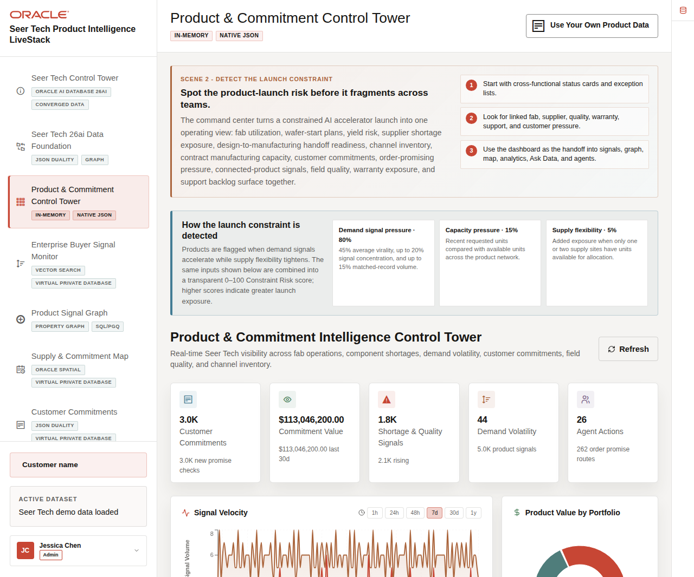
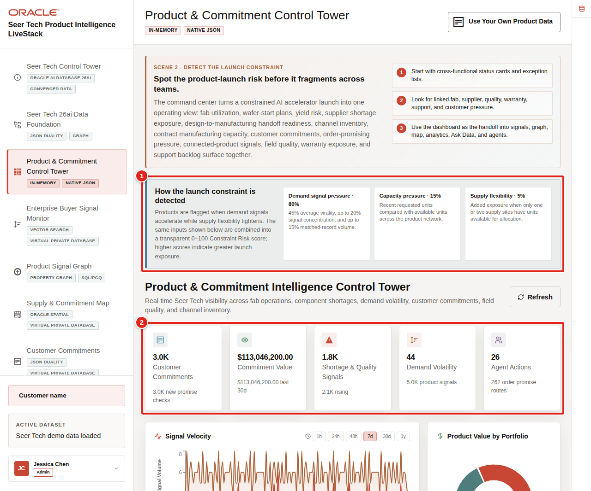
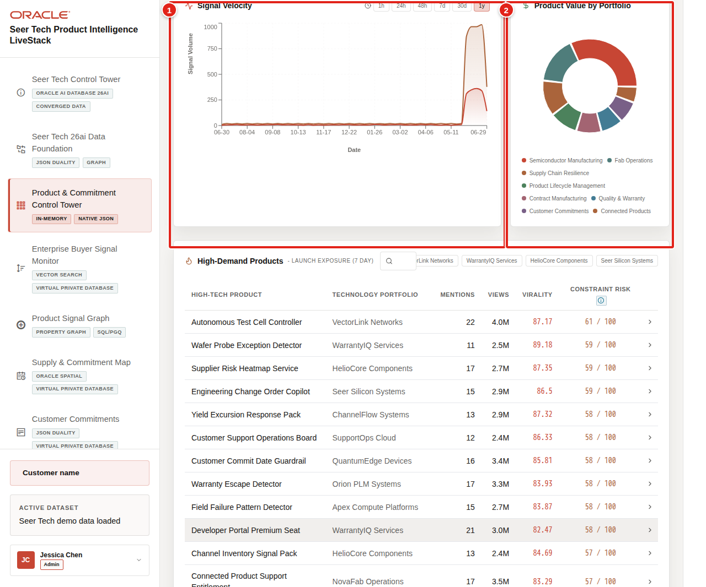
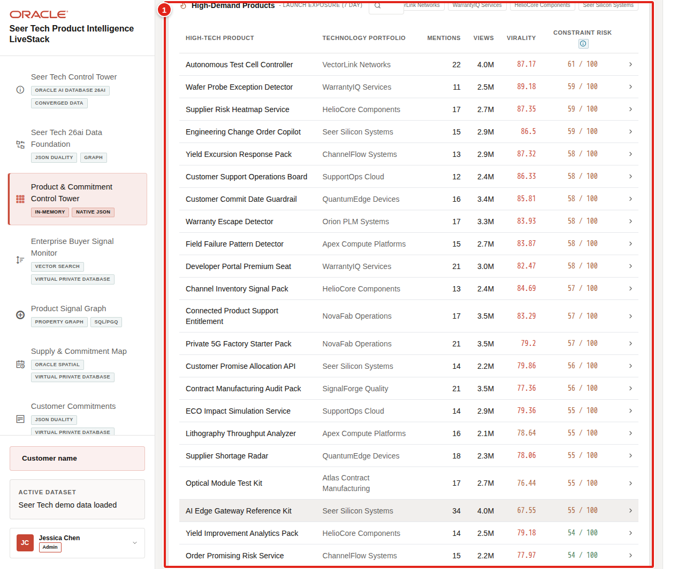

# Scene 3 Product & Commitment Intelligence Control Tower

## Introduction

The **Product & Commitment Intelligence Control Tower** detects the first sign that Seer Tech's AI infrastructure release train may miss its launch window. Demand is accelerating across products such as **Wafer Probe Exception Detector**, **Engineering Change Order Copilot**, **Supplier Risk Heatmap Service**, **Autonomous Test Cell Controller**, and **AI Edge Gateway Reference Kit**, while component, fab, supplier, and allocation flexibility remain finite.

Instead of treating every signal as a separate alert, the control tower combines demand-signal velocity, signal concentration, matched-record volume, recent requested units, available inventory, and supply-site flexibility into one launch-exposure view. The objective is not simply to find the most popular product; it is to identify where rising demand and limited supply options can affect a launch or customer commitment.

Estimated Time: **10 minutes**

### Objectives

In this scene, you will learn how Seer Tech detects a launch constraint, validates the demand trend over different time horizons, and identifies the products with the greatest constraint exposure.

**Note:** Oracle Internals is collapsed by default. Keep the business explanation visible first, then expand Oracle Internals when the audience wants implementation evidence.

## Task 1: Understand why the launch is being flagged

Use the explanation panel and status cards to connect the detected constraint to visible business evidence:

1. Click **Product & Commitment Control Tower** in the sidebar and confirm the page title **Product & Commitment Intelligence Control Tower**.
2. Read **How the launch constraint is detected**.
3. Review the contribution of demand-signal pressure, capacity pressure, and supply flexibility.
4. Compare those inputs with the status cards for customer commitments, commitment value, shortage and quality signals, demand volatility, and agent actions.

    

The displayed **Constraint Risk** score is a transparent 0–100 demo score. Demand-signal pressure contributes 80%: up to 45 points from average virality, 20 from signal concentration, and 15 from matched-record volume. Capacity pressure contributes up to 15 points from recently requested units compared with available units. Supply flexibility contributes up to 5 points when only one or two sites can allocate the product.

The current dataset typically shows about **3.0K customer commitments**, more than **$113M in commitment value**, and substantial shortage, quality, and demand-volatility activity. Live values can change after a restore or refresh, so present the relationship between the values rather than memorizing a single count.

## Task 2: Validate signal velocity across time

Use the chart to determine whether the pressure is a short spike or a sustained planning issue:

1. Scroll to **Signal Velocity**.
2. Select **24h**, **48h**, **7d**, or **30d** and observe how the time buckets change.
3. Select **1y** and confirm that the chart displays the full twelve-month history.
4. Read the horizontal **Date** axis and vertical **Signal Volume** axis.
5. Hover over the chart to inspect the values for a time bucket.
6. Hover over **Product Value by Portfolio** to retain the dollar-value context for each portfolio.

    

The one-year view distinguishes a repeatable demand pattern from a temporary burst. Product value then adds materiality: a rising signal matters more when it affects a high-value portfolio, a scarce component path, or a large customer-commitment pool.

## Task 3: Prioritize high-demand products by constraint risk

Move from portfolio-level pressure to specific products that require review:

1. Scroll to **High-Demand Products - Launch Exposure (7 Day)**.
2. Compare **Mentions**, **Views**, **Virality**, and **Constraint Risk**.
3. Use the search field to find a product or launch program.
4. Select a row when you want to inspect its unit price, inventory, signals, and allocation context.

    

The rows intentionally vary. A product with fewer mentions can still rank highly if its views accelerate, virality is strong, requested units exceed available inventory, or only a small number of supply sites can respond. That makes **Constraint Risk** more useful to a launch leader than a repeated generic momentum label.

The decision from this scene is clear: Seer Tech has enough evidence to investigate the launch path. Continue to Product Signals to understand which supply, demand, quality, and customer signals are creating the pressure.

*You can move to the next scene.*

## Credits & Build Notes
- **Author** - Oracle LiveLabs Team
- **Last Updated By/Date** - Oracle LiveLabs Team, 2026-07-02
- **Source Bundle** - `livestack-hightech.zip`
