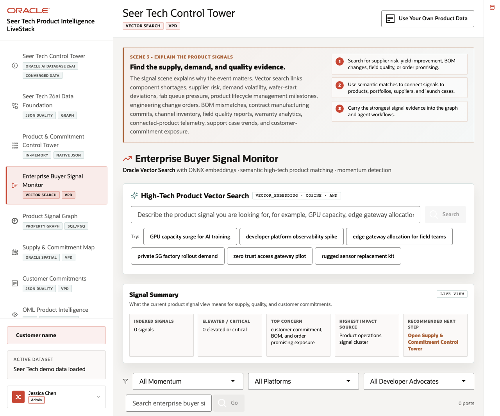
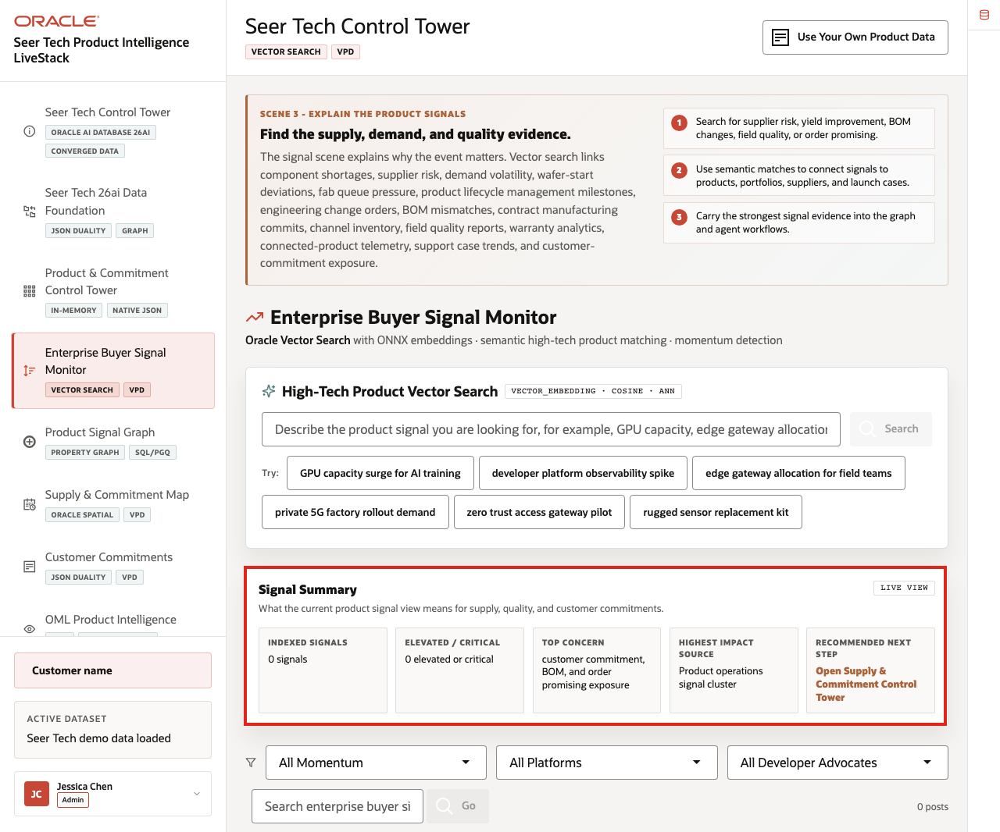
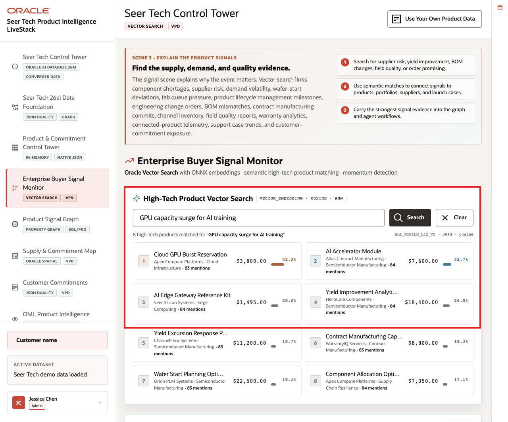
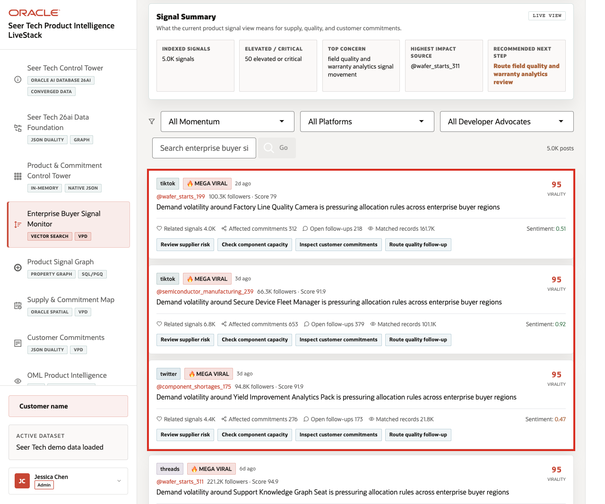

# Scene 4 Enterprise Buyer Signal Monitor

## Introduction

The **Enterprise Buyer Signal Monitor** helps product and operations teams understand why the launch needs attention before the risk is obvious in customer commitments alone.

The page connects component shortages, supplier risk, demand volatility, channel signals, product telemetry, field quality, warranty patterns, engineering change exposure, support trends, and customer commitment context. It uses Oracle AI Vector Search to embed a product-signal question and compare it with High Tech product and signal vectors, then combines semantic matches with operational signal cards.

Semantic search is difficult when supplier notes, partner updates, product telemetry, warranty cases, support tickets, product descriptions, embeddings, search indexes, and access policies live in separate systems. Oracle AI Database keeps vector search close to governed operational data so the search stays tied to live schema context and database access policies.

Estimated Time: **10 minutes**

### Objectives

In this scene, you will learn how vector search connects product, supply, quality, service, and customer commitment signals to the High Tech records that need follow-up.

## Task 1: Review the signal feed

Perform the following set of steps to see how supply, demand, quality, warranty, service, and customer signals are summarized for the operator:

1. Click **Enterprise Buyer Signal Monitor** in the sidebar.
2. Review **High-Tech Product Vector Search** at the top of the page.
3. Review example query chips such as GPU capacity surge, component shortage exposure, field quality patterns, connected-device telemetry, warranty risk, service operations, or customer commitment pressure.
4. Review the **Signal Summary** cards.
5. Review the product-signal feed and filter controls.

    

Use this opening view as the bridge between raw product text and governed High Tech intelligence. The same search pattern can support semiconductor manufacturing, supply chain resilience, product lifecycle management, connected products, quality and warranty, service operations, and customer commitments.

## Task 2: Run semantic product search

Perform the following set of steps to show how an operator can search by operating intent, not only by exact product names or keywords:

1. In **High-Tech Product Vector Search**, click the example **GPU capacity surge for AI training** or enter a similar phrase.
2. Click **Search** when the search action is enabled.
3. Review the returned products, technology portfolios, mentions, prices, and similarity scores.

    

4. Use visible examples such as **AI Accelerator Module**, **AI Edge Gateway Reference Kit**, **Component Allocation Optimizer**, **Component Shortage Scenario Lab**, or **Wafer Starts Commit Planner** to explain semantic matching across product and supply records.

The visible Oracle evidence is the vector path: the query is embedded, compared with product vectors using cosine distance, and returned with model and dimension metadata.

**Notes:**
- Sample values may change after data refreshes or rebuilds. Verify live output before presenting, then explain the business takeaway.
- The operator can search using real product and operations language and still find related records even when the source records use different wording.

## Task 3: Interpret the signal cards

Perform the following set of steps to identify affected products, severity, evidence, and possible next actions, such as checking supplier risk, opening the product graph, reviewing capacity, validating commitments, or preparing an agent action:

1. Scroll to the product signal cards.
2. Review signal source, momentum, affected commitments, matched records, sentiment, and open follow-ups when cards are populated.
3. Use action labels to explain where the operator could go next.

    

The business value is that teams can make the decision from connected, governed data. Oracle AI Database provides the shared foundation that keeps product data, signal search, analytics, and AI workflows aligned.

*You can move to the next scene.*

## Credits & Build Notes
- **Author** - Oracle LiveLabs Team
- **Last Updated By/Date** - Oracle LiveLabs Team, 2026-06-16
- **Source Bundle** - `livestack-hightech.zip`
