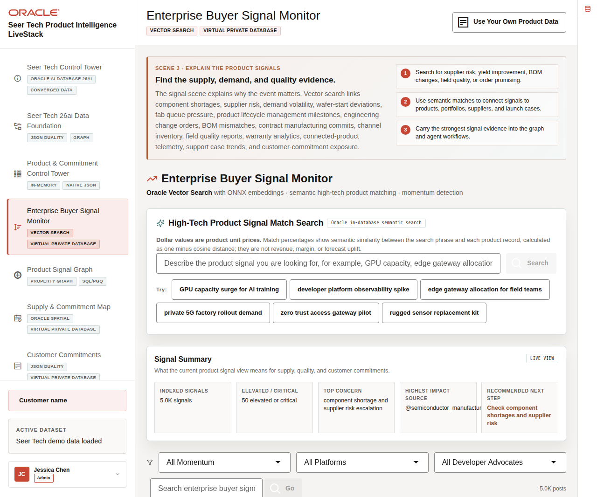
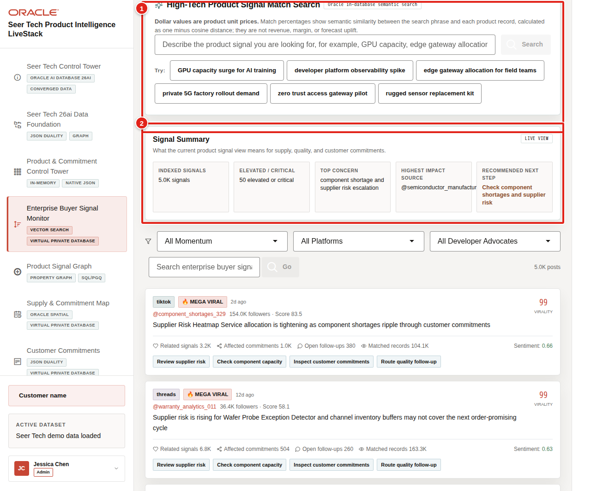
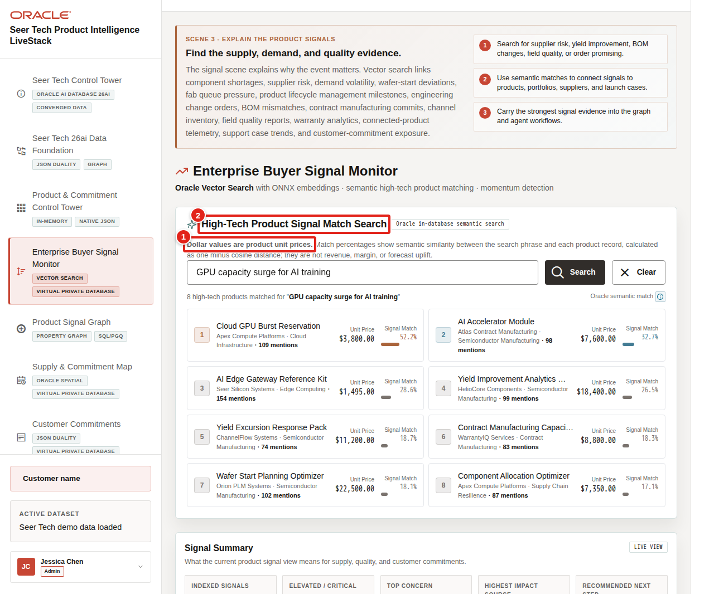
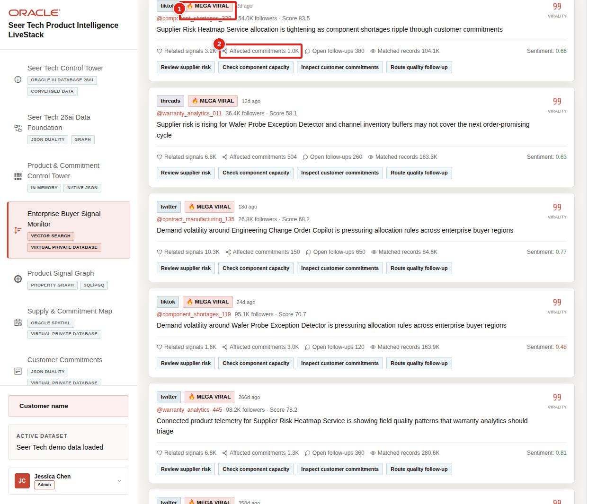

# Scene 4 Enterprise Buyer Signal Monitor

## Introduction

The **Enterprise Buyer Signal Monitor** explains why the launch constraint detected in the control tower matters. Seer Tech searches product and signal records for evidence of GPU capacity pressure, component shortages, supplier exposure, wafer-start changes, engineering change orders, field quality patterns, warranty risk, connected-product telemetry, service demand, and customer-commitment impact.

The page connects component shortages, supplier risk, demand volatility, channel signals, product telemetry, field quality, warranty patterns, engineering change exposure, support trends, and customer commitment context. **Oracle AI Vector Search** helps operators find related signals even when the wording differs across source records.

Semantic search is difficult when supplier notes, partner updates, product telemetry, warranty cases, support tickets, embeddings, search indexes, and access policies live in separate systems. **Oracle AI Database** keeps vector search close to governed operational records, so teams can search by operating intent without breaking the data trail.

**Oracle AI Vector Search** lets an operator describe the operating concern in business language. The database compares that phrase with governed High Tech product vectors and returns semantically related products even when the records do not contain the same keywords.

Estimated Time: **10 minutes**

### Objectives

In this scene, you will learn how to interpret product-signal search results, distinguish unit price from business impact, understand match percentages, and carry the strongest evidence into the product lifecycle graph.

## Task 1: Review the current signal situation

Start with the search and summary panels before opening individual signal cards:

1. Click **Enterprise Buyer Signal Monitor** in the sidebar.
2. Review **High-Tech Product Signal Match Search**.
3. Read the explanation beneath the search title.
4. Review **Signal Summary**, including indexed signals, elevated or critical activity, the top concern, the highest-impact source, and the recommended next step.
5. Review the signal-feed filters and first product-signal cards.

    

The summary converts a large signal feed into an operational handoff. In the current dataset, component shortage and supplier-risk escalation is a common top concern, and the recommended next step directs the operator toward capacity, supplier, or customer-commitment review.

## Task 2: Run a semantic product-signal search

Search by operating intent rather than by an exact stock-keeping unit or product name:

1. Select **GPU capacity surge for AI training**, or enter a similar High Tech phrase.
2. Click **Search**.
3. Review the returned products and technology portfolios.
4. Compare **Unit Price** and **Signal Match** for each result.

    

**Unit Price** is the catalog price of one product or solution unit. It is not estimated revenue impact, margin, shortage cost, or forecast value. **Signal Match** is semantic similarity between the search phrase and the product record, calculated as one minus cosine distance and shown as a percentage. A 92% match therefore means the language is highly related; it does not mean demand will rise by 92%.

The result can connect a GPU-capacity question to products such as **AI Accelerator Module**, **Cloud GPU Burst Reservation**, **AI Edge Gateway Reference Kit**, or related allocation and capacity solutions even when the exact search phrase is absent from the source record.

## Task 3: Interpret product-signal cards

Use the signal cards to understand severity and the downstream operating response:

1. Scroll to the first populated signal cards.
2. Review the source, posting date, audience reach, product-specific message, and **Virality** value.
3. Compare related signals, affected commitments, open follow-ups, matched records, and sentiment.
4. Review action chips such as **Review supplier risk**, **Check component capacity**, **Inspect customer commitments**, and **Route quality follow-up**.

    

Virality is a 0–100 signal-acceleration measure for the current product evidence. The supporting counts explain whether the signal has material operating reach. A highly viral signal with many affected commitments is a stronger launch-risk indicator than virality alone.

The decision from this scene is to trace the strongest evidence through the lifecycle network. Continue to Product Signal Graph to identify the bill of materials, supplier, fab, engineering change, quality, and customer relationships that can propagate the constraint.

*You can move to the next scene.*

## Credits & Build Notes
- **Author** - Oracle LiveLabs Team
- **Last Updated By/Date** - Oracle LiveLabs Team, 2026-07-02
- **Source Bundle** - `livestack-hightech.zip`
