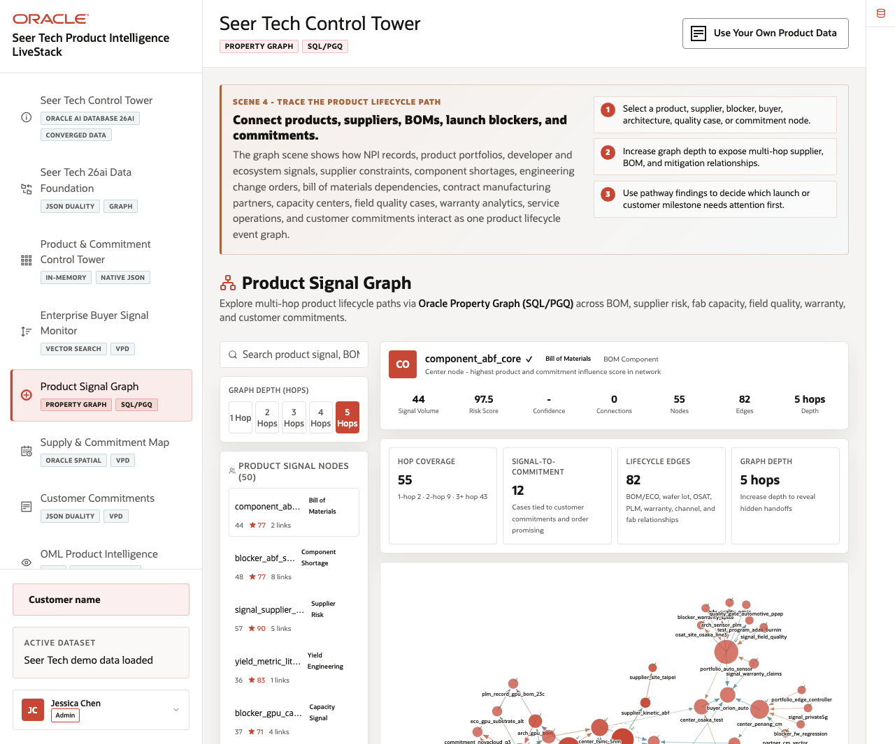
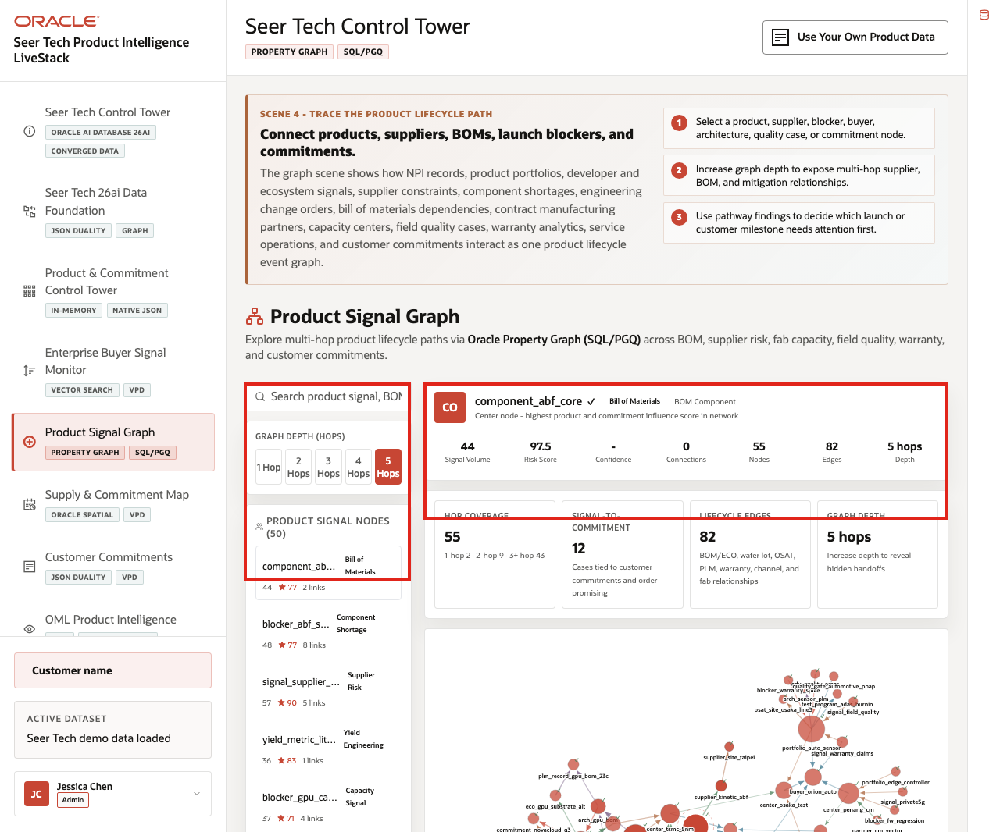
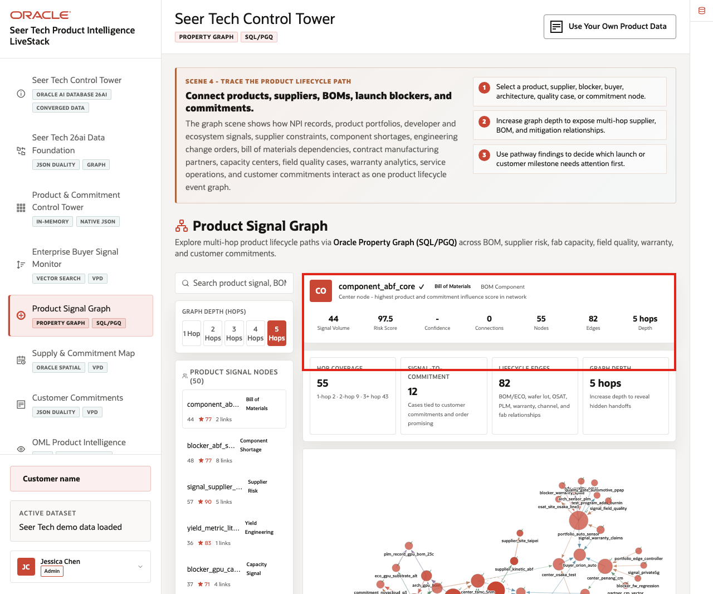
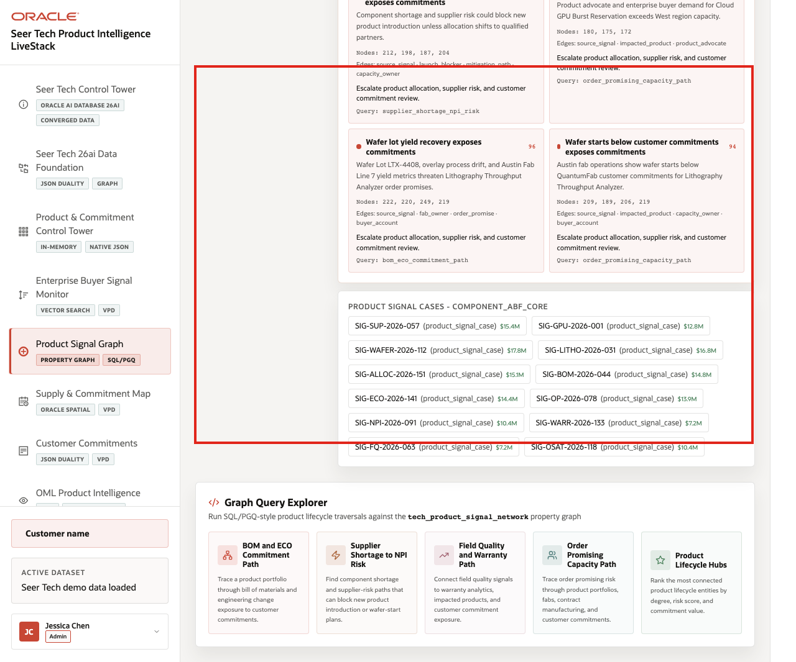
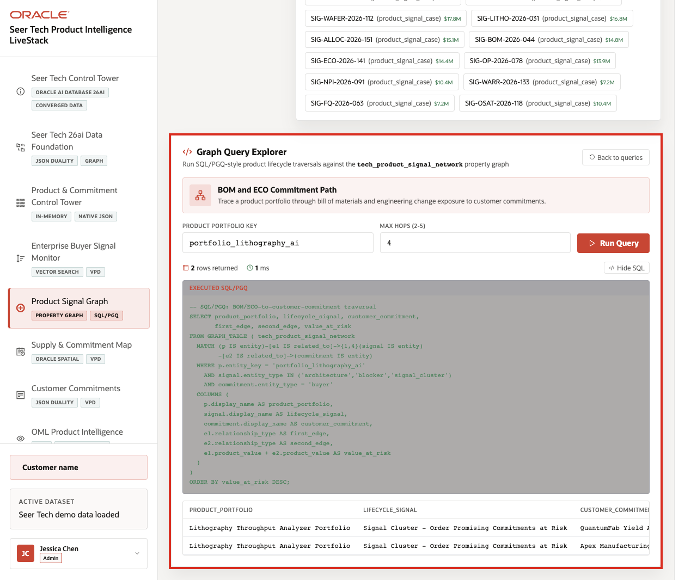

# Scene 5 Product Signal Graph

## Introduction

The **Product Signal Graph** helps users understand relationships that are hard to see in isolated rows. The page connects product lifecycle records, suppliers, bill of materials dependencies, launch blockers, fab capacity, wafer lots, test programs, quality cases, warranty cohorts, service operations, order promises, and customer commitments so teams can follow a product issue as a connected operating path.

High Tech teams struggle when the information needed for one decision lives in separate PLM, MES, ERP, quality, service, warranty, and customer systems. Oracle AI Database helps answer relationship questions across structured, graph, vector, spatial, and operational data so teams can reason across the product lifecycle instead of one record at a time.

Estimated Time: **10 minutes**

### Objectives

In this scene, you will learn how graph relationships connect products, components, suppliers, manufacturing steps, ECOs, NPI milestones, quality programs, service cases, and customer commitments across the launch-risk story.

## Task 1: Review the graph workspace

Perform the following set of steps to see how the product graph connects records across High Tech domains:

1. Click **Product Signal Graph** in the sidebar.
2. Review the graph depth controls: **1 Hop**, **2 Hops**, **3 Hops**, **4 Hops**, and **5 Hops**.
3. Review the search field for product, component, supplier, fab, quality, warranty, service, or customer commitment lookup.
4. Review **Product Signal Graph Nodes** and the selected node summary.
5. Expand **Oracle Internals** after the business flow is clear and review the property graph and SQL/PGQ-style evidence.

    

The graph should include High Tech relationships such as **blocks commitment**, **changes BOM**, **manufactured at**, **requires component**, **impacts yield**, **triggers warranty exposure**, **mitigated by ECO**, **feeds order promise**, **consumes wafer starts**, and **backed by capacity reservation** when the live dataset exposes those paths.

**Note:** Sample values may change after data refreshes or rebuilds. Verify live output before presenting, then explain the business takeaway.

## Task 2: Explore a lifecycle-risk example

Perform the following set of steps to show how connected evidence can reveal shared root causes, supplier exposure, yield risk, ECO impact, customer commitment exposure, and service follow-up:

1. In the node list, locate a visible product, component, supplier, launch blocker, quality case, or customer commitment node.
2. Review the node type, identifier, signal volume, risk score, hop coverage, lifecycle edges, and connected cases.
3. Change the graph depth from **1 Hop** to **2 Hops**, **3 Hops**, or **5 Hops** to explain how relationship scope changes.
4. Compare nearby product, BOM, supplier, fab, quality, warranty, service, and customer commitment nodes.

    

Use this example to show why graph context matters: a component shortage, wafer-start constraint, ECO delay, quality signal, customer commitment, and service exposure are more informative together than as isolated records.

## Task 3: Run the graph query explorer

Perform the following set of steps to explain how the graph remains an analysis view over governed High Tech data rather than a disconnected copy:

1. Scroll to **Graph Query Explorer**.
2. Review the example query cards.
3. Select a graph query and click **Run Query**.
4. Review returned rows and the SQL/PGQ-style query path.

    

    

The query explorer makes the Oracle graph pattern explainable. The presenter can show that the graph is not a static illustration; it is backed by queryable product lifecycle relationships over governed Oracle records.

The business value is that teams can make the decision from connected, governed data. **Oracle AI Database** provides the shared foundation that keeps operational data, analytics, graph evidence, and AI workflows aligned.

*You can move to the next scene.*

## Credits & Build Notes
- **Author** - Oracle LiveLabs Team
- **Last Updated By/Date** - Oracle LiveLabs Team, 2026-06-16
- **Source Bundle** - `livestack-hightech.zip`
