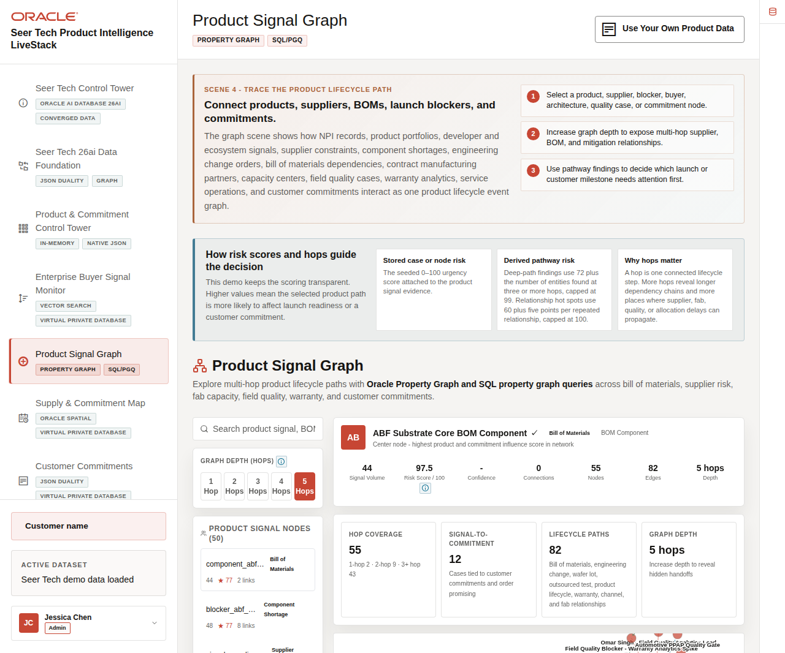
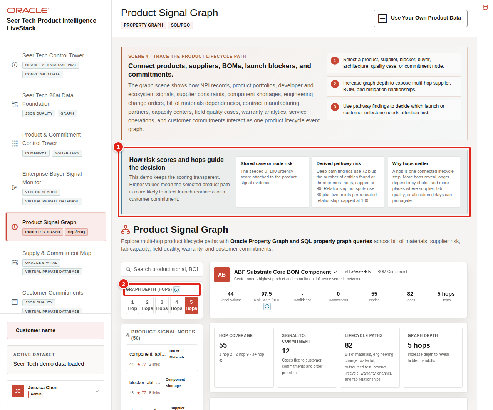
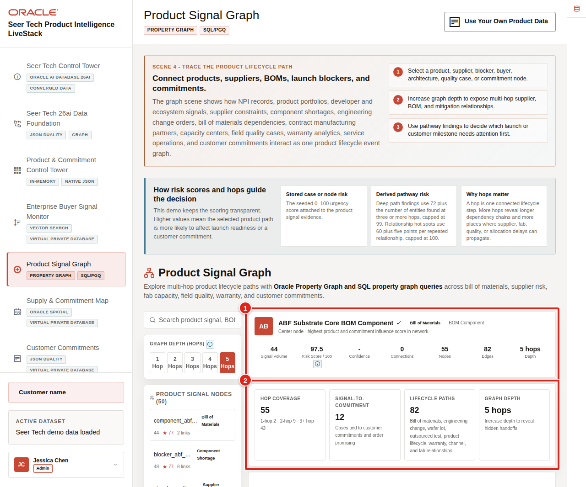
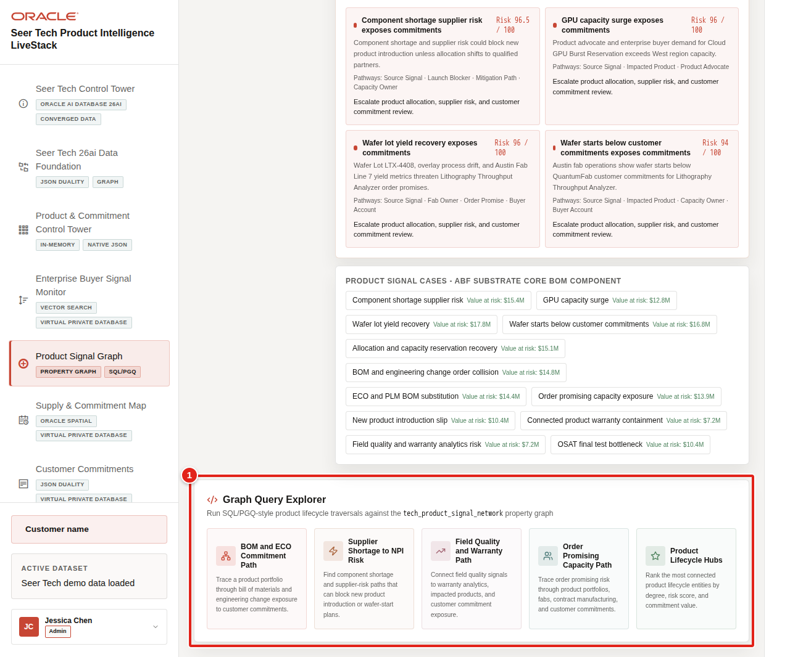
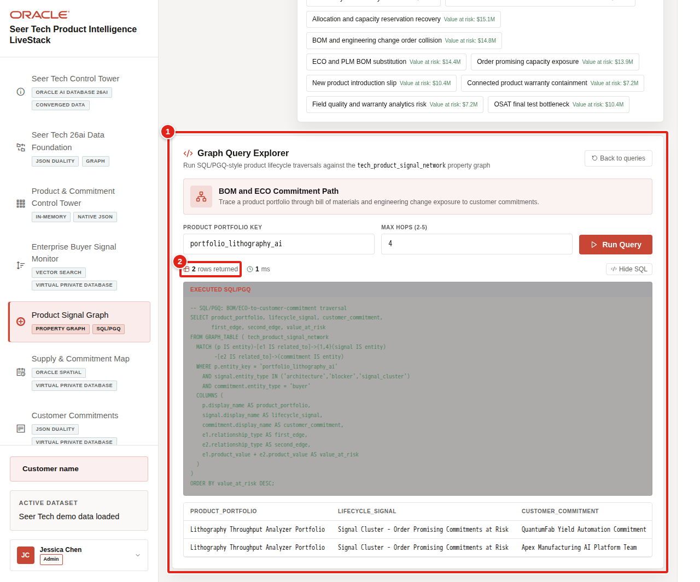

# Scene 5 Product Signal Graph

## Introduction

The **Product Signal Graph** traces the detected launch pressure through Seer Tech's product lifecycle. A supplier signal may connect to an advanced substrate component, a bill of materials, an engineering change order, wafer-start capacity, outsourced assembly and test, a product portfolio, an allocation plan, and finally a customer commitment.

Oracle Property Graph keeps those relationships queryable as one governed network. The graph helps an operator answer a business question that a flat alert list cannot: *Which dependency path can carry this constraint into the launch or a promised customer date?*

Estimated Time: **10 minutes**

### Objectives

In this scene, you will learn how risk scores prioritize lifecycle paths, why graph hops matter, how the Edge Legend explains relationships, and how a business user can run a focused lifecycle query without interpreting raw internal identifiers.

## Task 1: Review risk and graph-depth guidance

Start by understanding the two values that control the investigation:

1. Click **Product Signal Graph** in the sidebar.
2. Read **How risk scores and hops guide the decision**.
3. Select **1 Hop**, then increase the view through **5 Hops**.
4. Observe how additional suppliers, components, fabs, product records, quality evidence, and commitments enter the network.

    

The seeded **Stored case or node risk** is a 0–100 urgency value attached to the demo evidence. **Derived pathway risk** makes the demo calculation explicit: deep-path findings begin at 72 and add one point for each entity found at three or more hops, capped at 99; relationship hot spots begin at 60 and add five points for each repeated relationship, capped at 100.

A **hop** is one connected lifecycle step. More hops reveal a longer dependency chain and more places where supplier, fab, engineering, quality, allocation, or fulfillment delays can propagate. More hops do not automatically mean a worse outcome; they provide broader dependency evidence for the decision.

## Task 2: Inspect a lifecycle-risk path

Use the selected business entity and pathway findings to connect the graph to launch readiness:

1. Select a product, bill-of-materials component, supplier, capacity blocker, engineering change, quality case, or customer-commitment node.
2. Review the display name and plain-language entity type.
3. Compare **Signal Volume**, **Risk Score / 100**, connections, node and edge counts, and graph depth.
4. Review **Hop Coverage**, **Signal-to-Commitment**, **Lifecycle Paths**, and the connected business entities.
5. Scroll to **Key Pathway Findings** and compare the risk, description, pathway roles, value at risk, and recommended action.

    

The current graph commonly surfaces paths involving advanced substrate availability, wafer-start variance, engineering changes, capacity reservations, outsourced semiconductor assembly and test, order promising, field quality, and warranty containment. These are business dependencies, not isolated database keys.

Keep the **Edge Legend** visible during the walkthrough. It explains relationship groups such as demand signals, customer commitments, supply resilience, fab and manufacturing flow, product data and engineering change control, and quality and service intelligence.

## Task 3: Run a focused graph query

Use a prepared business query to validate a specific lifecycle path:

1. Scroll to **Graph Query Explorer**.
2. Select **BOM and ECO Commitment Path**. Here, BOM means **bill of materials** and ECO means **engineering change order**.
3. Review the plain-language description and maximum hop count.
4. Click **Run Query**.
5. Review the returned product portfolio, lifecycle signal, customer commitment, relationship path, and value at risk.

    

    

The query confirms whether the launch issue is connected to a real customer or fulfillment dependency. It also gives supply and product teams a shared path to discuss instead of asking each group to reconcile separate records.

The decision from this scene is to coordinate capacity and allocation using the locations that can respond. Continue to the Supply & Commitment Map.

*You can move to the next scene.*

## Credits & Build Notes
- **Author** - Oracle LiveLabs Team
- **Last Updated By/Date** - Oracle LiveLabs Team, 2026-07-02
- **Source Bundle** - `livestack-hightech.zip`
