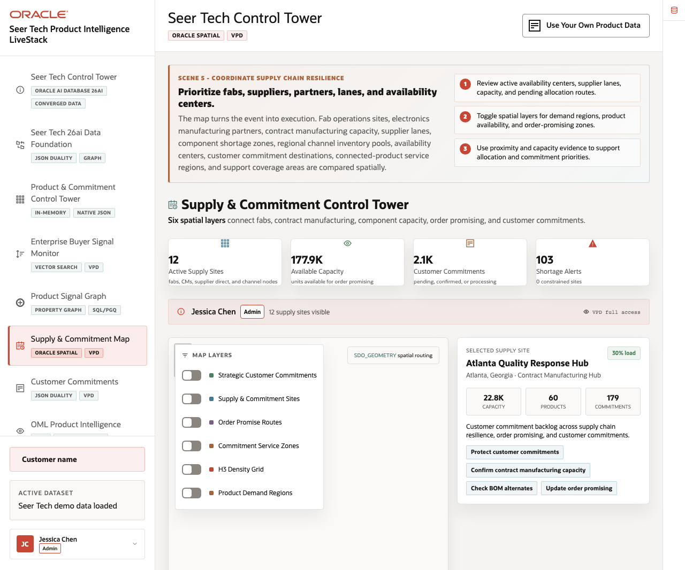
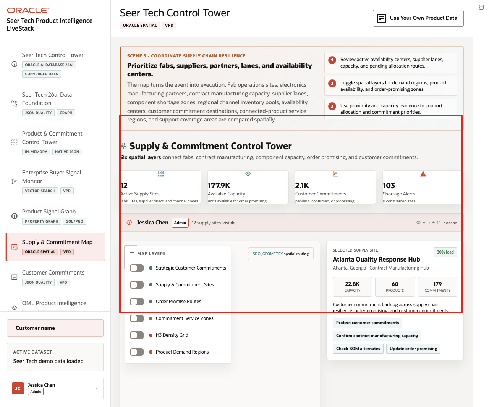
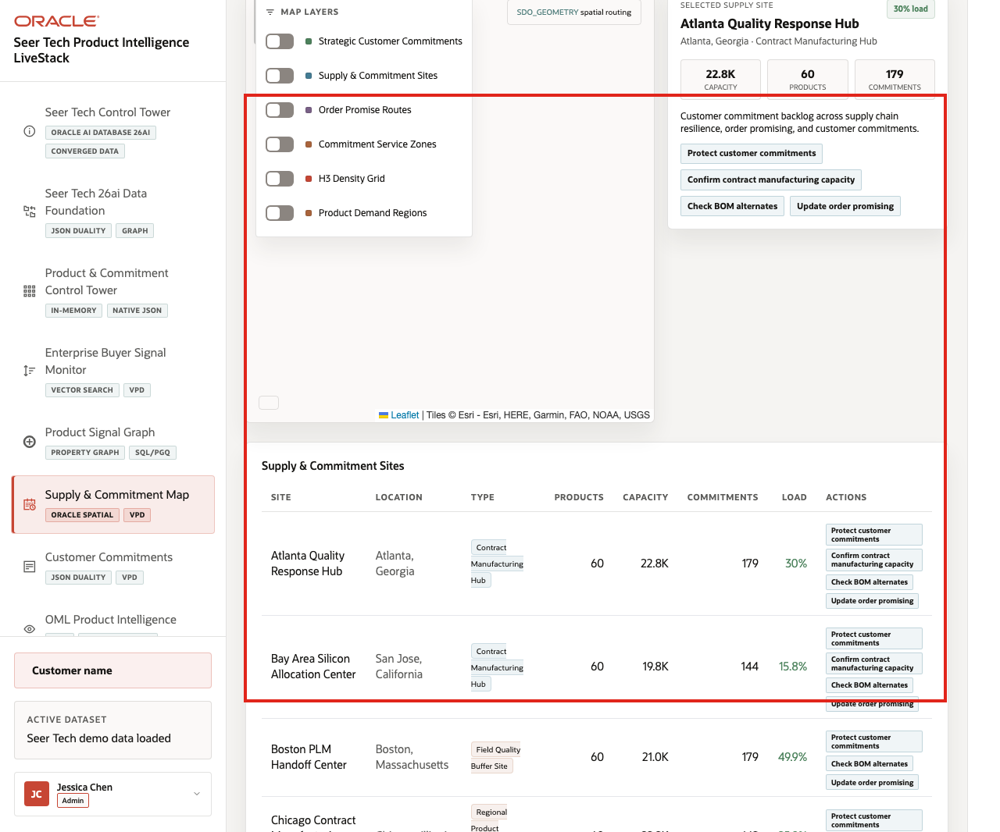
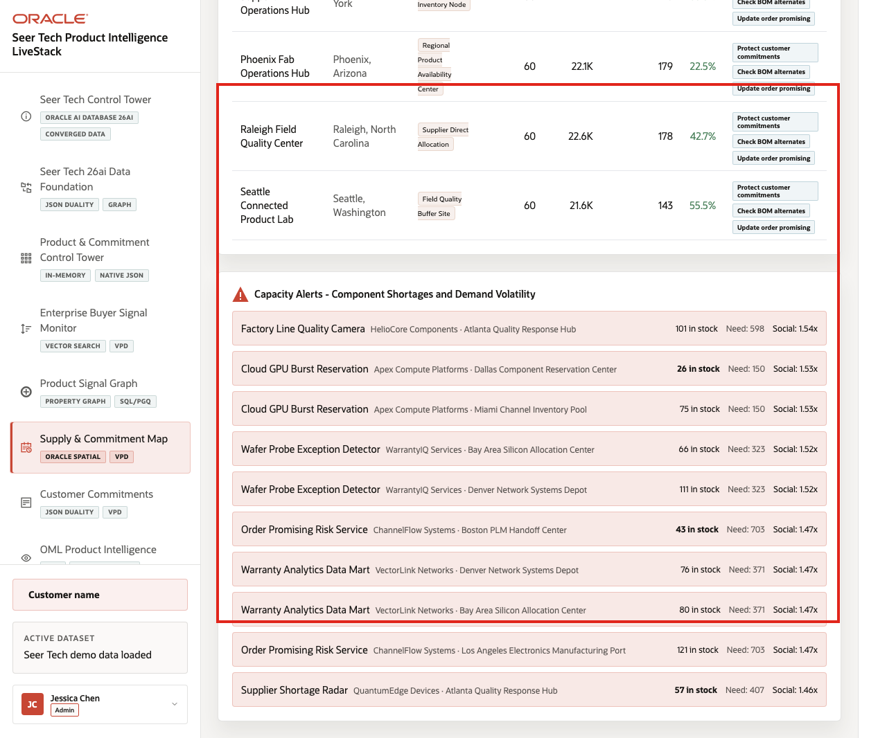

# Scene 6 Supply & Commitment Map

## Introduction

The **Supply & Commitment Map** helps teams decide where fabs, contract manufacturing sites, supplier lanes, channel inventory buffers, customer commitment destinations, service regions, and order-promising decisions intersect.

The page turns location context into an operating decision across semiconductor manufacturing, electronics manufacturing, component allocation, customer commitments, service logistics, and field quality workflows.

Location-aware decisions are difficult when supply sites, customer destinations, route commitments, service zones, capacity constraints, and demand regions live outside the operational data platform. Oracle AI Database keeps spatial geometry and operational records together so the map can support order promising, allocation, service coverage, and supply-risk decisions.

Estimated Time: **10 minutes**

### Objectives

In this scene, you will learn how Oracle Spatial supports supply allocation, commitment protection, contract manufacturing coordination, product availability, and service-region planning.

## Task 1: Review supply and commitment priorities

Perform the following set of steps to understand where capacity, customer commitments, shortage alerts, service coverage, and route coverage may require attention:

1. Click **Supply & Commitment Map** in the sidebar.
2. Review the KPI cards for active supply sites, available capacity, customer commitments, and shortage alerts.
3. Review the VPD banner and selected supply site card.
4. Use the selected site card to connect geography to product availability and customer commitments.

    

In the current demo dataset, the map shows **12** active supply sites, about **177.9K** available units, about **2.1K** customer commitments, and **103** shortage alerts. The selected site card turns spatial context into operating actions such as protecting customer commitments, confirming contract manufacturing capacity, checking BOM alternates, and updating order promising.

**Note:** Sample values may change after data refreshes or rebuilds. Verify live output before presenting, then explain the business takeaway.

## Task 2: Toggle spatial layers

Perform the following set of steps to compare different High Tech operating questions: where customer commitments are located, which sites support demand, how routes connect, which zones are covered, and where product demand is concentrated:

1. Review the map and its layer controls.
2. Use **Map Layers** to turn on layers such as Strategic Customer Commitments, Supply & Commitment Sites, Order Promise Routes, Commitment Service Zones, H3 Density Grid, and Product Demand Regions.
3. Review how the map changes as layers are enabled or disabled.
4. Use the spatial attribution badge to explain that Oracle Spatial stores and serves the geometry used by the map.

The layer controls let different users answer different operating questions, such as which Bay Area commitments depend on a silicon allocation center, which contract manufacturing site is close enough to protect an order promise, or which service region overlaps with field quality exposure.

## Task 3: Compare site data with the map

Perform the following set of steps to connect visual location context with concrete operating records such as capacity, commitments, shortage alerts, current load, supported products, and action chips:

1. Scroll to **Supply & Commitment Sites**.
2. Compare site name, location, type, products, capacity, commitments, load, and action chips.

    

3. Scroll to **Capacity Alerts**.
4. Review which products and supply sites need attention.

    

The site table and alerts turn spatial evidence into concrete supply, manufacturing, and customer-commitment actions. A supply leader can move from "shortage alerts are high" to the facility, product, route, or commitment queue that needs review.

The business value is that teams can make the decision from connected, governed data. Oracle AI Database provides the shared foundation that keeps operational data, spatial analysis, analytics, and AI workflows aligned.

*You can move to the next scene.*

## Credits & Build Notes
- **Author** - Oracle LiveLabs Team
- **Last Updated By/Date** - Oracle LiveLabs Team, 2026-06-16
- **Source Bundle** - `livestack-hightech.zip`
