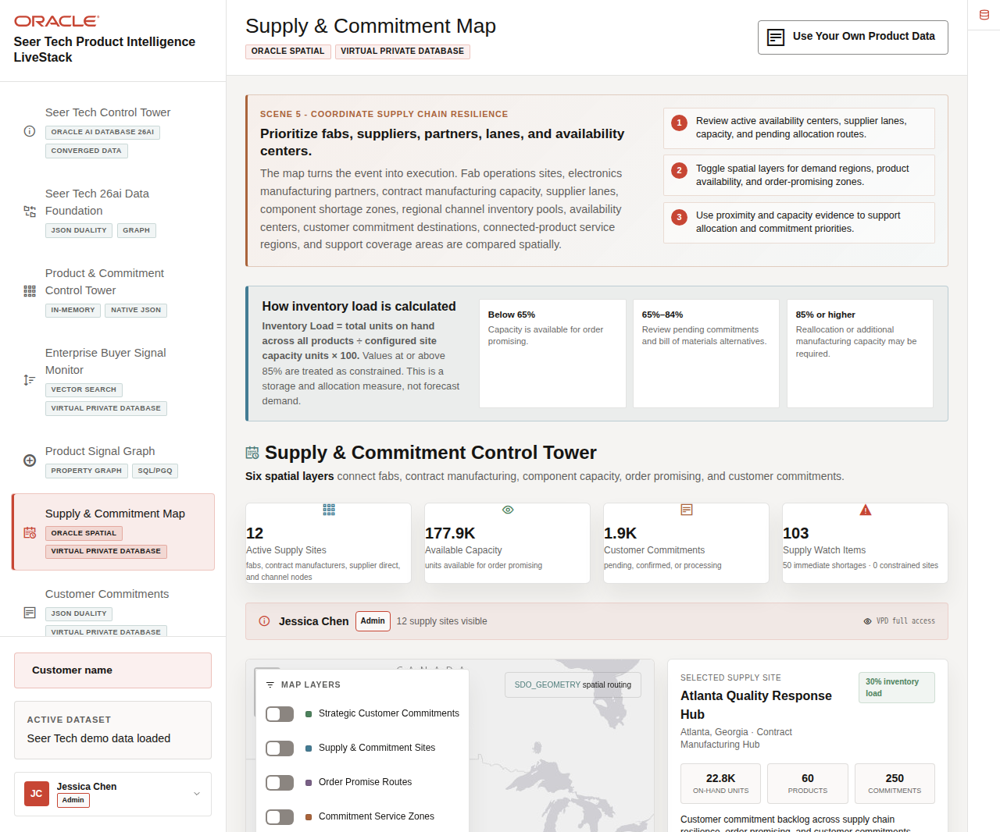
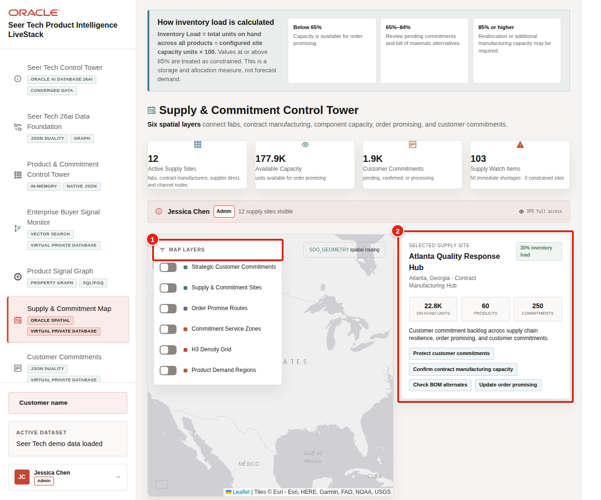
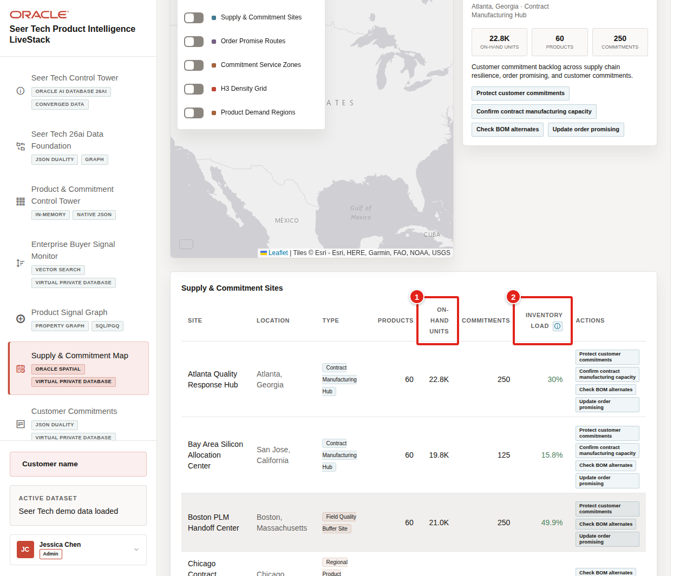
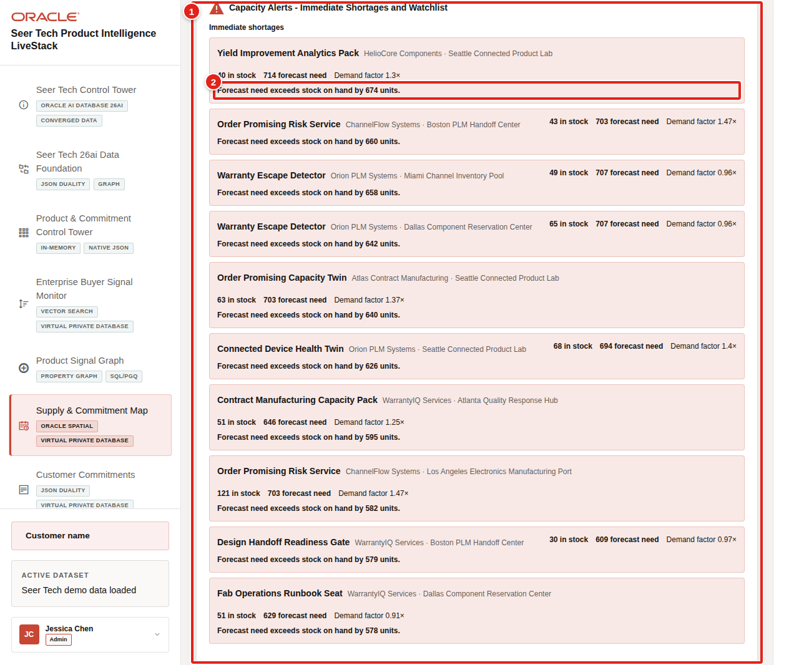

# Scene 6 Supply & Commitment Map

## Introduction

The **Supply & Commitment Control Tower** turns lifecycle risk into a capacity and allocation decision. Seer Tech can compare fabs, contract manufacturing hubs, supplier-direct allocation, channel inventory, field-quality buffers, product availability centers, order-promise routes, and customer destinations on one spatial operating view.

This scene answers the next launch question: *Which locations have inventory and flexibility, and which products have a supported immediate shortage rather than a generic warning?*

Estimated Time: **10 minutes**

### Objectives

In this scene, you will learn how Inventory Load is calculated, how spatial layers support allocation, how site-level actions protect commitments, and how Immediate Shortages differ from watchlist monitoring.

## Task 1: Understand Inventory Load and supply priorities

Use the calculation panel and status cards before choosing a site:

1. Click **Supply & Commitment Map** in the sidebar.
2. Read **How inventory load is calculated**.
3. Review the thresholds below 65%, from 65% through 84%, and at or above 85%.
4. Compare active supply sites, available capacity, customer commitments, and supply watch items.

    

**Inventory Load = total units on hand across all products ÷ configured site capacity units × 100.** It is a storage and allocation measure, not forecast demand. Below 65% indicates available order-promising capacity. From 65% through 84%, planners should review pending commitments and bill-of-materials alternatives. At 85% or higher, reallocation or added manufacturing capacity may be required.

The live demo typically shows **12 active supply sites**, about **177.9K available units**, and roughly **1.9K open customer commitments**. Values can change after a dataset refresh.

## Task 2: Use spatial layers to compare response options

Use the map to understand which facilities and routes can respond to the launch pressure:

1. Review **Map Layers**.
2. Toggle strategic customer commitments, supply and commitment sites, order-promise routes, service zones, density, and product-demand regions.
3. Select a supply site.
4. Review the site type, location, Inventory Load, on-hand units, supported products, and commitments.
5. Review the recommended actions: **Protect customer commitments**, **Confirm contract manufacturing capacity**, **Check BOM alternates**, and **Update order promising**. In the action label, BOM means **bill of materials**.

    

The actions remain prominent because the map is an execution surface, not only a visualization. A product or supply leader should leave this view knowing which facility, alternative component, allocation pool, or promise date needs review.

## Task 3: Distinguish shortages from watchlist items

Compare the site table with the evidence in Capacity Alerts:

1. Scroll to **Supply & Commitment Sites**.
2. Compare **On-Hand Units**, commitments, and **Inventory Load** by site.
3. Scroll to **Capacity Alerts - Immediate Shortages and Watchlist**.
4. Review an **Immediate shortage** card.
5. Confirm that the card shows stock on hand, forecast need, the demand factor, and a reason such as *Forecast need exceeds stock on hand by 674 units*.

    

    

A component is an **Immediate shortage** only when current stock is zero or forecast demand exceeds stock. A product with stock and zero current need must not be presented as a shortage. If such an item is retained for forecast monitoring, it belongs on the watchlist and must state the reason, such as forecast volatility or future demand exposure.

The decision from this scene is to identify which customer promises depend on the constrained path. Continue to **Customer Commitments**.

*You can move to the next scene.*

## Credits & Build Notes
- **Author** - Oracle LiveLabs Team
- **Last Updated By/Date** - Oracle LiveLabs Team, 2026-07-02
- **Source Bundle** - `livestack-hightech.zip`
