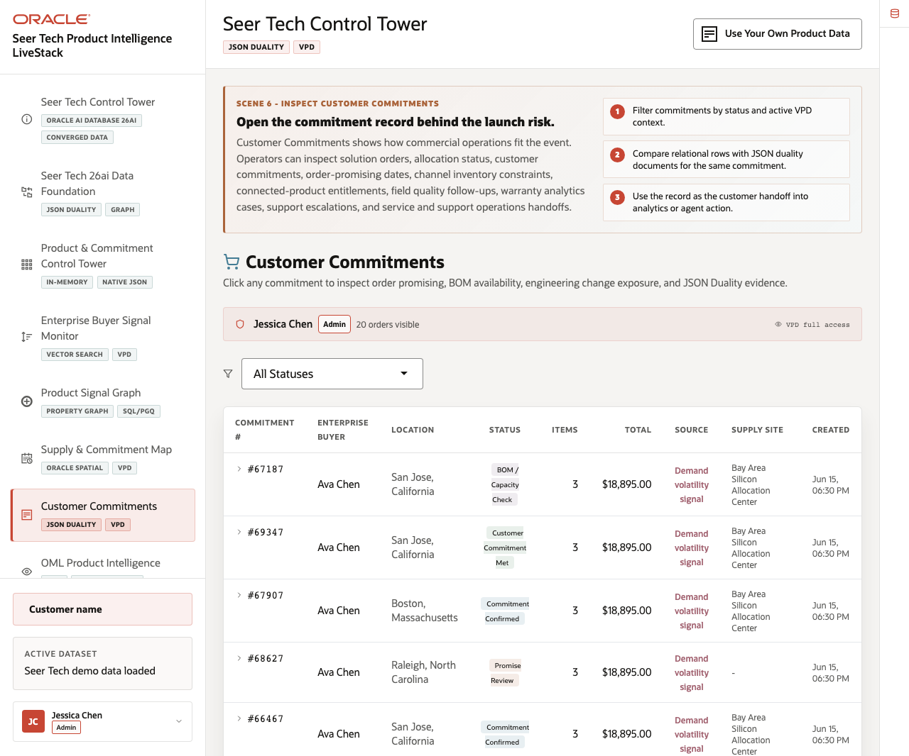
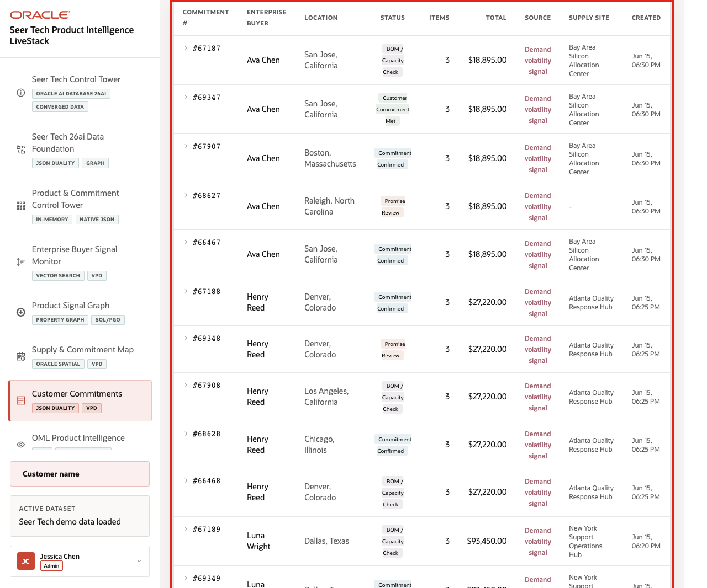
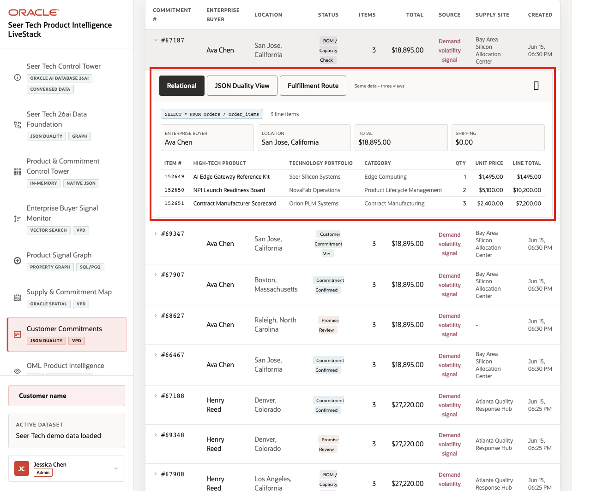
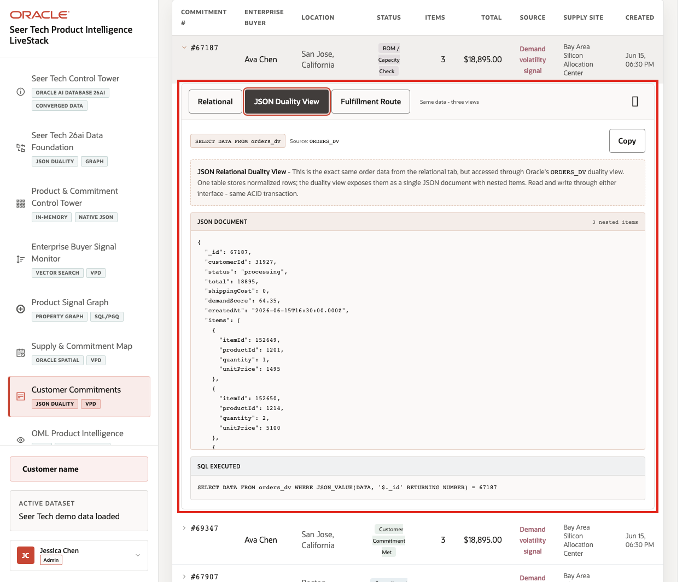
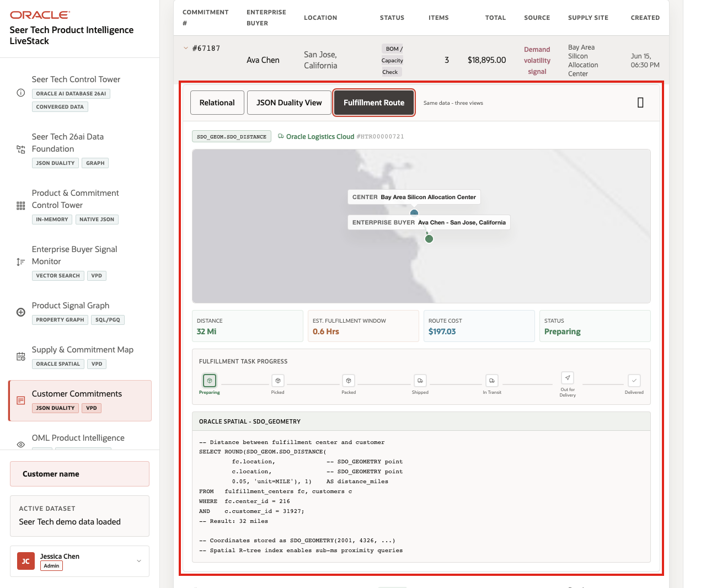

# Scene 7 Customer Commitments

## Introduction

**Customer Commitments** shows how commercial promises connect to the launch-risk story. The page can represent a wide range of High Tech commitments, including order promises, allocation reviews, BOM and capacity checks, shipment progress, service entitlements, warranty exposure, and strategic customer follow-up.

**Oracle AI Database** keeps each commitment in a single governed platform while presenting it in the format each workflow needs. Relational data supports operational processing, JSON Relational Duality supports application workflows, and Oracle Spatial adds route context such as supply site, customer location, distance, fulfillment window, and route status.

Estimated Time: **10 minutes**

### Objectives

In this scene, you will learn how one customer commitment can support order promising, supply operations, customer operations, application integration, and route context without creating disconnected copies of the record.

## Task 1: Review the customer commitment workspace

Perform the following set of steps to establish customer impact: who is expecting supply, what status the commitment is in, which product or portfolio is affected, what value is involved, and which supply site is responsible:

1. Click **Customer Commitments** in the sidebar.
2. Review the active user banner and VPD context.
3. Review the status filter.
4. Review the commitment table columns for commitment id, customer, location, status, item count, total value, source, supply site, and created time.
5. Focus on a visible commitment such as **67187**, **69347**, or the first visible row when those examples are not present.

    

Use visible rows to explain how customer operations connect to the broader launch-risk story. A strategic account commitment, component allocation request, field service entitlement, or product availability promise can become part of the same governed operating picture.

**Note:** Sample values may change after data refreshes or rebuilds. Verify live output before presenting, then explain the business takeaway.

## Task 2: Inspect the relational commitment detail

Perform the following set of steps to validate the commitment header, customer, line items, priority value, supply or logistics cost, and item-level information that operations teams need for follow-up:

1. Click a visible commitment row.
2. Confirm the **Relational** tab is selected.
3. Review customer, location, commitment value, supply or route cost, and line items when the detail panel loads.

    

**Expected result:** The UI returns the same type of result shown here. Exact rows, scores, or counts may vary by dataset, so verify the current values and focus the explanation on the operational pattern.

## Task 3: Compare the JSON Duality View

Perform the following set of steps to show that the same governed commitment can support both operations users and application teams without creating a separate document store:

1. Click **JSON Duality View** in the expanded commitment panel.
2. Review the source label for the customer commitment duality view.
3. Review the JSON document for the selected commitment.
4. Notice that the document should include identifiers, customer context, commitment status, commitment value, route or supply cost, demand score, created timestamp, and nested line items.

    

The key point is that the commitment is not copied into a separate document store. The same governed commitment can appear as operational detail or as a JSON document shape for applications.

## Task 4: Review route context

Perform the following set of steps to connect the commitment to the supply site, customer destination, distance, travel time, route cost, route status, and commitment progress:

1. Click **Fulfillment Route** in the expanded commitment panel.
2. Review the route map, supply site, and customer location.
3. Review distance, estimated transit, route cost, route status, and commitment progress.
4. Review the Oracle Spatial SQL example.

    

The business value is that customer operations, supply execution, JSON application access, and spatial context stay connected to the same governed customer commitment.

*You can move to the next scene.*

## Credits & Build Notes
- **Author** - Oracle LiveLabs Team
- **Last Updated By/Date** - Oracle LiveLabs Team, 2026-06-16
- **Source Bundle** - `livestack-hightech.zip`
