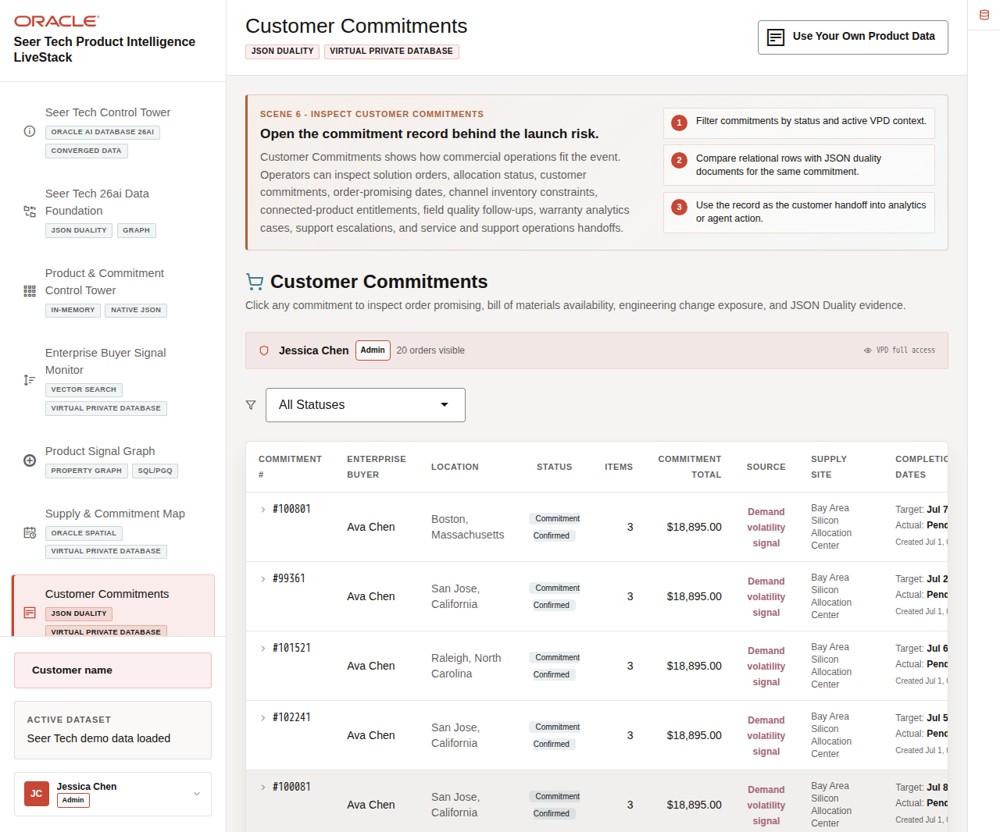
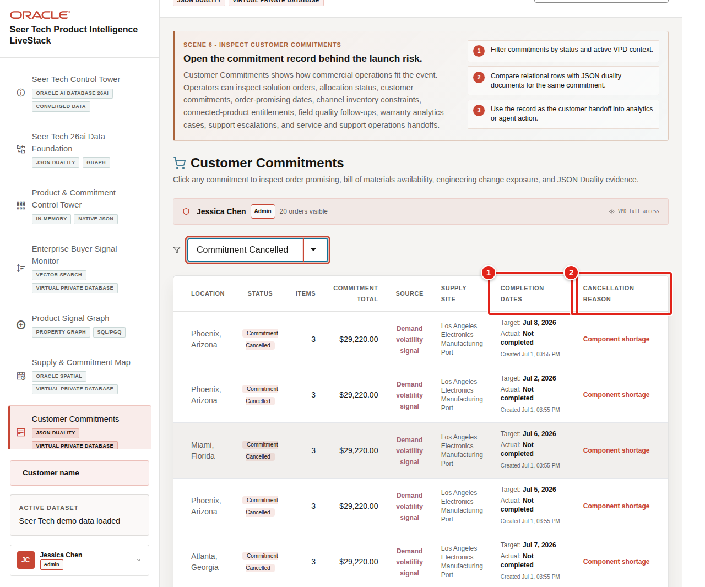
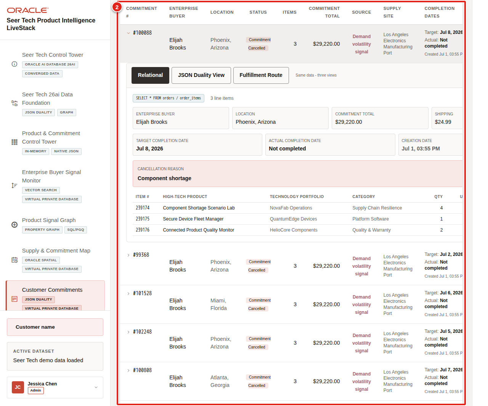
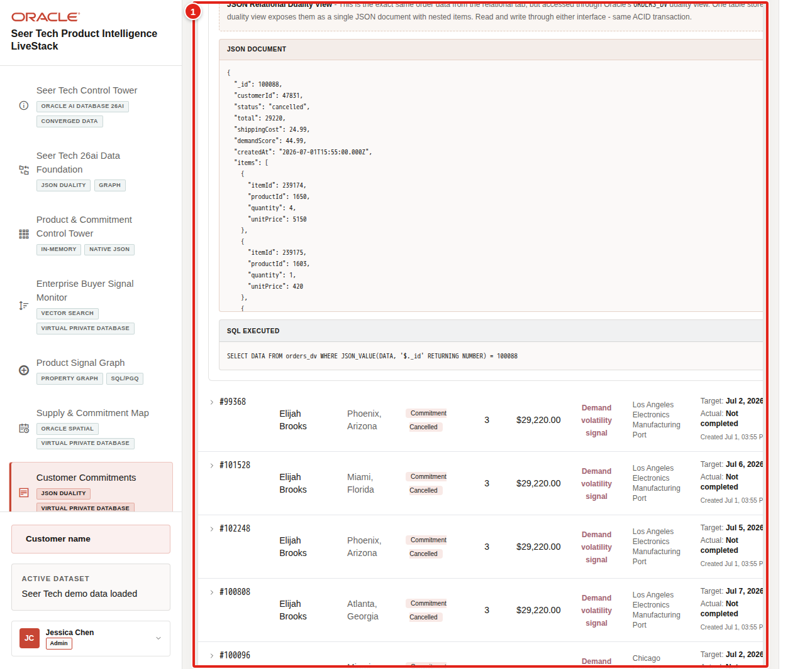
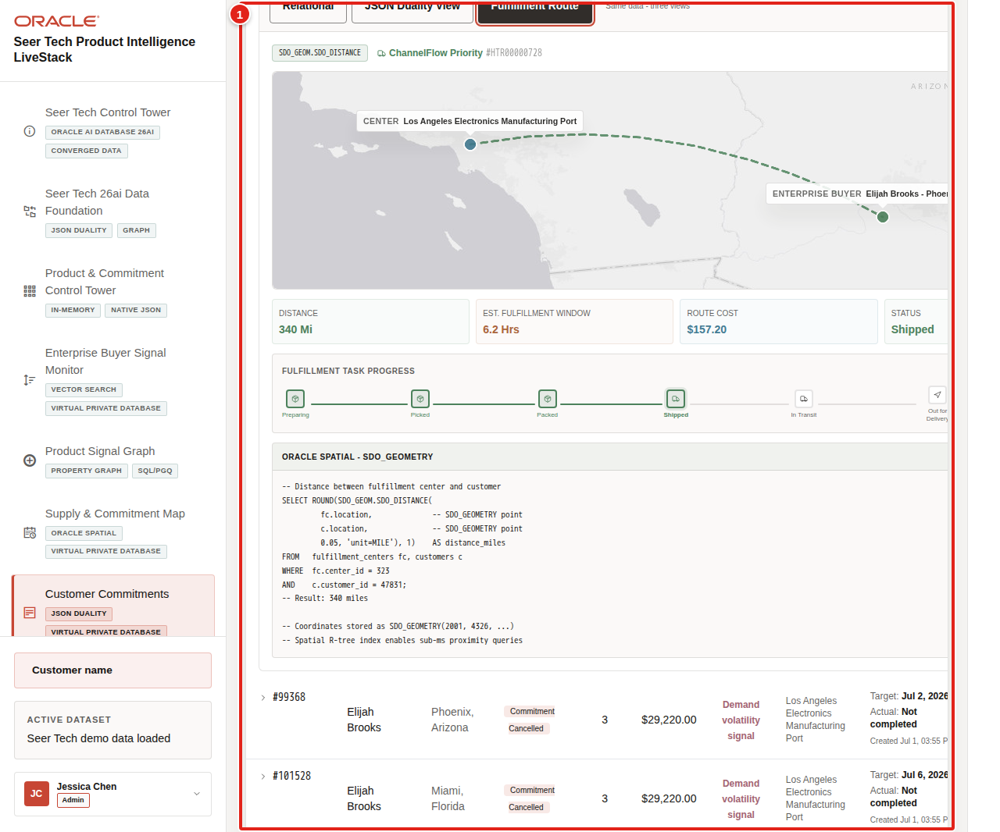

# Scene 7 Customer Commitments

## Introduction

**Customer Commitments** shows the commercial consequence of the launch constraint. Seer Tech can connect a product or supply issue to the enterprise buyer, commitment value, supply site, target date, actual completion status, and any cancellation reason.

The same governed commitment can be viewed as an operational row, an application-friendly JSON Relational Duality document, or a spatial fulfillment route. This keeps product operations, customer teams, and application developers aligned on one record.

Estimated Time: **10 minutes**

### Objectives

In this scene, you will learn how target and actual completion dates improve commitment triage, how cancellation reasons add business context, and how relational, JSON, and spatial views remain connected.

## Task 1: Review operational commitment dates

Start with the table as the customer-operations queue:

1. Click **Customer Commitments** in the sidebar.
2. Review the active user and Virtual Private Database access context.
3. Compare commitment number, enterprise buyer, location, status, items, commitment total, source, and supply site.
4. Review **Completion Dates**.
5. Compare **Target**, **Actual**, and the secondary **Created** timestamp.
6. Review **Cancellation Reason**.

    

The **Target Completion Date** is the operational date the team is working toward. A completed commitment shows an **Actual Completion Date**. An active commitment shows **Pending**, which avoids implying that fulfillment has already occurred. Creation date remains visible for context but is secondary to target and actual completion.

## Task 2: Inspect a cancelled commitment

Use the status filter to understand why a commitment left the active queue:

1. Open the status filter and select **Cancelled**.
2. Review the cancellation reason in the table.
3. Select a cancelled commitment.
4. Review **Target Completion Date**, **Actual Completion Date**, and **Cancellation Reason** in the detail panel.

    

Cancellation reasons can include component shortage, customer configuration change, duplicate order, missed delivery date, expired pricing approval, or a delayed customer project. The reason is shown only when it is relevant. Cancelled commitments display **Not completed** rather than a misleading actual completion date.

## Task 3: Compare the JSON Relational Duality document

Review the same commitment in the document shape used by applications:

1. Select **JSON Duality View** in the expanded commitment panel.
2. Review customer, status, value, source, target and actual delivery fields, demand score, and nested line items.
3. Compare the JSON values with the relational detail.

    

The commitment is not copied into a separate document store. JSON Relational Duality exposes an application-friendly document over the same governed relational data.

## Task 4: Review fulfillment-route context

Connect the commitment to the supply path that must meet the target date:

1. Select **Fulfillment Route**.
2. Review the supply site and customer destination.
3. Compare distance, estimated transit time, route cost, route status, and commitment progress.
4. Relate the route to the capacity and allocation decision from the previous scene.

    

The decision from this scene is to quantify future exposure before more commitments move into exception or cancellation status. Continue to Predictive Product & Commitment Analytics.

*You can move to the next scene.*

## Credits & Build Notes
- **Author** - Oracle LiveLabs Team
- **Last Updated By/Date** - Oracle LiveLabs Team, 2026-07-02
- **Source Bundle** - `livestack-hightech.zip`
