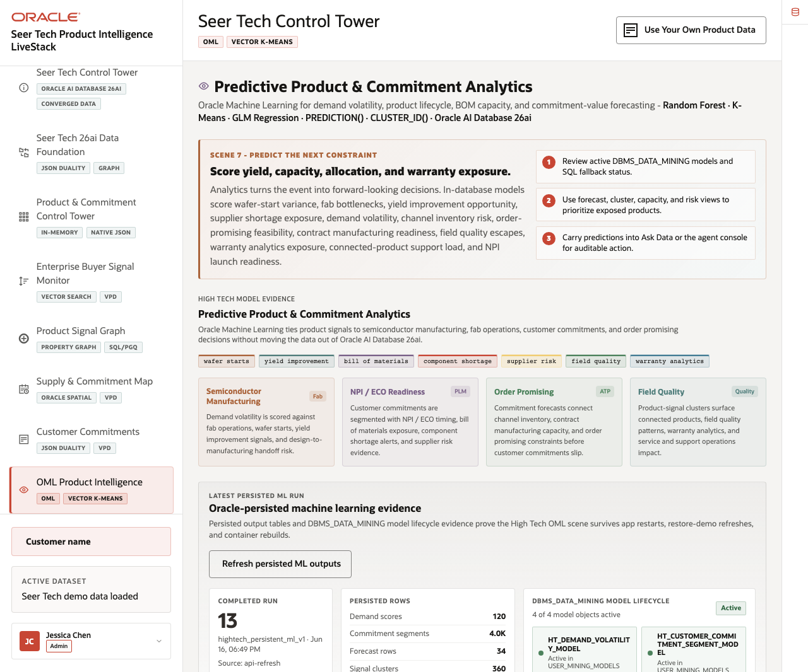
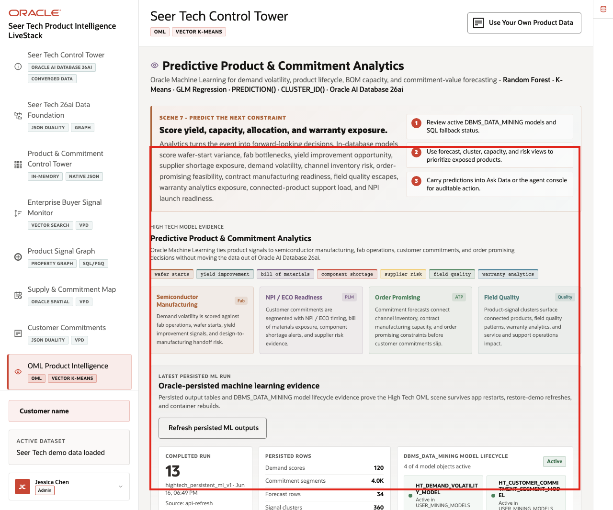
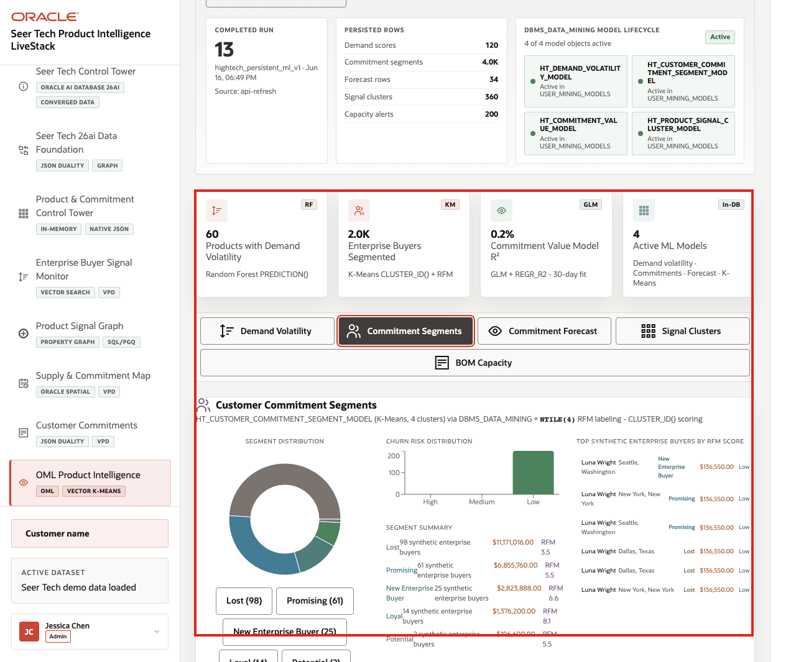
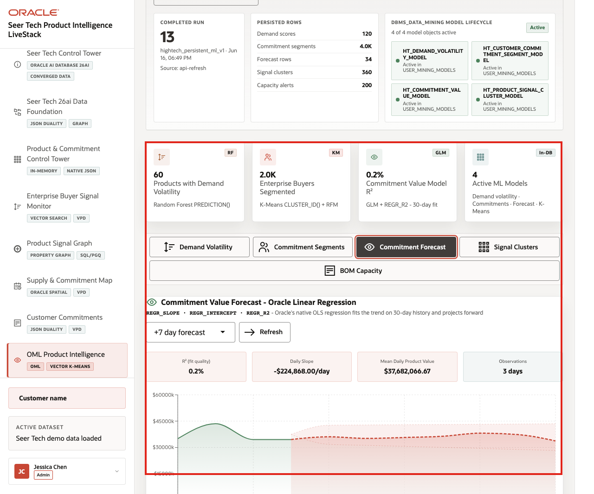
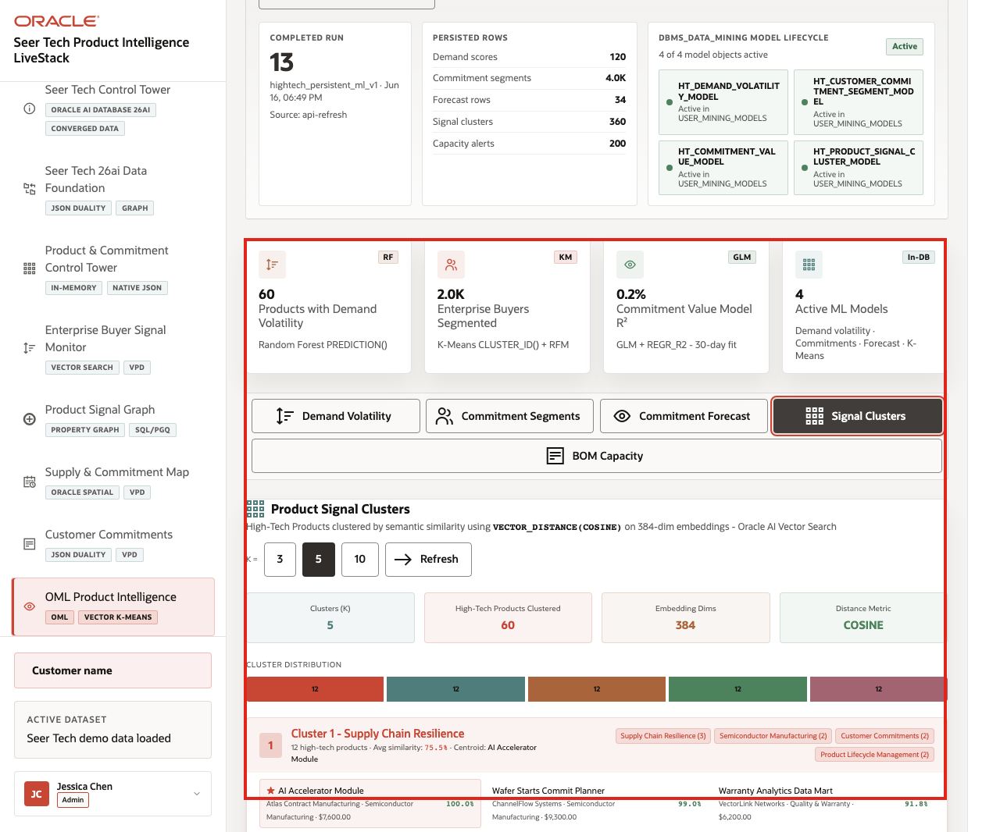
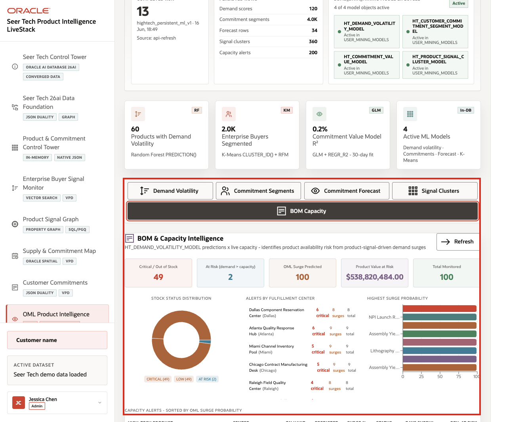

# Scene 8 OML Product Intelligence

## Introduction

**OML Product Intelligence** helps teams decide which predictive signals should become operational action. The page brings together demand volatility, customer commitment segmentation, commitment value forecasting, product signal clustering, BOM exposure, and capacity intelligence so planners can act before the next constraint becomes visible in operations.

**Oracle AI Database** keeps machine learning close to governed High Tech data. Oracle Machine Learning models and SQL analytics can run from the same connected foundation that powers the rest of the LiveStack demo, so sensitive product, customer, supplier, and service records do not need to move into disconnected ML silos.

Estimated Time: **12 minutes**

### Objectives

In this scene, you will learn how in-database analytics can score product demand, commitment value, customer segments, signal clusters, BOM exposure, and capacity pressure across High Tech workflows.

## Task 1: Inspect Demand Volatility Forecasting

Perform the following set of steps to identify products where predicted demand may require wafer-start planning, component allocation, channel inventory review, customer outreach, or order-promising action:

1. Click **OML Product Intelligence** in the sidebar.
2. Review the active ML model cards and persisted ML run evidence.
3. Keep the **Demand Volatility** tab selected.
4. Review product demand scores and the Random Forest scoring path.
5. Review the refresh control and prediction output when the model returns rows.

    

Use the visible predictions to explain how the same analytics pattern can support accelerator demand, edge gateway adoption, wafer-start planning, component shortage mitigation, channel inventory shifts, field quality exposure, and customer commitment protection.

**Note:** Sample values may change after data refreshes or rebuilds. Verify live output before presenting, then explain the business takeaway.

## Task 2: Review customer commitment segments

Perform the following set of steps to turn model output into customer and commitment groups that may need follow-up, allocation review, account outreach, service coordination, or priority planning:

1. Click **Commitment Segments**.
2. Review the segmentation model note for K-Means and RFM-style commitment behavior.
3. Review the segment distribution and highest-scoring customers or commitments when the output is populated.

    

Segments help teams decide whether a risk is isolated or concentrated in a strategic customer cohort. That distinction matters when a component allocation issue affects one opportunistic order versus a high-value enterprise commitment.

## Task 3: Interpret commitment value forecast

Perform the following set of steps to understand the expected value trend and how much confidence planners should place in it:

1. Click **Commitment Forecast**.
2. Review the forecast horizon, model quality cards, and forecast values.
3. Explain that a weak model fit tells planners to treat the forecast as directional, not certain.

    

This page helps a user connect product demand and customer commitment data to a governed forecast path. The model output is near the products, commitments, and signal records it uses, not in a disconnected notebook.

## Task 4: Explore product signal clusters

Perform the following set of steps to see how related products and signals group together by meaning:

1. Click **Signal Clusters**.
2. Review the **K =** controls when available.
3. Review the cluster count, products clustered, embedding dimensions, and distance metric when clustering completes.
4. Review a cluster card and its related products or signals.

    

Use this tab to explain how vector similarity can group High Tech records by operational meaning. Component shortages, GPU capacity pressure, field quality cases, connected-device telemetry, and warranty signals may cluster by meaning even when they use different text.

## Task 5: Review BOM and capacity intelligence

Perform the following set of steps to connect predicted demand with available capacity, component exposure, shortage alerts, product pressure, and value at risk:

1. Click **BOM Capacity**.
2. Review the summary cards.
3. Review capacity alerts and products sorted by surge probability or exposure.
4. Identify which products, BOM dependencies, or supply sites need attention.

    

The business value is that teams can move from predictive scoring to operating action before a capacity issue affects product launch, customer commitment, field quality, warranty, or service outcomes.

*You can move to the next scene.*

## Credits & Build Notes
- **Author** - Oracle LiveLabs Team
- **Last Updated By/Date** - Oracle LiveLabs Team, 2026-06-16
- **Source Bundle** - `livestack-hightech.zip`
