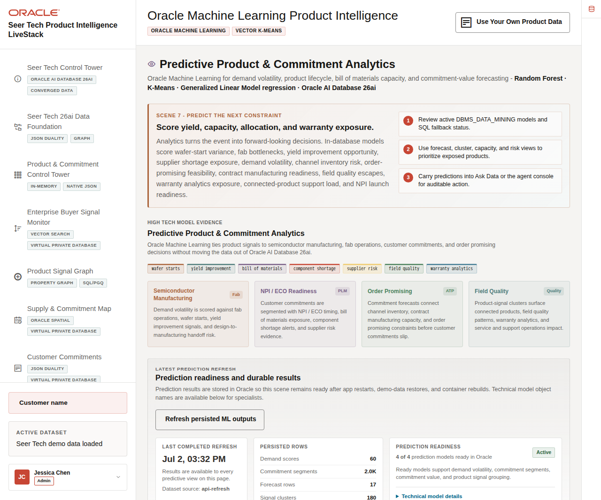
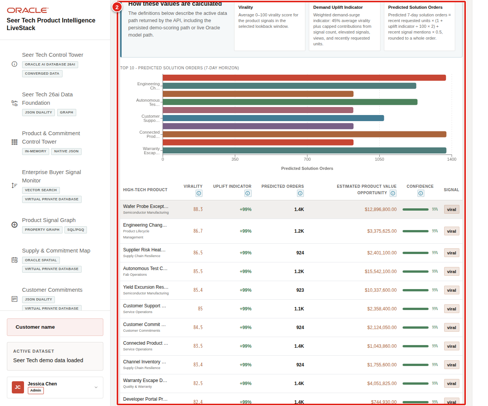
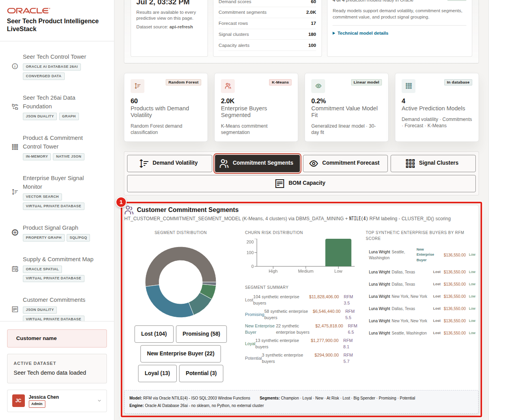
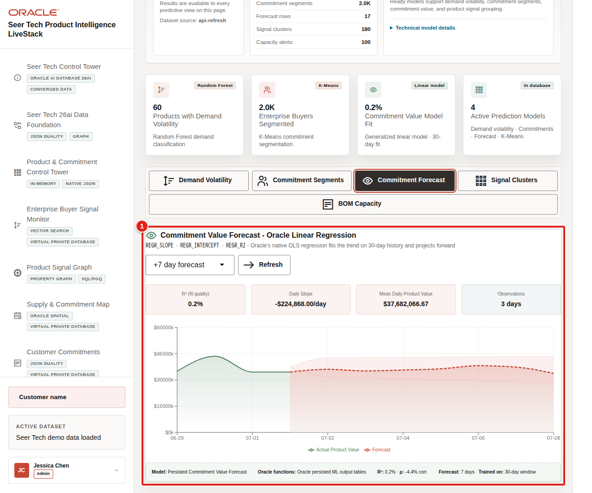
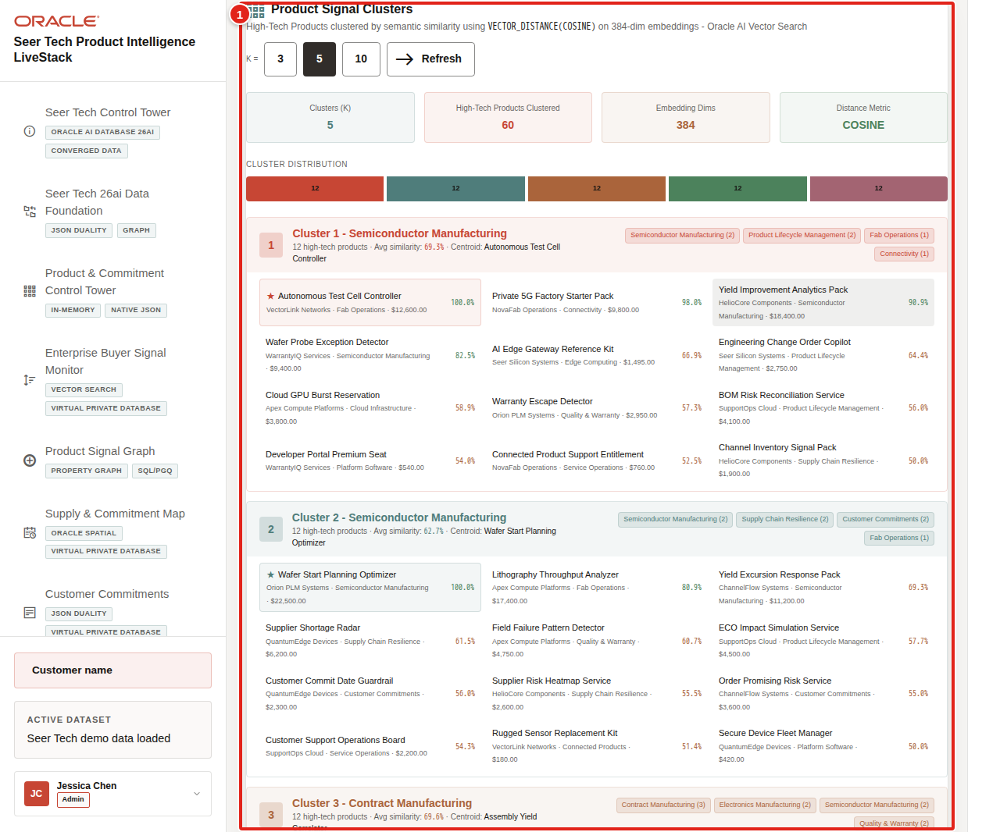
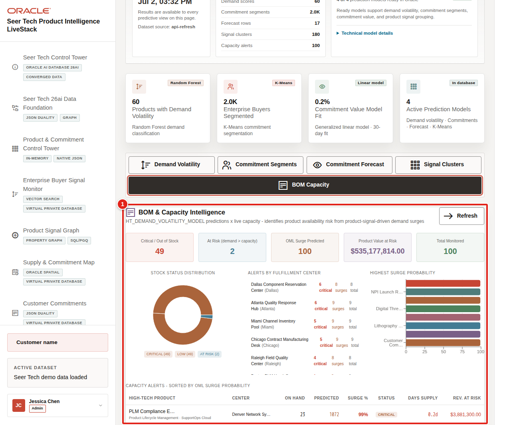

# Scene 8 Predictive Product & Commitment Analytics

## Introduction

**Predictive Product & Commitment Analytics** estimates where Seer Tech's next launch constraint may emerge. Oracle Machine Learning connects recent product signals with requested units, customer commitments, value, bill-of-materials exposure, and capacity evidence so product and supply teams can act before the next exception reaches a promise date.

The page leads with business predictions and durable result readiness. Technical database model object names remain available in the collapsed **Technical model details** section for specialists, without making internal identifiers the main operator story.

Estimated Time: **12 minutes**

### Objectives

In this scene, you will learn how **Virality**, **Demand Uplift**,**Predicted Orders**, value opportunity, and confidence are interpreted; how forecasts lead product details; and how related predictive views support customer, signal, and capacity decisions.

## Task 1: Confirm prediction readiness

Start with the persisted result status rather than raw model lifecycle identifiers:

1. Click **Oracle Machine Learning Product Intelligence** in the sidebar.
2. Review **Prediction readiness and durable results**.
3. Confirm the last completed refresh, dataset source, persisted-row counts, and **Prediction Readiness** status.
4. Expand **Technical model details** only when the audience needs database model names or catalog evidence.

    

The readiness panel explains the business value of persistence: demand scores, commitment segments, forecast rows, product-signal groups, and capacity alerts remain available after application restarts, demo restores, and container rebuilds.

## Task 2: Interpret Demand Volatility Forecasting

Use the forecast first, then inspect the products behind it:

1. Keep **Demand Volatility** selected.
2. Read **How these values are calculated**.
3. Review the **Top 10 - Predicted Solution Orders** bar chart.
4. Hover over a bar to inspect the product and predicted order value.
5. Review the product-detail table below the chart.
6. Compare **Virality**, **Uplift Indicator**, **Predicted Orders**, **Estimated Product Value Opportunity**, **Confidence**, and signal status.

    

The active persisted demo path uses these definitions:

- **Virality** is the product's average 0–100 virality score during the selected lookback window.
- **Demand Uplift Indicator** is a weighted demand-surge indicator: 45% average virality plus capped contributions from signal count, elevated signals, views, and recently requested units. It is not margin or price growth.
- **Predicted Solution Orders** equals recent requested units multiplied by `1 + (uplift ÷ 100 × 2)`, plus half of recent signal mentions, rounded to a whole order.
- **Estimated Product Value Opportunity** multiplies predicted orders by product unit price. It is a directional opportunity, not recognized revenue.
- **Confidence** is capped at 99% and reflects the strength of the uplift indicator plus the presence of recent product signals.

The forecast chart appears before the product table so the operator sees the portfolio-level demand pattern first and then inspects the individual products driving it.

## Task 3: Review customer commitment segments

Determine whether exposure is concentrated in a particular enterprise-buyer group:

1. Select **Commitment Segments**.
2. Review the K-Means segmentation explanation.
3. Compare segment distribution, commitment behavior, and the highest-value or highest-risk members.

    

Segmentation helps distinguish a broad launch issue from a constraint concentrated in strategic customers, regions, or order patterns.

## Task 4: Compare commitment forecasts and signal clusters

Use the supporting predictive views to understand value and related evidence:

1. Select **Commitment Forecast** and review the horizon, model-fit guidance, and forecast values.
2. Treat a weak fit as directional evidence rather than certainty.
3. Select **Signal Clusters**.
4. Review cluster counts, embedding dimensions, distance metric, and the products or signals grouped by operational meaning.

    

    

Vector grouping can connect component shortages, GPU capacity, field quality, connected-device telemetry, and warranty signals even when the source records use different language.

## Task 5: Connect predictions to bill-of-materials capacity

Close the analytics scene with an operating decision:

1. Select **BOM Capacity**. BOM means **bill of materials**.
2. Review summary cards for capacity and exposure.
3. Compare products by surge probability, shortage exposure, and value at risk.
4. Identify the product, dependency, or supply site that should move into Ask Data or agent action.

    

The predictive story now connects directly back to the runbook: demand pressure was detected, signal evidence explained it, graph paths located the dependencies, the map identified response options, commitments showed customer exposure, and analytics identified where the next constraint may appear.

*You can move to the next scene.*

## Credits & Build Notes
- **Author** - Oracle LiveLabs Team
- **Last Updated By/Date** - Oracle LiveLabs Team, 2026-07-02
- **Source Bundle** - `livestack-hightech.zip`
