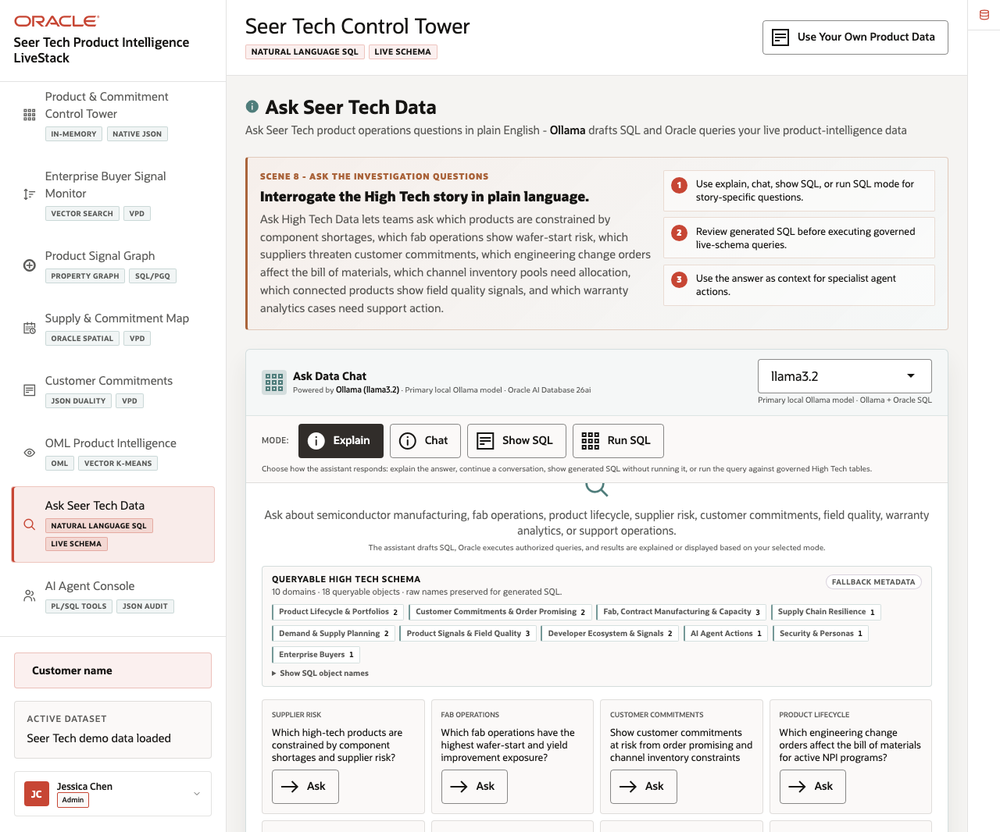
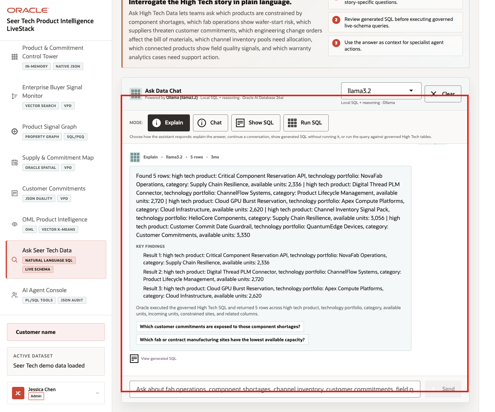
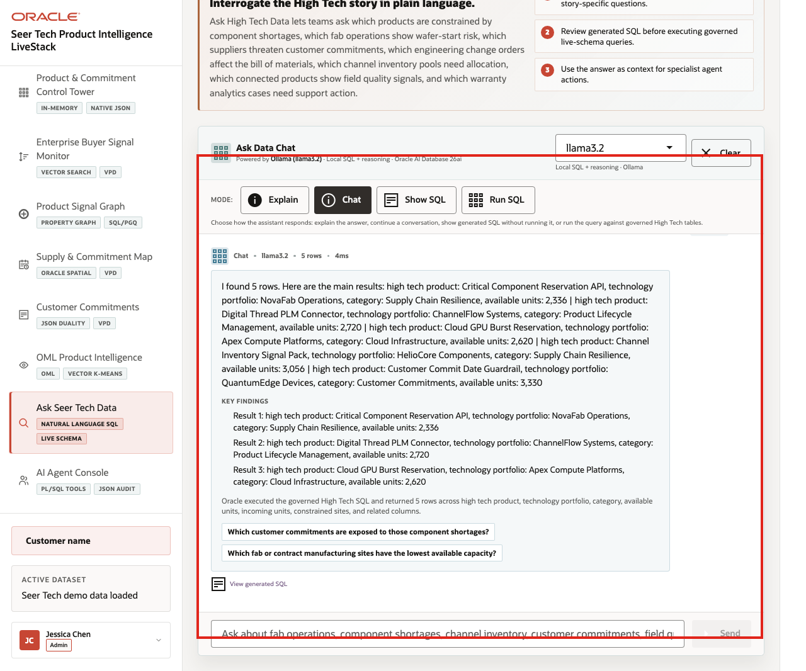
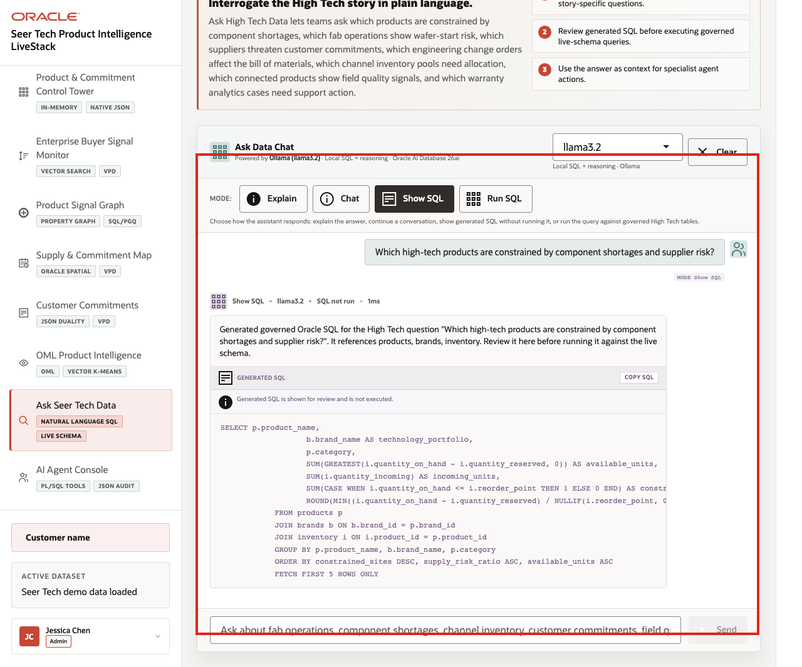
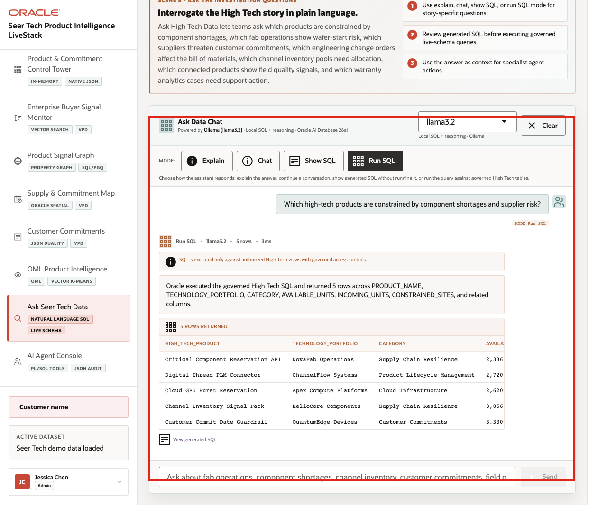

# Scene 9 Ask Seer Tech Data

## Introduction

**Ask Seer Tech Data** helps users ask operational questions in plain language while keeping the answer path visible. Users can compare narrated answers, conversational responses, generated SQL, and returned rows across product portfolios, component supply, fab capacity, customer commitments, quality and warranty, service operations, connected-product telemetry, and agent audit data.

Natural-language data access can create governance risk if the language model generates invalid SQL, references the wrong objects, hides the query path, or exposes more data than the user should see. Oracle AI Database keeps query execution grounded in the live High Tech schema while the UI shows the selected mode and generated SQL path.

**Note:** Ollama provides the local AI runtime used for reasoning, while Oracle remains the governed source for data access and execution.

Estimated Time: **10 minutes**

### Objectives

In this scene, you will learn how governed natural-language SQL can support High Tech operating questions without hiding the query path.

## Task 1: Review the assistant workspace

Perform the following set of steps to show how High Tech users can ask questions in plain language while still keeping the query path visible and controlled:

1. Click **Ask Seer Tech Data** in the sidebar.
2. Review the runtime profile in the top right of the assistant card.
3. Review the queryable schema summary and domain groups.
4. Review the available modes: **Explain**, **Chat**, **Show SQL**, and **Run SQL**.
5. Review the example questions.

    

Use this opening view to explain that the assistant is not a generic chatbot. It is a governed High Tech data assistant that uses schema metadata, visible query modes, and Oracle-backed execution.

## Task 2: Use Explain mode for a narrated answer

Perform the following set of steps when the user wants a business-readable answer first:

1. Click **Clear** if a previous result is visible.
2. Click **Explain**.
3. Ask a High Tech question such as:
- *Which products are constrained by component shortages and supplier risk?*
- *Which commitments need capacity review before the promise date?*
- *Which products show field quality or warranty exposure?*
4. Review the narrated answer and generated SQL details when they are visible.

    

**Expected result:** The assistant returns a narrated answer and key findings without making generated SQL the main artifact. The response should connect the business answer to governed High Tech data rather than returning raw rows as the main story.

**Notes:**

- Sample values may change after data refreshes or rebuilds. Verify live output before presenting, then explain the business takeaway.
- Use this mode when the user wants a business-readable answer first. The system still uses governed SQL behind the scenes.

## Task 3: Use Chat mode for a conversational answer

Perform the following set of steps when the user is exploring the data interactively and may want follow-up questions, regional breakdowns, or a more conversational explanation:

1. Click **Clear** if the Explain result is still visible.
2. Click **Chat**.
3. Ask a related question, such as **Which high-tech products have low capacity?** or **Which customer commitments are at risk from shortage signals?**

    

**Expected result:** The assistant returns a conversational response and follow-up prompts grounded in the live High Tech schema.

## Task 4: Use Show SQL mode to inspect the query path

Perform the following set of steps when a data steward, planner, engineer, or reviewer needs to see the query path before rows are returned:

1. Click **Clear** if the Chat result is still visible.
2. Click **Show SQL**.
3. Ask a question such as **Which products have the highest demand volatility this week?**, **Which supply sites have shortage alerts?**, or **Which commitments are waiting on BOM or capacity review?**
4. Review the generated SQL.

    

This is the governance moment: the user can inspect the generated SQL before asking the database to return rows.

## Task 5: Use Run SQL mode to inspect returned rows

Perform the following set of steps to inspect the live rows behind the answer. This helps the user connect a plain-English question to specific products, supply sites, commitments, quality records, warranty cohorts, service operations, or agent actions:

1. Click **Clear** if the generated SQL result is still visible.
2. Click **Run SQL**.
3. Ask a question such as **Which high-tech products have low capacity?** or rerun the previous question.
4. Review the returned table.
5. Expand **View generated SQL** if you want to show the query behind the result.

    

Use the completed mode examples to explain the governance pattern behind the page:

1. The user asks a High Tech question in plain English.
2. The app builds prompt and schema context for the selected runtime profile.
3. Ollama drafts SQL or a response plan.
4. Oracle AI Database executes authorized SQL against the live schema.
5. The UI returns visible SQL, rows, or a narrated answer depending on the selected mode.

The business value is that product, manufacturing, supply, quality, service, and customer operations teams can move from a plain-English question to a governed operating decision without losing visibility into the query path.

This pattern matters because teams want faster answers, but they also need governed access, visible query logic, and a trusted execution layer.

*You can move to the next scene.*

## Credits & Build Notes
- **Author** - Oracle LiveLabs Team
- **Last Updated By/Date** - Oracle LiveLabs Team, 2026-06-16
- **Source Bundle** - `livestack-hightech.zip`
