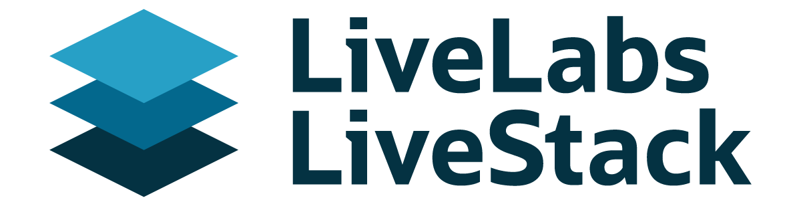
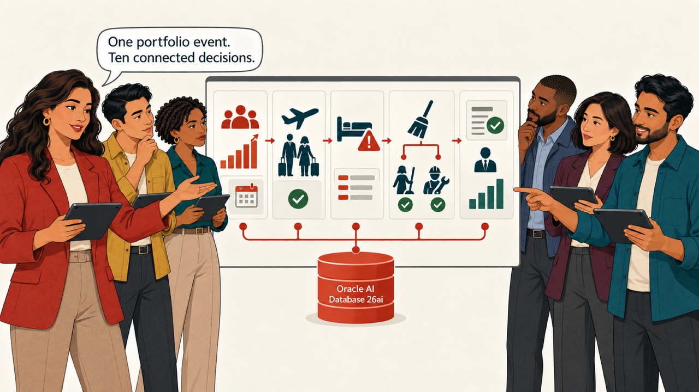
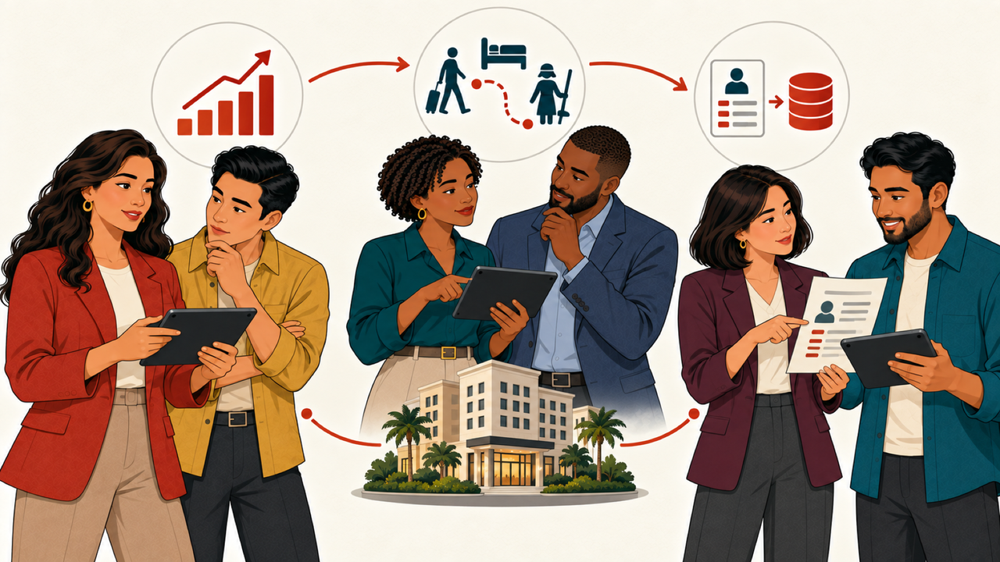
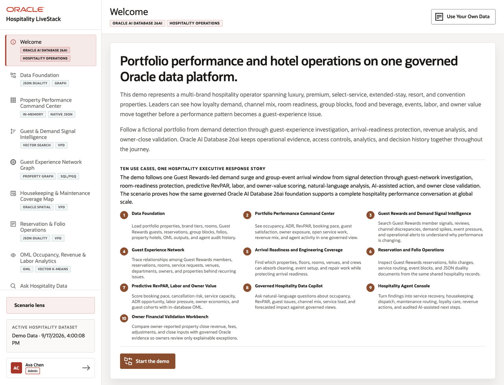

# Oracle AI Database 26ai Hospitality LiveStack Guide

## Introduction

On Monday morning, Sofia Ramirez is preparing for the portfolio review when a group-demand surge begins to collide with an important arrival window. Several room types are gaining revenue opportunity, but room readiness and service capacity are tightening at the same time.

Sofia brings together revenue strategy, guest experience, room operations, owner finance, and data specialists. They need to determine where demand is changing, which guests and rooms are exposed, how to deploy service teams, what the reservation and folio records show, what may happen next, and how to close the owner record. Every decision uses the same Oracle AI Database 26ai foundation.

Estimated demo time: 90 minutes.

### Meet the Hospitality Team

The runbook uses six fictional personas to make responsibility and handoffs clear.

- **Sofia Ramirez, VP Portfolio Operations:** leads the portfolio review and coordinates the final response.
- **Marcus Chen, Director Revenue Strategy:** evaluates demand, occupancy, ADR, RevPAR, and revenue exposure.
- **Amara Okafor, Director Guest Experience and Loyalty:** reviews guest, loyalty, channel, and service signals.
- **Theo Brooks, Rooms Operations and Engineering Manager:** manages room readiness, housekeeping, maintenance, and arrival capacity.
- **Elena Park, Owner Finance Controller:** reconciles reservation, folio, owner-close, and audit evidence.
- **Dev Shah, Oracle Data and AI Architect:** connects the workflow to Oracle AI Database 26ai data, analytics, and SQL.

### The Hospitality LiveStack

The team works in one application backed by the same hospitality data foundation used throughout the ten scenes.

### Objectives

In this LiveStack demo, you will see how hospitality leaders can use the same trusted Oracle data to improve occupancy, ADR, RevPAR, guest experience, room readiness, service capacity, revenue assurance, and owner reporting.

### Prerequisites

Open the running Hospitality LiveStack in a modern browser. No database or coding knowledge is needed to follow the business workflow.

## Demo Flow

### Establish the picture

- Scene 1: Data Foundation.
- Scene 2: Property Performance Command Center.

### Find the cause and protect the arrival

- Scene 3: Guest and Demand Signal Intelligence.
- Scene 4: Guest Experience Network Graph.
- Scene 5: Housekeeping and Maintenance Coverage Map.

### Reconcile, forecast, and ask

- Scene 6: Reservation and Folio Operations.
- Scene 7: OML Occupancy Revenue and Labor Analytics.
- Scene 8: Ask Hospitality Data.

### Coordinate the response and close the loop

- Scene 9: Hospitality Agent Console.
- Scene 10: Owner Financial Validation Workbench.

## Learn More

- [Oracle AI Database 26ai](https://docs.oracle.com/en/database/oracle/oracle-database/26/index.html)
- [Oracle AI Vector Search](https://www.oracle.com/database/ai-vector-search/)
- [Oracle Spatial](https://docs.oracle.com/en/database/oracle/oracle-database/26/spatl/toc.htm)
- [Oracle Property Graph](https://docs.oracle.com/en/database/oracle/property-graph/26.2/index.html)
- [Oracle Machine Learning for SQL](https://docs.oracle.com/en/database/oracle/machine-learning/oml4sql/tasks.html)
- [Oracle REST Data Services](https://docs.oracle.com/en/database/oracle/oracle-rest-data-services/25.4/orddg/index.html)

## Credits and Build Notes

- Author: Matt Kowalik, Principal Product Manager
- Last updated: September 2026
