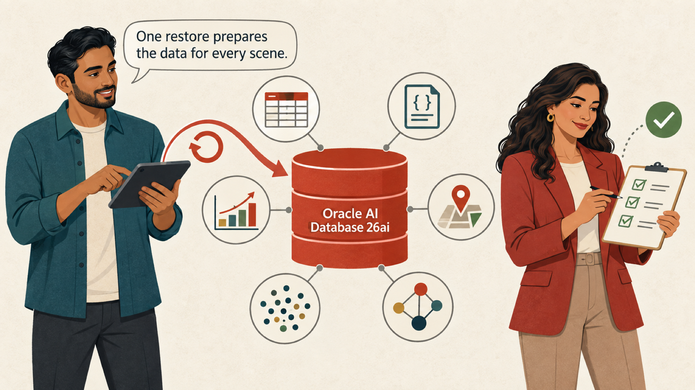
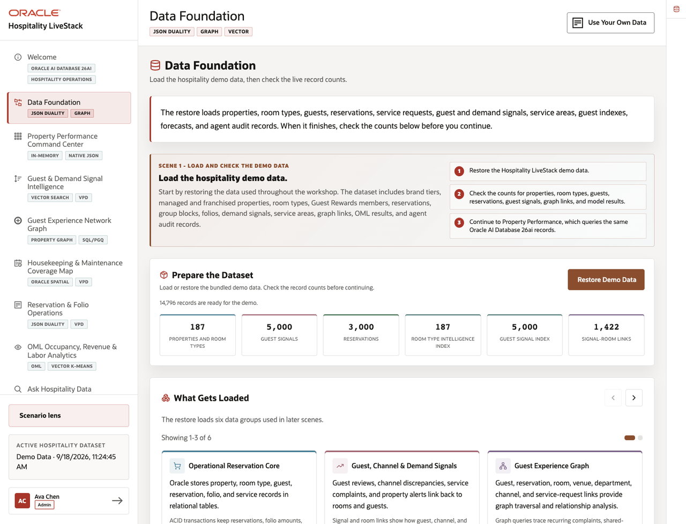
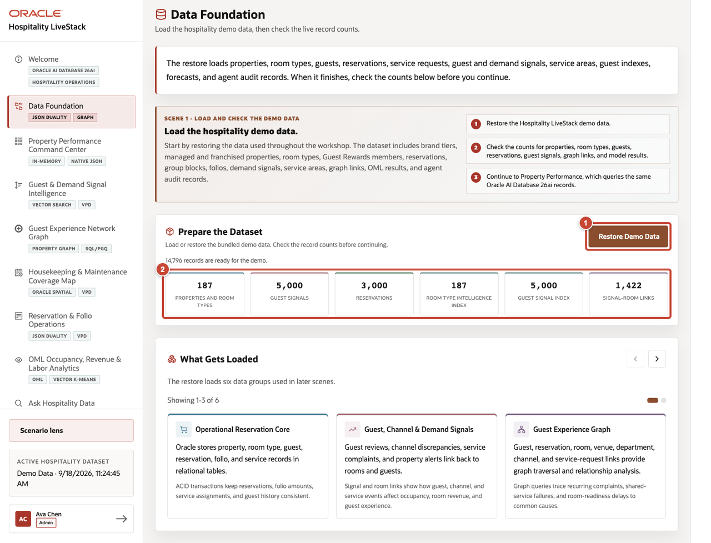
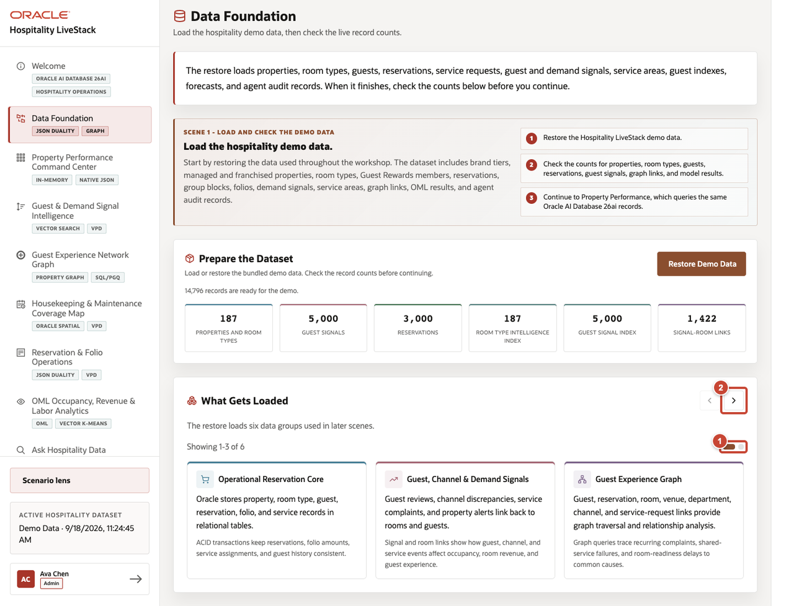
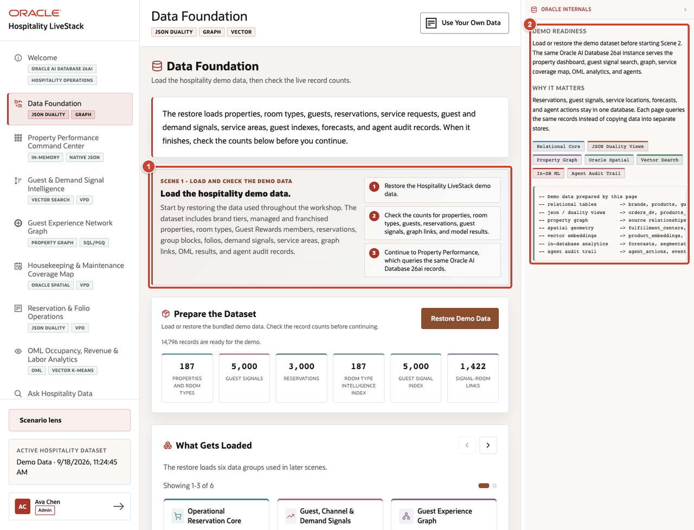

# Scene 1 Data Foundation

## Introduction

Sofia wants everyone working from the same numbers. Dev restores the synthetic hotel portfolio, and Sofia checks the record counts before the review begins.

Estimated time: 8 minutes.

### Objectives

Restore the data, check the record counts, and inspect how Oracle AI Database 26ai stores the data used by revenue, operations, guest experience, and owner teams.

## Task 1 Restore the demo dataset

Restore the data before you begin the remaining scenes.

1. Select **Restore Demo Data**.
2. Wait for the progress indicator to reach 100%. Confirm that the page shows **187** properties and room types, **5,000 Guest Signals**, **3,000 Reservations**, **187** room-type index records, **5,000** guest-record index entries, and **1,422** guest-to-room links.

Oracle AI Database 26ai supports relational, JSON, spatial, graph, and vector models in one converged database. The button starts one coordinated SQL and PL/SQL workflow that replaces the demo records, rebuilds the spatial and vector objects, and commits the restored dataset. The application also records a restore telemetry event.

## Task 2 Review what is loaded

Review the six data groups loaded by the restore.

1. Review the first three groups: reservation records, guest and demand activity, and graph relationships.
2. Select the right carousel control.
3. Review the remaining groups: housekeeping and maintenance coverage, reservation documents, and occupancy forecasts.

## Task 3 Review the Oracle implementation

Open Oracle Internals and match the page to the database features it uses.

1. Review the story panel. It shows the sequence for Scene 1: restore the demo data, check the record counts, and use those records throughout the workshop.
2. Select **Show Oracle Internals** and map the story to the implementation. The restore loads the relational tables. The count cards verify the restored rows and indexes. JSON duality views, property graph, Oracle Spatial, vector search, in-database machine learning, and the agent audit trail use the same data in later scenes.

These data models and workloads run in one Oracle AI Database 26ai instance. Continue to **Scene 2: Property Performance Command Center** after reviewing the mapping.

## Credits and Build Notes

- Author: Matt Kowalik, Principal Product Manager
- Last updated: September 2026
