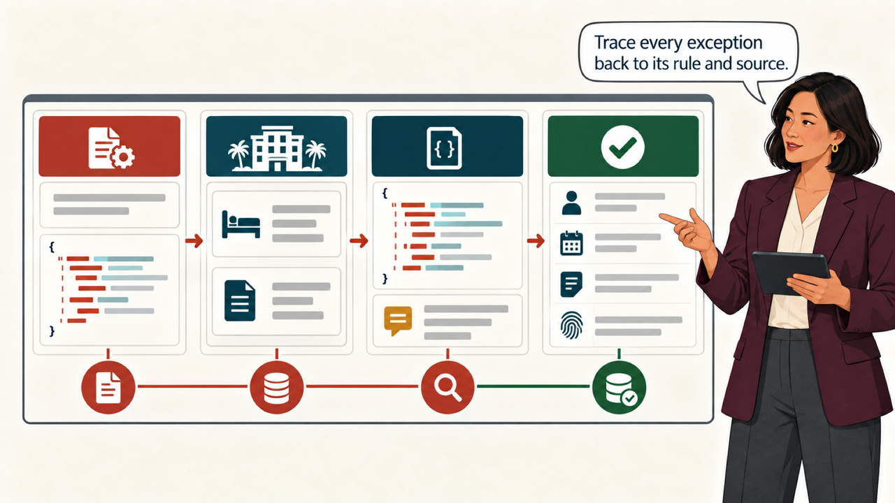
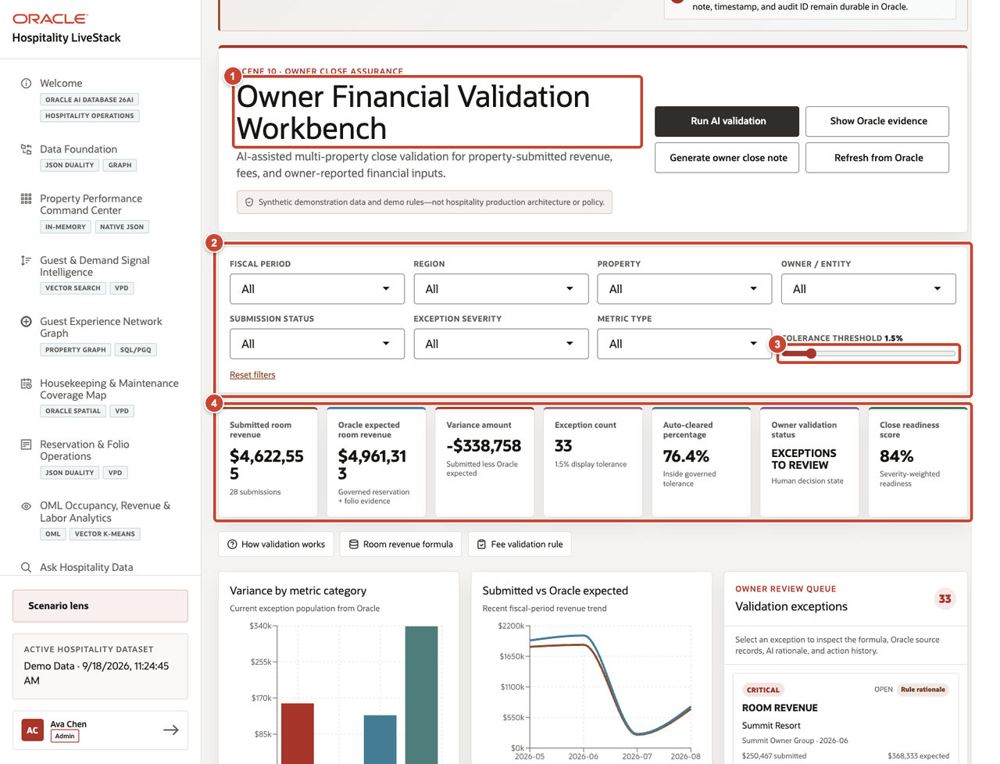
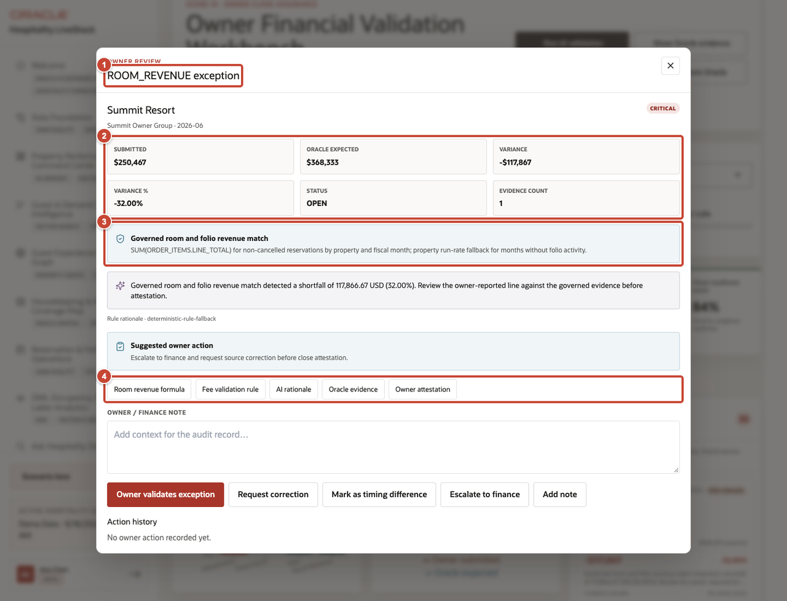
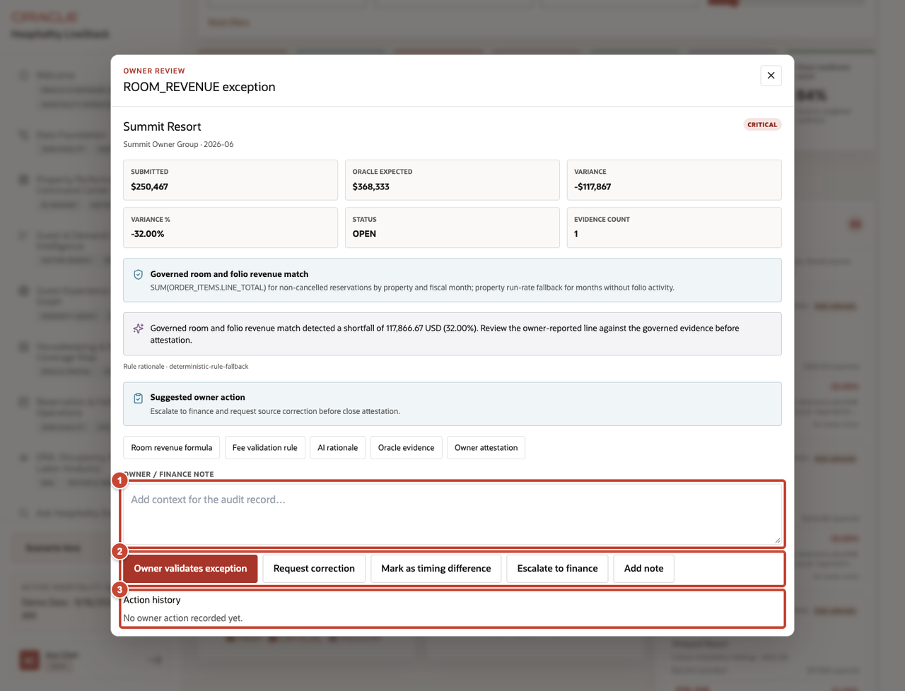

# Scene 10 Owner Financial Validation Workbench

## Introduction

Before the owner close, Elena checks one exception against the rule, reservation, folio, and JSON record. She records the decision so the next reviewer can see exactly what happened.

Estimated time: 10 minutes.

### Objectives

Check a close exception against its rule and source records, then save the owner decision in the audit trail.

## Task 1 Filter the close population

1. Confirm that **Owner Financial Validation Workbench** is open.
2. Filter the synthetic close population by fiscal period, region, property, owner, submission status, severity, or metric.
3. Set the tolerance threshold used to display exceptions.
4. Review the submitted room revenue, Oracle expected room revenue, variance, exception count, validation status, and close-readiness summary.

## Task 2 Inspect the supporting records

1. Open the **Summit Resort ROOM_REVENUE** exception.
2. Compare the submitted amount, Oracle expected amount, variance, status, and number of supporting items.
3. Review the versioned validation rule and rationale.
4. Open the formula, fee rule, AI rationale, Oracle source record, or owner attestation needed for the decision.

All owner close records in this scene are synthetic demo data and do not describe a real property or owner.

## Task 3 Record the decision

1. Enter the owner or finance review note.
2. Select the appropriate outcome: **Owner validates exception**, **Request correction**, **Mark as timing difference**, **Escalate to finance**, or **Add note**.
3. Confirm that **Action history** records the decision for the next close review.

**Next:** Return to the runbook introduction or close the demo after completing the owner review.

## Credits and Build Notes

- Author: Matt Kowalik, Principal Product Manager
- Last updated: September 2026
