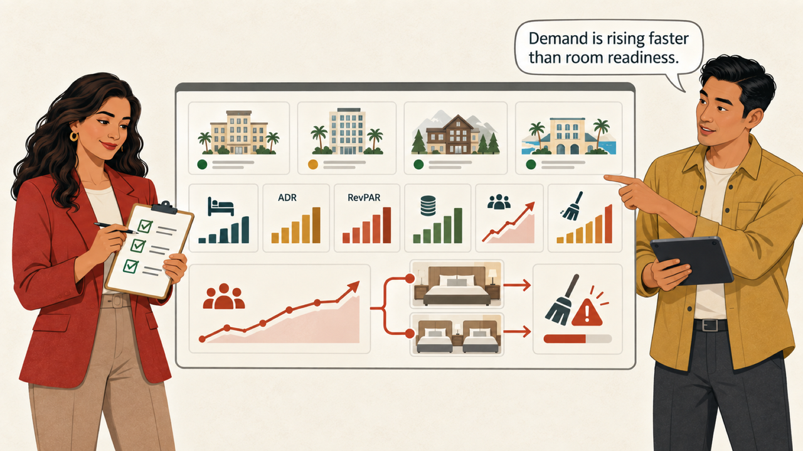
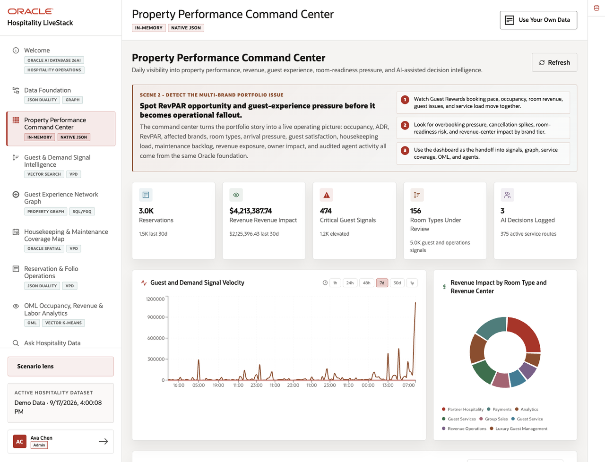
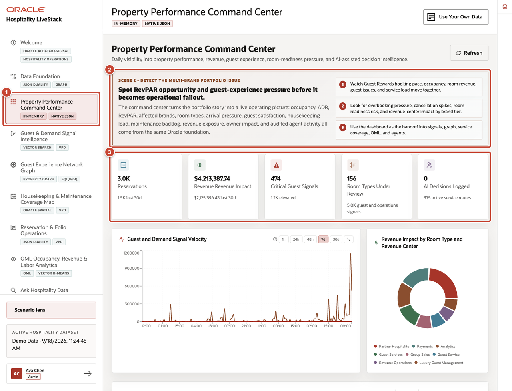
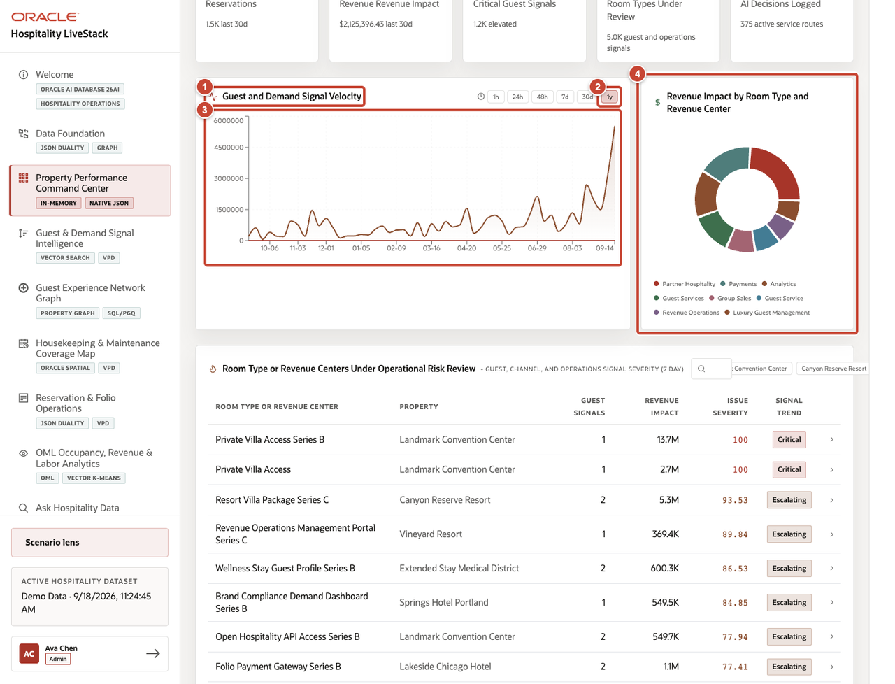
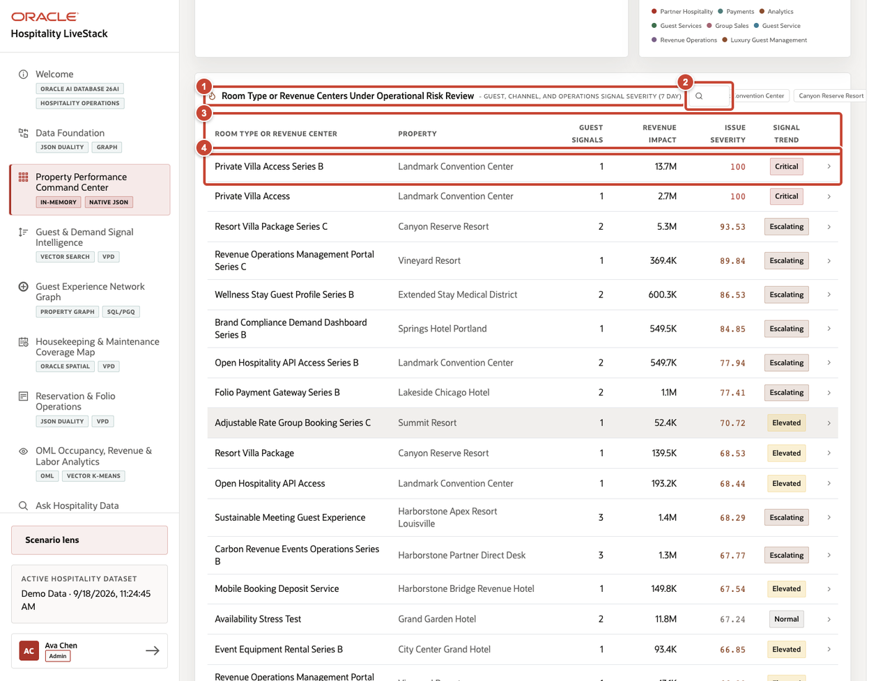

# Scene 2 Property Performance Command Center

## Introduction

With the shared dataset restored, Sofia Ramirez opens the portfolio review with Marcus Chen. A rise in group demand is increasing revenue opportunity, but room-readiness pressure could put upcoming arrivals at risk. They must identify which properties and room types need attention before the pattern affects occupancy, guest experience, or posted revenue.

Estimated time: 10 minutes.

### Objectives

Identify a property-performance pattern and trace it from the dashboard to signals, service operations, analytics, or owner review.

## Task 1 Review portfolio KPIs

Use the portfolio overview to establish the issue before opening the detailed signals.

1. Select **Property Performance Command Center**.
2. Review the story panel to identify the demand, room-readiness, guest-experience, and revenue pattern under investigation.
3. Review reservations, revenue impact, critical guest signals, room types under review, and recorded AI decisions. Treat **Revenue Impact** as booked reservation value on this dashboard, not posted room revenue from folios.

## Task 2 Review demand signal velocity

Compare the long-range signal pattern with the revenue categories affected by it.

1. Locate **Guest and Demand Signal Velocity**.
2. Select **1y** to load the full synthetic signal history in weekly buckets. Use the shorter controls when you need a recent operating window.
3. Review the chart for sustained increases, recurring spikes, and the most recent change in signal volume.
4. Compare the velocity pattern with **Revenue Impact by Room Type and Revenue Center** to identify the categories that need closer review.

## Task 3 Review high-demand room types

Use the operational-risk table to select the room type, revenue center, or property that needs follow-up.

1. Scroll to **Room Type or Revenue Centers Under Operational Risk Review**.
2. Enter a room type, revenue center, or property in the search field. Use a property chip beside the field when you want to narrow the list further.
3. Compare guest signals, revenue impact, issue severity, and signal trend for the filtered results.
4. Select a row to open its capacity and guest-signal details.

## Credits and Build Notes

- Author: Matt Kowalik, Principal Product Manager
- Last updated: September 2026
