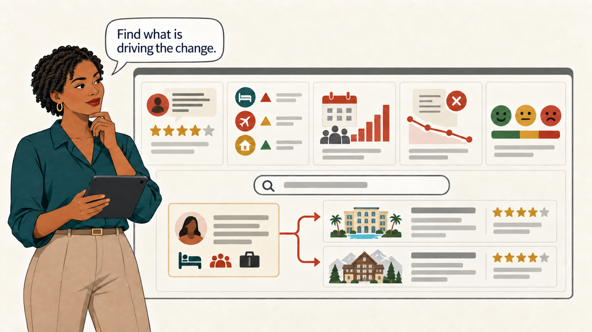
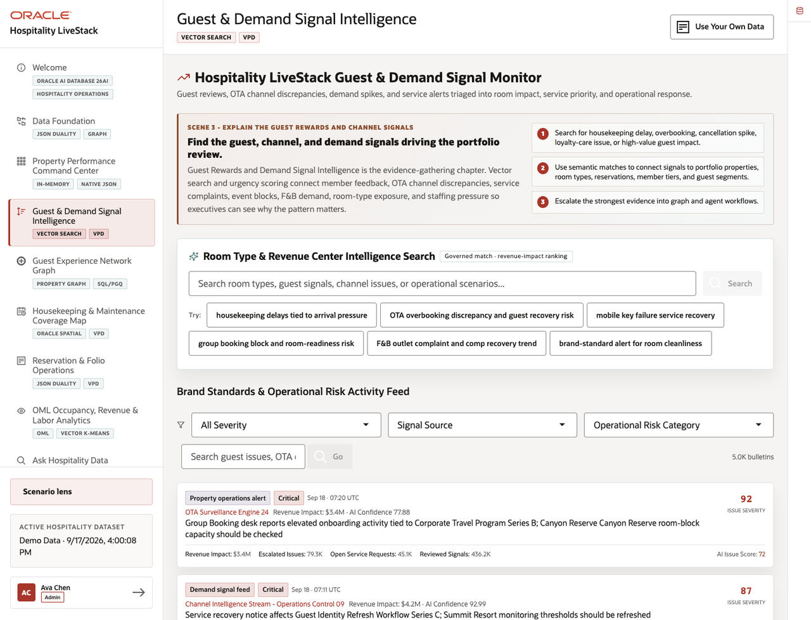
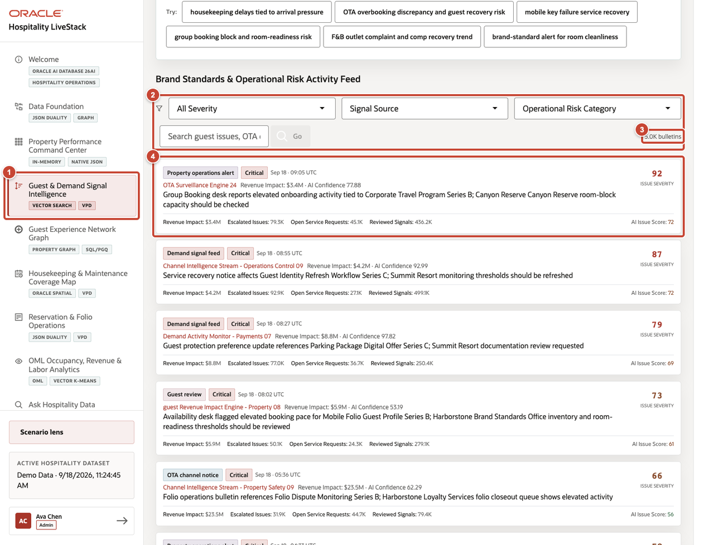
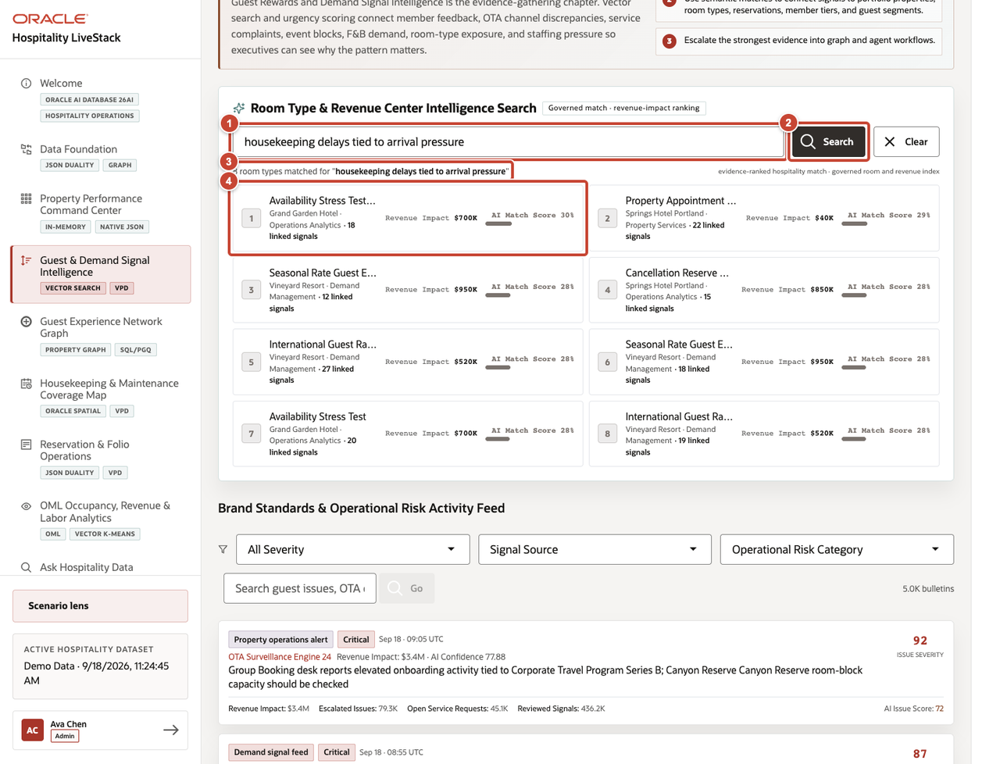
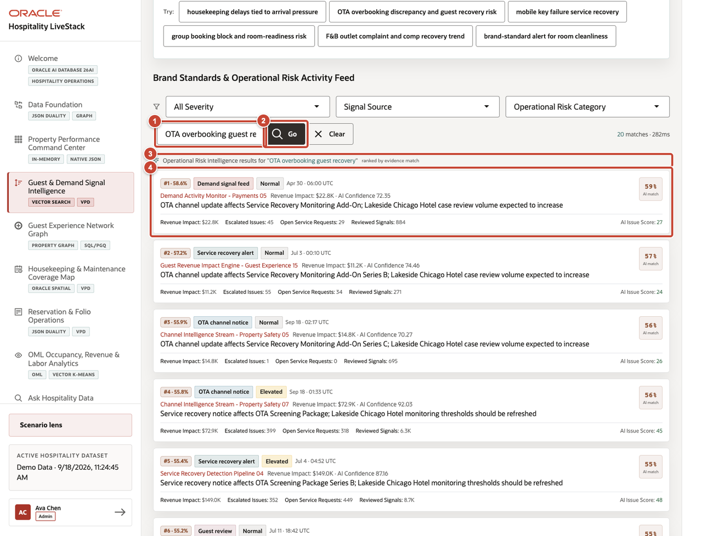

# Scene 3 Guest and Demand Signal Intelligence

## Introduction

The dashboard shows where pressure is building, not why. Amara checks guest feedback, booking alerts, cancellations, events, and service complaints to find what is driving the change.

Estimated time: 10 minutes.

### Objectives

Use semantic search to connect a portfolio problem with the relevant guest, channel, room-type, reservation, and service records.

## Task 1 Review the activity feed

1. Select **Guest & Demand Signal Intelligence** from the navigation menu.
2. Use **All Severity**, **Signal Source**, and **Operational Risk Category** to narrow the feed when a specific issue needs review.
3. Check the bulletin count to confirm that the selected filters changed the result set.
4. Review the first bulletin's source, severity, timestamp, revenue impact, open service requests, and AI Issue Score.

## Task 2 Search related hotel records

1. Enter **housekeeping delays tied to arrival pressure** in **Room Type & Revenue Center Intelligence Search**.
2. Select **Search**.
3. Confirm that Oracle AI Database returns a ranked list of matches for the query.
4. Compare the top results by property, category, linked guest activity, revenue impact, and AI Match Score. A useful result may rank highly even when it does not repeat the exact search phrase.

## Task 3 Open the right operating record

1. Enter **OTA overbooking guest recovery** in the activity-feed search field.
2. Select **Go**.
3. Confirm that the result count and semantic ranking label appear.
4. Review the highest-ranked bulletin's match score, source, severity, property context, revenue impact, and open service requests. Record the property, service, and room-type terms needed for the next investigation.

**Next:** After completing the investigation, continue with **Scene 4: Guest Experience Network Graph**.

## Credits and Build Notes

- Author: Matt Kowalik, Principal Product Manager
- Last updated: September 2026
