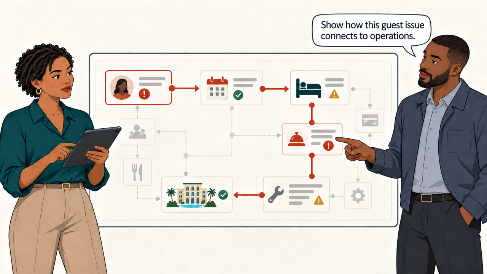
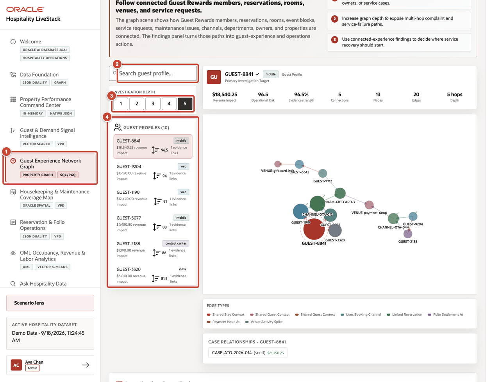
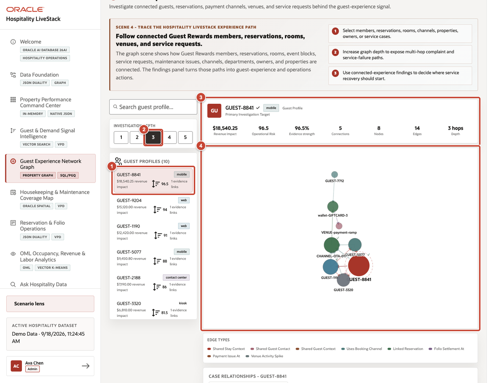
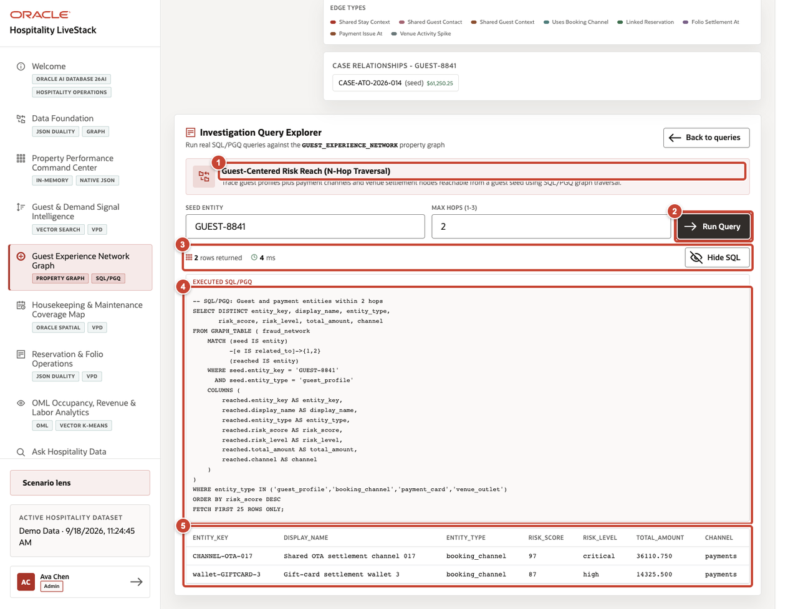

# Scene 4 Guest Experience Network Graph

## Introduction

One guest issue touches several records. Amara and Theo use the graph to follow it through the reservation, room, service request, maintenance work, booking channel, and property.

Estimated time: 8 minutes.

### Objectives

Trace a multi-hop guest-experience or operating issue and turn the relationships into a targeted service-recovery or operations decision.

## Task 1 Review the graph workspace

1. Select **Guest Experience Network Graph** from the navigation menu.
2. Enter a guest, reservation, room, channel, service request, or property in **Search guest issue entities**.
3. Set the relationship depth. Begin with the smallest depth that can answer the question.
4. Select a guest profile to establish the investigation target.

## Task 2 Explore connected exposure

1. Select **GUEST-8841** from the guest profiles.
2. Select **Show 3 relationship layers**.
3. Review the primary investigation target and its risk, value, and relationship totals.
4. Trace the graph from the guest to connected reservations, payment channels, venue activity, and settlement records.

## Task 3 Review the SQL/PGQ implementation

1. Open **Guest-Centered Risk Reach (N-Hop Traversal)** in **Investigation Query Explorer**.
2. Select **Run Query**.
3. Confirm the returned row count and execution time.
4. Review the SQL/PGQ statement and verify the guest seed, relationship hops, entity types, and result limit.
5. Compare the returned entities with the relationship path shown in the graph.

**Next:** Continue with **Scene 5: Housekeeping and Maintenance Coverage Map**.

## Credits and Build Notes

- Author: Matt Kowalik, Principal Product Manager
- Last updated: September 2026
