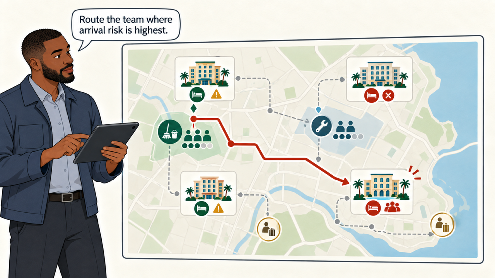
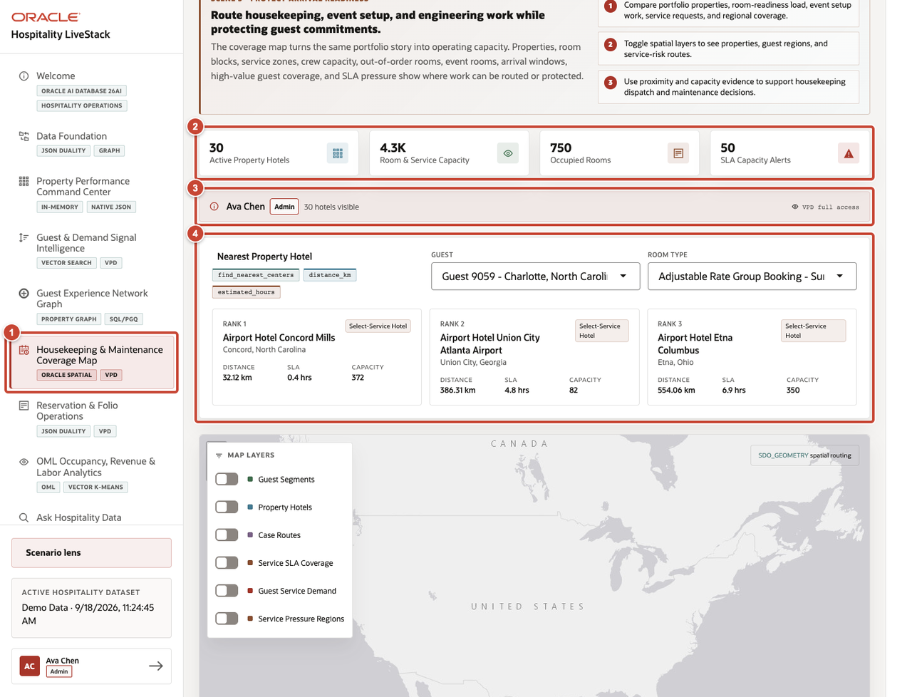
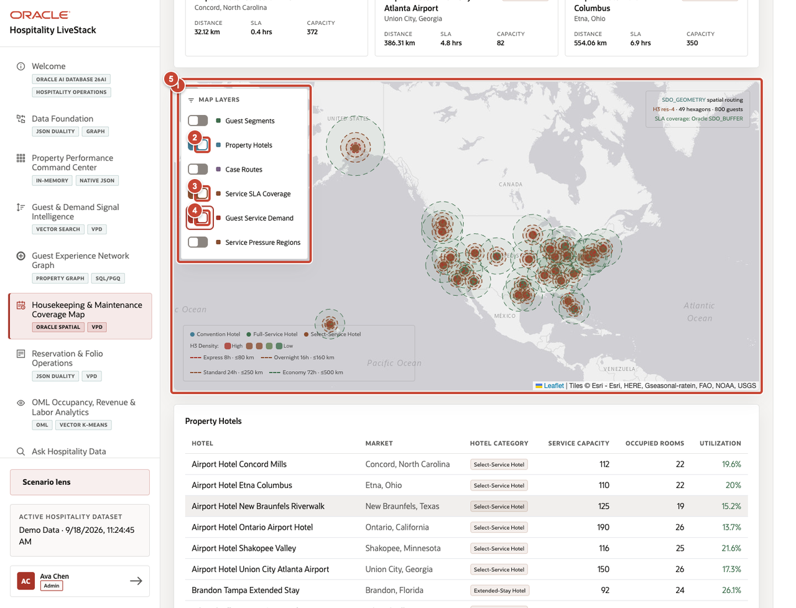
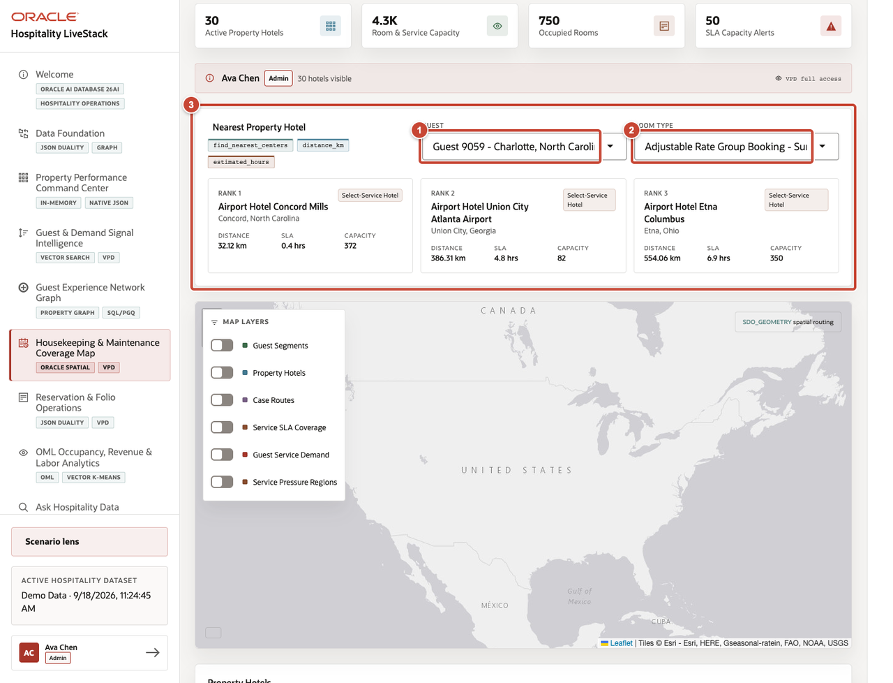

# Scene 5 Housekeeping and Maintenance Coverage Map

## Introduction

The graph points to a room-readiness problem before a busy arrival window. Theo compares nearby crews, out-of-order rooms, and event work, then decides where to send housekeeping or engineering support.

Estimated time: 8 minutes.

### Objectives

Use location and capacity data to decide where housekeeping, engineering, and event crews can help without leaving another hotel short-staffed.

## Task 1 Review coverage priorities

1. Select **Housekeeping & Maintenance Coverage Map** from the navigation menu.
2. Review active property hotels, room and service capacity, occupied rooms, and SLA capacity alerts.
3. Confirm the VPD access context shown for the active user.
4. Review **Nearest Property Hotel** before changing the map layers.

## Task 2 Toggle spatial layers

1. Locate **Map Layers**.
2. Turn on **Property Hotels**.
3. Turn on **Service SLA Coverage**.
4. Turn on **Guest Service Demand**.
5. Compare the map markers, SLA coverage rings, demand overlays, and legend. Turn layers off when they obscure the decision.

## Task 3 Compare coverage with guest commitments

1. Select the guest or service-recovery case.
2. Select the room type or service category required by the case.
3. Compare the ranked property hotels by distance, SLA, and available service capacity before choosing a route.

**Next:** Continue with **Scene 6: Reservation and Folio Operations**.

## Credits and Build Notes

- Author: Matt Kowalik, Principal Product Manager
- Last updated: September 2026
