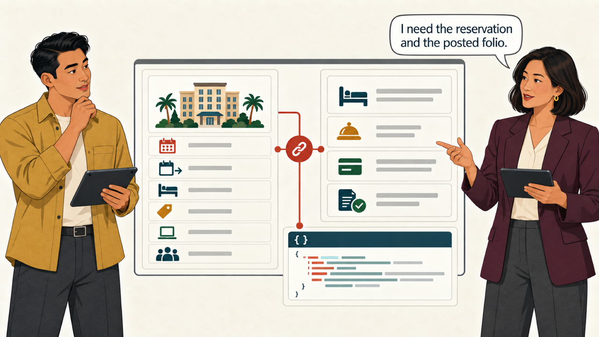
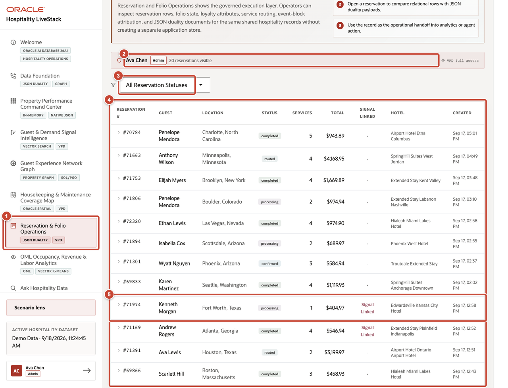
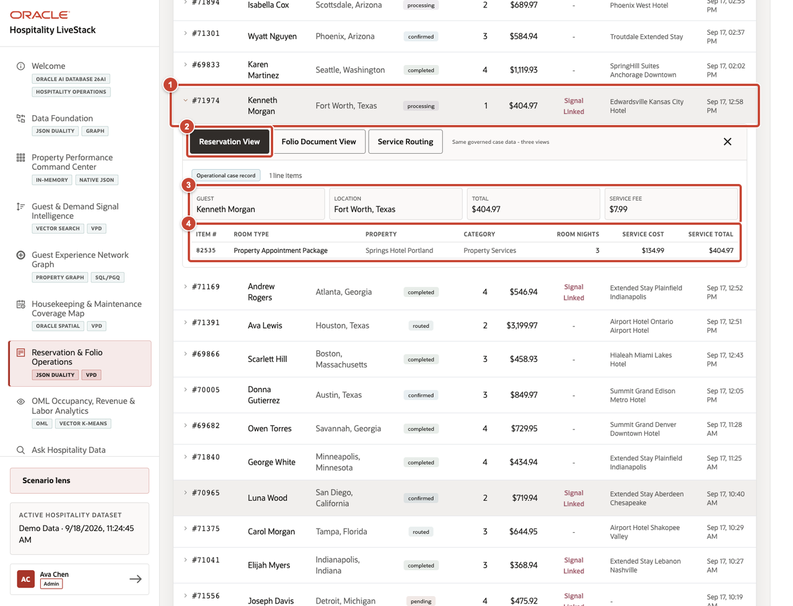
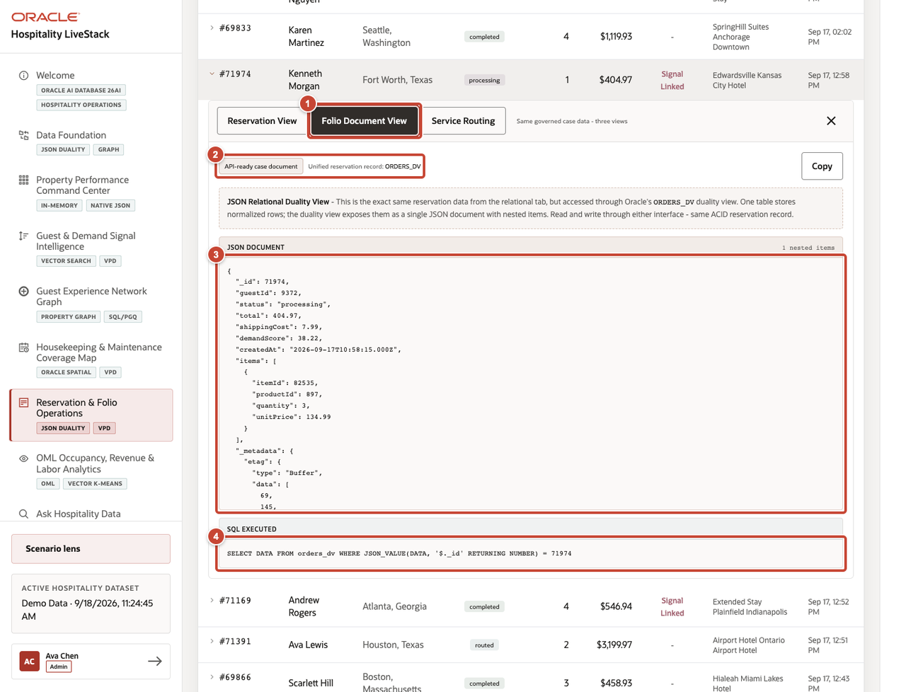

# Scene 6 Reservation and Folio Operations

## Introduction

The service response protects the arrival, but Marcus and Elena Park still need the operating and financial record behind the decision. They inspect the reservation, stay details, room assignment, group context, and posted folio activity. Their review keeps booked value separate from realized room revenue while showing the same stay through relational and JSON views.

Estimated time: 10 minutes.

### Objectives

Inspect the operational record behind a guest, revenue, service, or event decision. Compare the relational and JSON views of the same record.

## Task 1 Filter the operating record

1. Select **Reservation & Folio Operations** from the navigation menu.
2. Confirm the reservation count visible under the active VPD context.
3. Use **All Reservation Statuses** to narrow the operating list.
4. Review the reservation table for guest, location, status, item count, total value, signal linkage, property hotel, and timestamp.
5. Select reservation **#71974**, which is linked to a guest signal.

## Task 2 Inspect reservation and folio detail

1. Expand reservation **#71974**.
2. Select **Reservation View**.
3. Review the reservation summary, including guest, status, location, total value, and service fee.
4. Review the service lines and room-night details that make up the reservation record.

## Task 3 Compare the JSON duality view

1. Select **Folio Document View**.
2. Confirm the API-ready document source and unified reservation record identifier.
3. Compare the reservation identifier, guest identifier, status, total, service fee, and nested items with the relational view.
4. Review the executed SQL that reads the JSON Relational Duality view. The document and relational views use the same Oracle data rather than separate application stores.

**Next:** Continue with **Scene 7: OML Occupancy, Revenue and Labor Analytics**.

## Credits and Build Notes

- Author: Matt Kowalik, Principal Product Manager
- Last updated: September 2026
