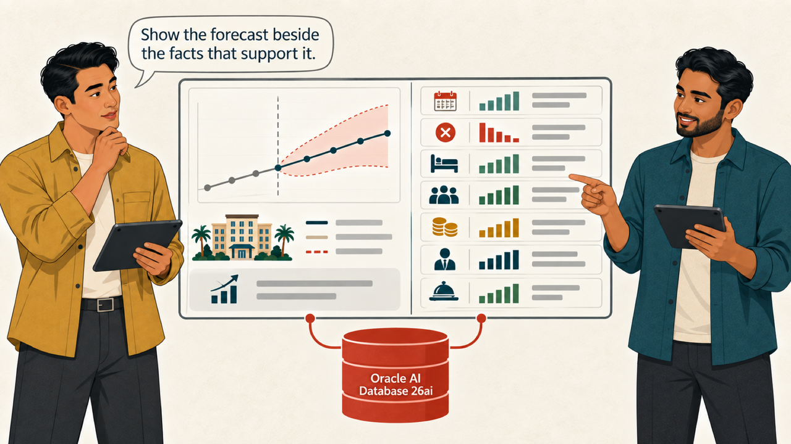
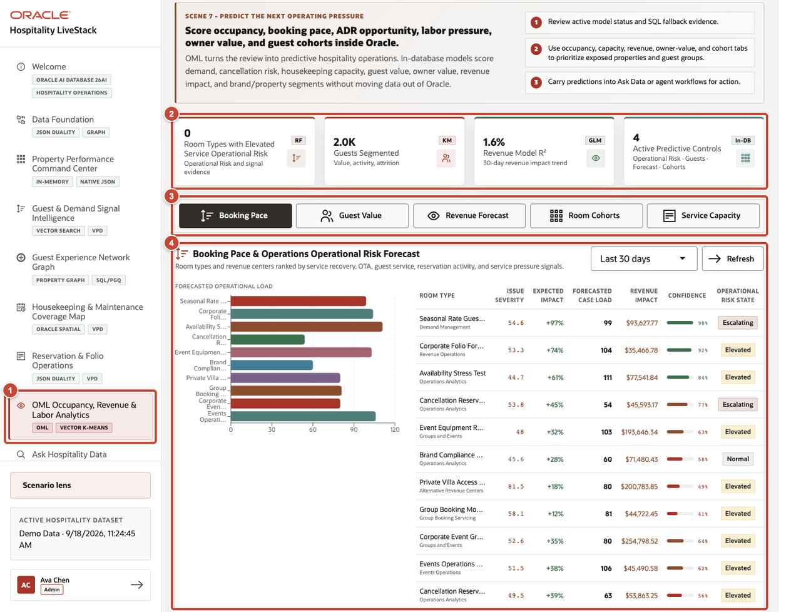
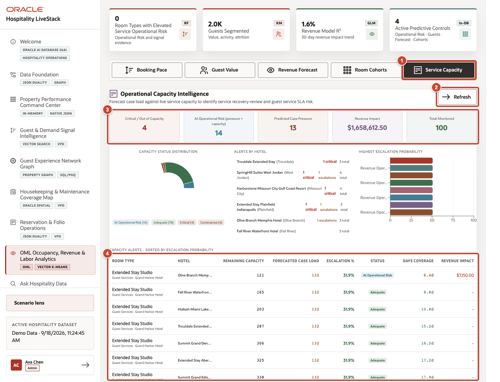
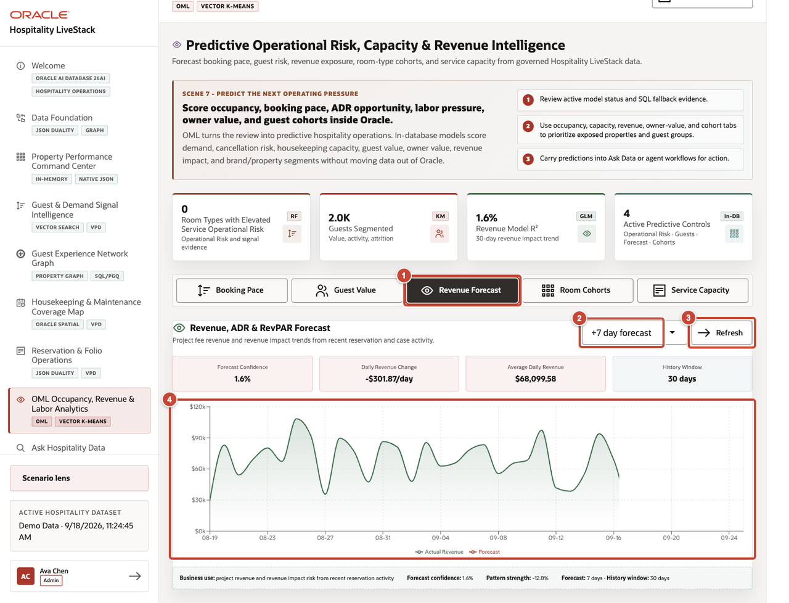

# Scene 7 OML Occupancy Revenue and Labor Analytics

## Introduction

Marcus knows what has happened. Now he and Dev look ahead. They compare occupancy and revenue forecasts with booking pace, cancellations, staffing, and service workload without mistaking a prediction for posted revenue.

Estimated time: 10 minutes.

### Objectives

Review predictive hospitality outputs without separating model features, results, and operational facts from their Oracle source data.

## Task 1 Review model readiness

1. Select **OML Occupancy, Revenue & Labor Analytics** from the navigation menu.
2. Review the model and segmentation indicators.
3. Review the available analytics views: Booking Pace, Guest Value, Revenue Forecast, Room Cohorts, and Service Capacity.
4. Use **Booking Pace** to compare the forecast with the operating data behind it. Treat the forecast as a prediction, not a posted financial result.

## Task 2 Review property and capacity exposure

1. Select **Service Capacity**.
2. Select **Refresh** when the latest model result is required.
3. Review the capacity summary for room types, service pressure, and operational exposure.
4. Use the result table to identify the property, room type, or service record that needs operational review.

## Task 3 Review the revenue forecast

1. Select **Revenue Forecast**.
2. Choose the forecast horizon.
3. Select **Refresh** after changing the horizon.
4. Compare actual revenue, forecast revenue, forecast confidence, daily revenue change, average daily revenue, and the history window.

**Next:** Continue with **Scene 8: Ask Hospitality Data**.

## Credits and Build Notes

- Author: Matt Kowalik, Principal Product Manager
- Last updated: September 2026
