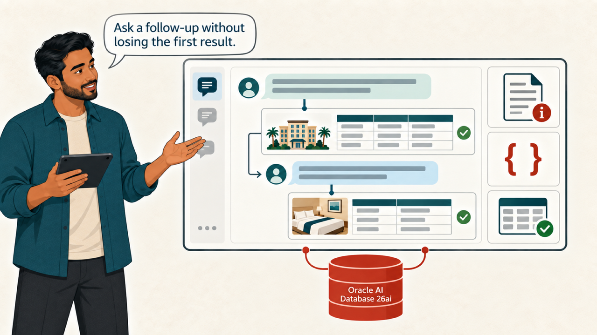
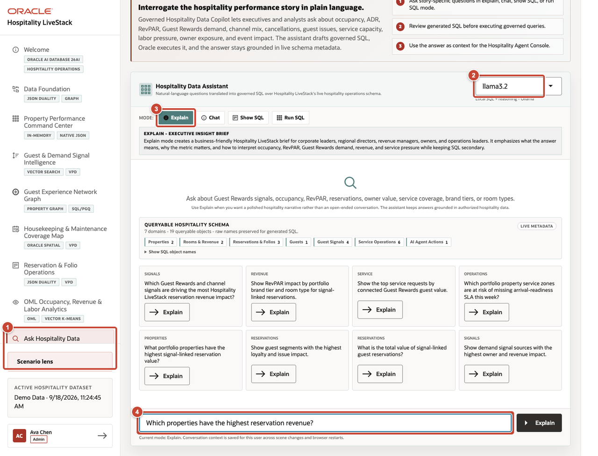
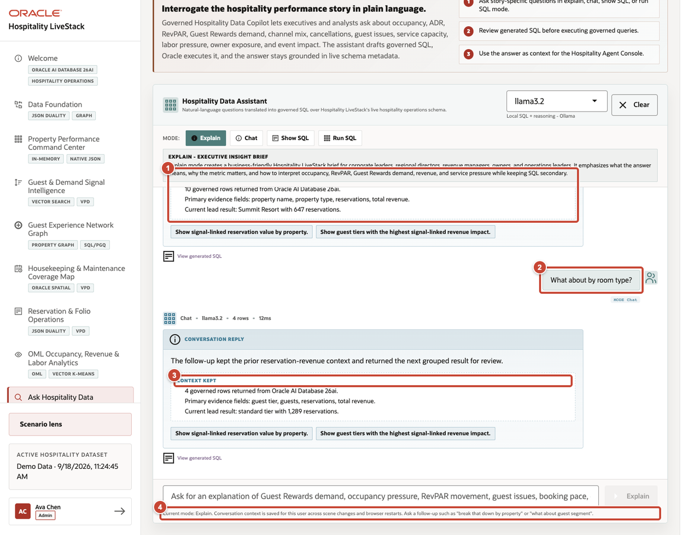
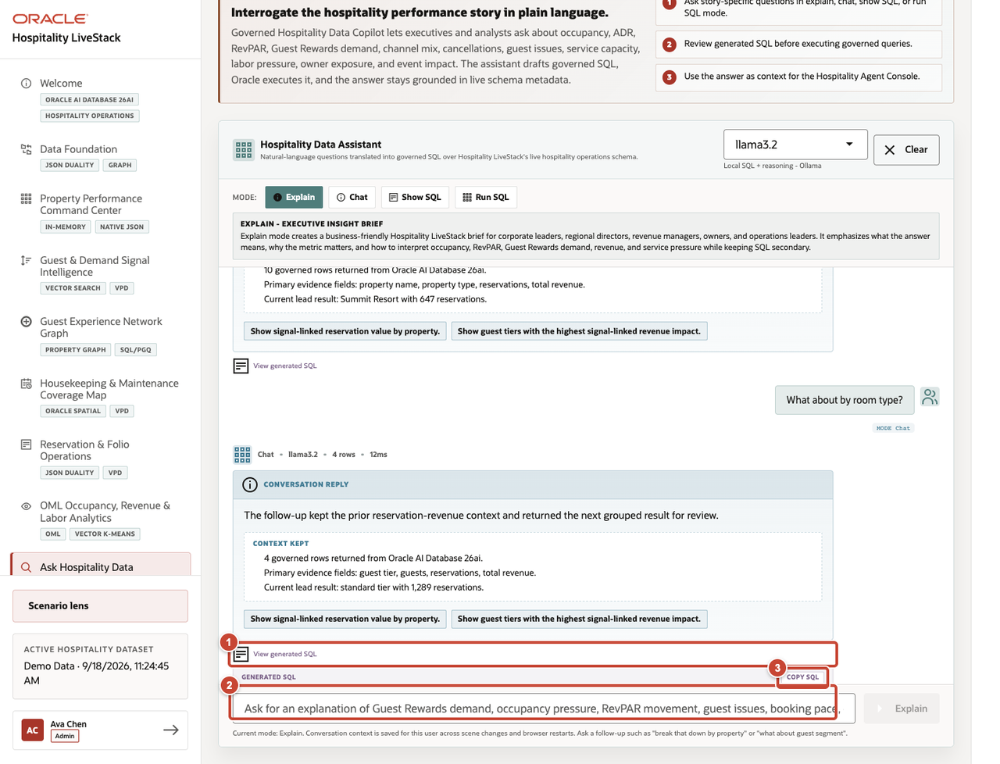

# Scene 8 Ask Hospitality Data

## Introduction

The team has now reviewed dashboards, signals, relationships, service capacity, operating records, and forecasts. Dev uses Ask Hospitality Data to bring those domains into one governed conversation. A follow-up question can build on the prior result, while the user can choose an explanation, inspect generated SQL, or run an authorized query.

Estimated time: 10 minutes.

### Objectives

Ask an operating question, inspect the reasoning path that the interface exposes, and keep follow-up analysis grounded in governed Oracle data.

## Task 1 Ask an operating question

1. Select **Ask Hospitality Data** from the navigation menu.
2. Confirm the runtime profile.
3. Select **Explain** for a business interpretation of the result.
4. Enter `Which properties have the highest reservation revenue?`, then submit the question.

## Task 2 Continue the conversation

1. Confirm that the first response retains its supporting context.
2. Enter the follow-up `What about by room type?`.
3. Confirm that the follow-up response shows **Context kept** and remains tied to the prior result.
4. Review the persistence notice. The conversation is saved for the active user across scene changes and browser restarts.

## Task 3 Inspect SQL when appropriate

1. Open **View generated SQL** beneath the response.
2. Review the selected columns, joins, conditional aggregates, grouping, and ordering before using the query.
3. Select **Copy SQL** only when the statement is needed for an authorized review or execution workflow.

**Next:** Continue with **Scene 9: Hospitality Agent Console**.

## Credits and Build Notes

- Author: Matt Kowalik, Principal Product Manager
- Last updated: September 2026
