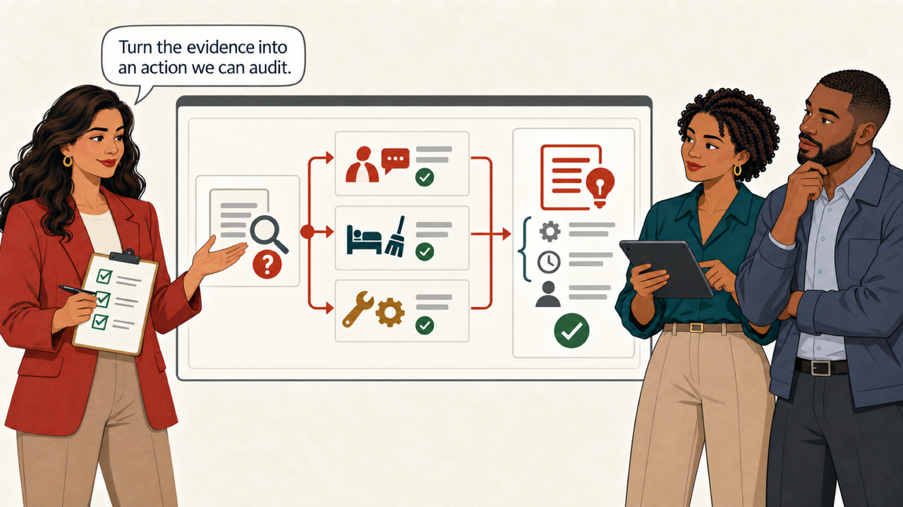
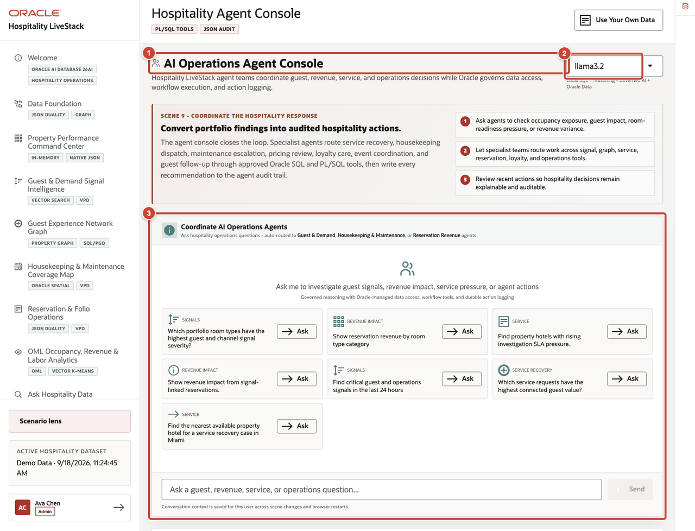
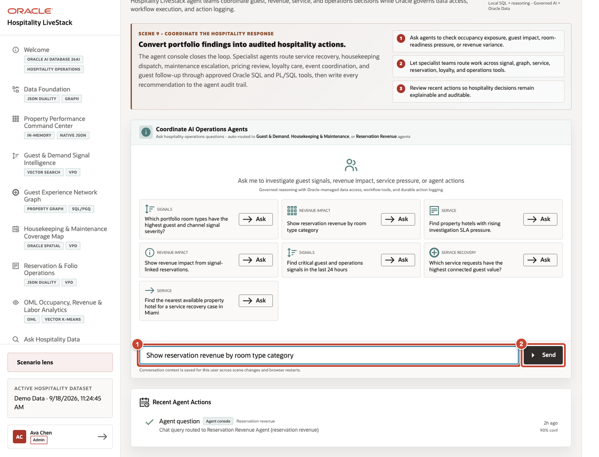
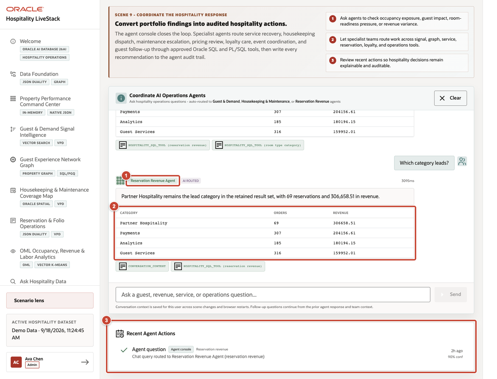

# Scene 9 Hospitality Agent Console

## Introduction

The answer points to properties that need guest care, housekeeping, and engineering. Sofia, Amara, and Theo use the Agent Console to assign the right specialists, refine the request, and check the action log.

Estimated time: 8 minutes.

<video controls width="100%">
  <source src="https://c4u04.objectstorage.us-ashburn-1.oci.customer-oci.com/p/EcTjWk2IuZPZeNnD_fYMcgUhdNDIDA6rt9gaFj_WZMiL7VvxPBNMY60837hu5hga/n/c4u04/b/livelabsfiles/o/livestack%2FVideos%2FHospitality%2FScene%209%20-%20Hospitality%20Agent%20Console.mp4" type="video/mp4">
  Your browser does not support the video tag.
</video>

### Objectives

Ask a focused operations question, review the assigned specialist context, and confirm that the result and action history remain explainable.

## Task 1 Review the workspace

1. Confirm that **AI Operations Agent Console** is open.
2. Confirm the agent runtime profile.
3. Review the operations-agent workspace and the example questions available for guest, revenue, service, and operations investigations.

## Task 2 Ask an action-oriented question

1. Enter `Show reservation revenue by room type category` in the agent question field.
2. Select **Send**.

## Task 3 Review the routed result and audit trail

1. Confirm that the question is routed to the **Reservation Revenue Agent**.
2. Review the returned rows and the Oracle tools listed beneath the response. Ask a follow-up such as `Which category leads?` to continue the same conversation.
3. Review **Recent Agent Actions** for the recorded question, routed agent, domain, time, and confidence.

**Next:** Continue with **Scene 10: Owner Financial Validation Workbench**.

## Credits and Build Notes

- Author: Matt Kowalik, Principal Product Manager
- Last updated: September 2026
