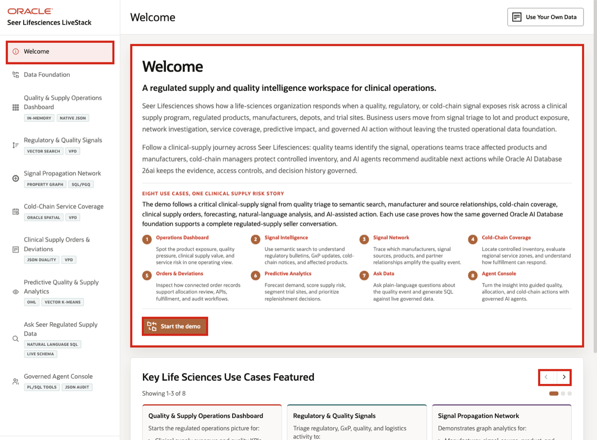

# Seer Lifesciences Clinical Supply LiveStack Guide

## Introduction

Life sciences organizations need an operational intelligence layer that connects the transactional systems managing trial supply to risk detection, governed analytics, and auditable AI-assisted action. CTMS, RTSM/IRT, EDC, QMS, manufacturing, depot, logistics, and regulatory systems each manage critical parts of clinical supply operations. The business value comes from connecting the signals from those systems into one governed decision layer so sponsors, CROs, clinical supply teams, quality teams, and operations leaders can minimize trial interruptions and compliance risk.

The Seer Lifesciences Clinical Supply LiveStack Demo shows that connected decision layer. It does not position Oracle AI Database as a replacement for source systems. Instead, it shows how Oracle AI Database 26ai can help bring regulated supply, quality, logistics, trial-site, and audit signals together so teams can detect risk earlier, inspect the evidence behind a decision, and move from signal to reviewable action with more control.

The demo follows one clinical-supply risk journey: a quality or regulatory signal appears, semantic matching identifies potentially affected products, relationship analysis traces propagation paths, spatial views show cold-chain coverage, orders expose trial-site and supply value impact, predictive analytics supports planning decisions, natural-language analytics exposes trusted SQL and row results, and agent-assisted workflows record auditable follow-up. The story is clinical supply continuity first, with Oracle capabilities supporting that business outcome.

This same connected architecture is also relevant to adjacent use cases such as cold-chain event management and enrollment-driven resupply optimization, but this runbook stays focused on the regulated clinical-supply risk journey shown in the current app.

Estimated Demo Time: **90 minutes**

Each scene is designed to take between 5 and 10 minutes.

### Objectives

In this LiveStack demo, you will see how a life sciences organization can use a governed operational intelligence layer to identify regulated supply risk, protect trial continuity, improve quality traceability, and make AI-assisted operational decisions easier to inspect and explain.

### Prerequisites

Before you begin, confirm that you can open the running Seer Lifesciences LiveStack in a modern browser. No database or coding knowledge is required to follow the business workflow.

## Demo Flow

- **Scene 1:** Welcome and Demo Orientation.
- **Scene 2:** Data Foundation.
- **Scene 3:** Quality and Supply Operations Dashboard.
- **Scene 4:** Regulatory and Quality Signals.
- **Scene 5:** Signal Propagation Network.
- **Scene 6:** Cold-Chain Service Coverage.
- **Scene 7:** Clinical Supply Orders and Deviations.
- **Scene 8:** Predictive Quality and Supply Analytics.
- **Scene 9:** Ask Seer Regulated Supply Data.
- **Scene 10:** Governed Agent Console.

## Learn More

- [Oracle AI Database 26ai documentation](https://docs.oracle.com/en/database/oracle/oracle-database/26/index.html)
- [Oracle AI Agent Memory](https://www.oracle.com/database/ai-agent-memory/)
- [Oracle AI Vector Search](https://www.oracle.com/database/ai-vector-search/)
- Oracle Spatial and Graph documentation: [Oracle Spatial](https://docs.oracle.com/en/database/oracle/oracle-database/26/spatl/toc.htm) and [Oracle Property Graph](https://docs.oracle.com/en/database/oracle/property-graph/26.2/index.html)
- [Oracle Machine Learning for SQL documentation](https://docs.oracle.com/en/database/oracle/machine-learning/oml4sql/tasks.html)
- [Oracle REST Data Services documentation](https://docs.oracle.com/en/database/oracle/oracle-rest-data-services/25.4/orddg/index.html)
- [Oracle LiveLabs catalog](https://livelabs.oracle.com/)

## Credits & Build Notes
- **Author** - Oracle LiveLabs Team
- **Last Updated By/Date** - Oracle LiveLabs Team, 2026-06-04
