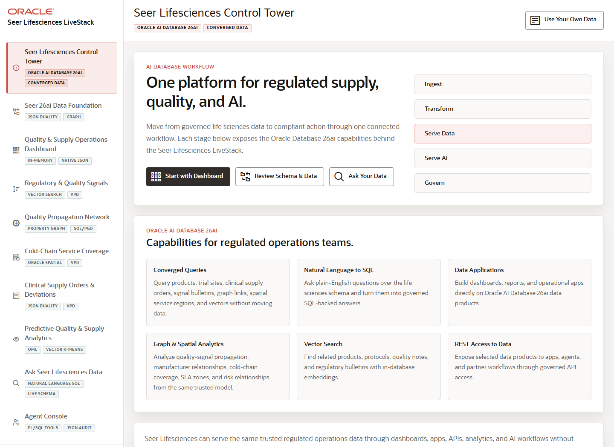

# Scene 1 Welcome and Demo Orientation

## Introduction

**Welcome** gives the audience a roadmap for the clinical-supply story. The welcome page previews how the walkthrough moves from data foundation to dashboard triage, signal matching, graph propagation, cold-chain coverage, order traceability, predictive analytics, governed natural-language access, and auditable agent workflows.

Life sciences teams often struggle to explain how a quality signal becomes an operational decision. A regulatory bulletin, GxP deviation, cold-chain advisory, manufacturer note, or trial-site supply risk may appear in one system while product, order, depot, and audit evidence sit somewhere else.

**Oracle AI Database** helps connect those workflows on one governed data foundation. In this scene, the welcome page turns the demo into one connected clinical-supply story instead of a sequence of unrelated technology features.

Estimated Time: **5 minutes**

### Objectives

In this scene, you will learn how to position the clinical-supply story, which business outcomes the audience should watch for, and how the rest of the walkthrough builds from that opening context.

## Task 1: Review the clinical supply story

Perform the following set of steps to use the welcome page to frame the demo for clinical operations, quality, supply chain, regulatory, and manufacturing leaders.

1. Click **Welcome** in the sidebar.
2. Review **Eight use cases, one clinical supply risk story** in the top panel.
3. Read the eight numbered use case summaries. The point is to make the demo easy to tell as one regulated supply journey: quality teams identify a signal, operations teams trace exposure, cold-chain teams protect controlled inventory, analytics forecast risk, and agents recommend governed actions.
4. Review the visible **Key Life Sciences Use Cases Featured** tiles.

Keep the talk track business focused. Lead with clinical supply continuity, quality traceability, regulatory readiness, and governed action rather than feature-by-feature technology detail.

## Task 2: Continue the demo

Perform the following set of steps to continue the demo and move the audience into the next business workflow.

1. Click **Start the demo**.
2. Confirm the demo moves to the next page.

*You can move to the next scene.*

## Credits & Build Notes
- **Author** - Oracle LiveLabs Team
- **Last Updated By/Date** - Oracle LiveLabs Team, 2026-05-29
