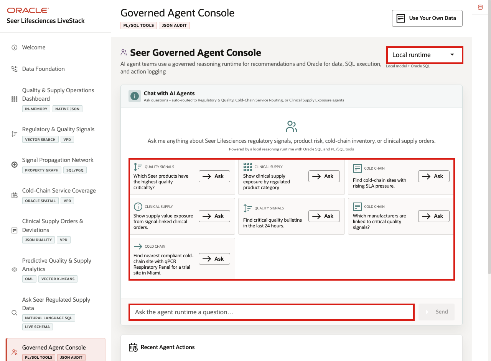
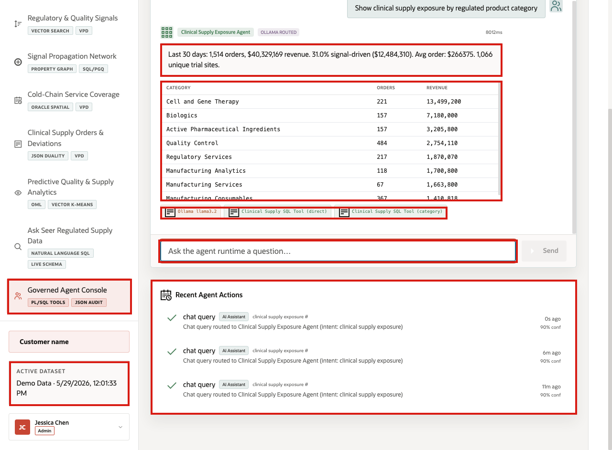
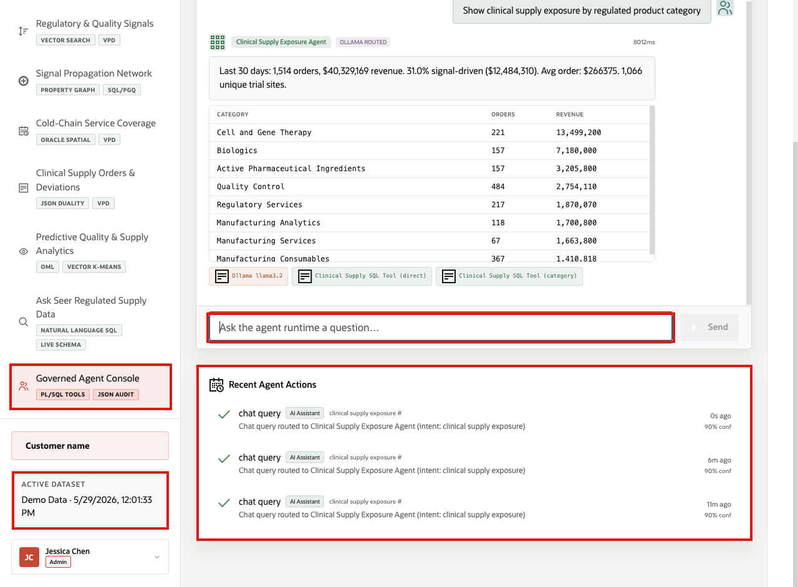

# Scene 10 Governed Agent Console

## Introduction

**Governed Agent Console** shows how AI-assisted workflows can answer regulated supply questions without becoming a black box. The page routes requests through visible agent paths for quality signals, cold-chain routing, and clinical supply exposure while keeping Oracle data access, tool use, and action logging reviewable.

This is difficult to implement in a regulated environment because AI recommendations need traceability. Teams need to know which question was asked, which tool path was used, what data was returned, and whether the action was logged for later review.

**Oracle AI Database** helps address that challenge by keeping agent tools close to governed operational data. In this LiveStack demo, the agent runtime reasons over the question, Oracle SQL and PL/SQL tools retrieve or act on data, and the app records auditable activity.

Estimated Time: **10 minutes**

### Objectives

In this scene, you will learn what life sciences decision the agent console supports, what evidence the user should inspect, and what action the team may take next.

## Task 1: Review the agent console workspace

Perform the following set of steps to review the workspace and show how AI-assisted operations can remain tied to governed data and audit evidence.

1. Click **Governed Agent Console** in the sidebar.
2. Review the runtime profile selector in the top right.
3. Review the example questions in the chat panel.
4. Review **Recent Agent Actions** below the chat panel.

Use this opening view to explain governed AI as an operational assistant rather than an untraceable chatbot.

## Task 2: Run the clinical supply exposure agent question

Perform the following set of steps to run a question that connects natural language, agent routing, SQL tooling, and returned clinical supply data.

1. Click **Ask** on **Show clinical supply exposure by regulated product category**.
2. Review the agent response at the top of the chat output.
3. Review the clinical supply exposure table.
4. Review the tool badges below the response.

In the current demo dataset, the agent summarizes the last **30** days: **1,514** orders, **$40,329,169** revenue, **31.0%** signal-driven exposure, and **1,066** unique trial sites. The table shows **Cell and Gene Therapy** with **221** orders and **$13,499,200** in revenue.

**Note:** Sample values may change after data refreshes or rebuilds. Verify live output before presenting, then explain the business takeaway.

## Task 3: Interpret the operational story

Perform the following set of steps to use the response and explain why governed agent workflows matter in regulated operations.

1. The question narrows the analysis to clinical supply exposure by regulated product category.
2. Oracle data identifies category-level orders and revenue.
3. The agent summarizes exposure and displays the supporting rows.
4. The business user can compare whether the exposure pattern aligns with the quality signals, cold-chain coverage, and OML risk views from earlier scenes.

This is the operational point of the scene: the agent is useful because it returns governed evidence and keeps the tool path visible.

## Task 4: Review the agent action audit trail

Perform the following set of steps to review the audit trail and show how the demo supports traceability.

1. Scroll to **Recent Agent Actions**.
2. Review the top action row.
3. Confirm that the row shows a **chat query** routed to the **clinical supply exposure** agent path.
4. Review the confidence value.

This is the compliance moment in the scene. Regulated organizations can use AI-assisted workflows only when the actions, tool paths, and decision evidence are reviewable.

**Congratulations!** *You have completed the Seer Lifesciences Clinical Supply LiveStack Demo.*

## Credits & Build Notes
- **Author** - Oracle LiveLabs Team
- **Last Updated By/Date** - Oracle LiveLabs Team, 2026-05-29
