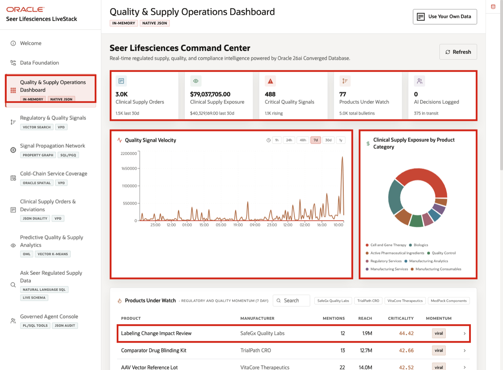
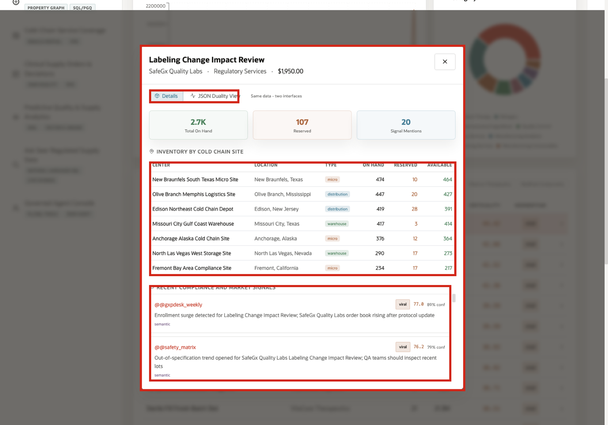
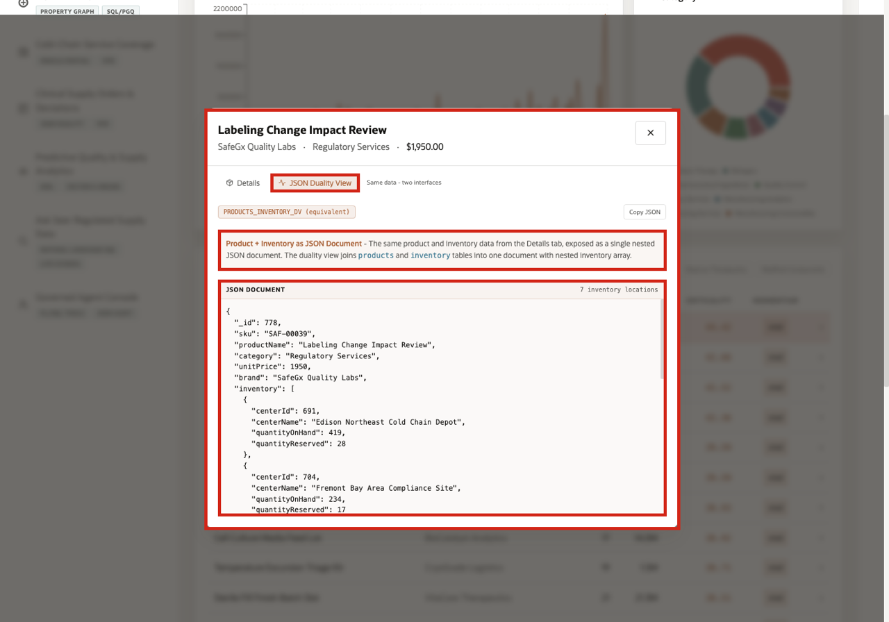

# Scene 3 Quality and Supply Operations Dashboard

## Introduction

**Quality and Supply Operations Dashboard** is the triage point for the clinical-supply journey. The signal is rising regulated supply and quality activity across products, orders, and trial-site demand. The risk is that a product issue or supply constraint becomes a trial interruption, release delay, or compliance escalation before teams have connected the evidence.

The page helps quality, clinical supply, and operations leaders decide where to focus first. It connects supply exposure, critical signals, products under watch, product category exposure, and decision activity so the user can move from dashboard-level awareness to a product-specific investigation.

Oracle AI Database supports this view by keeping operational, analytical, JSON, and AI-ready data connected in the same governed layer. That capability is most relevant after the business decision is clear: the dashboard is useful because it helps teams triage risk and decide what evidence to inspect next.

The **Labeling Change Impact Review** row provides a clear opening example. A regulated product is visible at the dashboard level and then traceable down to inventory, recent signals, and JSON application shape.

Estimated Time: **10 minutes**

### Objectives

In this scene, you will learn how the dashboard surfaces supply risk, what evidence the user should inspect, what decision the business user needs to make, and what follow-up may happen next.

## Task 1: Review the operations dashboard

Use the dashboard as a daily triage view. In the current demo dataset, the opening KPI row shows **3,000** clinical supply orders, about **\$79.0M** in clinical supply exposure, **488** critical quality signals, **77** products under watch, and the current agent decision count.

1. Click **Quality & Supply Operations Dashboard** in the sidebar.
2. Review the KPI cards across the top of the page.
3. Review **Quality Signal Velocity**. This chart shows whether regulated quality, logistics, and compliance activity is accelerating.
4. Review **Clinical Supply Exposure by Product Category** to see which product categories carry the most supply value.
5. Connect the operating outcome to the evidence: the user needs to decide which product, category, or signal pattern deserves investigation first.

The business action may be to open an impact assessment, check controlled inventory, coordinate with a depot or manufacturer, or ask an analyst to validate the exposure pattern.

In the current demo dataset, the opening KPI row shows **3,000** clinical supply orders, about **\$79.0M** in clinical supply exposure, **488** critical quality signals, **77** products under watch, and the current agent decision count.

A quality or supply leader can start with those metrics, then move to the products table to see which regulated products are driving the story.

**Note:** Sample values may change after data refreshes or rebuilds. Verify live output before relying on specific sample values.

## Task 2: Review products under watch

The table moves the user from broad triage to product-level evidence. In the current demo dataset, **Labeling Change Impact Review** appears as a leading SafeGx Quality Labs regulated service with **12** recent mentions, about **1.9M** reach, and **viral** momentum.

1. Scroll to **Products Under Watch**.
2. Review the product rows. The table ranks regulated products by recent quality and regulatory momentum and shows product name, manufacturer, mentions, reach, criticality, and momentum label.
3. Use the search field or manufacturer chips if you want to narrow the table.
4. Click the **Labeling Change Impact Review** row.

This is the first investigation handoff in the story: a product under watch becomes the focus for inventory, signal, and application evidence.

## Task 3: Inspect the product detail modal

Open the product detail modal to assess whether the signal has operational consequences. The decision is whether the product needs supply planning, quality review, or regulatory follow-up.

1. Open the product **Details** modal to connect quality momentum with operational readiness. The user can see whether controlled inventory is available and whether recent signals support further action.
2. After you click **Labeling Change Impact Review**, the detail modal opens. The default **Details** view shows the selected product, SafeGx Quality Labs manufacturer, Regulatory Services category, \$1,950.00 unit supply value, total on-hand inventory, reserved inventory, and signal mention count.
3. Review the inventory table to see where the product is stocked, how many units are on hand, how many are reserved, and how many are still available by cold-chain site.
4. Review the inventory table to understand where the product is stocked, how many units are on hand, how many are reserved, and how many remain available by cold-chain site. Then connect that inventory picture to the recent compliance and market signals so the product's operational status is tied to business evidence.

**Note:** Sample values may change after data refreshes or rebuilds. Verify live output before relying on specific sample values.

## Task 4: Review the JSON Duality View

Review the JSON Duality View to confirm that the same trusted regulated product evidence can support different consumers. Business users see product details in the interface, while applications can use the same data shape as a structured document.

1. In the product modal, click **JSON Duality View**.
2. Review the JSON document for **Labeling Change Impact Review**.
3. Notice how Oracle JSON Relational Duality lets the app expose product and inventory evidence as a document while preserving the governed relational model behind the demo.

The point is traceability across formats: the same product risk can be traced through dashboard metrics, inventory rows, signal evidence, and JSON application access.

Business users see product details in the interface, while applications can use the same information as a structured document.

*You can move to the next scene.*

## Credits & Build Notes
- **Author** - Oracle LiveLabs Team
- **Last Updated By/Date** - Oracle LiveLabs Team, 2026-06-04
