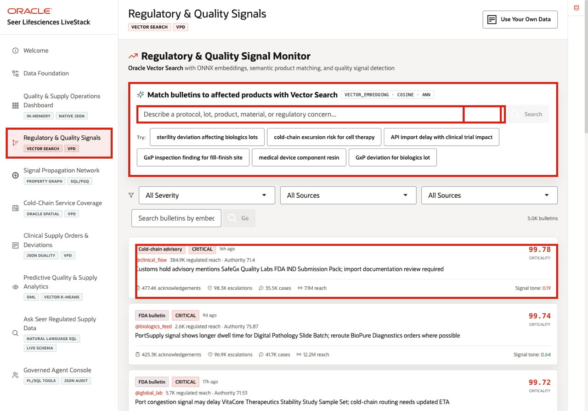
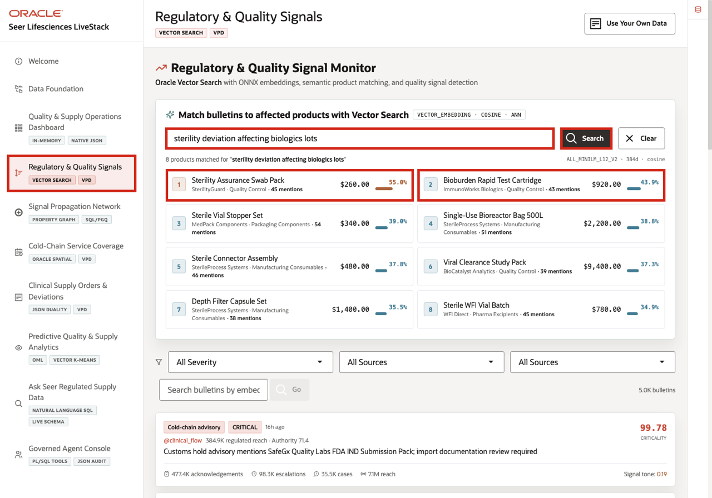

# Scene 4 Regulatory and Quality Signals

## Introduction

**Regulatory and Quality Signals** is where the demo moves from triage to risk identification. The signal is ambiguous quality, regulatory, cold-chain, or manufacturing language that may not match the exact product catalog terms. The business risk is that teams miss an affected product because the alert uses different wording than the operational data.

This is realistic in life sciences operations. A bulletin may mention sterility, labeling, protocol deviation, temperature excursion, import delay, component resin, or fill-finish capacity without naming every impacted product, lot, order, or trial site.

The page helps the user decide which products may need impact assessment, replenishment review, route protection, or quality follow-up. Oracle AI Vector Search supports that decision by comparing signal and product meaning, then returning ranked product evidence that a business user can inspect.

Estimated Time: **10 minutes**

### Objectives

In this scene, you will learn how semantic matching surfaces affected products, what evidence the user should inspect, and how the business can decide whether a signal needs operational follow-up.

## Task 1: Review the Regulatory and Quality Signals page

Review the page to see how a plain-language signal becomes a product impact question.

1. Click **Regulatory & Quality Signals** in the sidebar.
2. Review **Match bulletins to affected products with Vector Search** at the top of the page.
3. Review the default quality signal stream below the search panel.
4. Review the business question: product impact matters more than text similarity. VECTOR_DISTANCE is the database capability that ranks meaning-based matches after that business value is clear.

The action that may follow is an impact assessment, inventory check, manufacturer inquiry, or route-protection review for the matched products.

## Task 2: Run Semantic Product Matching

Run a semantic search to see how an unstructured quality concern becomes ranked product evidence.

1. In **Match bulletins to affected products with Vector Search**, click **sterility deviation affecting biologics lots**.
2. Review the returned product matches.
3. Focus on **Sterility Assurance Swab Pack** and **Bioburden Rapid Test Cartridge** at the top of the results.

In the current demo dataset, the search returns **8** matched products. **Sterility Assurance Swab Pack** appears with a **55.0%** similarity score, while **Bioburden Rapid Test Cartridge** appears with a **43.9%** score. The decision is whether either product should be escalated for quality review, supply exposure analysis, or trial-site impact assessment.

**Note:** Sample values may change after data refreshes or rebuilds. Verify live output before relying on specific sample values.

## Task 3: Review the quality signal stream

Perform the following set of steps to review the quality signal stream and connect ranked product matches with live operational signals.

1. Scroll to the signal stream if needed.
2. Use the severity and source filters if you want to narrow the list.
3. Review the top critical signal, such as the customs hold advisory for **SafeGx Quality Labs FDA IND Submission Pack**.
4. Compare the filtered signal evidence to the ranked vector results above.

The value is speed with control. Quality and supply teams can connect ambiguous language to governed product and order evidence, then decide whether the next step is investigation, inventory protection, or documented follow-up.

*You can move to the next scene.*

## Credits & Build Notes
- **Author** - Oracle LiveLabs Team
- **Last Updated By/Date** - Oracle LiveLabs Team, 2026-06-04
