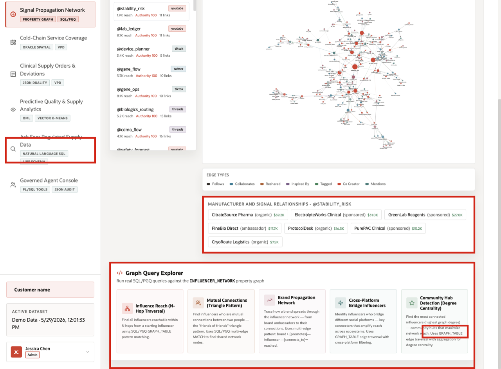
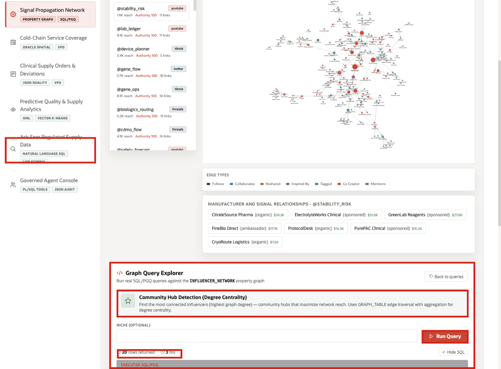

# Scene 5 Signal Propagation Network

## Introduction

**Signal Propagation Network** shows why one signal may not be isolated. The operational event is a quality, regulatory, or supply signal connected to sources, manufacturers, products, logistics partners, and regulated communities. The risk is propagation: a source or relationship cluster may amplify impact across products or partners before the organization sees it in a linear report.

Life sciences teams often need to understand whether a bulletin, advisory, or manufacturer note is part of a wider pattern. That is difficult when source relationships, product links, logistics references, and manufacturer context are spread across separate systems and manual tracking files.

The page helps the user decide which sources, manufacturers, or communities need closer monitoring. Oracle property graph and SQL/PGQ support that decision by making relationship paths queryable over governed life sciences data.

Estimated Time: **10 minutes**

### Objectives

In this scene, you will learn how relationship analysis exposes propagation paths, what evidence the user should inspect, and how the business can prioritize monitoring or follow-up.

## Task 1: Review the Signal Propagation Network page

Perform the following set of steps to review how relationships, communities, and propagation paths extend beyond a simple source list.

1. Click **Signal Propagation Network** in the sidebar.
2. Review the regulatory and quality source list on the left.
3. Review the graph depth control. Increasing the hop count expands the network from direct relationships to broader propagation paths.
4. Review the graph workspace. The graph connects regulated signal sources through relationship types such as follows, collaborates, reshared, inspired by, tagged, co-creator, and mentions.

The business decision is whether a source or community is important enough to monitor, investigate, or include in a broader impact assessment.

## Task 2: Inspect the selected source data point

Perform the following set of steps to inspect the selected source and compare direct authority metrics with network position.

1. Use the selected source at the top of the list, such as **@stability_risk**.
2. Review the source metrics above the graph, including regulated reach, authority, signal rate, connections, nodes, edges, and graph depth.
3. Compare the source row on the left with the graph on the right.
4. Review **Manufacturer and Signal Relationships** below the graph.

This is the data point to focus on during the demo: **@stability_risk** is the selected source, and the visible manufacturer relationships connect the source to organizations such as CitrateSource Pharma, ElectrolyteWorks Clinical, GreenLab Reagents, and PurePAC Clinical.

**Note:** Sample values may change after data refreshes or rebuilds. Verify live output before relying on specific sample values.

## Task 3: Run Community Hub Detection

Perform the following set of steps to run **Community Hub Detection** and identify sources near the center of active signal communities.

1. Scroll to **Graph Query Explorer**.
2. Select **Community Hub Detection (Degree Centrality)**.
3. Click **Run Query**.
4. Review the returned rows.

Focus on the result count and the first hub. In the current demo dataset, the query returns **20** rows and identifies **@import_alerts** as a high-degree hub with **15** graph connections, **6** edge types, and an average relationship strength of about **0.610**.

The operational takeaway is that the organization can prioritize a source based on connected influence, not only on one visible message. The governed follow-up may be source monitoring, manufacturer outreach, or a broader exposure check in the next scenes.

This result is useful because it shows a graph-based decision signal: the most important source is not defined by one message alone, but by how many meaningful relationship paths it can activate across the network.

*You can move to the next scene.*

## Credits & Build Notes
- **Author** - Oracle LiveLabs Team
- **Last Updated By/Date** - Oracle LiveLabs Team, 2026-06-04
