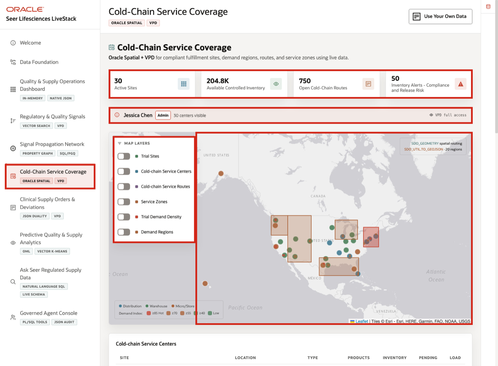
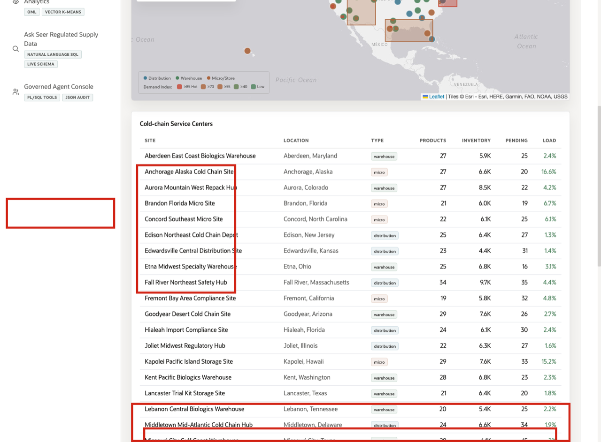
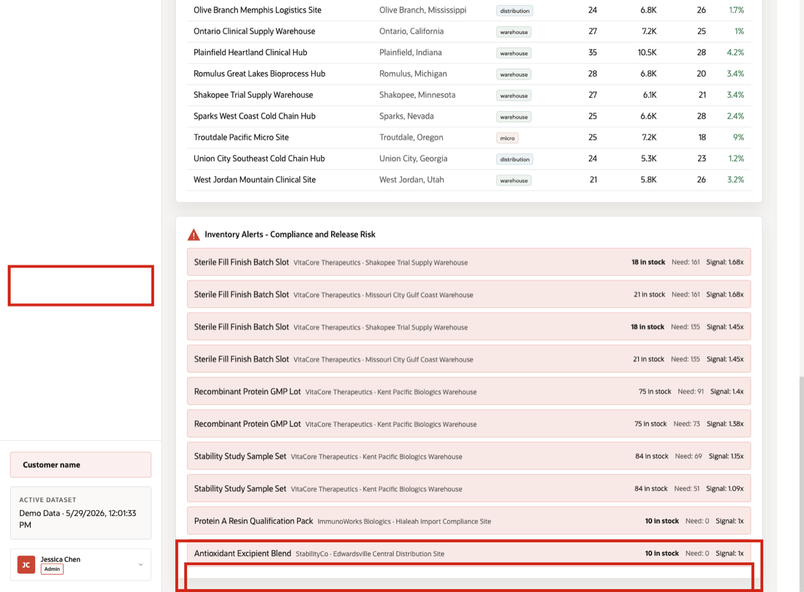

# Scene 6 Cold-Chain Service Coverage

## Introduction

**Cold-Chain Service Coverage** brings the risk journey into operational geography. The signal is controlled supply pressure across trial sites, depots, service zones, routes, and demand regions. The risk is that a quality signal or supply constraint affects temperature-sensitive products without teams understanding where inventory, route capacity, and regional demand intersect.

Clinical supply and quality teams need this context for biologics, trial kits, high-value therapies, and controlled materials. A product may look available in a table, but trial continuity depends on where inventory sits, which routes are open, and whether the region can be served within operating constraints.

The page helps the user decide whether a site, route, or region may need capacity review, replenishment, rerouting, or escalation. Oracle Spatial supports that decision by storing sites, zones, routes, and demand regions in Oracle and surfacing them as one governed operational view with VPD context.

Estimated Time: **10 minutes**

### Objectives

In this scene, you will learn how geographic evidence informs cold-chain and inventory decisions, what data the user should inspect, and what operational follow-up may happen next.

## Task 1: Review the cold-chain coverage context

Perform the following set of steps to use the map as the operational geography view for controlled clinical supply.

1. Click **Cold-Chain Service Coverage** in the sidebar.
2. Review the KPI tiles at the top of the page. They summarize active sites, available controlled inventory, open cold-chain routes, and compliance or release-risk inventory alerts.
3. Review the VPD banner below the tiles. It shows which demo user is active and whether the page is using full access or a region-filtered view.
4. Review the map workspace. This is where trial sites, cold-chain service centers, cold-chain routes, service zones, trial demand density, and demand regions can be layered together.

In the current demo dataset, the page shows **30** active sites, about **204.8K** available controlled inventory units, **750** open cold-chain routes, and **50** inventory alerts. The decision this supports is whether the organization has enough service coverage and controlled inventory in the regions where risk is emerging.

**Note:** Sample values may change after data refreshes or rebuilds. Verify live output before relying on specific sample values.

## Task 2: Explore spatial demand and service coverage

Perform the following set of steps to explore spatial demand and service coverage together.

1. In **Map Layers**, turn on **Service Zones** and **Demand Regions** if they are not already active.
2. Review the service-zone shapes around fulfillment locations.
3. Review the demand-region polygons. The demand index color scale helps identify regions where supply pressure is higher.
4. Use the visible map layers to review how spatial data supports service coverage and demand-region analysis.

The business action may be to confirm a depot can cover the region, check whether a route is still viable, or ask supply planning to protect inventory before a trial site is affected.

## Task 3: Inspect cold-chain site load

Perform the following set of steps to inspect the site table and connect the map with operational capacity.

1. Scroll to **Cold-chain Service Centers**.
2. Review the site name, location, type, products, inventory, pending routes, and load percentage.
3. Focus on **Fall River Northeast Safety Hub** as one example. In the current dataset, it carries **34** stocked products, about **9.7K** inventory units, **35** pending shipments, and about **4.4%** load.
4. Compare this row with other sites to understand where there may be available capacity or regional pressure.

**Note:** Sample values may change after data refreshes or rebuilds. Verify live output before relying on specific sample values.

## Task 4: Investigate an inventory alert

Perform the following set of steps to review the alert table and connect capacity with regulated supply risk.

1. Scroll to **Inventory Alerts - Compliance and Release Risk**.
2. Review the top alert rows.
3. Focus on **Clean Steam Integrity Audit** at **Fall River Northeast Safety Hub**.
4. Interpret the row: **18** units are on hand against a reorder point of **38**, with **25** reserved units and a critical stock status.

This is the operational point of the scene: spatial coverage and supply alerts are not separate decisions. The regulated supply team can evaluate sites, routes, capacity, and risk from one Oracle-backed operating picture before deciding on replenishment, rerouting, or quality follow-up.

*You can move to the next scene.*

## Credits & Build Notes
- **Author** - Oracle LiveLabs Team
- **Last Updated By/Date** - Oracle LiveLabs Team, 2026-06-04
