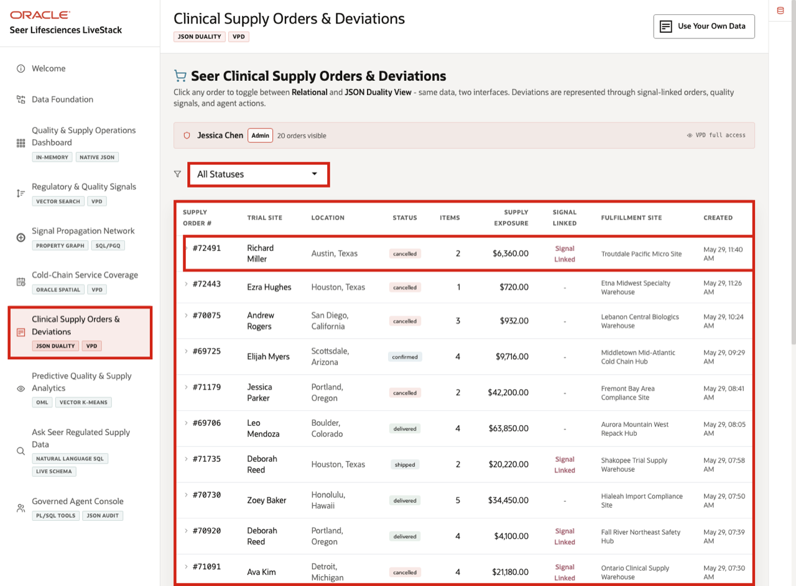
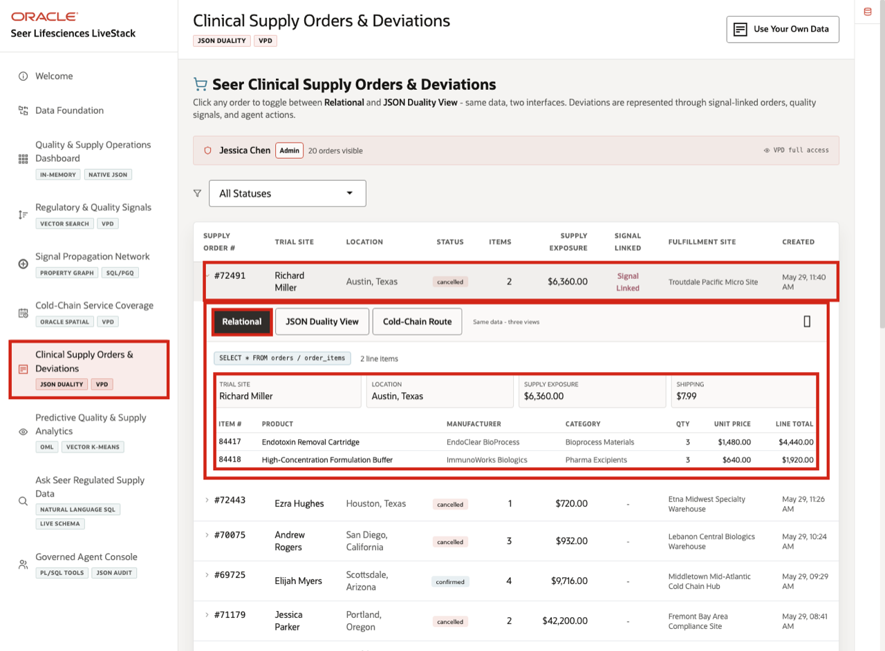
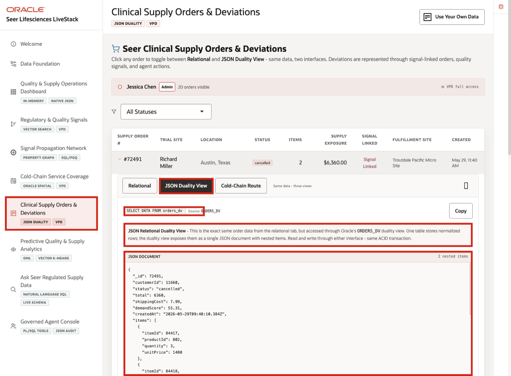
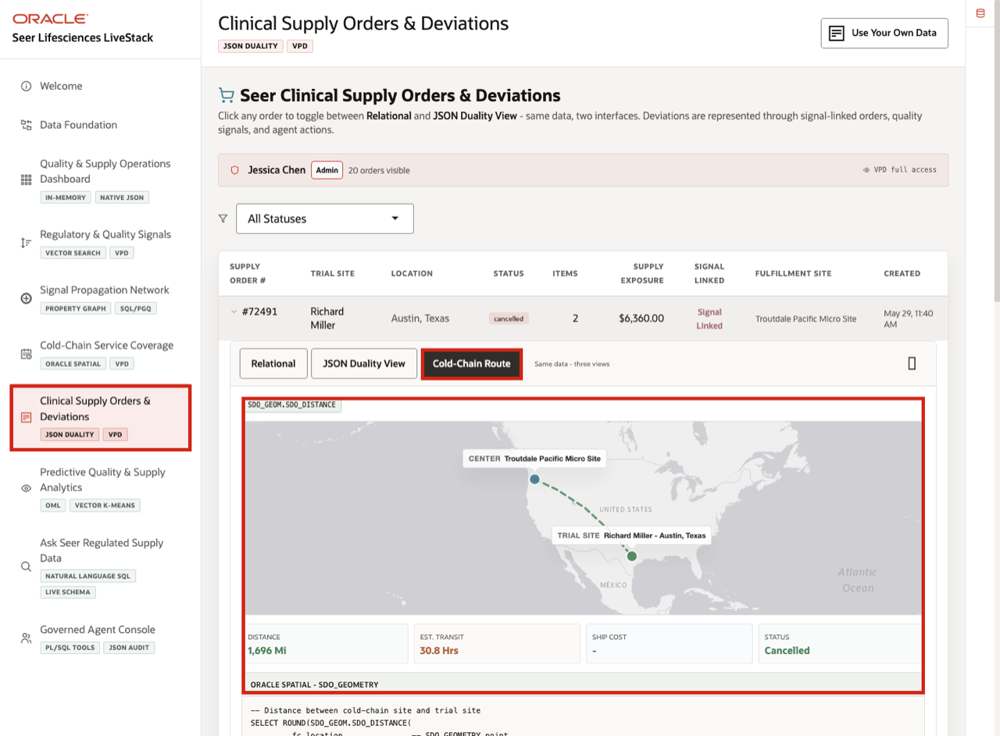

# Scene 7 Clinical Supply Orders and Deviations

## Introduction

**Clinical Supply Orders and Deviations** gives clinical supply, quality, and operations users one workspace for answering a practical question: *What happened to this order, what evidence is attached to it, and what action may be needed next?*

The page connects order status, trial site, supply exposure, signal linkage, fulfillment detail, JSON access, and cold-chain route evidence.

This matters because clinical supply teams must trace order and deviation evidence quickly. If an order is signal-linked or a shipment is delayed, the team needs to understand the trial site, product lines, fulfillment site, exposure value, and route context without waiting for separate reports.

**Oracle AI Database** helps address that challenge by keeping relational order data and JSON document access aligned through JSON Relational Duality. Business users can inspect structured order detail while applications and APIs can use the same order as a document.

Estimated Time: **10 minutes**

### Objectives

In this scene, you will learn what life sciences decision the order workspace supports, what evidence the user should inspect, and what action the team may take next.

## Task 1: Review the order workspace

Perform the following set of steps to review the order workspace and show how regulated supply records stay connected to trial sites, signal linkage, and fulfillment evidence.

1. Click **Clinical Supply Orders & Deviations** in the sidebar.
2. Review the VPD banner below the page subtitle. It shows the active demo user and whether the user has full access or a region-filtered order view.
3. Review the status filter and the order table.
4. Focus on order **#72491**.

In the current demo dataset, order **#72491** is a cancelled clinical supply order for **Richard Miller** in **Austin, Texas**, with **$6,360.00** supply exposure and a signal-linked status.

**Note:** Sample values may change after data refreshes or rebuilds. Verify live output before presenting, then explain the business takeaway.

## Task 2: Inspect the relational order detail

Perform the following set of steps to open the relational detail and show the operational system of record.

1. Click order **#72491**.
2. Confirm the **Relational** tab is selected.
3. Review the trial site, location, supply exposure, shipping cost, and line-item table.
4. Review the products in the order, including **Endotoxin Removal Cartridge** and **High-Concentration Formulation Buffer**.

This view matters for clinical supply operations because the order, line items, fulfillment site, and signal linkage are visible in one place for review and follow-up.

## Task 3: Compare the JSON Duality View

Perform the following set of steps to compare the JSON Duality View and show how the same trusted order data can support application and API access.

1. Click **JSON Duality View** in the expanded order panel.
2. Review the source label **ORDERS_DV**.
3. Review the JSON document for order **72491**.
4. Notice that the document contains the order id, trial site, status, total, shipping cost, created date, and nested line items.

## Task 4: Review shipment and cold-chain route context

Perform the following set of steps to review the route tab and connect the order to cold-chain execution.

1. Click **Cold-Chain Route** in the expanded order panel.
2. Review the fulfillment site and trial-site context.
3. Review the shipment context: route status, distance, estimated transit time, route cost, and delivery timing.
4. Review the shipment progress timeline if it is visible.

Emphasize traceability here: the same order can be shown as relational rows, as a JSON document, and as route evidence without changing the underlying operational source.

*You can move to the next scene.*

## Credits & Build Notes
- **Author** - Oracle LiveLabs Team
- **Last Updated By/Date** - Oracle LiveLabs Team, 2026-05-29
