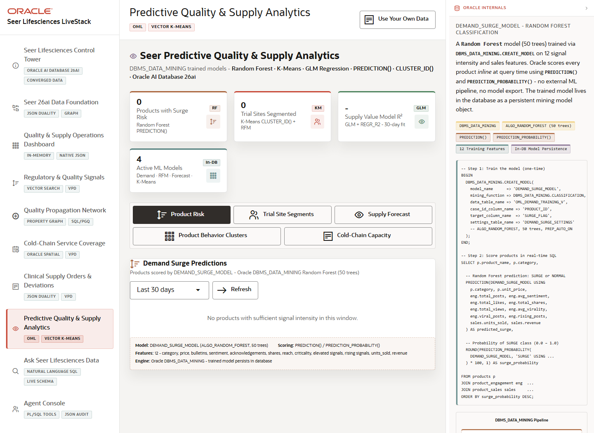
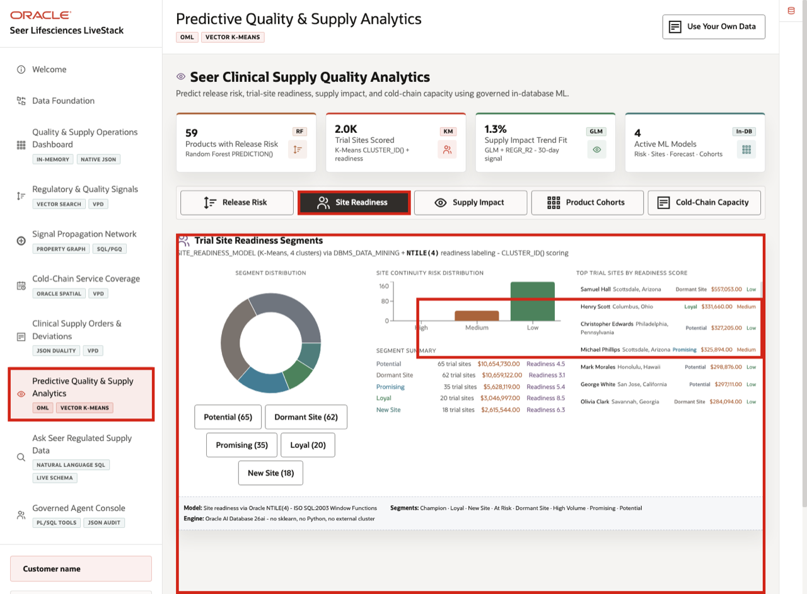
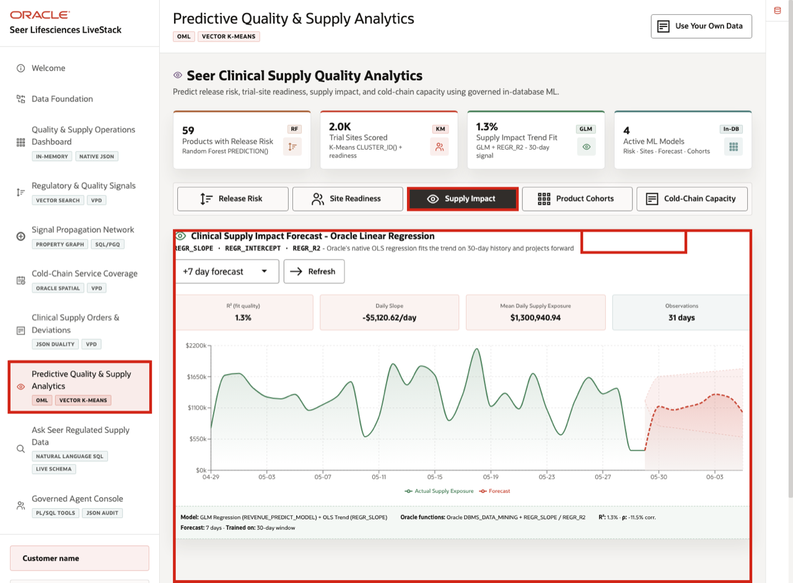
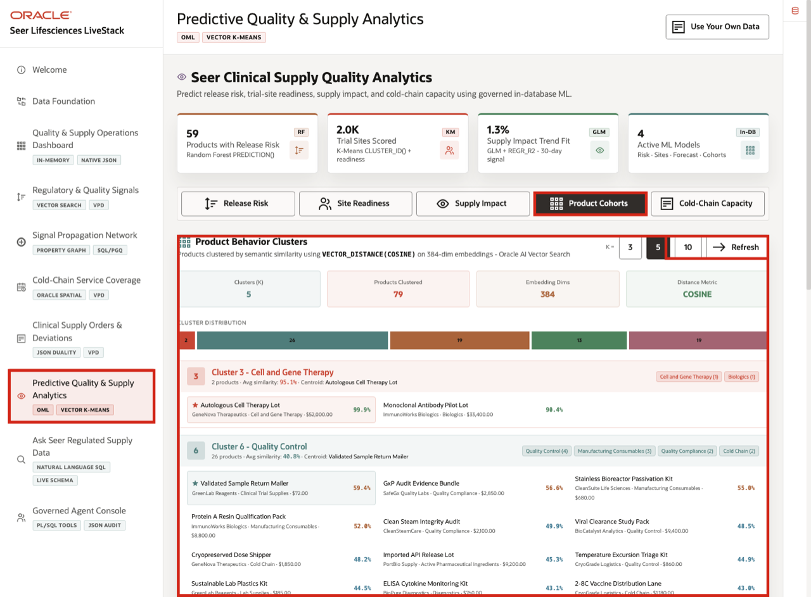
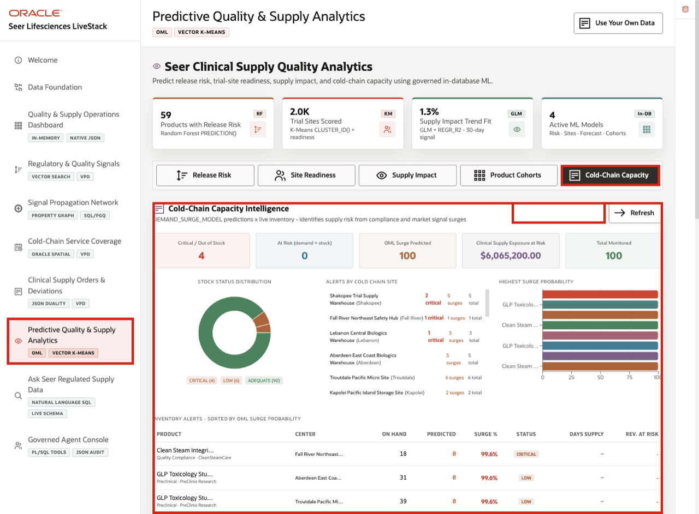

# Scene 8 Predictive Quality and Supply Analytics

## Introduction

**Predictive Quality and Supply Analytics** turns the connected evidence into planning decisions. The signal is model-backed risk across product release, trial-site readiness, supply impact, product cohorts, and cold-chain capacity. The business risk is that teams react too late because quality signals, order trends, inventory posture, and site behavior are not evaluated together.

Quality, clinical operations, manufacturing, and supply teams need to prioritize what matters before a trial site, batch release, or controlled inventory position is affected. They need risk scores that remain connected to governed data, not disconnected model outputs that are difficult to explain.

The page helps users decide where to focus planning, replenishment, site support, or quality follow-up. Oracle Machine Learning for SQL supports that decision by training and scoring close to the governed life sciences data, then exposing the outputs through business-facing tabs.

Estimated Time: **10 minutes**

### Objectives

In this scene, you will learn how model-backed analytics support planning decisions, what evidence the user should inspect, and how risk scores can lead to governed operational follow-up.

## Task 1: Review the OML analytics workspace

Perform the following set of steps to review how model-backed risk scores can support regulated supply decisions.

1. Click **Predictive Quality & Supply Analytics** in the sidebar.
2. Review the four summary cards at the top of the page: products with release risk, trial sites scored, supply impact trend fit, and active ML models.
3. Review the mode tabs: **Release Risk**, **Site Readiness**, **Supply Impact**, **Product Cohorts**, and **Cold-Chain Capacity**.
4. Stay on **Release Risk** and review the bar chart and product table.
5. Focus on **GLP Toxicology Study Kit**, **NGS Oncology Library Kit**, and **Clean Steam Integrity Audit** in the release-risk table.

In the current demo dataset, the release-risk model scores **59** products and uses an in-database Random Forest path. The table shows predicted clinical supply demand, supply exposure, confidence, and signal severity. The decision is whether a product needs release-risk review, supply protection, or additional quality follow-up.

**Note:** Sample values may change after data refreshes or rebuilds. Verify live output before relying on specific sample values.

## Task 2: Filter Site Readiness

Perform the following set of steps to review how the business can segment trial sites by behavior and operational risk.

1. Click **Site Readiness**.
2. Review the segment distribution and segment summary.
3. Click one of the segment controls if you want to narrow the site list.
4. Review the filtered site list on the right.

This helps clinical operations understand which sites may need closer planning, supply monitoring, or support before enrollment or treatment schedules are affected. It also previews the value of future enrollment-driven resupply optimization without expanding the current demo scope.

## Task 3: Change the Supply Impact forecast

Perform the following set of steps to use the forecast tab to connect quality signals with future supply impact.

1. Click **Supply Impact**.
2. Change the forecast horizon if you want to compare a different planning window.
3. Click **Refresh** if the page does not update automatically.
4. Review the model quality cards and the forecast chart.

The forecast remains part of the same operating story. The user can move from signal detection to exposure assessment to planning decisions without losing governance over the data path.

## Task 4: Change Product Cohorts

Perform the following set of steps to use the Product Cohorts tab and understand how similar regulated products can be grouped for planning and risk review.

1. Click **Product Cohorts**.
2. Change the cluster count if you want to compare cohort granularity.
3. Review the cluster summary cards and distribution.
4. Review one cluster card and its product assignments.

This is useful when product teams need to understand which materials, therapies, or supply categories behave similarly under quality and demand pressure.

## Task 5: Review Cold-Chain Capacity

Perform the following set of steps to review how model-backed risk can turn into replenishment and allocation decisions.

1. Click **Cold-Chain Capacity**.
2. Review the inventory summary cards.
3. Scroll to the capacity or inventory alert table if needed.
4. Focus on a high-risk row such as **Clean Steam Integrity Audit**.

The scene connects AI to operational action: model scores help users decide where capacity, replenishment, or quality follow-up may need attention. In a production setting, similar connected signals could also support cold-chain event management, including temperature excursion detection and impact response.

*You can move to the next scene.*

## Credits & Build Notes
- **Author** - Oracle LiveLabs Team
- **Last Updated By/Date** - Oracle LiveLabs Team, 2026-06-04
