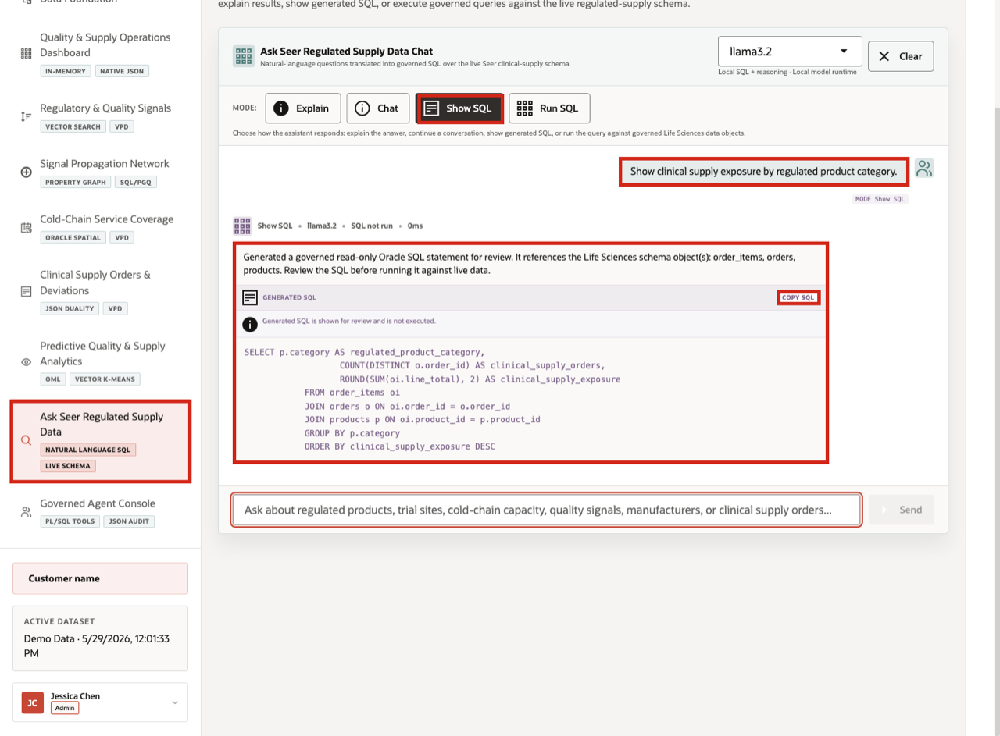
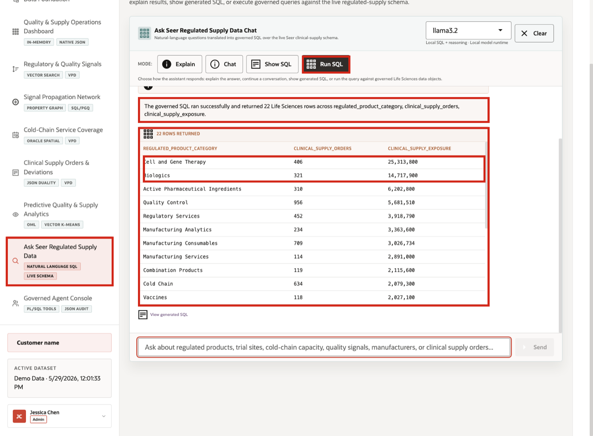

# Scene 9 Ask Seer Regulated Supply Data

## Introduction

**Ask Seer Regulated Supply Data** shows governed self-service analytics for the clinical-supply journey. The operational event is a business user needing an answer quickly: which product categories carry supply exposure, which cold-chain sites have capacity, or which quality signals are connected to orders. The risk is that natural-language access can become opaque or uncontrolled if users cannot inspect the query path.

Life sciences teams need faster answers, but they also need reviewability. A generated answer is not enough in a regulated environment; users need visible SQL, trusted execution, returned rows, and a clear boundary between the reasoning runtime and governed data access.

The page helps the user decide whether to trust, review, or run an analytic question. Oracle AI Database supports the pattern by executing governed SQL against the live regulated-supply schema while the app exposes modes for explanation, chat, generated SQL inspection, and SQL execution.

In this LiveStack demo, the app sends the business question and schema context to the local reasoning runtime, validates the generated SQL path, and uses Oracle AI Database 26ai as the execution authority. The user can inspect generated SQL before execution, run the SQL to return rows, or use narrative modes when a summarized answer is more useful.

Estimated Time: **10 minutes**

### Objectives

In this scene, you will learn how natural-language analytics can remain governed, what evidence the user should inspect, and how SQL visibility supports regulated decision-making.

## Task 1: Review the Ask Seer Regulated Supply Data workspace

Perform the following set of steps to review how business users can ask questions in plain language while keeping the query path visible and controlled.

1. Click **Ask Seer Regulated Supply Data** in the sidebar.
2. Review the runtime profile in the top right of the chat card. The current demo uses the local **llama3.2** runtime.
3. Review the four modes: **Explain**, **Chat**, **Show SQL**, and **Run SQL**.
4. Review the queryable Life Sciences schema panel.
5. Focus on the **Supply Exposure** question: **Show clinical supply exposure by regulated product category.**

This page demonstrates speed with control: business users can ask questions in plain language, while the system still shows the query path and uses Oracle as the trusted execution layer for the demo.

## Task 2: Inspect generated SQL

Perform the following set of steps to inspect the generated SQL and confirm that the answer is traceable.

1. Click **Show SQL**.
2. Enter **Show clinical supply exposure by regulated product category.**
3. Click **Send**.
4. Review the generated SQL.

The generated SQL groups clinical supply orders by regulated product category and calculates clinical supply exposure. This is the governance moment in the scene because the business user can inspect the query path before asking the database to return rows.

The value is not only convenience. A clinical supply or quality analyst can get faster answers while still seeing the SQL and data rows behind the result.

## Task 3: Run the SQL and inspect the returned data

Perform the following set of steps to run the SQL and inspect the returned rows for concrete exposure patterns across regulated product categories.

1. Click **Clear** if the generated SQL result is still visible.
2. Click **Run SQL**.
3. Enter **Show clinical supply exposure by regulated product category.**
4. Click **Send**.
5. Review the returned table.
6. Focus on the first row: **Cell and Gene Therapy**.

In the current demo dataset, the question returns **22** rows. The first row shows **Cell and Gene Therapy** with **406** clinical supply orders and **\$25,313,800** in clinical supply exposure.

This data point anchors the scene. The natural-language question surfaces a concrete regulated supply exposure pattern that could matter to clinical supply, quality, manufacturing, and executive operations teams.

**Note:** Sample values may change after data refreshes or rebuilds. Verify live output before relying on specific sample values.

## Task 4: Review the governance pattern

The governance pattern is speed with control: the user asks in plain language, the system shows or runs SQL, Oracle returns trusted data, and the answer remains reviewable.

1. The user asks a regulated supply question in plain English.
2. The app builds prompt and schema context for the selected runtime profile.
3. The local reasoning runtime drafts SQL or a response plan.
4. Oracle AI Database executes the generated SQL against the live schema used by the demo.
5. The UI returns either visible SQL, raw rows, or a narrated answer.

This pattern matters because regulated organizations want faster answers, but they also need governed access. Ask Seer Regulated Supply Data shows how natural-language analytics can be useful without hiding the query path or implying that the intelligence layer replaces the specialized systems that manage clinical operations.

*You can move to the next scene.*

## Credits & Build Notes
- **Author** - Oracle LiveLabs Team
- **Last Updated By/Date** - Oracle LiveLabs Team, 2026-06-04
