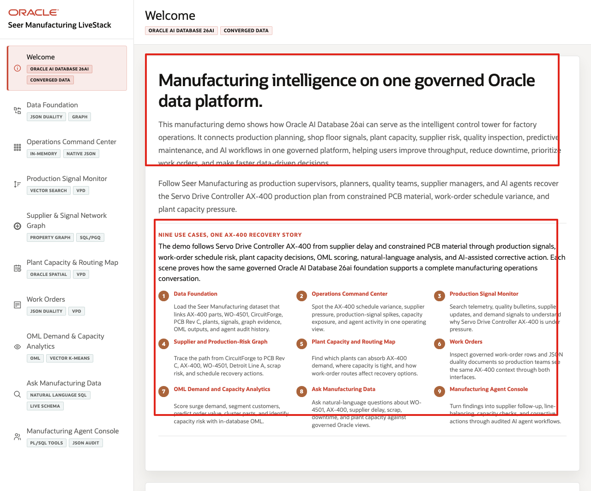
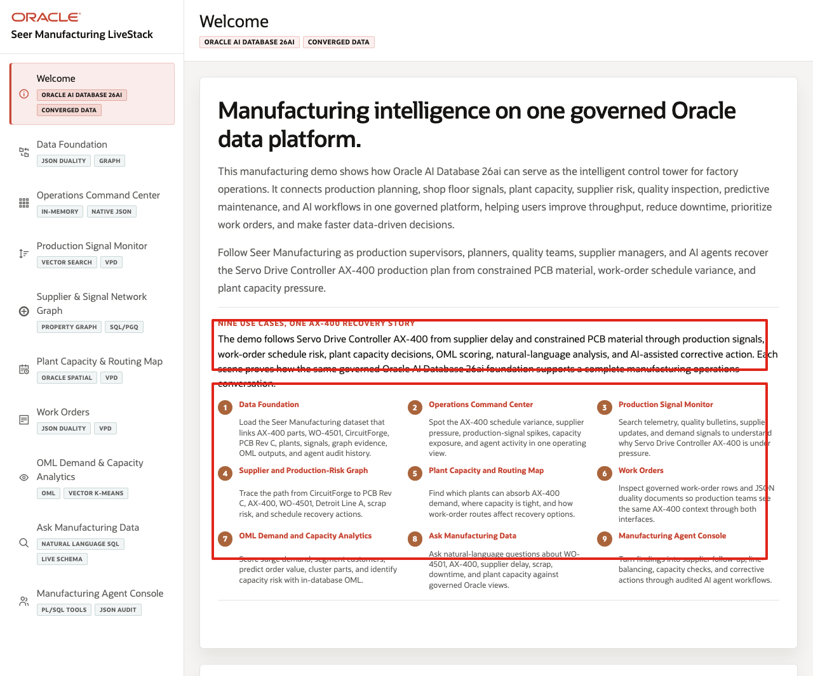
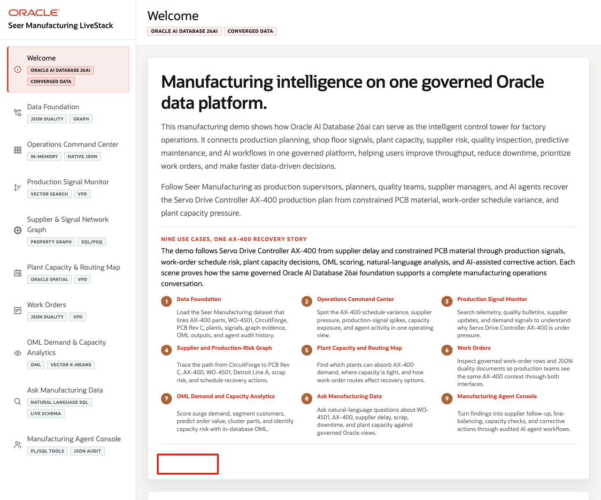

# Scene 1 Welcome and Demo Orientation

## Introduction

This opening scene orients users to the Seer Manufacturing LiveStack Demo. The welcome page introduces the manufacturing operations story and uses a carousel to preview the use cases available in the demo.

The story follows the Servo Drive Controller AX-400 production plan as Seer Manufacturing works through constrained PCB material, supplier delay, work-order schedule variance, plant-capacity pressure, scrap risk, and AI-assisted corrective action. Use this scene to establish the user role: an operations leader, plant manager, production supervisor, maintenance planner, quality engineer, or supply chain analyst who needs one governed view of factory operations.

Estimated Time: 5 minutes

### Objectives

In this scene, you will:
- Review the use case carousel on the welcome page.
- Learn which manufacturing use cases are available to explore in the LiveStack Demo.
- Connect the use cases to the AX-400 recovery story.
- Use the carousel controls to move through the use case tiles.
- Click **Start the demo** to continue to the data foundation page.

## Task 1: Review the use case carousel

1. Read the three visible use case tiles.
2. Click the right carousel arrow to move forward.
3. Continue until you have reviewed all visible manufacturing use cases.
4. Use the left carousel arrow if you want to return to earlier tiles.

    

The welcome page frames the demo as manufacturing intelligence on one governed Oracle data platform. The carousel introduces how the LiveStack connects the data foundation, operations command center, production and quality signals, supplier and production-risk graph, plant capacity map, work orders, OML analytics, Ask Manufacturing Data, and agent-assisted operations.

## Task 2: Connect the story to AX-400 recovery

1. Review the main welcome story.
2. Focus on the line that explains the Servo Drive Controller AX-400 recovery plan.
3. Explain that the same production issue will move through supplier risk, production signals, work orders, plant capacity, predictive analytics, natural-language exploration, and AI agent action.

    

Use this as the narrative anchor for the rest of the runbook. The demo is not a feature checklist. It is a manufacturing operations investigation that starts with a production plan under pressure and ends with auditable corrective action.

## Task 3: Continue the demo

1. Click **Start the demo**.

    

2. Confirm the demo moves to **Data Foundation**.

Use this transition to explain that the welcome page is the orientation layer. The next scene prepares the governed manufacturing dataset that powers every later workflow.

## Credits & Build Notes
- **Author** - Oracle LiveLabs Team
- **Last Updated By/Date** - Oracle LiveLabs Team, 2026-06-02
- **Screenshot source** - Captured from `http://143.47.191.163:8505/`.
