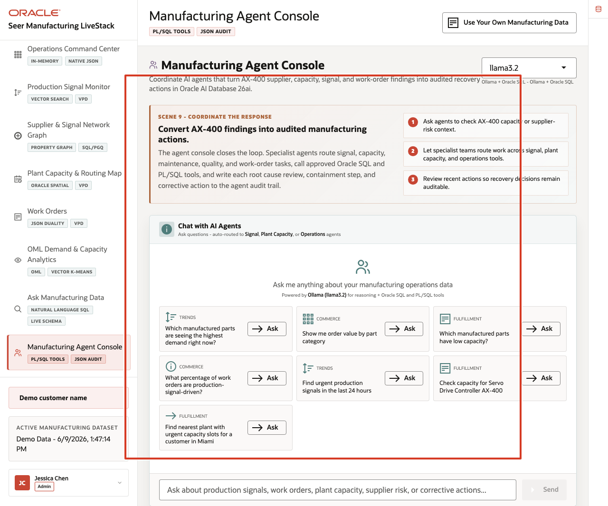
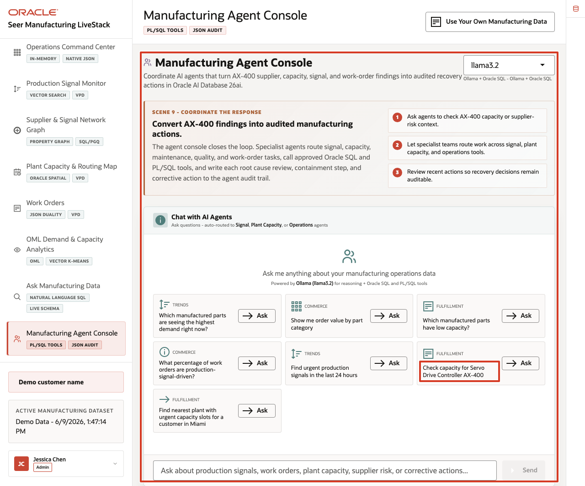
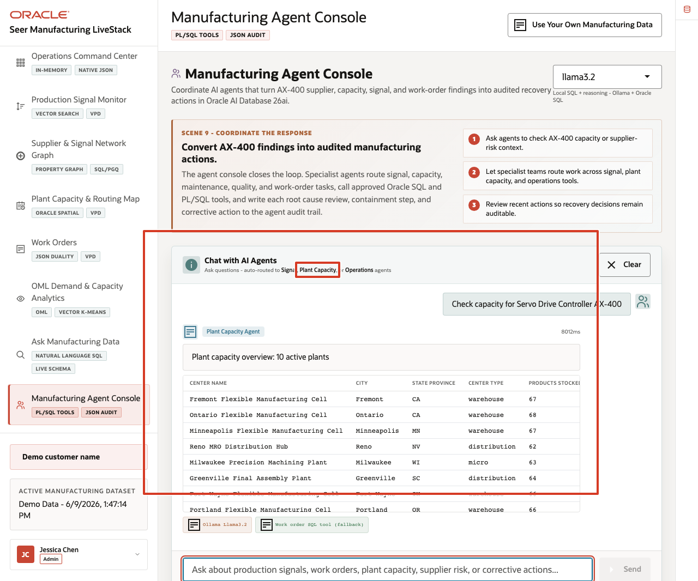
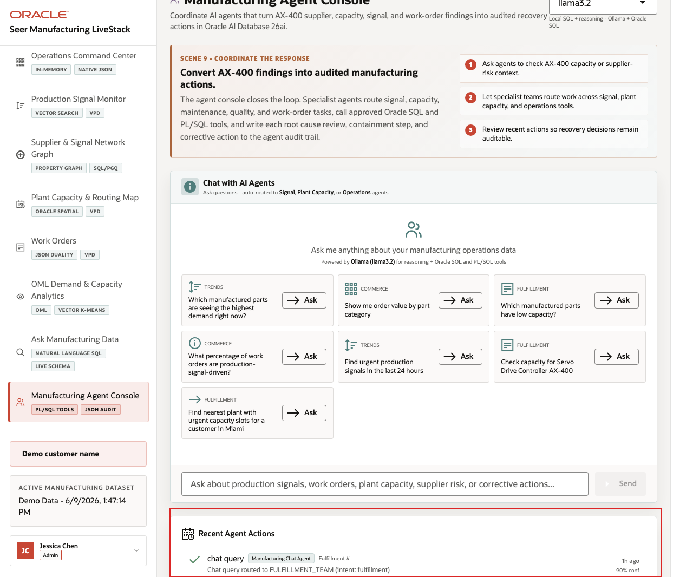

# Scene 10 Manufacturing Agent Console

## Introduction

A manufacturing operations leader, production supervisor, plant capacity planner, quality engineer, maintenance planner, or AI platform owner uses this page to see how agentic assistance can support day-to-day manufacturing decisions. This persona is not only interested in whether an AI agent can answer a question. They need to know which specialist path handled the request, which tools were used, what data was returned, and whether the action was recorded for later review.

This is difficult to implement when AI agents operate as black boxes outside the operational data platform. Manufacturing teams may get a recommendation, but not the routing decision, SQL or PL/SQL tool path, confidence, or audit record behind it.

Oracle AI Database helps address these challenges by keeping the source data, SQL execution, PL/SQL tools, and durable action logging in the database. In this LiveStack Demo, the app orchestrates the agent workflow, Ollama provides reasoning, and Oracle AI Database 26ai executes the governed data operations.

Estimated Time: 10 minutes

### Objectives

In this scene, you will:
- Review the **Manufacturing Agent Console** workspace and runtime profile.
- Review the production signal, work-order, plant capacity, and corrective-action example questions.
- Run a plant-capacity agent question.
- Inspect the agent response and returned plant capacity table.
- Review the **Recent Agent Actions** audit trail.
- Understand why observable agent behavior matters for enterprise manufacturing workflows.

## Task 1: Review the agent console workspace

1. Click **Manufacturing Agent Console** in the sidebar.
2. Review the runtime profile selector. The current demo uses **llama3.2** through Ollama-backed reasoning.
3. Review the example questions in the agent workspace.
4. Review **Recent Agent Actions** below the workspace.
5. Focus on the plant-capacity example: **Check capacity for Servo Drive Controller AX-400**.

    

Use this opening view to explain the role of the page. The user is not looking at a generic chatbot. They are looking at an operational agent surface where manufacturing questions are routed to specialist teams such as signal review, plant capacity, and work-order follow-up.

## Task 2: Run the plant-capacity agent question

1. Click **Ask** on **Check capacity for Servo Drive Controller AX-400**.

    

2. Review the agent response at the top of the chat output.
3. Review the returned plant capacity table.
4. Review the tool and runtime badges below the response.

In the current demo dataset, the agent routes the request to the **Plant Capacity** path and returns a capacity overview with **10** active plants. The visible table includes **Fremont Flexible Manufacturing Cell**, **Ontario Flexible Manufacturing Cell**, **Minneapolis Flexible Manufacturing Cell**, **Reno MRO Distribution Hub**, and **Milwaukee Precision Machining Plant**. The response exposes the Ollama runtime and SQL tool path.

This is the data point to emphasize during the demo. The agent did more than answer a text question. It classified the manufacturing capacity intent, queried governed plant data, returned a structured table, and exposed enough runtime information for an operator to understand the path.

## Task 3: Review the agent action audit trail

1. Scroll to **Recent Agent Actions**.

    

2. Review the panel as the audit surface for completed action-cycle records.
3. If action rows are present, confirm the action type, routed agent path, execution status, and confidence value.
4. If the panel is empty after a chat-only response, explain that the answer still exposes runtime and tool badges in the chat result, while action-cycle records appear when the application writes them to the event history.

This is the governance point of the scene: agent decisions should be observable after the conversation or action cycle. The page separates the live chat response from the durable action history so operators can distinguish immediate assistance from recorded operational actions.

The value of Oracle AI Database is that the agent workflow stays connected to governed operational data. The AI runtime can reason and orchestrate, while Oracle remains responsible for data access, SQL and PL/SQL execution, spatial and operational calculations, and durable audit records.

You can move to the next scene.

## Credits & Build Notes
- **Author** - Oracle LiveLabs Team
- **Last Updated By/Date** - Oracle LiveLabs Team, 2026-06-09
