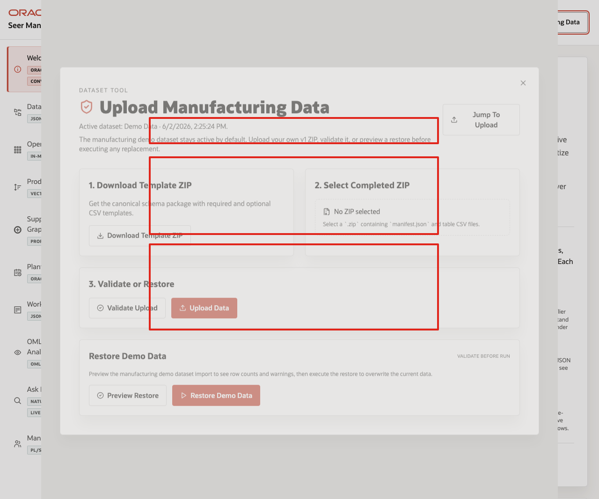
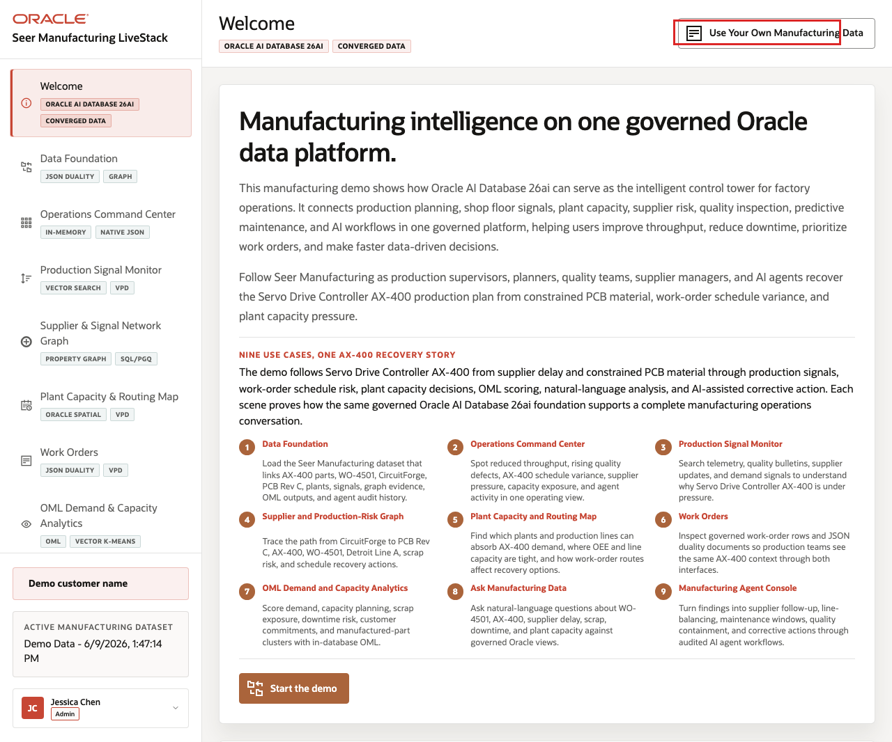
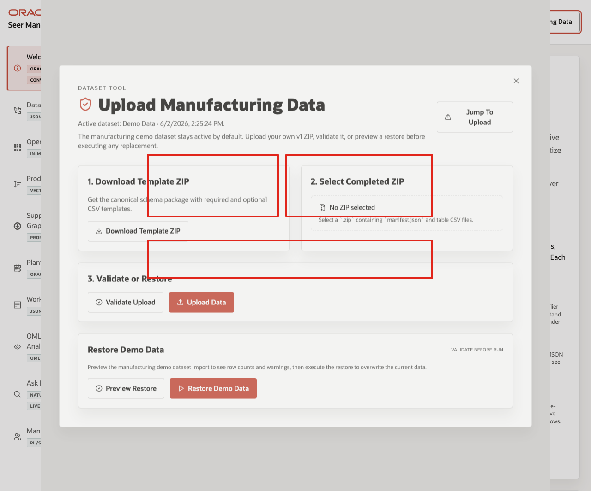
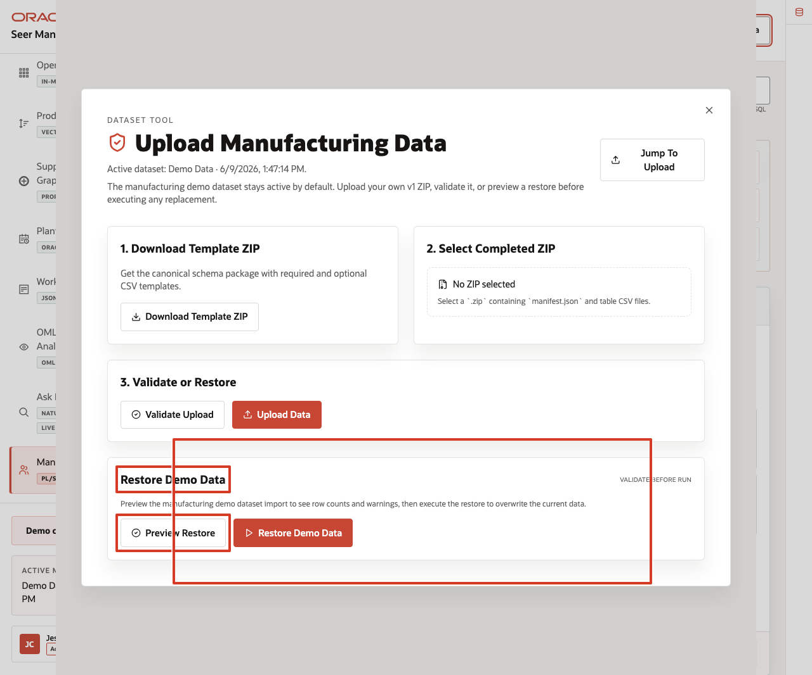

# Scene 11 Use Your Own Manufacturing Data

## Introduction

**Use Your Own Manufacturing Data** shows how users can replace or restore the manufacturing dataset through the application while keeping the demo safe and repeatable. The workflow supports template download, ZIP validation, upload, seeded-data restore, and the expectation that only synthetic or non-sensitive manufacturing data is used.

This scene matters because a manufacturing LiveStack is most useful when teams can map the demo pattern to their own terminology and sample data. The application makes that workflow explicit while keeping the seeded Seer Manufacturing data available as a known-good baseline.

Estimated Time: 10 minutes

### Objectives

In this scene, you will learn how the dataset tool supports template ZIP download, completed ZIP upload, validation, restore preview, seeded-data restore, active dataset state, and data-safety expectations.

## Task 1: Open the dataset tool

Perform the following set of steps to open the dataset tool and reinforce the key safety rule: use only synthetic or non-sensitive manufacturing data in the demo environment:

1. From any application scene, click **Use Your Own Manufacturing Data** in the top bar.
2. Review the modal title and active dataset line.
3. Confirm that the modal presents the data replacement workflow for manufacturing sample data.
4. Review the main sections: **Download Template ZIP**, **Select Completed ZIP**, **Validate or Restore**, and **Restore Manufacturing Demo Data**.

    

In the current demo, the modal shows the active dataset as **Demo Data** and provides a workflow for a v1 ZIP that contains `manifest.json` and table CSV files.

**Note:** Sample values may change after data refreshes or rebuilds. Verify live output before presenting, then explain the business takeaway.

## Task 2: Review the template and upload workflow

Perform the following set of steps to review the template and upload workflow and show how custom manufacturing datasets remain repeatable and easier to troubleshoot:

1. Click **Download Template ZIP** to download the canonical schema package.
2. Review **Select Completed ZIP**. The control expects a `.zip` containing `manifest.json` and table CSV files.
3. Review the **Validate Upload** and **Upload Data** actions.
4. Explain that validation should run before data replacement.

    

This workflow helps keep custom demos repeatable. The template sets the expected structure, validation checks the completed ZIP before import, and upload remains an explicit action.

## Task 3: Preview or restore the seeded dataset

Perform the following set of steps to preview or restore the seeded dataset and return the demo to a known-good baseline after testing custom data:

1. In **Restore Demo Data**, review the **Preview Restore** and **Restore Demo Data** controls.
2. Click **Preview Restore** when you are ready to validate the seeded dataset before resetting the demo.
3. When the preview response completes, review row counts, warnings, or issues returned by the validation.
4. If you need to return the demo to the seeded baseline, click **Restore Demo Data** after validating the restore path.
5. Close the dataset manager when finished.

    

Use this scene to explain the operating guardrail: teams can bring synthetic manufacturing data into the LiveStack, but the seeded dataset remains available as a known baseline.

You can move to the download lab when you want to run the Manufacturing LiveStack locally.

## Credits & Build Notes
- **Author** - Oracle LiveLabs Team
- **Last Updated By/Date** - Oracle LiveLabs Team, 2026-06-22
