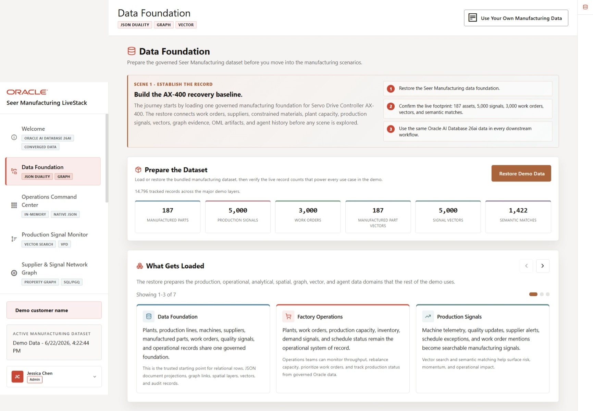
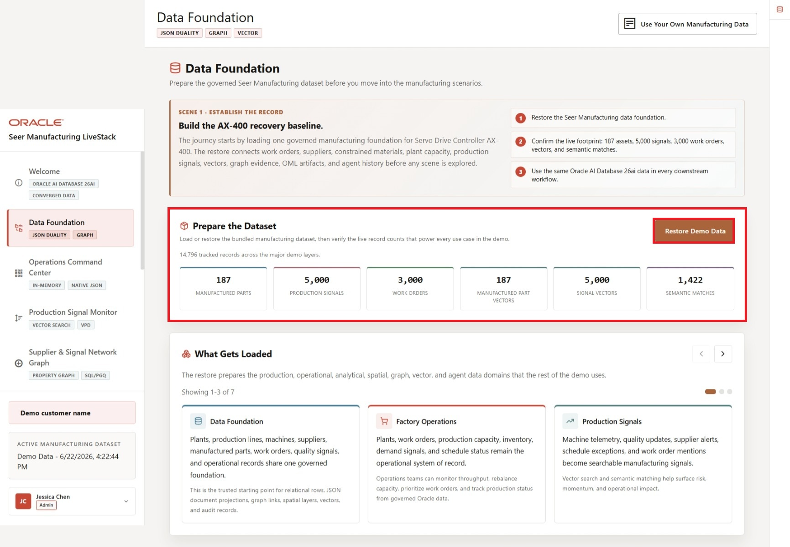
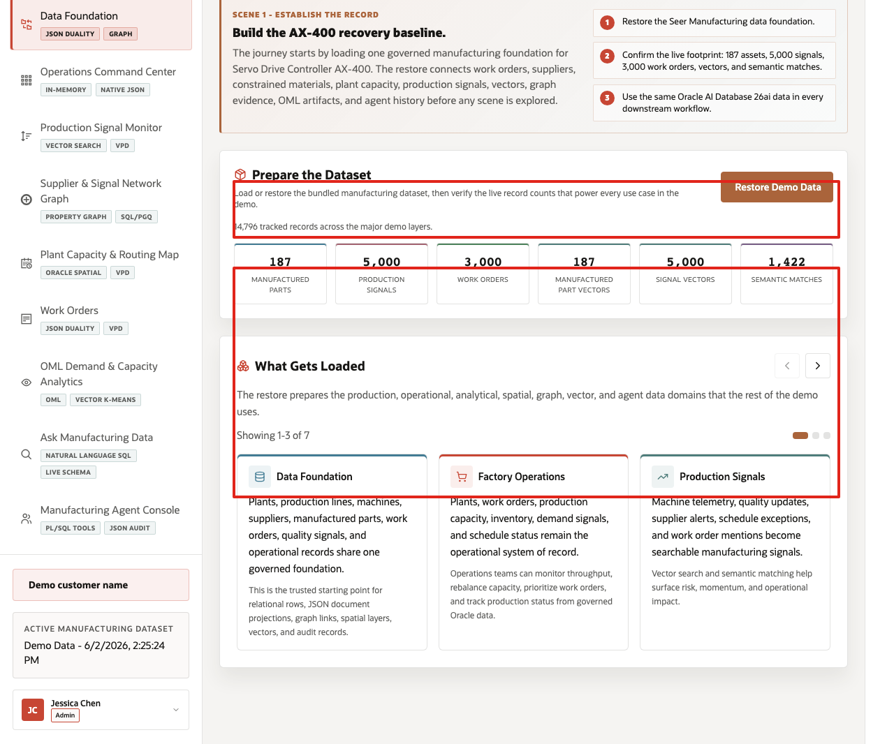
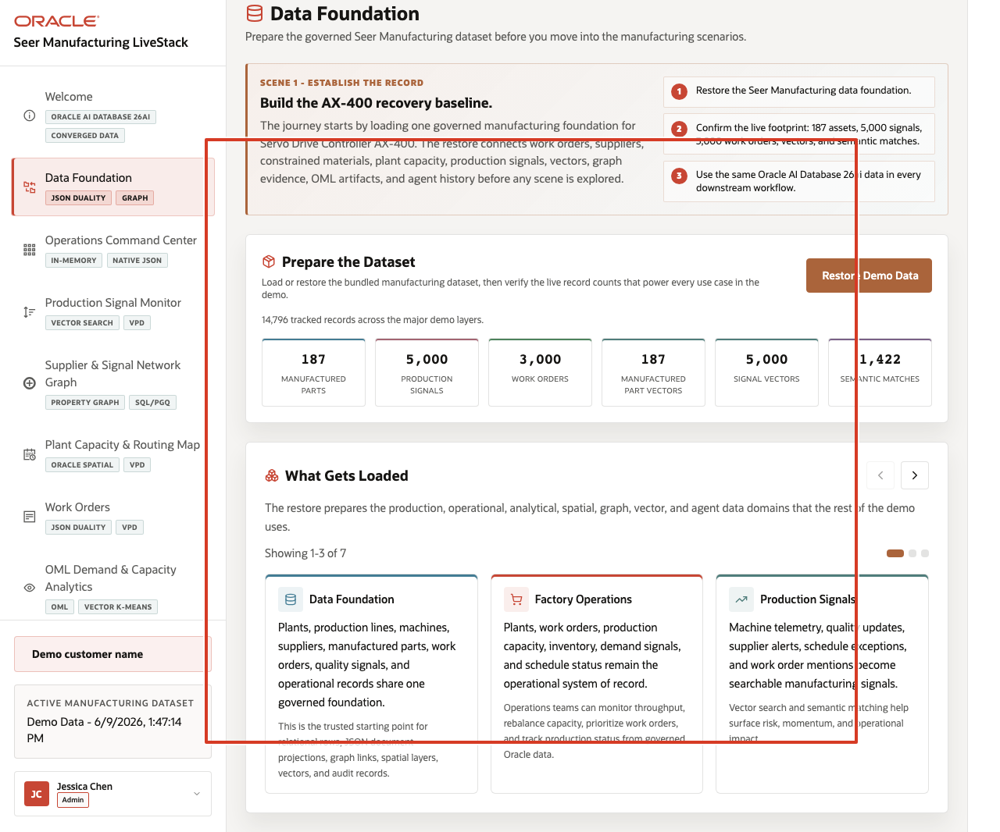

# Scene 2 Manufacturing Data Foundation

## Introduction

This scene prepares the trusted **Seer Manufacturing** dataset used throughout the demo. Loading or restoring the data gives every later screen the same governed starting point, so dashboards, signal search, graph analysis, plant routing, work orders, analytics, Ask Data, and agent actions all reflect the same manufacturing data foundation.

The scene is useful at the start of a customer walkthrough because it establishes that the later pages are not separate demos. Manufactured parts, work orders, production signals, supplier relationships, plant capacity, route geography, vectors, semantic matches, machine learning outputs, and agent audit records are all prepared from the same Oracle-backed foundation.

Estimated Time: **5 minutes**

### Objectives

In this scene, you will learn what data powers the demo, what evidence confirms the environment is ready, and how the connected data foundation supports the later manufacturing workflows.

## Task 1: Prepare the dataset

Perform the following set of steps to prepare the dataset so every later scene starts from the same trusted manufacturing baseline:

1. From the welcome page, click **Start the demo**, or click **Data Foundation** in the sidebar.
2. In **Prepare the Dataset**, click **Restore Demo Data** if the dataset needs to be reset to the seeded baseline.
3. Wait for the operation to complete.
4. Review the record counts below the action.

    

In the current demo dataset, the page shows **14,796** tracked records across the major demo layers, including **187** manufactured parts, **5,000** production signals, **3,000** work orders, **187** manufactured-part vectors, **5,000** signal vectors, and **1,422** semantic matches.

Use these counts to frame the demo. The user is not loading a single table for a dashboard. The page prepares the operational, analytical, spatial, graph, vector, and audit data that each later scene uses.

**Note:** Sample values may change after data refreshes or rebuilds. Verify live output before presenting, then explain the business takeaway.

## Task 2: Review what gets loaded

Perform the following set of steps to review what gets loaded and show that the demo uses recognizable manufacturing data, not only dashboard-ready metrics:

1. Scroll to **What Gets Loaded**.
2. Review the first three carousel cards: **Data Foundation**, **Factory Operations**, and **Production Signals**.
3. Use the right carousel arrow to review the remaining data groups.
4. Click the **Oracle Internals** icon on the far-right rail to expand the sidebar, then review the Oracle capability notes.

    

The carousel explains the shared data model in business terms: plants, production lines, machines, suppliers, manufactured parts, work orders, quality signals, inventory and capacity records, route geography, graph links, vectors, ML outputs, and agent actions. The sidebar ties that story to Oracle capabilities such as relational data, JSON Duality Views, property graph, Oracle Spatial, vector search, in-database ML, and the agent audit trail.

## Task 3: Connect the foundation to the rest of the demo

Perform the following set of steps to use this page as the bridge into the operating story and connect the data foundation to the rest of the demo:

Use this page as the handoff into the operating story:

1. Explain that the command center will summarize the foundation as manufacturing operating indicators.
2. Explain that production signals will use vector search over the signal data prepared here.
3. Explain that supplier graph, plant routing, work orders, OML analytics, Ask Data, and agent pages all read from the same governed foundation.

    

The business value is that teams can make decisions from connected, governed data. Oracle AI Database provides the shared foundation that keeps operational data, analytics, spatial views, graph relationships, vector search, natural-language access, and AI workflows aligned.

You can move to the next scene.

## Credits & Build Notes
- **Author** - Oracle LiveLabs Team
- **Last Updated By/Date** - Oracle LiveLabs Team, 2026-06-09
