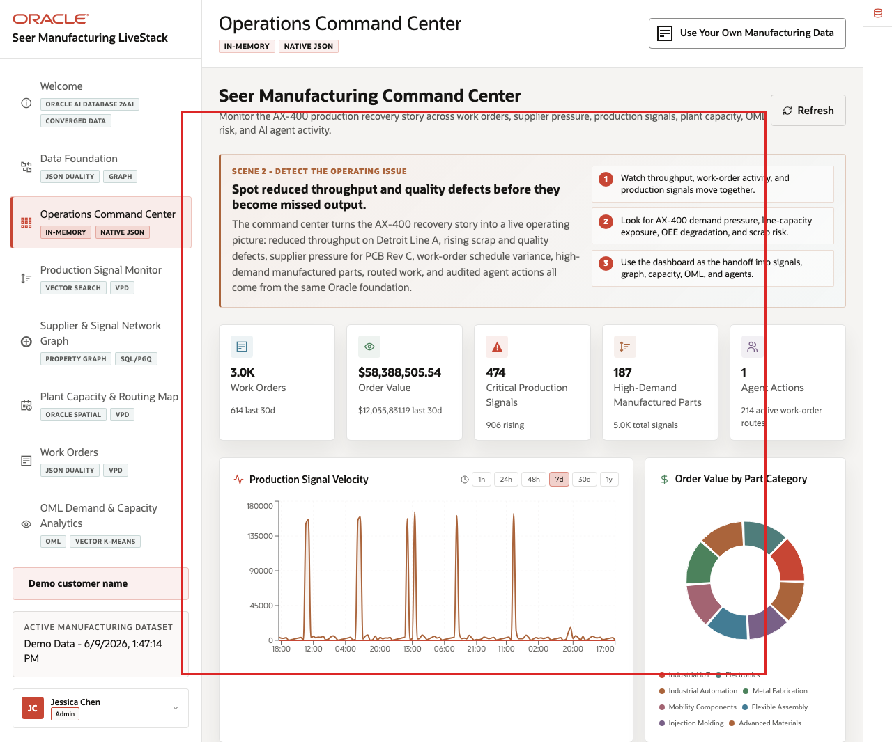
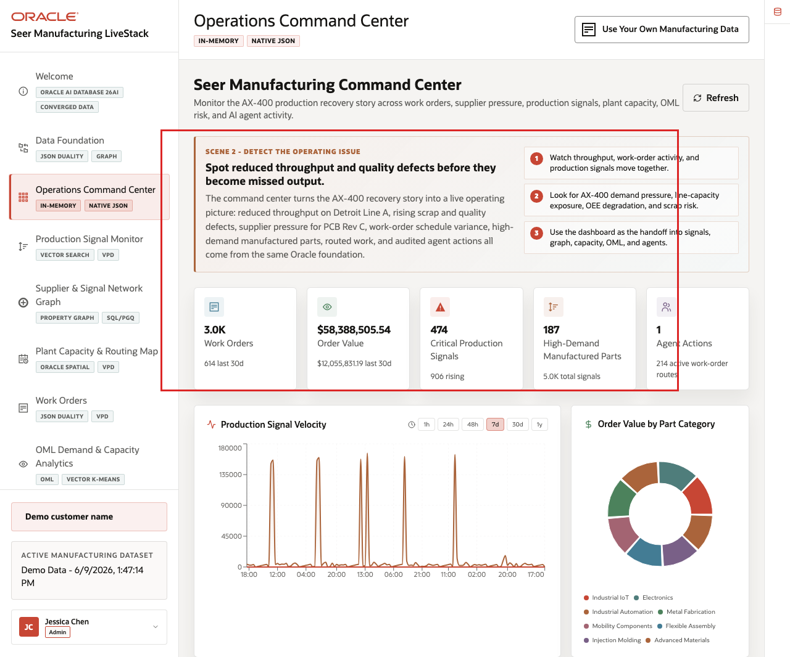
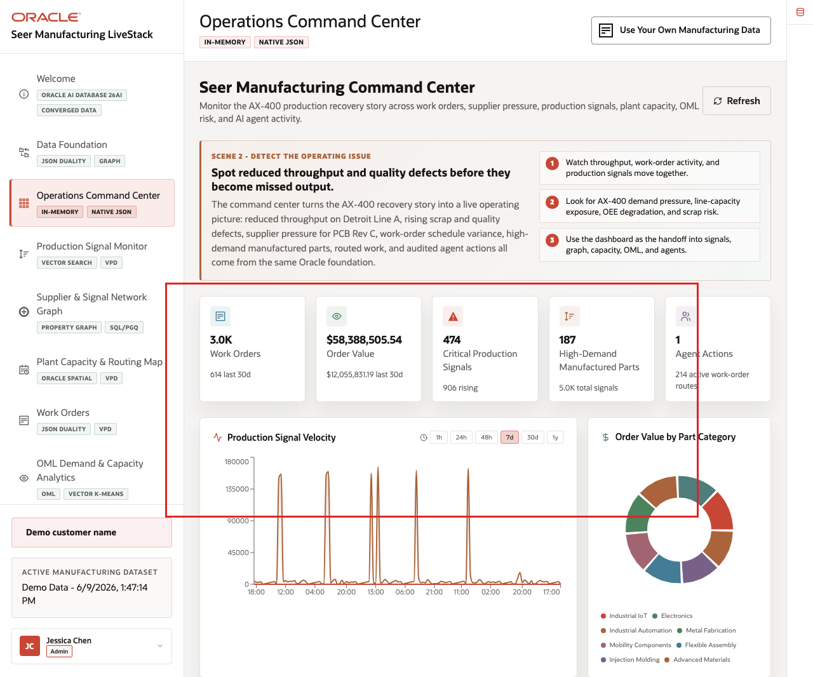
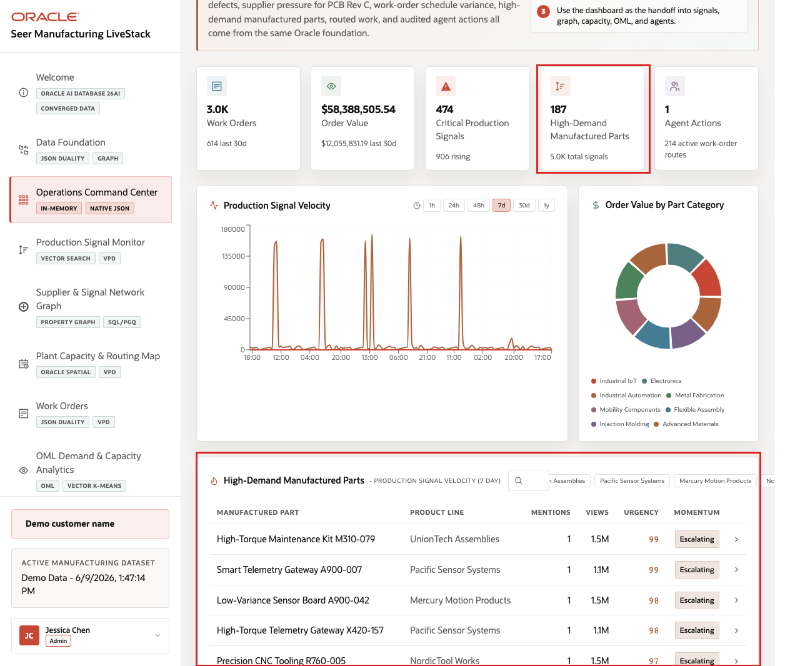

# Scene 3 Operations Command Center

## Introduction

The Operations Command Center is built for a manufacturing operations leader, plant manager, production supervisor, capacity planner, or manufacturing analyst who needs a daily operating view of work-order volume, production value, production signals, high-demand parts, plant capacity pressure, and AI-assisted actions. The goal is to see where the AX-400 recovery plan is under pressure before the issue becomes a missed-output escalation.

Dashboards like this are difficult to implement when work orders, production signals, supplier updates, capacity records, machine telemetry, and agent activity live in different systems. Teams often need duplicated extracts, separate BI models, and reconciliation logic before a dashboard can show a trustworthy view.

Oracle AI Database helps address that challenge by keeping operational, analytical, JSON, in-memory, and AI-ready data close to the same governed data foundation. In this scene, the dashboard brings together live manufacturing KPIs, production signal velocity, order value by part category, and high-demand manufactured parts without sending the user to another application.

Estimated Time: 10 minutes

### Objectives

In this scene, you will:
- Review the command center as a manufacturing operations user.
- Interpret the KPI cards, production signal velocity chart, order value chart, and high-demand manufactured parts table.
- Change the signal velocity time window.
- Search or filter high-demand manufactured parts.
- Use the **Oracle Internals** sidebar to explain why this dashboard can stay connected to governed Oracle data.

## Task 1: Review the command center dashboard

1. Click **Operations Command Center** in the sidebar.
2. Review the KPI cards across the top of the page.
3. Review **Production Signal Velocity**.
4. Review **Order Value by Part Category**.
5. Review **High-Demand Manufactured Parts**.

    

6. Open or review the **Oracle Internals** sidebar on the right.

In the current demo dataset, the page shows **3.0K** work orders logged, about **$12.06M** in order value over the last 30 days, **474** critical production signals, **187** high-demand manufactured parts, and **2** completed agent actions. Use those numbers to frame the command center as a triage surface: the user can see work-order load, value exposure, signal pressure, watched parts, and AI activity in one place.

## Task 2: Interpret signal velocity and order value

1. Click a signal velocity time range such as **24h**, **48h**, or **7d**.
2. Review how the signal chart changes by time bucket.
3. Review the order value chart by part category.
4. Focus on visible categories such as **Industrial IoT**, **Electronics**, **Industrial Automation**, **Metal Fabrication**, and **Mobility Components**.

    

This is the business story to emphasize: manufacturing users need to know where value, volume, and risk are moving together. A category with high order value and rising production signals may need a different operating response than a low-value category with stable capacity.

## Task 3: Review high-demand manufactured parts

1. Use the high-demand parts search box to filter for a part, product family, or program.
2. Review the top watched rows.

    

3. Focus on rows such as **High-Torque Maintenance Kit M310-079**, **Smart Telemetry Gateway A900-007**, or **Low-Variance Sensor Board A900-042**.
4. Review the columns for category, supplier or brand, signal count, urgency, views, and next operating context.

The high-demand parts table turns the KPI story into a set of manufacturing decisions. A plant manager or production supervisor can move from "critical production signals are high" to a specific manufactured part, supplier, or production line that needs review.

You can move to the next scene.

## Credits & Build Notes
- **Author** - Oracle LiveLabs Team
- **Last Updated By/Date** - Oracle LiveLabs Team, 2026-06-09
