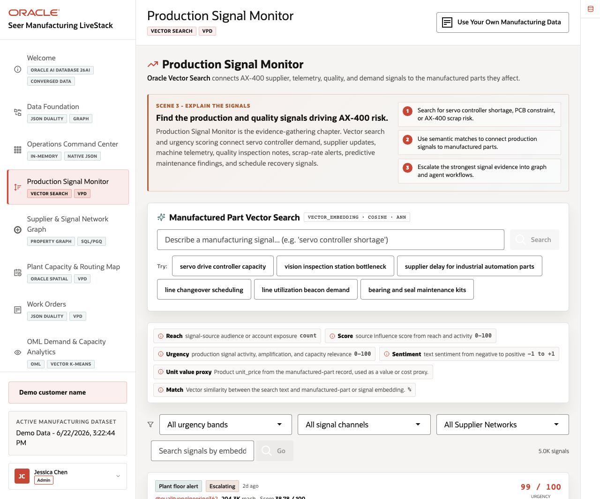
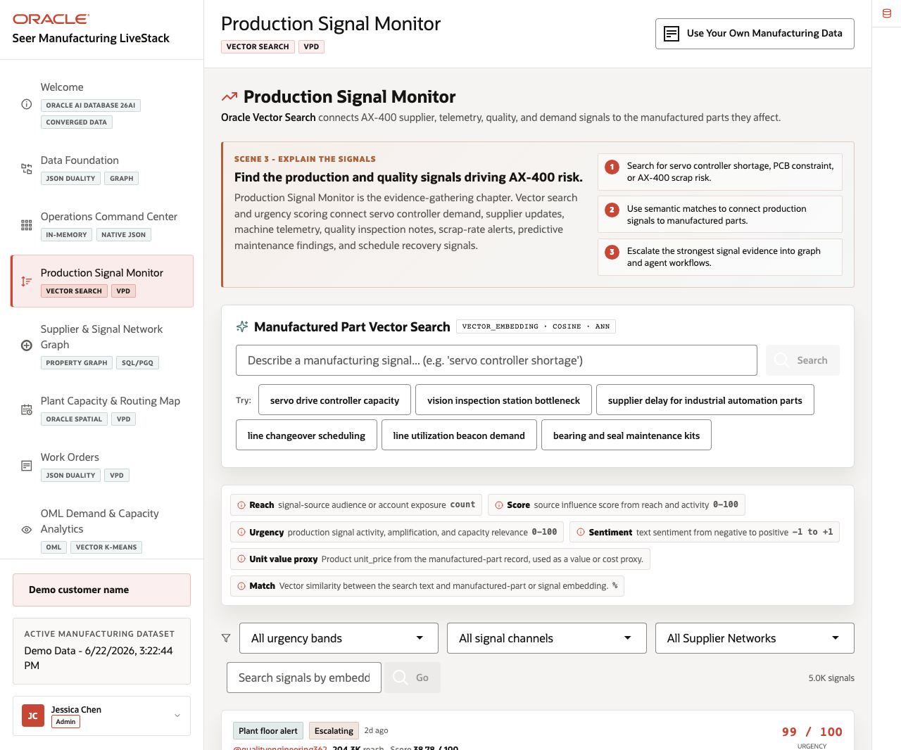
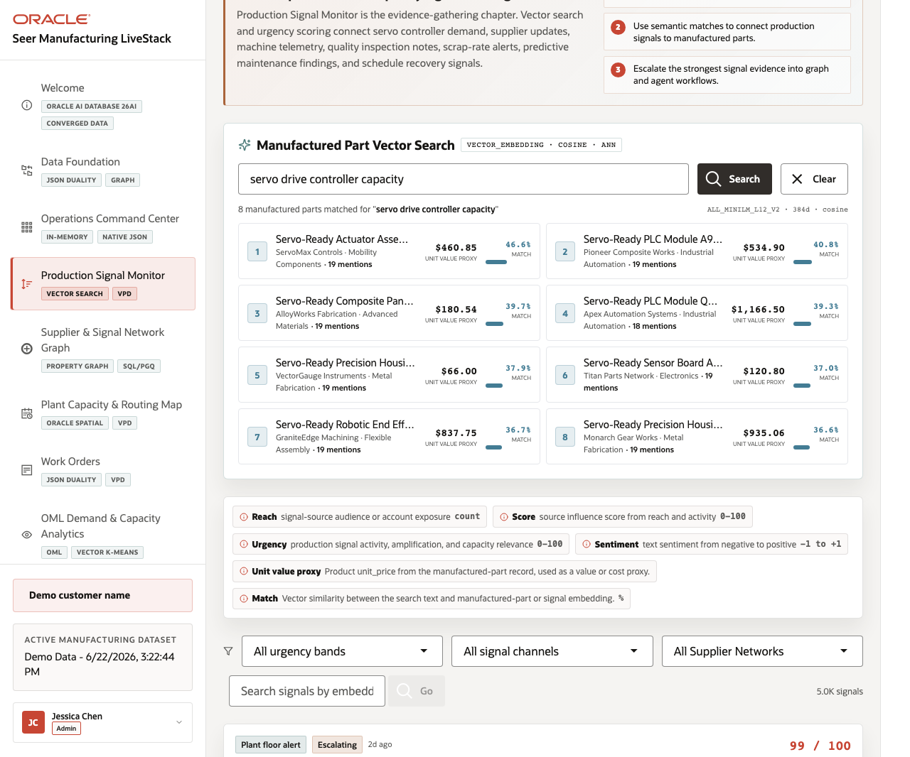
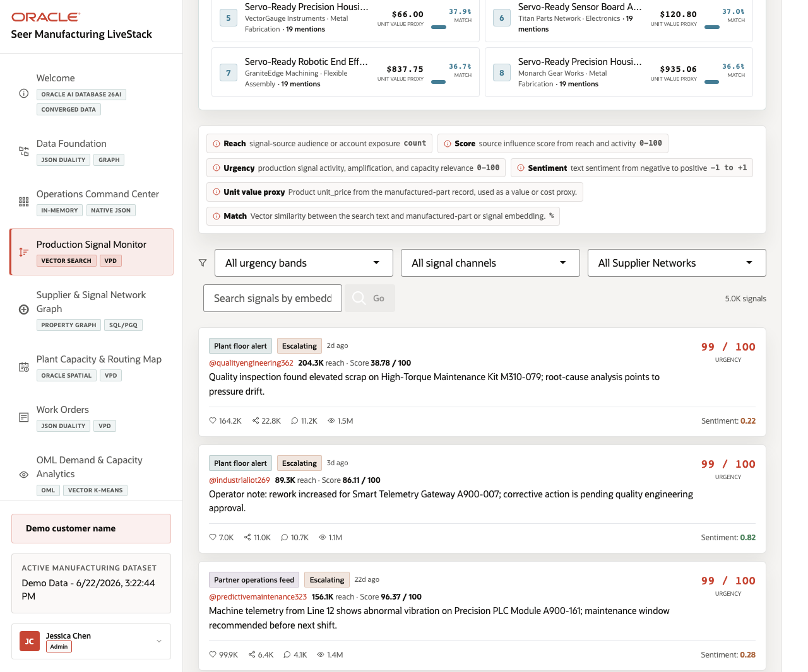

# Scene 4 Production Signal Monitor

## Introduction

A quality engineer, production supervisor, maintenance planner, supplier manager, or manufacturing analyst uses this page to understand what production signals are saying before the risk is obvious in work-order volume alone. This persona is looking for patterns in machine telemetry, quality inspection findings, supplier updates, procurement alerts, rework notes, scrap risk, and work-order mentions. The goal is to connect operational language to affected manufactured parts quickly enough to act.

Semantic search is difficult to implement when signals, part catalogs, embeddings, search indexes, and access policies live in separate systems. Manufacturing teams often have to move operational text into external search services, synchronize vector indexes, and then rebuild access control outside the database.

Oracle AI Database helps address these challenges by keeping vector search close to governed manufacturing data. In this LiveStack Demo, the page uses natural-language search over manufactured-part and signal embeddings, shows match evidence, and keeps the operating feed tied to database access policies.

Estimated Time: 10 minutes

### Objectives

In this scene, you will:
- Review the **Production Signal Monitor** workspace.
- Run a semantic search for an AX-400 or servo controller capacity phrase.
- Inspect matched manufactured parts and production signals.
- Review the signal summary and matched production signal cards.
- Understand why vector search and governed access matter for manufacturing signal discovery.

## Task 1: Review the signal feed

1. Click **Production Signal Monitor** in the sidebar.
2. Review **Manufactured Part Vector Search** at the top of the page.
3. Review the example query chips, including **servo drive controller capacity**, **supplier delay for industrial automation parts**, and **line changeover scheduling**.
4. Review the signal count and active signal cards.
5. Review urgency, source channel, reach, score, and signal text on the visible cards.

    

In the current demo dataset, the page shows **5.0K** indexed production signals. Visible examples include quality inspection scrap findings, machine telemetry vibration alerts, procurement risk updates, and rework notes. Use this opening view to explain that the AX-400 recovery story is driven by many operational signals, not by a single dashboard number.

The metric labels now include definitions for dollar-value proxies and match percentages, so users can explain what the visible amount and percentage represent before moving into the signal feed.

## Task 2: Run manufactured-part semantic search

1. Click the **servo drive controller capacity** example query chip, or enter `servo drive controller capacity` in the search field.
2. Click **Search**.

    

3. Review the matched manufactured parts or related signal evidence returned above the feed.
4. Connect the result to the AX-400 story: the search is looking for semantically related part-capacity and production-risk language, not only exact keyword matches.

This is the data point to emphasize. A production supervisor can search for the operating concept they want to investigate, such as servo controller capacity, and the system can find related parts and signal evidence by vector similarity.

## Task 3: Interpret the signal cards

1. Scroll through the production signal cards.
2. Review signal source, urgency, reach, score, sentiment, and the production issue described in each card.
3. Focus on examples such as elevated scrap, abnormal vibration, constrained raw material allocation, or pending quality engineering corrective action.
4. Use the action labels and scene transition to explain where the operator could go next: supplier graph, plant capacity map, work orders, OML analytics, Ask Data, or the agent console.
5. Review the visible definitions for reach, score, urgency, and sentiment. Where a scale is shown, use that scale rather than adding a separate calculation.

    

The value of Oracle AI Database is that operational text can become searchable manufacturing intelligence without leaving the governed data platform. Vector search helps users find related signals by meaning, while the Oracle-backed application still shows source, score, and operating context.

You can move to the next scene.

## Credits & Build Notes
- **Author** - Oracle LiveLabs Team
- **Last Updated By/Date** - Oracle LiveLabs Team, 2026-06-22
