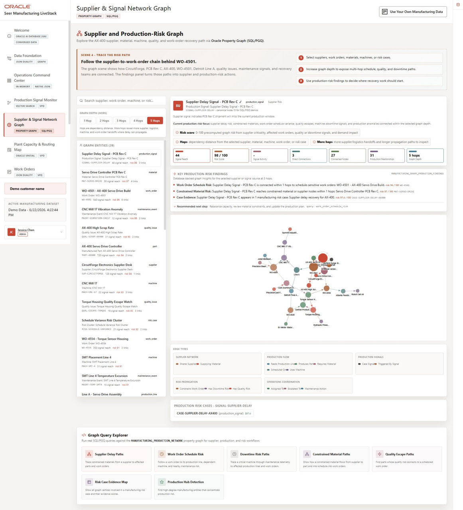
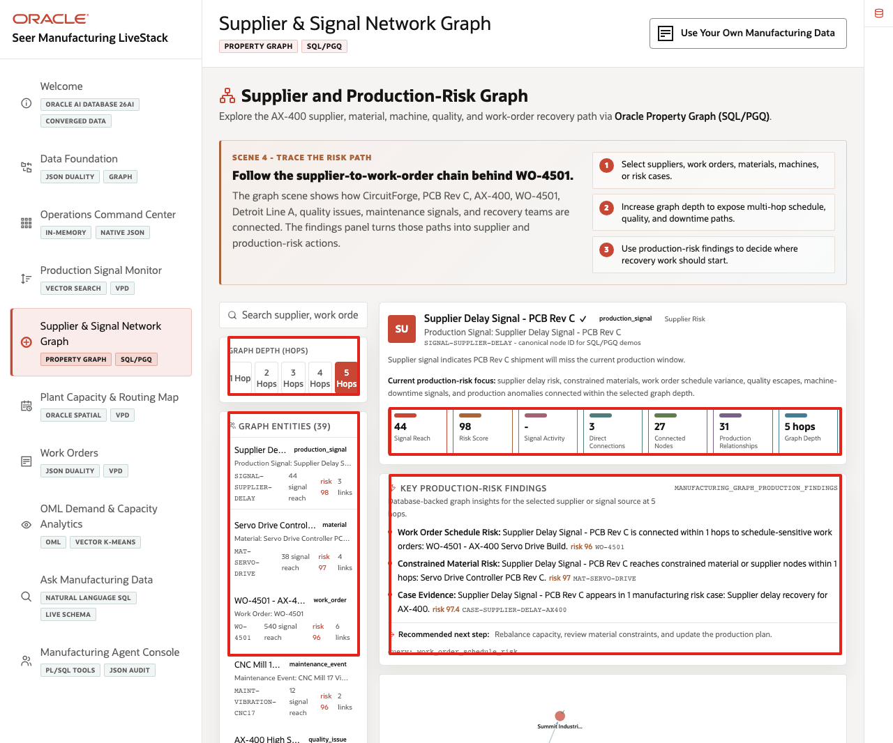
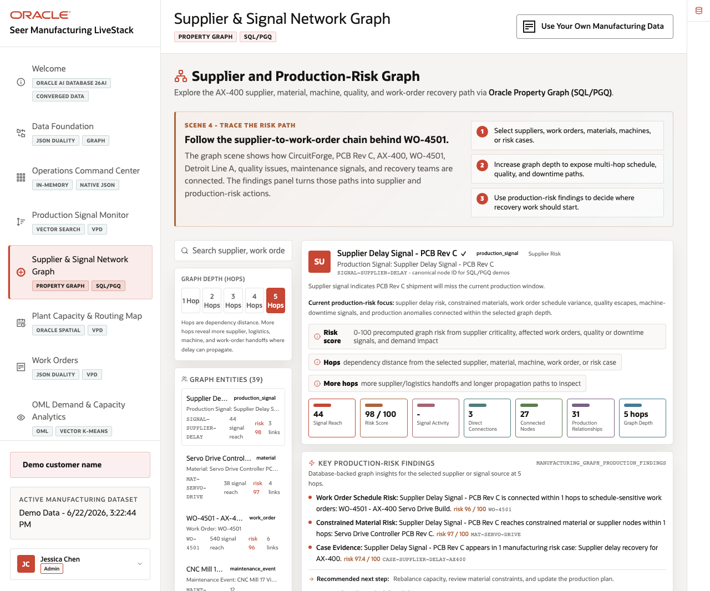
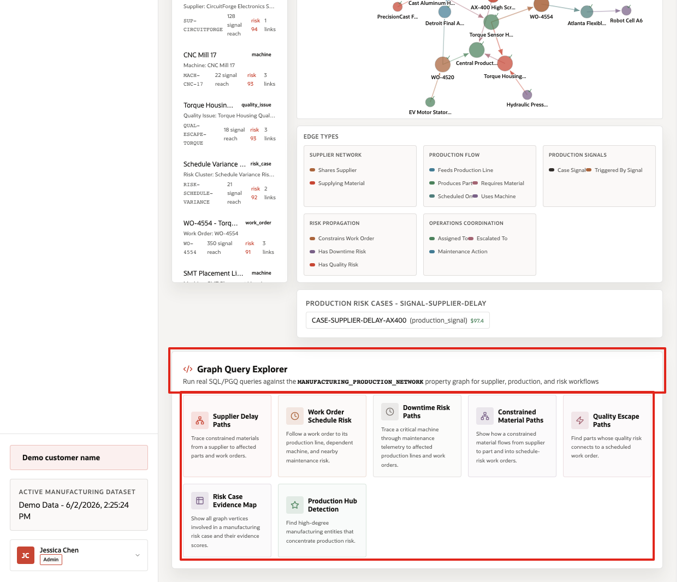

# Scene 5 Supplier and Signal Network Graph

## Introduction

**Supplier and Signal Network Graph** helps users understand manufacturing relationships that are hard to see in isolated rows. The page connects suppliers, constrained materials, manufactured parts, work orders, production lines, machines, maintenance events, quality issues, production signals, and risk cases so teams can see the recovery path as connected evidence.

This is difficult when relationship analysis requires data movement into a separate graph database or offline notebook. Manufacturing users may know that a supplier delay is creating schedule risk, but they need to see how CircuitForge, PCB Rev C, AX-400, WO-4501, Detroit Line A, machine telemetry, and scrap-risk findings connect without losing governance.

Oracle AI Database helps address these challenges by supporting graph analysis over the operational manufacturing schema. In this scene, the application exposes supplier and production-risk relationships while the sidebar explains the Oracle Property Graph and SQL/PGQ pattern behind the view.

Estimated Time: **10 minutes**

### Objectives

In this scene, you will learn what manufacturing relationship decision the graph supports, what evidence the user should inspect, and what action the team may take next.

## Task 1: Review the graph workspace

Perform the following set of steps to review the graph workspace and show how supplier, material, work-order, machine, and risk relationships connect:

1. Click **Supplier & Signal Network Graph** in the sidebar.
2. Review the graph depth controls: **1 Hop**, **2 Hops**, **3 Hops**, **4 Hops**, and **5 Hops**.
3. Review the search field for supplier, work order, machine, or risk lookup.
4. Review **Graph Entities**.
5. Open or review the **Oracle Internals** sidebar on the right.

    

In the current demo dataset, the page shows **39** graph entities. Visible nodes include **Supplier Delay Signal - PCB Rev C**, **Servo Drive Controller PCB Rev C**, **WO-4501 - AX-400 Servo Drive Build**, **AX-400 High Scrap Rate**, **AX-400 Servo Drive Controller**, **CircuitForge Electronics Supplier Desk**, **CNC Mill 17**, **Line A - Servo Drive Assembly**, and **Detroit Final Assembly Plant**.

**Note:** Sample values may change after data refreshes or rebuilds. Verify live output before presenting, then explain the business takeaway.

## Task 2: Explore a production-risk example

Perform the following set of steps to explore a production-risk example and show how relationship depth changes the operating picture:

1. In the entity list, locate **Supplier Delay Signal - PCB Rev C**.
2. Review the node type, signal reach, risk score, link count, connected nodes, and production relationships.
3. Compare it with nearby risk nodes such as **Servo Drive Controller PCB Rev C**, **WO-4501 - AX-400 Servo Drive Build**, **AX-400 High Scrap Rate**, and **CircuitForge Electronics Supplier Desk**.
4. Change the graph depth from **1 Hop** to **2 Hops**, **3 Hops**, or **5 Hops** to explain how relationship scope changes.

    

Use this example to explain why graph context matters. A supplier delay, constrained material, manufactured part, work order, production line, quality issue, and maintenance signal are more informative together than as independent records. The graph view helps the operator see the recovery path as connected evidence.

## Task 3: Explain the Oracle graph pattern

Perform the following set of steps to explain how the graph remains an analysis view over governed manufacturing data rather than a disconnected copy:

1. Scroll to the **Graph Query Explorer** area.
2. Review example questions such as **Supplier Delay Paths**, **Work Order Schedule Risk**, **Downtime Risk Paths**, **Constrained Material Paths**, **Quality Escape Paths**, **Risk Case Evidence Map**, and **Production Hub Detection**.
3. Review the Oracle Internals content that references property graph and SQL/PGQ.
4. Explain that the graph is an analysis view over governed manufacturing data rather than a disconnected copy.

    

The value of Oracle AI Database is that manufacturing teams can ask relationship-aware questions inside the same governed platform that stores the operational data. That reduces data movement and lets the graph story stay connected to the rest of the demo.

You can move to the next scene.

## Credits & Build Notes
- **Author** - Oracle LiveLabs Team
- **Last Updated By/Date** - Oracle LiveLabs Team, 2026-06-09
