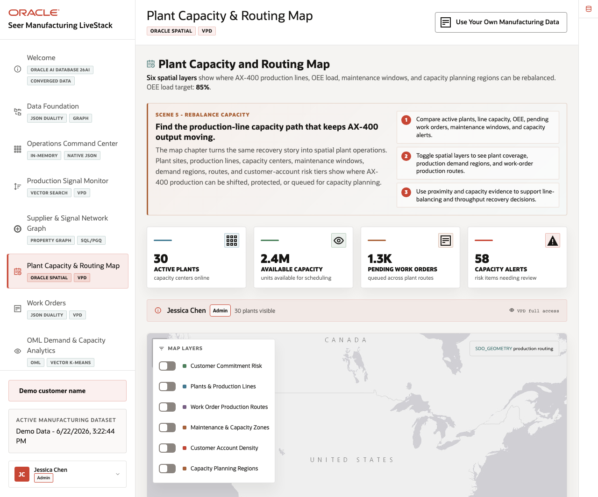
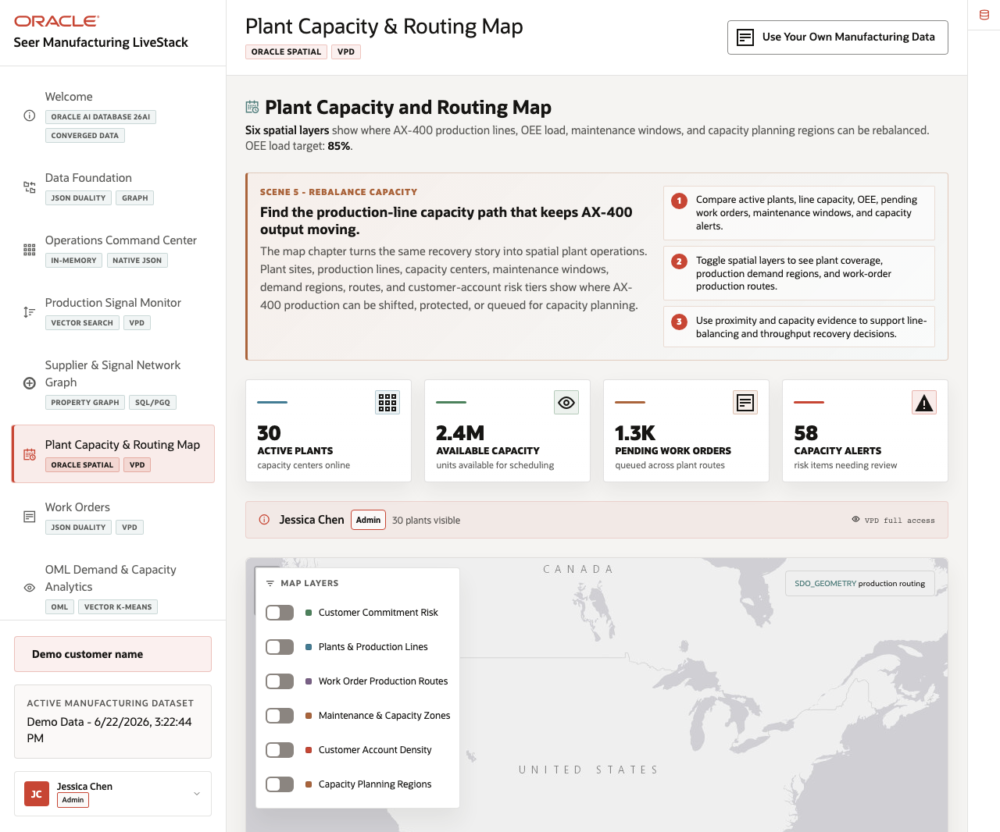
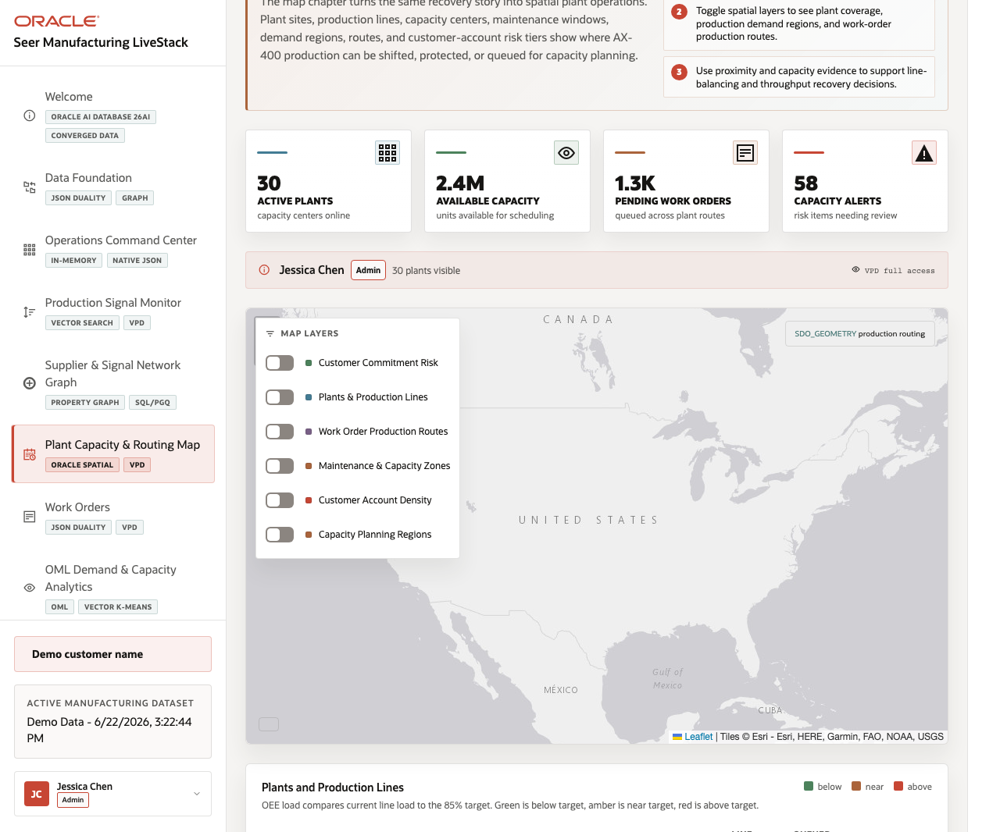
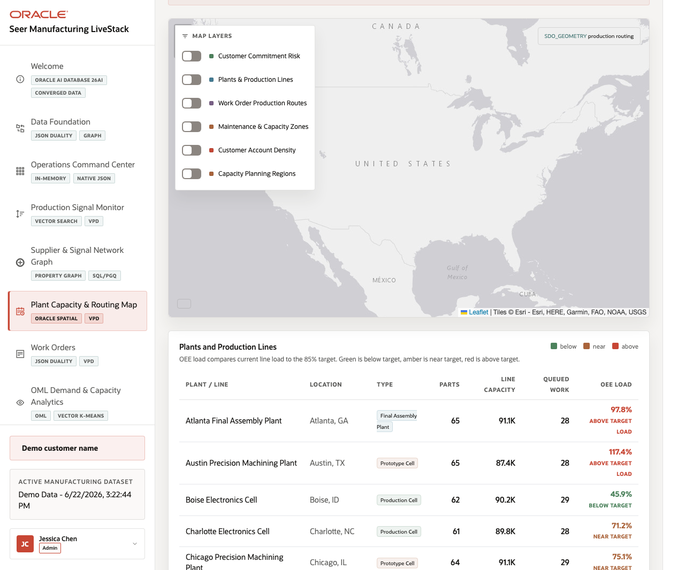

# Scene 6 Plant Capacity and Routing Map

## Introduction

A plant capacity planner, production supervisor, supply chain analyst, field operations lead, or manufacturing operations leader uses this page to understand where plant capacity, demand regions, work-order routes, inventory constraints, and customer risk intersect. This persona needs a geographic operating view, not just a list of plants.

Location-aware manufacturing decisions are difficult when plant sites, work-order routes, demand regions, capacity zones, and customer risk tiers live outside the operational data platform. Teams may export to a GIS tool, but then lose the connection to current work orders, capacity levels, access controls, and operational status.

Oracle AI Database helps address these challenges by keeping spatial geometry and operational records together. In this scene, Oracle Spatial powers plant locations, routes, coverage zones, density grids, demand regions, and proximity context in the same application that manages the rest of the manufacturing data.

Estimated Time: 10 minutes

### Objectives

In this scene, you will:
- Review the **Plant Capacity and Routing Map** as a geographic operating view.
- Interpret the active plant, available capacity, pending work order, and capacity alert cards.
- Toggle map layers for customer commitment risk, plants and production lines, work-order routes, maintenance and capacity zones, account density, and capacity planning regions.
- Compare map evidence with the plant table.
- Explain how Oracle Spatial supports location-aware manufacturing decisions.

## Task 1: Review plant capacity priorities

1. Click **Plant Capacity & Routing Map** in the sidebar.
2. Review the stat cards across the top of the page.
3. Review the current user and VPD banner.
4. Review the map and the plant-capacity summary before changing layers.
5. Note the displayed OEE load target before comparing plant and line load.

    

Use this opening view to explain the manufacturing problem. The AX-400 recovery plan needs to know where production can be shifted, which plants have available capacity, how many work orders are pending, and where capacity alerts may block a schedule recovery action.

## Task 2: Toggle spatial layers

1. Review the map and its layer controls.
2. Toggle **Customer Commitment Risk**.
3. Toggle **Plants & Production Lines** and **Work Order Production Routes**.
4. Toggle **Maintenance & Capacity Zones**, **Customer Account Density**, and **Capacity Planning Regions**.
5. Review how the map changes as layers are added or removed.
6. Use the OEE load legend to distinguish below-target, near-target, and above-target plant or line load.

    

The layer controls make the same map useful for different questions. A plant manager may start with plant locations and coverage zones. A supply chain analyst may focus on work-order routes. A capacity planner may compare demand regions and density with available production capacity.

## Task 3: Compare plant data with the map

1. Scroll to the **Plants** table.
2. Review columns for center, location, type, supported products, capacity, pending work orders, load, and status.
3. Use the table to connect map markers to concrete operating records.
4. Explain how the same plant records can support both operational planning and spatial routing.

    

The value of Oracle AI Database is that location intelligence is not detached from the operational data. Oracle Spatial can support route coverage and proximity analysis while the application still shows capacity, pending work, alerts, and VPD-aware access from the same data foundation.

You can move to the next scene.

## Credits & Build Notes
- **Author** - Oracle LiveLabs Team
- **Last Updated By/Date** - Oracle LiveLabs Team, 2026-06-22
