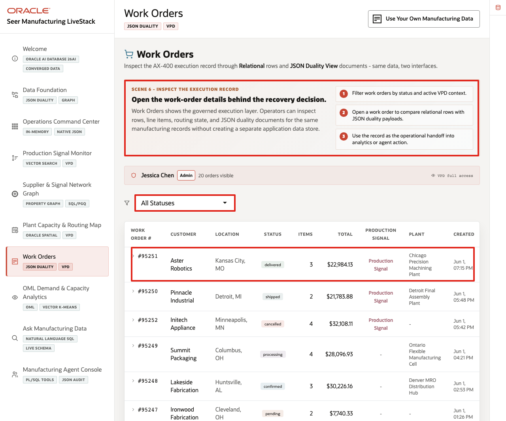
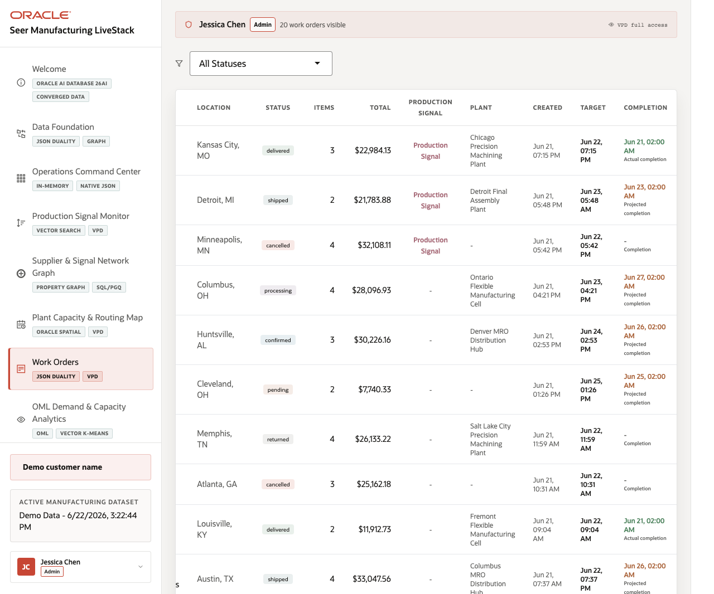
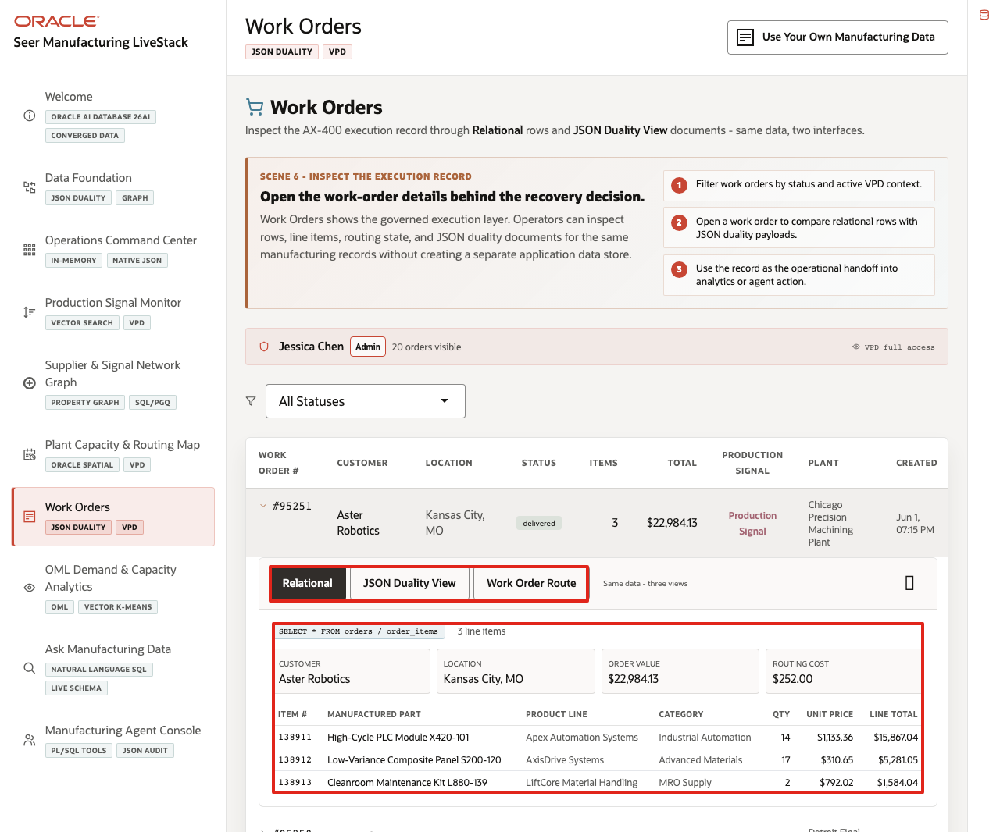
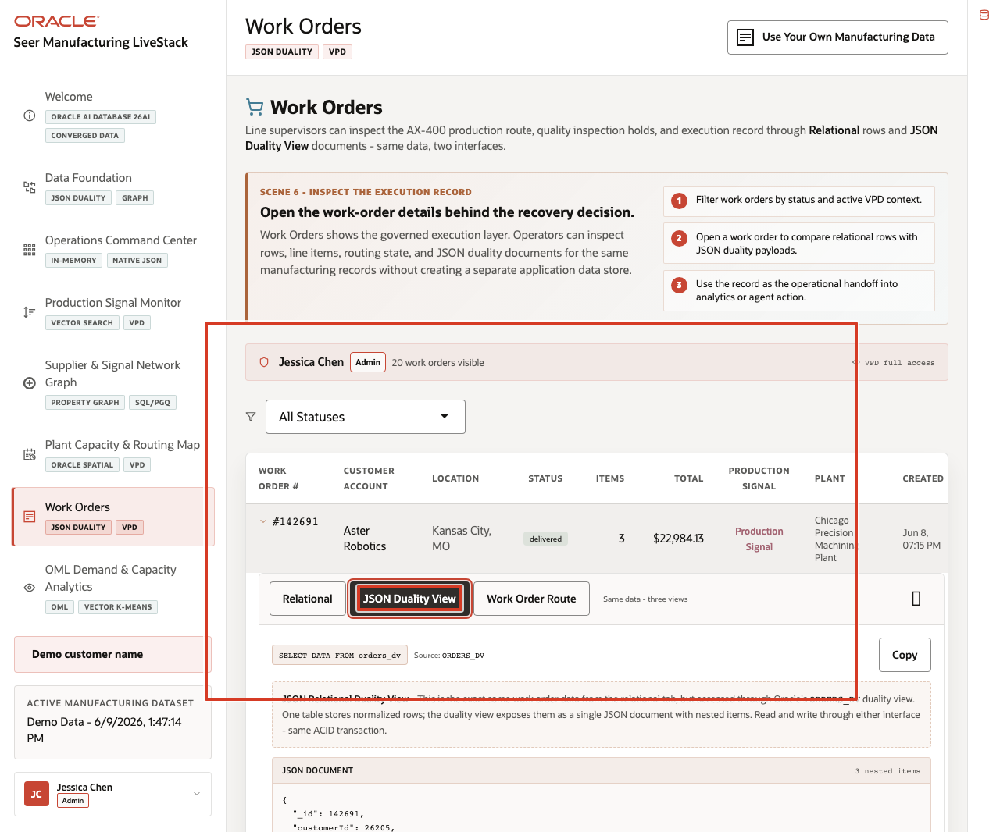
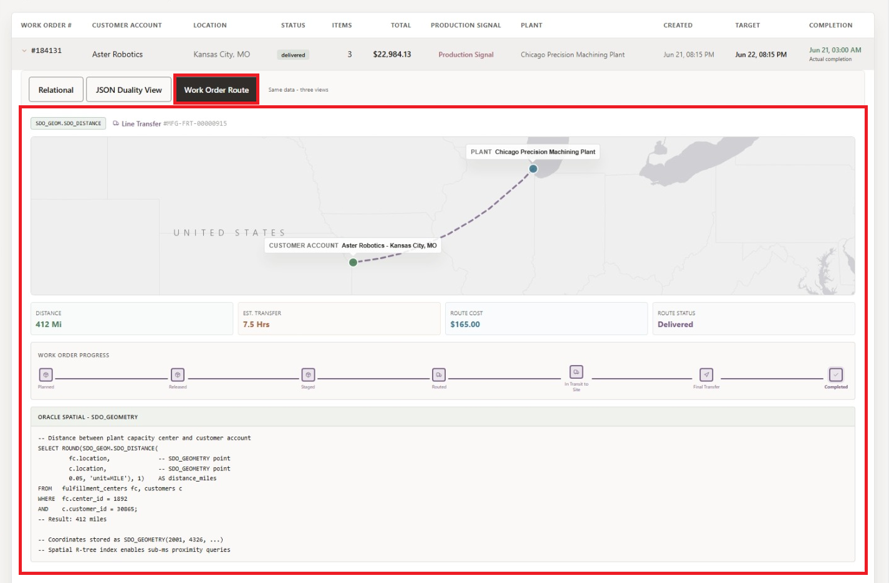

# Scene 7 Work Orders and JSON Duality

## Introduction

**Work Orders and JSON Duality** helps users understand the same manufacturing transaction from multiple angles. The page shows how a governed work order can support operations users, application teams, and route planning without creating separate copies of the record.

This is difficult to implement when work-order headers, line items, customer accounts, plant assignments, route state, and API payloads are handled in separate systems. Each copy creates synchronization risk and extra engineering work when the work-order model changes.

**Oracle AI Database** helps address these challenges by keeping the work-order record in one governed platform while exposing it through the shape each workflow needs. Relational tables provide transactional detail. JSON Relational Duality Views expose the same work order as a nested JSON document. Oracle Spatial adds plant route and distance context.

Estimated Time: **10 minutes**

### Objectives

In this scene, you will learn what operational decision the Work Orders page supports, what evidence the user should inspect, and what action the team may take next.

## Task 1: Review the work-order workspace

Perform the following set of steps to review the work-order workspace and establish the operational context for work order #142691:

1. Click **Work Orders** in the sidebar.
2. Review the active user banner. The current demo user is **Jessica Chen**, with **Admin** access and **20** visible work orders on the page.
3. Review the status filter.
4. Review the table columns: work order number, customer, location, status, line items, total, production signal, plant, and created time.
5. Focus on work order **#142691**.

    

In the current demo dataset, work order **#142691** is for **Aster Robotics** in **Kansas City, Missouri**. It is **Delivered**, has **3** line items, totals **$22,984.13**, and is fulfilled by **Chicago Precision Machining Plant**. This work order will be the data point used through the rest of the scene.

**Note:** Sample values may change after data refreshes or rebuilds. Verify live output before presenting, then explain the business takeaway.

## Task 2: Inspect the relational work-order detail

Perform the following set of steps to inspect the relational work-order detail and validate the operational system of record:

1. Click work order **#142691**.

    

2. Confirm the **Relational** tab is selected.
3. Review customer, location, work-order value, plant assignment, and route cost.
4. Review the line-item table.

For work order **#142691**, the relational view shows line items such as **Low-Variance Composite Panel S200-120**, **Cleanroom Maintenance Kit L880-139**, and **High-Cycle PLC Module X420-101**. This view is useful for operations because the work-order header and item detail remain normalized and easy to validate.

**Note:** Sample values may change after data refreshes or rebuilds. Verify live output before presenting, then explain the business takeaway.

## Task 3: Compare the JSON Duality View

Perform the following set of steps to compare the JSON Duality View and show how the same trusted work-order data can support application and API access:

1. Click **JSON Duality View** in the expanded work-order panel.

    

2. Review the source label **ORDERS_DV**.
3. Review the JSON document for work order **142691**.
4. Notice that the document contains `_id`, `customerId`, `status`, `total`, `shippingCost`, `demandScore`, `createdAt`, and nested `items`.

This is the key point of the page. The JSON document is not a separate copy of the work order. It is the same governed work-order data exposed through an Oracle JSON Relational Duality View. Application teams can use document-shaped access while operations teams continue to work with relational tables and SQL.

## Task 4: Review route context

Perform the following set of steps to review route context and connect the work order to plant assignment, customer location, distance, route cost, and progress:

1. Click **Work Order Route** in the expanded work-order panel.

    

2. Review the assigned plant and customer location.
3. Review distance, shipping or route cost, status, and work-order progress.
4. Use the route view to explain how spatial context stays connected to the same governed work-order record.

For work order **#142691**, the page connects **Chicago Precision Machining Plant** to **Aster Robotics** in **Kansas City, Missouri**. The page shows how Oracle Spatial can provide route context while JSON Duality and relational views expose the same work-order truth.

**Note:** Sample values may change after data refreshes or rebuilds. Verify live output before presenting, then explain the business takeaway.

The value of Oracle AI Database is that the same work order can support operations, API access, and route analysis without splitting the story across separate persistence layers.

You can move to the next scene.

## Credits & Build Notes
- **Author** - Oracle LiveLabs Team
- **Last Updated By/Date** - Oracle LiveLabs Team, 2026-06-09
