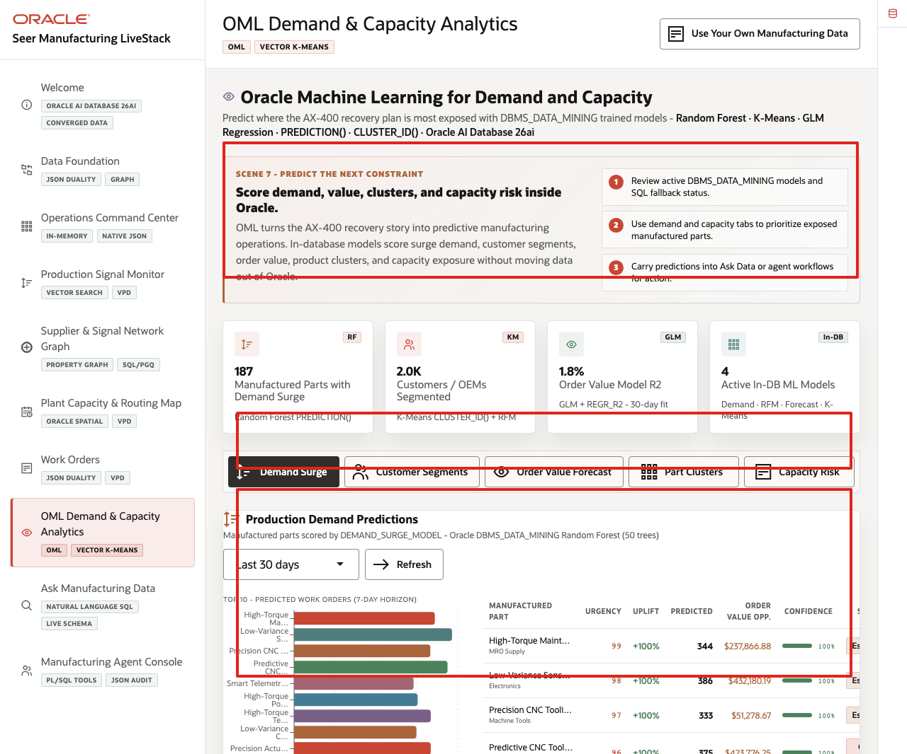
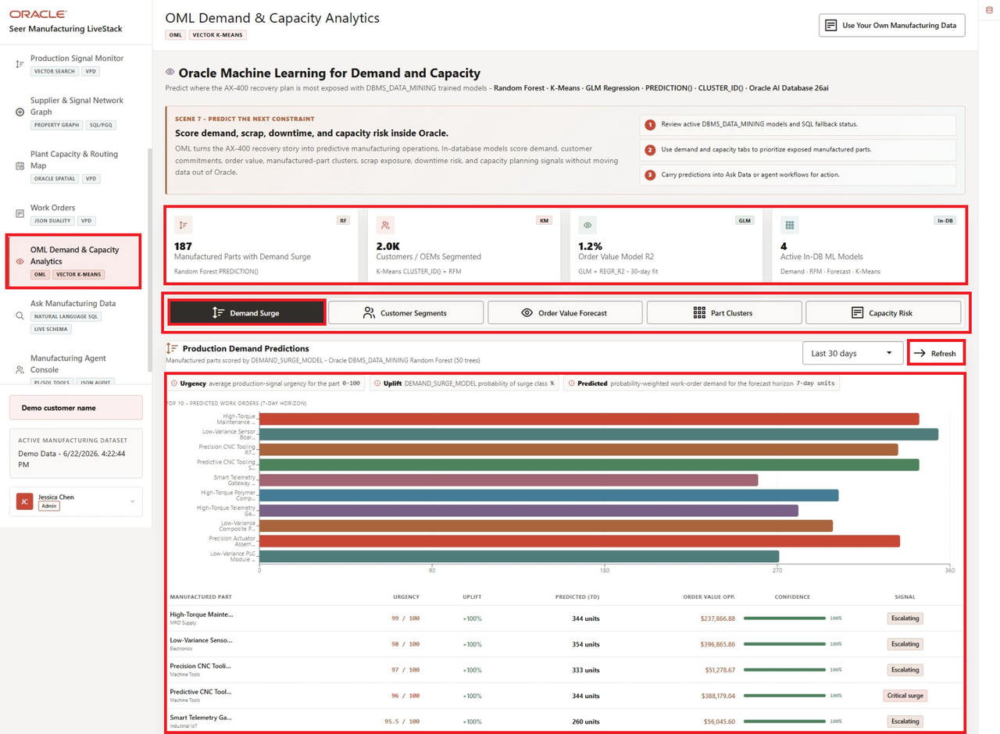
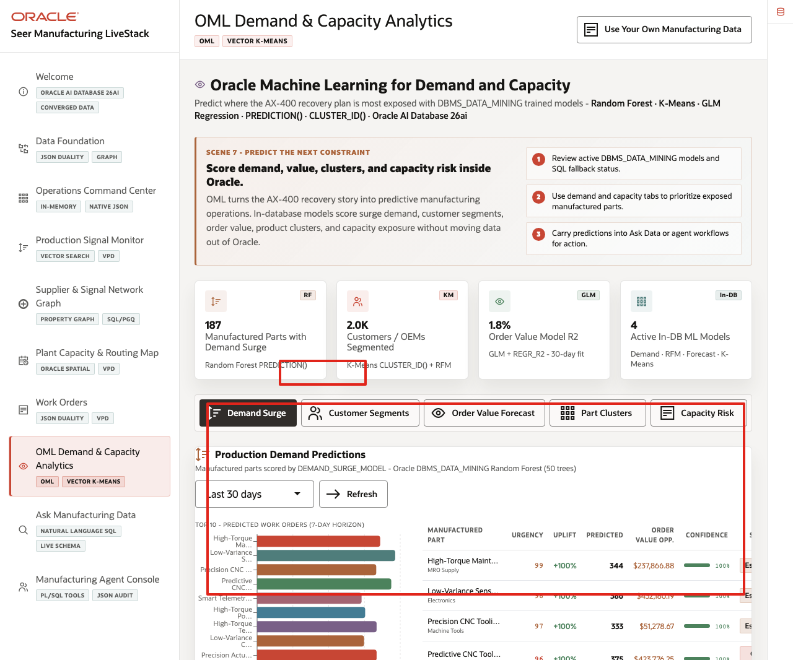
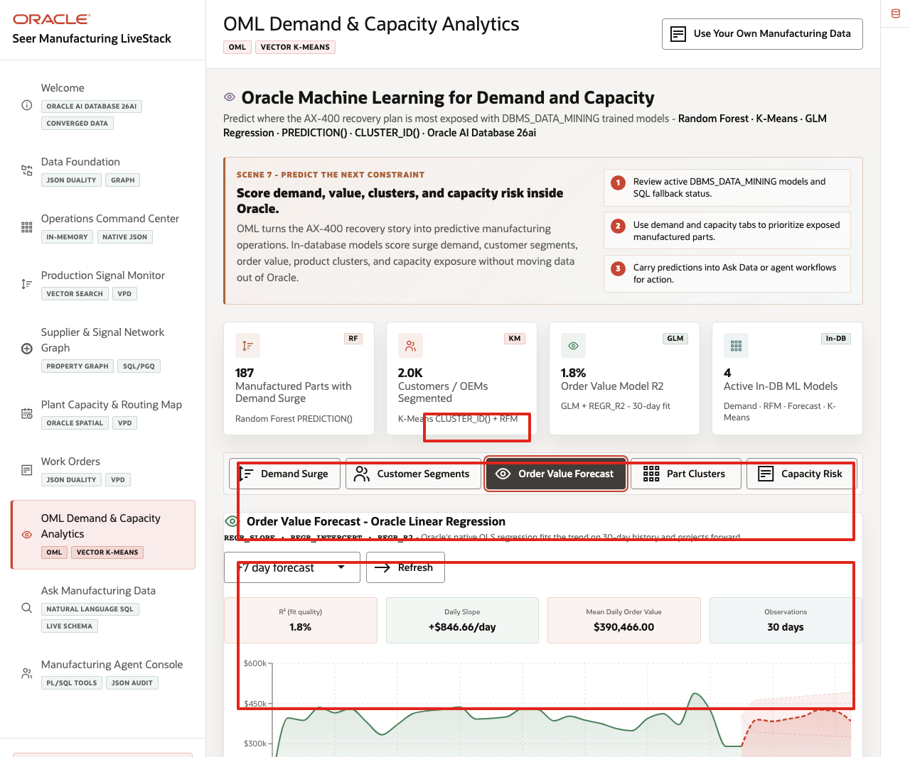
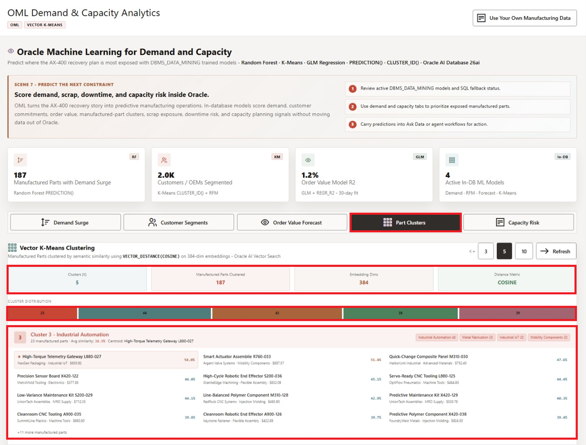
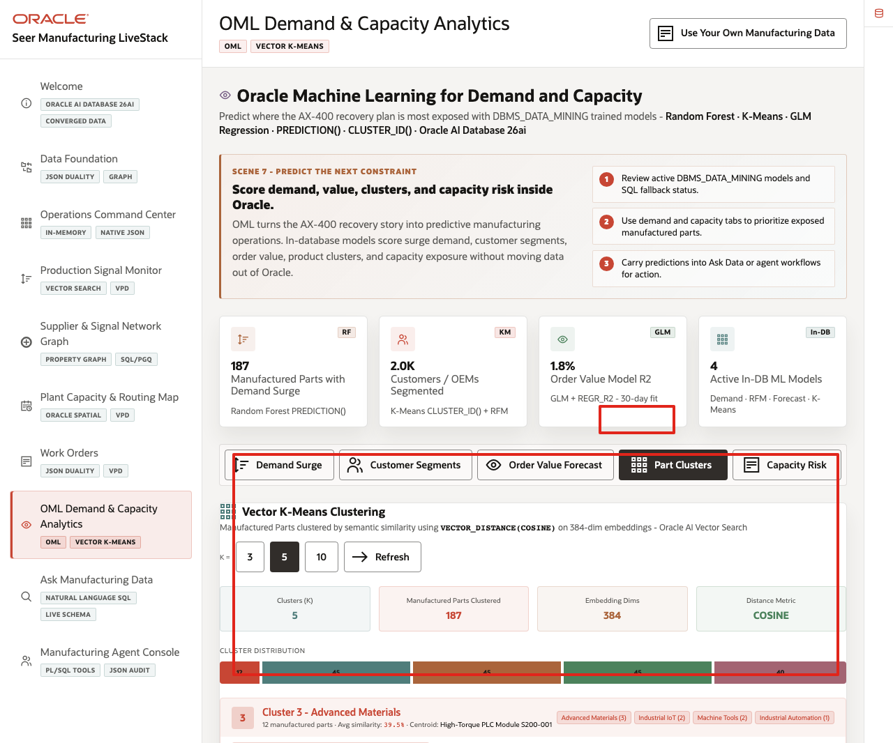

# Scene 8 OML Demand and Capacity Analytics

## Introduction

**OML Demand and Capacity Analytics** helps manufacturing teams decide which predictive signals should become operational action. The page brings together demand surge, customer segmentation, order-value forecasting, part clustering, and capacity risk so teams can plan before constraints affect the AX-400 recovery plan.

This is difficult when predictive work is split across notebooks, exported CSV files, BI extracts, external ML services, and separate operational systems. Manufacturing teams can lose trust in predictions when model features are stale, scoring jobs run away from live data, or the explanation behind a forecast is disconnected from the work-order and capacity records that business users rely on.

**Oracle AI Database** helps address these challenges by keeping machine learning close to governed manufacturing data. Oracle Machine Learning models and SQL analytics can run from the same connected data foundation that powers the rest of the LiveStack Demo.

Estimated Time: **12 minutes**

### Objectives

In this scene, you will learn what planning decision the analytics workspace supports, what evidence the user should inspect, and what action the team may take next.

## Task 1: Inspect Demand Surge predictions

Perform the following set of steps to inspect Demand Surge predictions and show how in-database analytics can surface parts, suppliers, and plant-capacity decisions that need attention:

1. Click **OML Demand & Capacity Analytics** in the sidebar.
2. Review the four KPI cards at the top of the page: **Manufactured Parts with Demand Surge**, **Customers / OEMs Segmented**, **Order Value Model R2**, and **Active In-DB ML Models**.
3. Review the five analytics tabs: **Demand Surge**, **Customer Segments**, **Order Value Forecast**, **Part Clusters**, and **Capacity Risk**.
4. Confirm that **Demand Surge** is selected.
5. Review the scoring window, **Refresh** control, bar chart, and prediction table.

    

Use this opening view to set the scene: this page is not a separate data science notebook. It is a business-facing analytics surface backed by in-database analytics. The demand predictions help the team decide which parts, suppliers, and plant-capacity decisions deserve attention before schedule risk becomes missed output.

## Task 2: Review Customer Segments

Perform the following set of steps to review Customer Segments and turn model output into accounts, OEMs, or demand patterns that may need follow-up:

1. Click **Customer Segments**.
2. Review the **Segment Distribution** chart.
3. Review the repeat-order risk distribution.
4. Review **Segment Summary** and **Top customer accounts by RFM score**.
5. Optionally click a segment filter to focus the account list.

    

This is useful for manufacturing operations teams because segmentation becomes operational. The team can move from a model result to the accounts, OEMs, or demand patterns that need follow-up, production planning, or capacity allocation.

## Task 3: Interpret Order Value Forecast

Perform the following set of steps to interpret the Order Value Forecast and discuss how much confidence planners should place in the projection:

1. Click **Order Value Forecast**.
2. Review the forecast horizon selector and **Refresh** control.
3. Review the model quality cards: **R² (fit quality)**, **Daily Slope**, **Mean Daily Order Value**, and **Observations**.
4. Review the order value trend chart and forecast band.

    

Use this forecast as a trust discussion. The page does not hide model quality. It shows the fit, slope, and observation window so a planner can treat the forecast as operational context instead of over-trusting a black-box prediction.

## Task 4: Explore Part Clusters

Perform the following set of steps to explore Part Clusters and show how vector similarity can group manufactured parts by operational meaning:

1. Click **Part Clusters**.
2. Review the **K =** controls.
3. Review the cluster count, parts clustered, embedding dimensions, and distance metric.
4. Review a cluster card and its related manufactured parts.

    

This helps users understand how vector similarity can group manufactured parts without leaving the governed data platform. The same vector infrastructure that supports production-signal search can also support manufacturing analytics.

## Task 5: Review Capacity Risk

Perform the following set of steps to review Capacity Risk and identify parts, plants, or capacity centers that may need attention before constraints affect the recovery plan:

1. Click **Capacity Risk**.
2. Review the summary cards.
3. Review the capacity status distribution.
4. Review monitored capacity by plant or capacity center.
5. Scan the highest risk indicators for parts or plants that need attention.

    

This turns model output into an operating view: the user can see which parts, plants, and capacity centers need attention before a constraint affects the AX-400 recovery plan.

You can move to the next scene.

## Credits & Build Notes
- **Author** - Oracle LiveLabs Team
- **Last Updated By/Date** - Oracle LiveLabs Team, 2026-06-09
