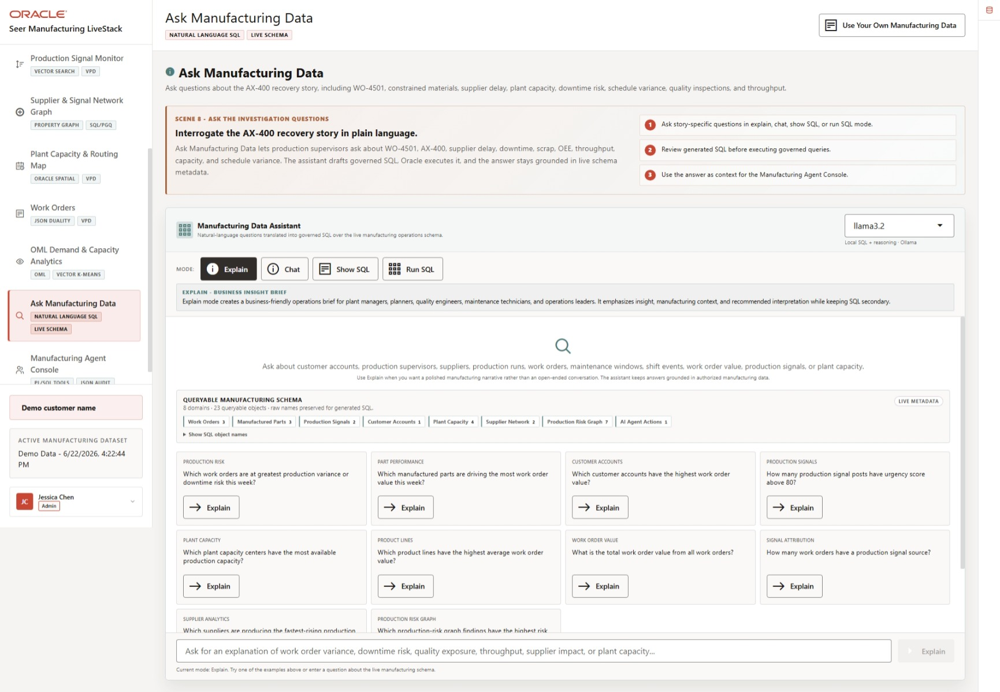
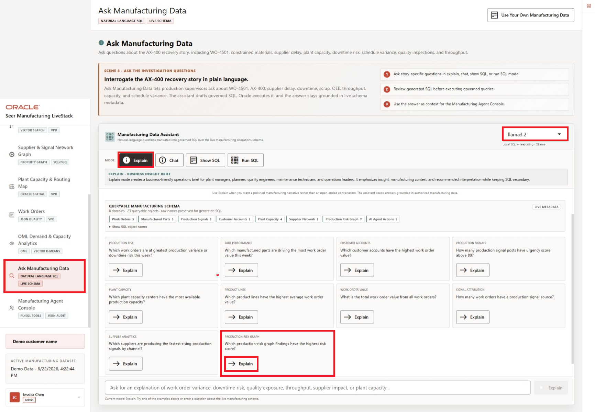
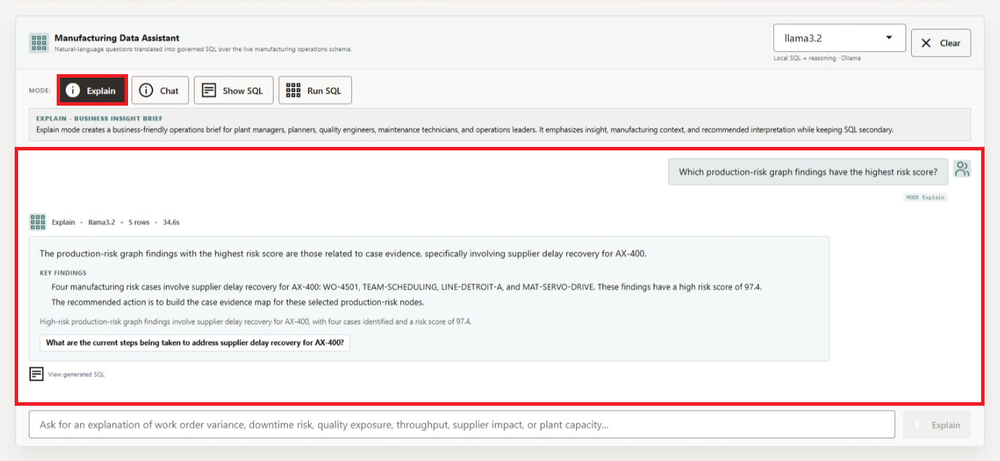
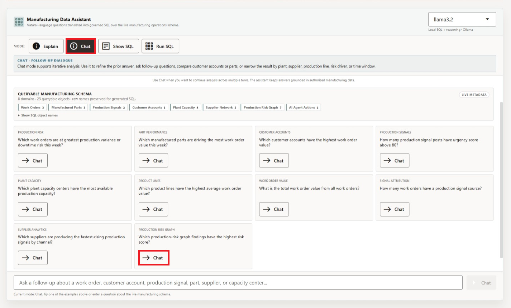
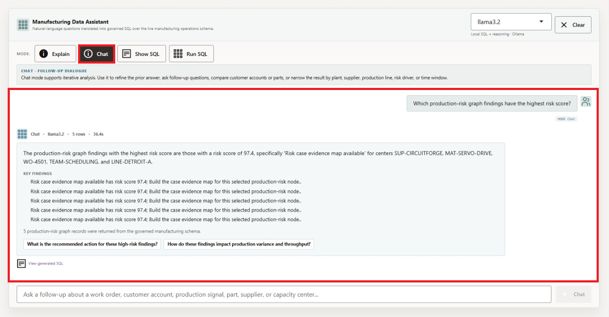
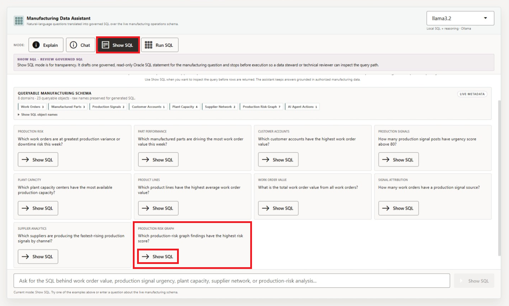
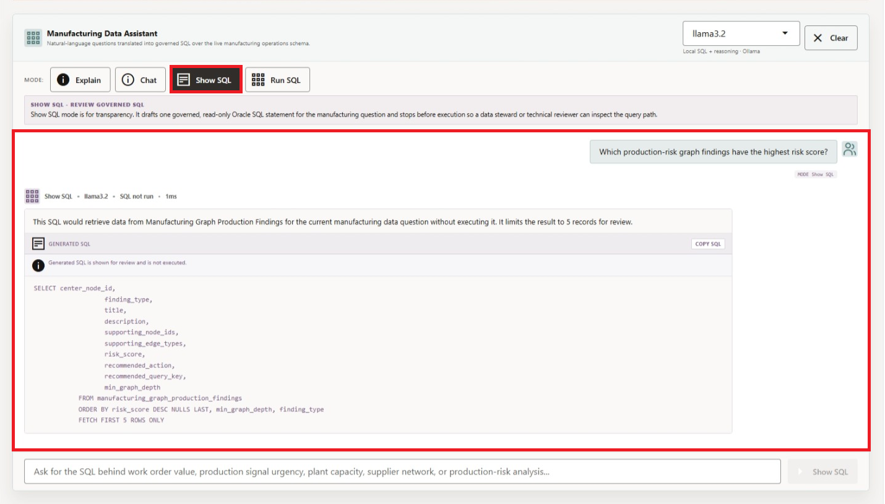
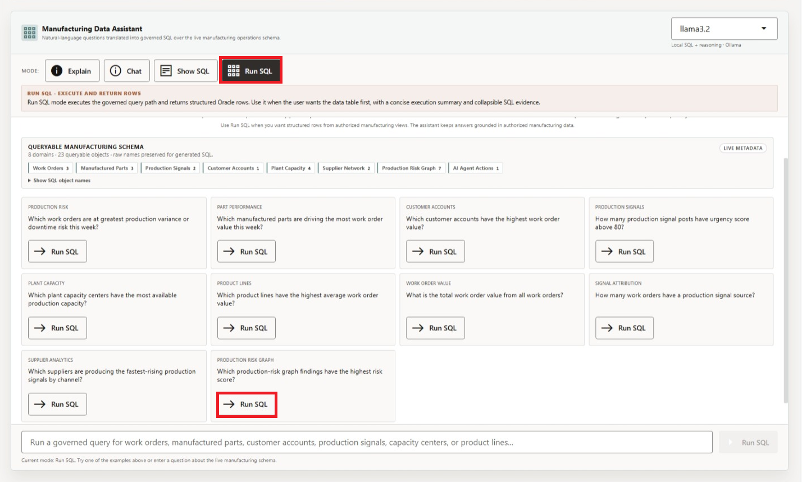
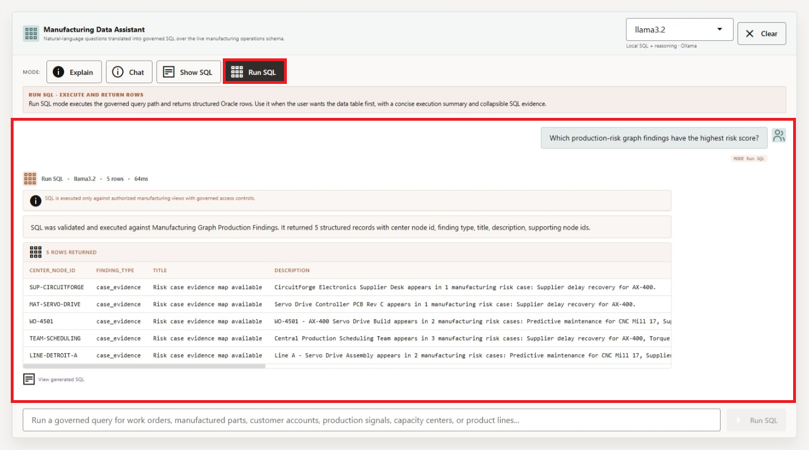

# Scene 9 Ask Manufacturing Data

## Introduction

**Ask Manufacturing Data** helps business users ask production-risk questions in plain language while keeping the query path visible. Users can inspect generated SQL, run it against trusted Oracle data, and review returned rows, which makes self-service analytics faster without turning the answer into a black box.

Natural-language data access can create governance risk if the language model generates invalid SQL, references the wrong tables, hides the query path, or exposes more data than the user should see. Manufacturing teams need self-service analytics, but data teams still need traceability, read-only execution, and a clear source of truth.

**Oracle AI Database** helps address these challenges by keeping query execution grounded in the live manufacturing schema. In this LiveStack Demo, the app sends the question and schema context to the local Ollama runtime, validates the generated SQL path, and uses Oracle AI Database 26ai as the execution authority.

Estimated Time: **10 minutes**

### Objectives

In this scene, you will learn what manufacturing decision natural-language analytics supports, what evidence the user should inspect, and what action the team may take next.

## Task 1: Use Explain mode for a narrated answer

Perform the following set of steps to use **Explain mode** when the user wants a business-readable answer first:

1. Click **Ask Manufacturing Data** in the sidebar.
2. Review the runtime profile in the top right of the assistant card. The current demo uses **llama3.2** through the local Ollama runtime.
3. Review the queryable schema summary. The current page shows **8** domains and **23** queryable objects.
4. Click **Explain**.
5. Click **Explain** on the **Production Risk Graph** question: **Which production-risk graph findings have the highest risk score?**

    

Expected result: The assistant returns a narrated answer and key findings without making the generated SQL the main artifact. Use this mode when the user wants a business-readable answer first. The system still uses governed SQL behind the scenes, but the presentation is optimized for a plant manager, production supervisor, or operations analyst.

    

**Note:** Sample values may change after data refreshes or rebuilds. Verify live output before presenting, then explain the business takeaway.

## Task 2: Use Chat mode for a conversational answer

Perform the following set of steps to use **Chat mode** when the user wants to explore the data interactively and ask follow-up questions:

1. Click **Clear** if the Explain result is still visible.
2. Click **Chat**.
3. Click **Chat** on the same **Production Risk Graph** question.

    

Expected result: The assistant returns a conversational response and follow-up prompts. Use this mode when the user is exploring the data interactively. Chat mode keeps the answer grounded in the live manufacturing schema, but it is shaped for follow-up questions such as breaking the result down by work order, supplier, production line, or risk case.

    

## Task 3: Use Show SQL mode to inspect the query path

Perform the following set of steps to use Show SQL mode when a user, data steward, or technical reviewer needs to inspect the query path before rows are returned:

1. Click **Clear** if the Chat result is still visible.
2. Click **Show SQL**.
3. Click **Show SQL** on the same **Production Risk Graph** question.

    

4. Review the generated SQL.

    

The generated SQL reads from `manufacturing_graph_production_findings`, orders by `risk_score DESC NULLS LAST`, then by graph depth and finding type, and limits the result with `FETCH FIRST 5 ROWS ONLY`. This is the governance moment in the scene: the user can inspect the query path before asking the database to return rows.

Use this mode when the user, data steward, or technical reviewer wants to verify what will run before rows are returned. The language model proposes the SQL, but the query path remains visible and reviewable.

## Task 4: Use Run SQL mode to inspect returned rows

Perform the following set of steps to use Run SQL mode and inspect the live rows behind the answer:

1. Click **Clear** if the generated SQL result is still visible.
2. Click **Run SQL**.
3. Click **Run SQL** on the same **Production Risk Graph** question.

    

4. Review the returned table.

    

In the current demo dataset, the question returns **5** rows. The top risk findings are tied to **CircuitForge Electronics Supplier Desk**, **Servo Drive Controller PCB Rev C**, **WO-4501 - AX-400 Servo Drive Build**, **Central Production Scheduling Team**, and **Line A - Servo Drive Assembly**, each with a **97.4** risk score and case-evidence recommendations.

**Note:** Sample values may change after data refreshes or rebuilds. Verify live output before presenting, then explain the business takeaway.

This is the data point to emphasize during the demo. A plain-English question surfaces specific operating risk by supplier, material, work order, scheduling team, production line, score, and recommended action. The business user can discover the issue without writing SQL, while the SQL and database result remain visible for trust.

Use the four completed mode examples to explain the governance pattern behind the page:

1. The user asks a manufacturing question in plain English.
2. The app builds prompt and schema context for the selected runtime profile.
3. Ollama drafts SQL or a response plan.
4. Oracle AI Database executes authorized SQL against the live schema.
5. The UI returns visible SQL, rows, or a narrated answer depending on the selected mode.

This pattern matters because manufacturing users want faster answers, but they also need governed access, visible query logic, and a trusted execution layer. Ask Manufacturing Data shows how natural-language analytics can support self-service exploration without hiding the query path or replacing the database as the trusted execution layer.

You can move to the next scene.

## Credits & Build Notes
- **Author** - Oracle LiveLabs Team
- **Last Updated By/Date** - Oracle LiveLabs Team, 2026-06-22
