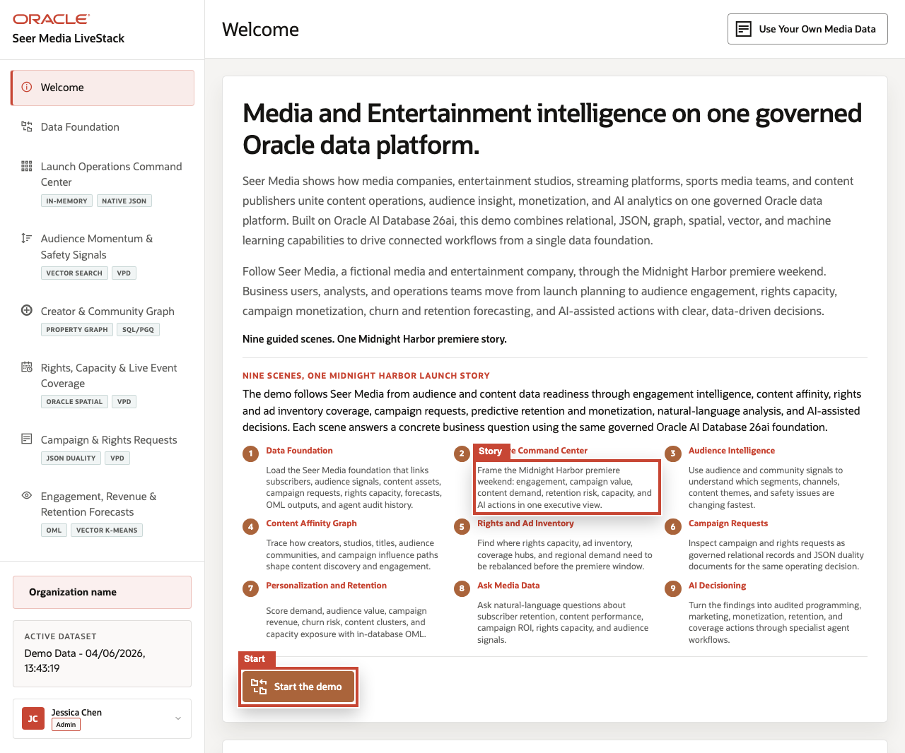

# Media & Entertainment Content Intelligence LiveStack Guide

## Introduction

As streaming, advertising, creator-led discovery, live sports, and fandom engagement continue to converge, media organizations need faster ways to connect audience signals, rights, content, campaigns, and monetization decisions.
The **Seer Media LiveStack** shows how those signals can come together so teams can spot demand shifts earlier, understand the evidence behind a decision, and act with more confidence.

This runbook supports the **Seer Media LiveStack Demo**. The demo shows how media organizations can connect audience intelligence, content operations, monetization, rights management, analytics, and AI workflows through one governed data foundation.

In the demo, Seer Media follows the **Midnight Harbor** launch weekend. Business users and technical stakeholders move from launch planning into audience engagement, content recommendation, creator and community analysis, rights and live-event capacity, campaign request operations, predictive revenue and retention analytics, conversational data access, and AI-assisted media operations.

Estimated Demo Time: **90 minutes**

Each scene is designed to take between **5 and 10 minutes**.

### Objectives

In this scene, you will learn how the media story is organized, which business functions the page introduces, and how the rest of the runbook follows one connected launch-weekend operating thread.

### Prerequisites

Before you begin, confirm that you can open the running **Seer Media LiveStack** in a modern browser. No coding or database administration knowledge is required for the guided business workflow.

**Note:** **Podman** and **Podman Compose** are required only if you plan to run the portable LiveStack locally in the download lab.

## Demo Flow

- **Scene 1:** Seer Media Control Tower.
- **Scene 2:** Seer 26ai Media Data Foundation.
- **Scene 3:** Content Revenue and Operations Dashboard.
- **Scene 4:** Audience and Market Signals.
- **Scene 5:** Creator Influence Network.
- **Scene 6:** Rights and Distribution Coverage.
- **Scene 7:** Campaign Orders and Rights Cases.
- **Scene 8:** Predictive Demand and Revenue Analytics.
- **Scene 9:** Ask Seer Media Data.
- **Scene 10:** Seer Media Agent Console.
- **Scene 11:** Use Your Own Media Data.
- **Conclusion and business outcomes.**
- **Download and run the portable Media LiveStack.**

## Learn More

- [Oracle AI Database 26ai documentation](https://docs.oracle.com/en/database/oracle/oracle-database/26/index.html)
- [Oracle AI Agent Memory](https://www.oracle.com/database/ai-agent-memory/)
- [Oracle AI Vector Search](https://www.oracle.com/database/ai-vector-search/)
- Oracle Spatial and Graph documentation: [Oracle Spatial](https://docs.oracle.com/en/database/oracle/oracle-database/26/spatl/toc.htm) and [Oracle Property Graph](https://docs.oracle.com/en/database/oracle/property-graph/26.2/index.html)
- [Oracle Machine Learning for SQL documentation](https://docs.oracle.com/en/database/oracle/machine-learning/oml4sql/tasks.html)
- [Oracle REST Data Services documentation](https://docs.oracle.com/en/database/oracle/oracle-rest-data-services/25.4/orddg/index.html)
- [Oracle LiveLabs catalog](https://livelabs.oracle.com/)

## Credits & Build Notes
- **Author** - Oracle LiveLabs Team
- **Last Updated By/Date** - Oracle LiveLabs Team, 2026-06-04
