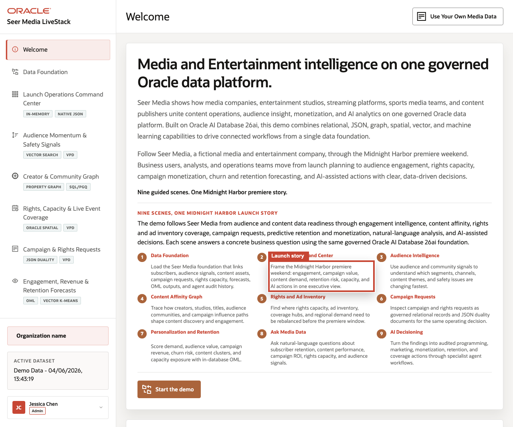
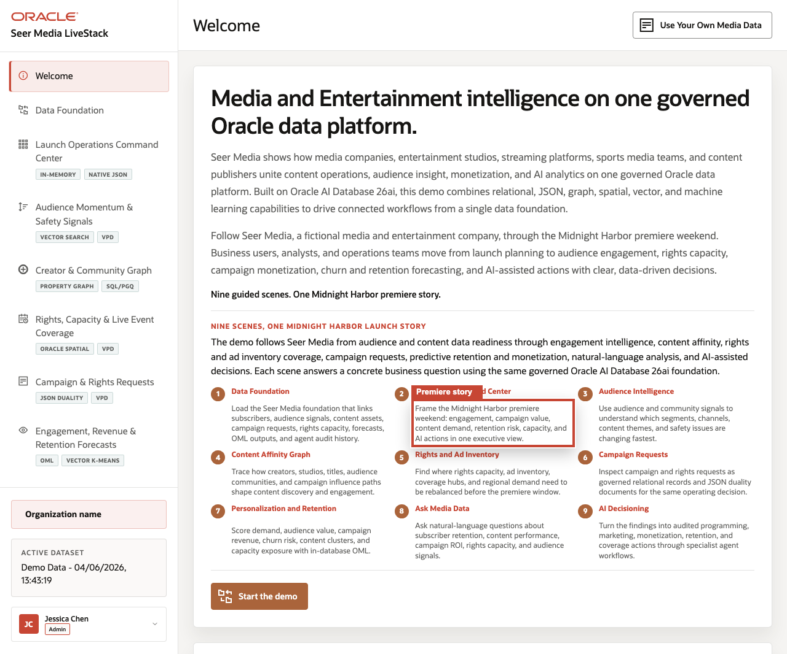
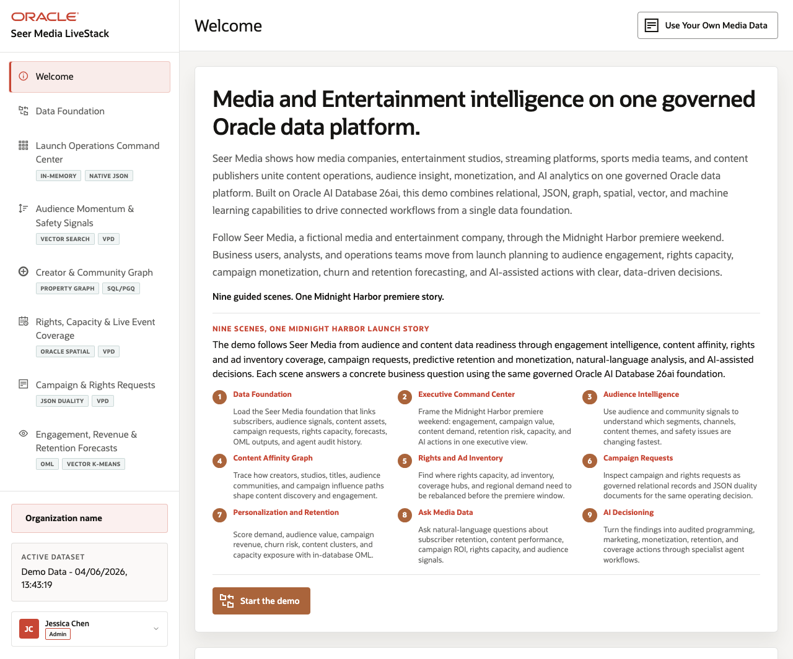
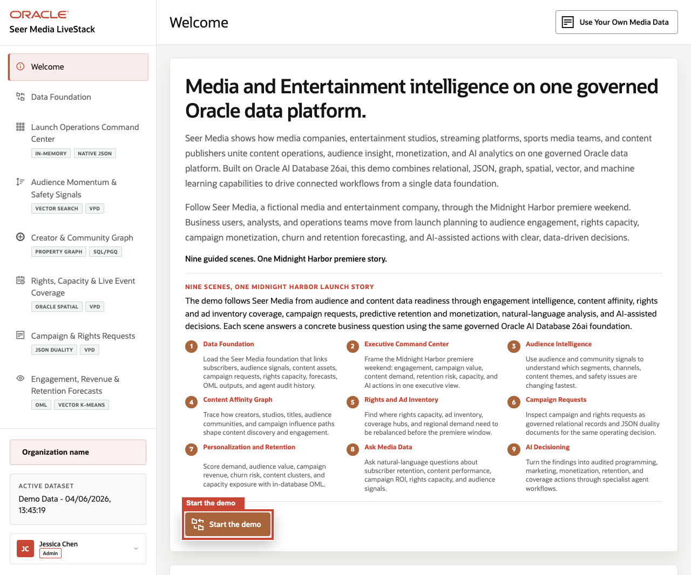

# Scene 1 Seer Media Control Tower

## Introduction

This opening scene gives users a roadmap for the media journey. The carousel previews the workflows covered in the LiveStack, so the audience can see how the walkthrough moves from launch operations to audience intelligence, creator influence, rights coverage, analytics, and AI-assisted decisions.

Use this page to explain who the demo is for: content strategists, streaming operators, audience-growth leaders, ad-sales teams, rights managers, and AI stakeholders who need a connected operating picture.

Estimated Time: **5 minutes**

### Objectives

In this scene, you will learn how the media story is organized, which business functions the page introduces, and how the rest of the runbook follows one connected launch-weekend operating thread.

## Task 1: Review the launch story

Perform the following set of steps to understand how audience demand, content performance, creator engagement, rights readiness, and monetization decisions connect during a major content release.

1. Open the running Seer Media LiveStack application.
2. Review the headline **Media & Entertainment intelligence on one governed Oracle data platform**.
3. Read the opening copy about Seer Media and the Midnight Harbor premiere weekend.
4. Explain that the demo connects studios, streamers, sports media teams, game publishers, ad-sales teams, and operations teams on one governed platform.

    

- Callout 1 highlights the **Midnight Harbor** launch narrative
- Callout 2 highlights the primary action that moves the user into the guided demo.

Use this page to set the audience's expectation. The demo will show how content operations, audience insight, monetization, rights capacity, and AI analytics can share the same Oracle AI Database 26ai foundation.

## Task 2: Review the use case carousel

Perform the following set of steps so the audience understands the complete media operating journey. Each card previews a business problem the demo will address, such as launch performance, audience momentum, creator influence, rights coverage, campaign operations, analytics, or AI-assisted action.

1. Scroll to **Key Media & Entertainment Use Cases Featured**.
2. Review the visible carousel cards for **Launch Operations Command Center**, **Audience Momentum & Safety Signals**, and **Creator & Community Graph**.
3. Click the right carousel arrow to review the remaining use case groups.
4. Use the carousel dots or arrows to return to the first group if needed.

    

The carousel introduces the full media operating model: launch KPIs, campaign performance, audience momentum, content demand, trust and safety signals, creator influence, rights capacity, campaign requests, predictive forecasts, conversational data access, and agent-assisted actions.

## Task 3: Continue the demo

Perform the following set of steps to establish the governed media dataset that supports every later workflow.

1. Click **Start the demo**.

    

2. Confirm the demo moves to **Data Foundation**.

Use this transition to explain that the welcome page is the orientation layer. The next scene prepares the governed Seer Media dataset that powers every later workflow.

## Credits & Build Notes
- **Author** - Oracle LiveLabs Team
- **Last Updated By/Date** - Oracle LiveLabs Team, 2026-06-04
