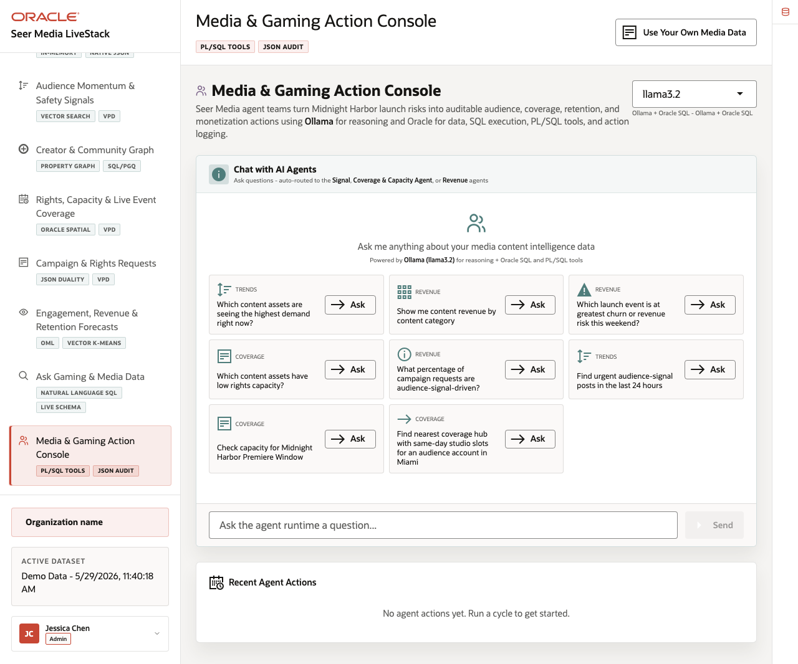
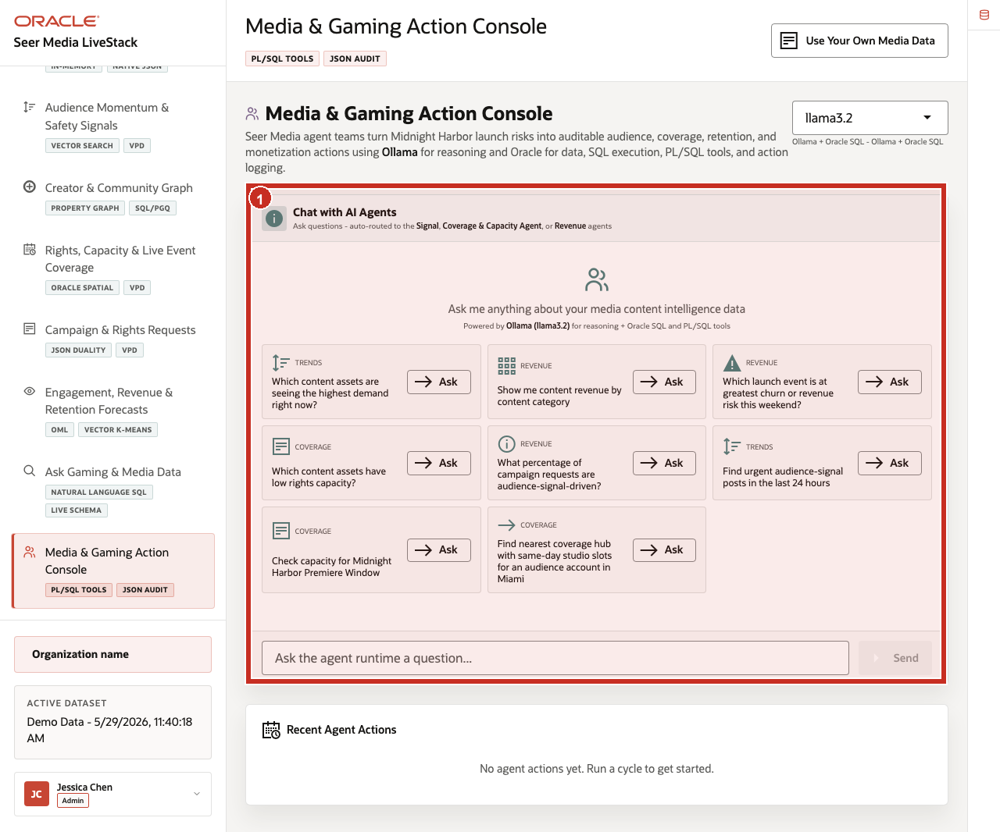
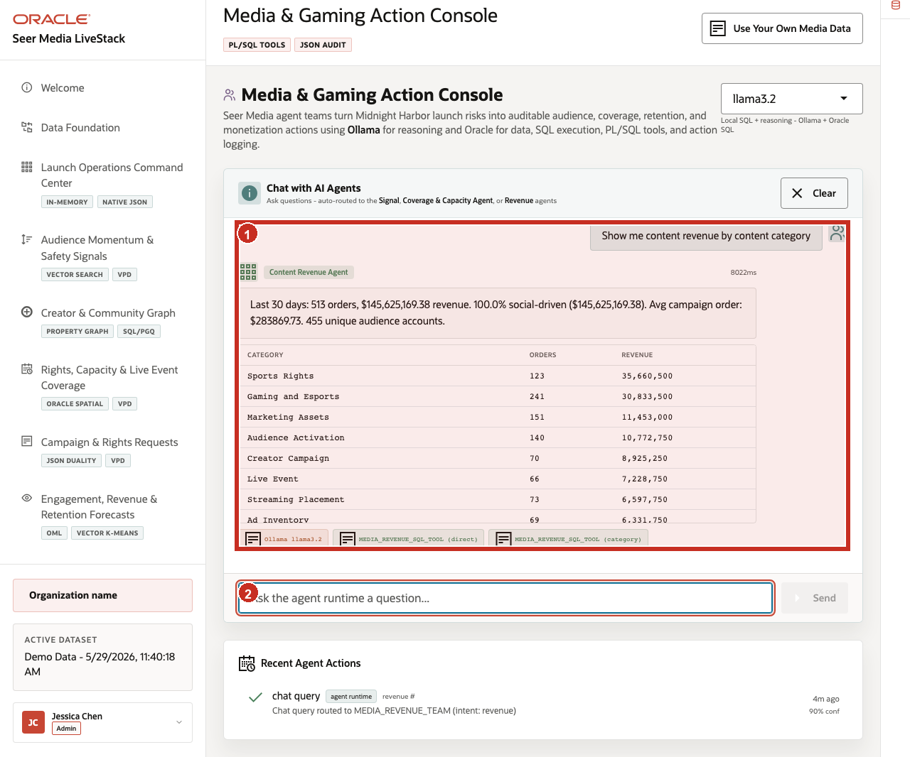
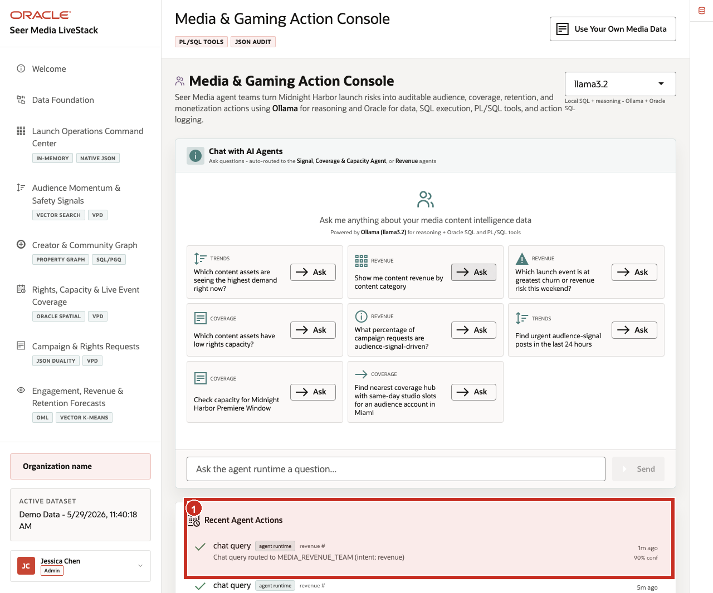

# Scene 10 Seer Media Agent Console

## Introduction

A media operations leader, campaign analyst, rights-capacity planner, retention manager, or AI platform owner uses this page to see how agentic assistance can support day-to-day media decisions. This persona is not only interested in whether an AI agent can answer a question. They need to know which specialist path handled the request, which tools were used, what data was returned, and whether the action was recorded for later review.

This is difficult to implement when AI agents operate as black boxes outside the operational data platform. Media teams may get a recommendation, but not the routing decision, SQL or PL/SQL tool path, confidence, or audit record behind it.

Oracle AI Database helps address these challenges by keeping the source data, SQL execution, PL/SQL tools, and durable action logging in the database. In this LiveStack Demo, the app orchestrates the agent workflow, Ollama provides reasoning, and Oracle AI Database 26ai executes the governed data operations.

Estimated Time: 10 minutes

### Objectives

In this scene, you will:
- Review the **Media & Gaming Action Console** workspace and runtime profile.
- Review the trends, revenue, and coverage example questions.
- Run a content revenue agent question.
- Inspect the agent response and returned revenue table.
- Review the **Recent Agent Actions** audit trail.
- Understand why observable agent behavior matters for enterprise media workflows.

## Task 1: Review the agent console workspace

1. Click **Media & Gaming Action Console** in the sidebar.
2. Review the runtime profile selector. The current demo uses **llama3.2** through Ollama-backed reasoning.
3. Review the example questions in the agent workspace.
4. Review **Recent Agent Actions** below the workspace.
5. Focus on the revenue example: **Show me content revenue by content category**.

    

Use this opening view to explain the role of the page. The user is not looking at a generic chatbot. They are looking at an operational agent surface where media questions are routed to specialist paths such as signal review, coverage and capacity, revenue analysis, and retention follow-up.

## Task 2: Run the content revenue agent question

1. Click **Ask** on **Show me content revenue by content category**.

    

Callout 1 highlights the agent response and returned revenue table. Callout 2 highlights the runtime and tool evidence below the response.

2. Review the agent response at the top of the chat output.
3. Review the returned category, order count, and revenue table.
4. Review the tool and runtime badges below the response.

In the current seeded dataset, the agent routes the request to the **Content Revenue Agent** path and returns the last 30 days of revenue by category. The visible response shows **513** orders, about **$145.6M** in revenue, and categories such as **Sports Rights**, **Gaming and Esports**, **Marketing Assets**, **Audience Activation**, **Creator Campaign**, **Live Event**, **Streaming Placement**, and **Ad Inventory**. The response exposes the Ollama runtime and media revenue SQL tool path.

This is the data point to emphasize during the demo. The agent did more than answer a text question. It classified the revenue intent, queried governed media data, returned a structured table, and exposed enough runtime information for an operator to understand the path.

## Task 3: Review the agent action audit trail

1. Scroll to **Recent Agent Actions**.

    

2. Review the newest action row.
3. Confirm that the row shows a **chat query** routed to the media revenue agent path.
4. Review the confidence value.

In the current seeded dataset, the completed chat action is logged with **90%** confidence and a route to `MEDIA_REVENUE_TEAM`. This is the governance point of the scene: agent decisions should be observable after the conversation. The page shows that interactions are not just transient chat messages; they are written into the action history.

The value of Oracle AI Database is that the agent workflow stays connected to governed operational data. The AI runtime can reason and orchestrate, while Oracle remains responsible for data access, SQL and PL/SQL execution, spatial and operational calculations, and durable audit records.

You can move to the next scene.

## Credits & Build Notes
- **Author** - Oracle LiveLabs Team
- **Last Updated By/Date** - Oracle LiveLabs Team, 2026-05-29
