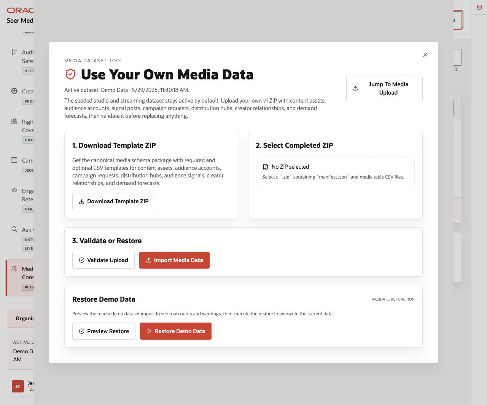
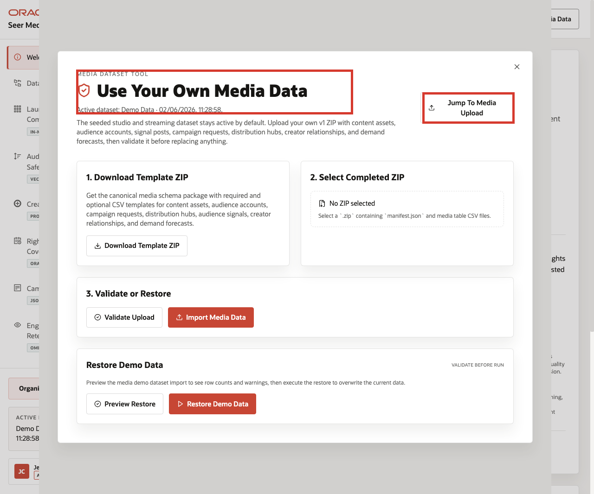
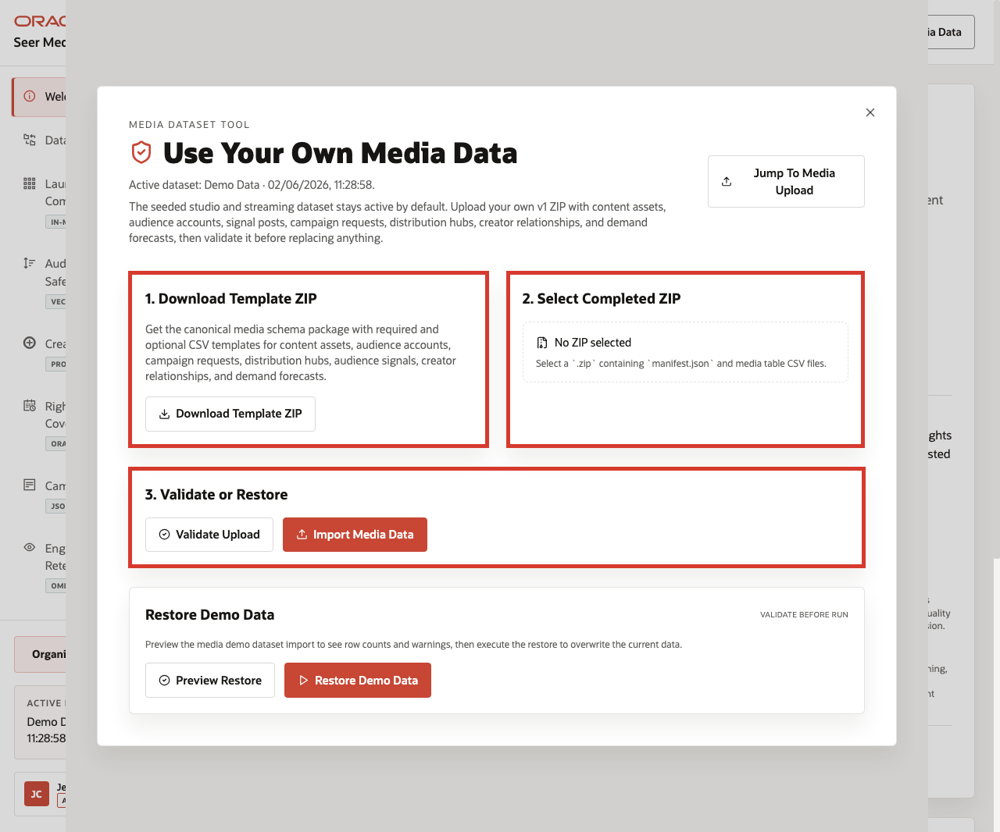
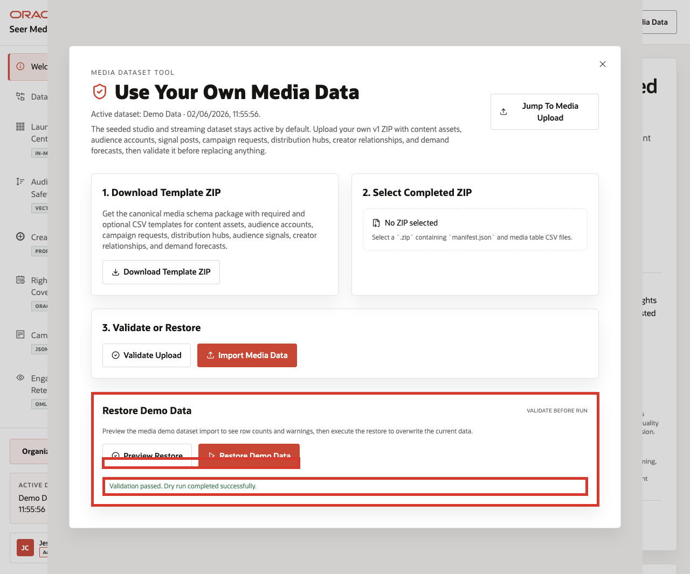

# Scene 11 Use Your Own Media Data

## Introduction

**Use Your Own Media Data** shows how teams can safely test custom datasets while preserving a repeatable demo experience and a known-good baseline. The workflow supports downloading a template ZIP, selecting a completed ZIP, validating it, uploading it, previewing the seeded restore, and restoring the bundled demo data.

The LiveStack becomes more relevant when organizations can map the demo pattern to their own content catalogs, audience segments, campaign workflows, rights regions, and operational terminology.
 - A streaming platform might bring content titles, subscriber segments, and viewing signals.
 - A studio might bring release windows, campaign orders, and rights regions.
 - A sports network might bring highlight packages, ad inventory, and market demand.

The application makes that workflow explicit while keeping the seeded Seer Media data available as a known-good baseline. When a refresh succeeds, the backend also records one immutable usage telemetry event through Object Storage so demo refresh usage can be measured without changing the user workflow or relying on a shared counter file.

Estimated Time: **10 minutes**

### Objectives

In this scene, you will learn how custom media data can be introduced safely while maintaining governance, repeatability, and rollback capability.

**Important:** Use only synthetic, masked, or approved sample media data. Do not upload proprietary audience records, restricted subscriber information, contractual rights data, or other sensitive production datasets.

## Task 1: Open the dataset tool

Perform the following set of steps to show how media organizations can safely test custom datasets while preserving the seeded baseline.

1. From any application scene, click **Use Your Own Media Data** in the top bar.
2. Review the modal title and active dataset line.
3. Review the main sections: **Download Template ZIP**, **Select Completed ZIP**, **Validate or Restore**, and **Restore Demo Data**.

    

In the current demo, the modal shows the active dataset as **Demo Data** and provides a workflow for a v1 ZIP that contains `manifest.json` and media table CSV files.

## Task 2: Review the template and upload workflow

Perform the following set of steps to show how custom datasets remain repeatable, predictable, and easier to troubleshoot.

1. Click **Download Template ZIP** to download the canonical schema package.
2. Review **Select Completed ZIP**. The control expects a `.zip` containing `manifest.json` and media table CSV files.
3. Review the **Validate Upload** and **Import Media Data** actions.
4. Validation helps ensure the uploaded dataset matches the expected structure before any operational data is replaced.

    

The template includes required and optional CSV structures for content assets, audience accounts, campaign requests, distribution hubs, audience signals, creator relationships, and demand forecasts.

This workflow helps keep custom demos repeatable: the template sets the expected structure, validation checks the completed ZIP before import, and import remains an explicit action.

## Task 3: Preview or restore the seeded dataset

Perform the following set of steps to return the environment to a known-good baseline after testing custom media data.

1. In **Restore Demo Data**, click **Preview Restore**.
2. Review the dry-run validation result.
3. If you need to return the demo to the seeded baseline, click **Restore Demo Data** only in a disposable or demo environment.
4. Close the dataset manager when finished.

    

In the hosted demo captured for this runbook, **Preview Restore** returned **Validation passed. Dry run completed successfully.** The restore preview validates the seeded media package before replacing anything.

Teams can experiment with custom datasets while retaining a trusted baseline that allows demonstrations to be repeated consistently. The refresh workflow remains fail-open: if telemetry is unavailable, the dataset restore still completes and the demo remains usable.

You can move to the **Conclusion** or the **Download** lab when you want to run the Media LiveStack locally.

## Credits & Build Notes
- **Author** - Oracle LiveLabs Team
- **Last Updated By/Date** - Oracle LiveLabs Team, 2026-06-04
