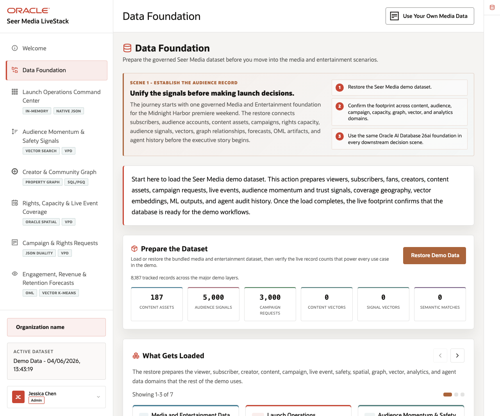
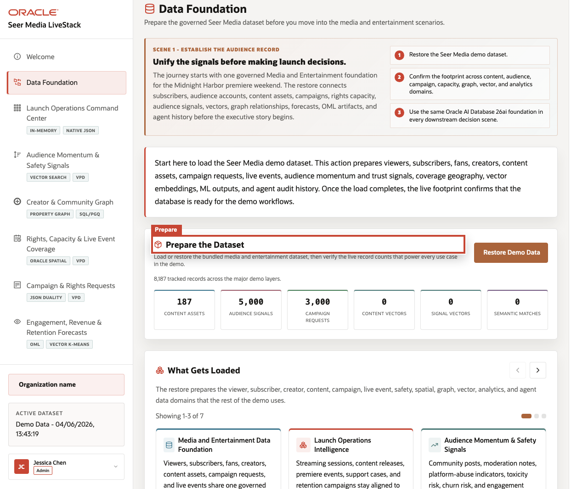
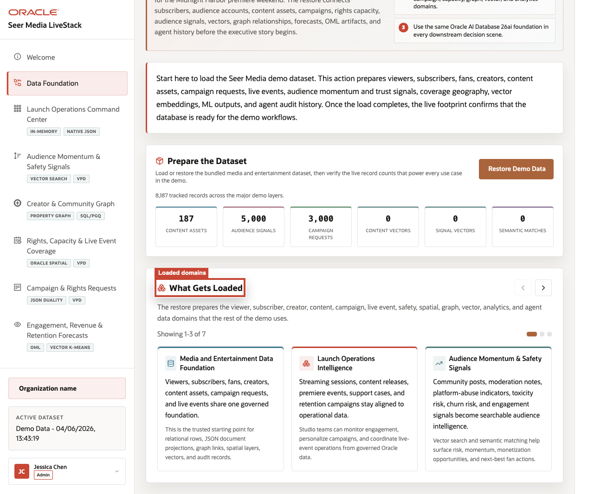
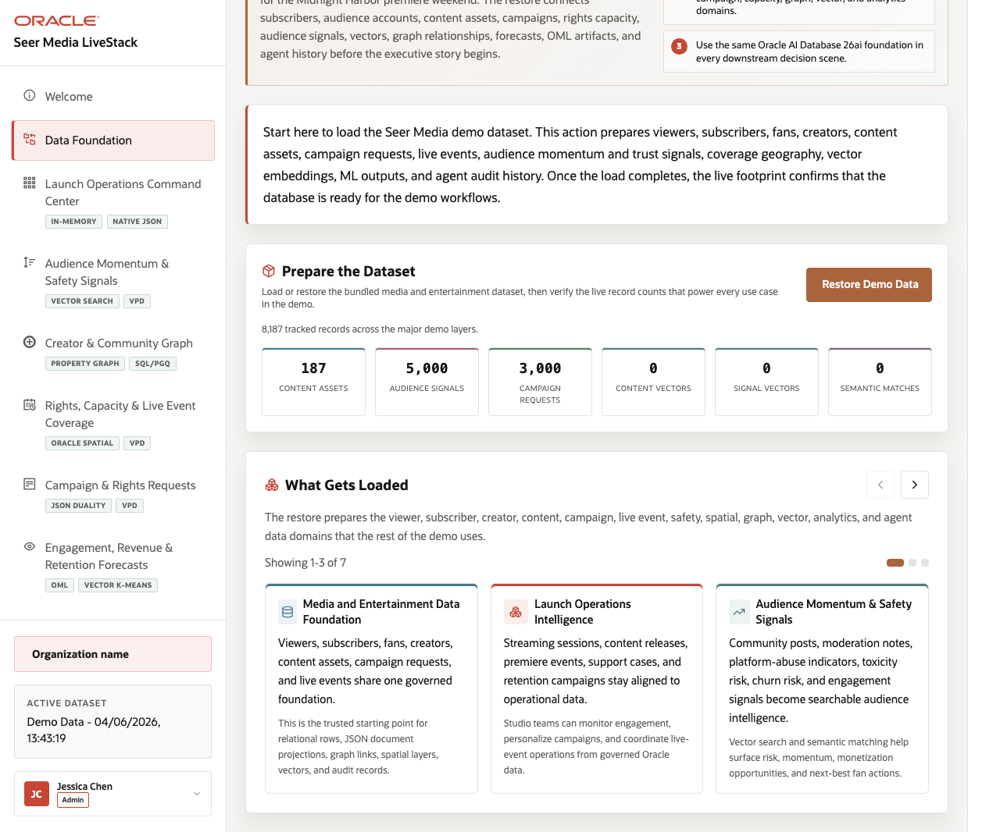

# Scene 2 Seer 26ai Media Data Foundation

## Introduction

This scene prepares the trusted **Seer Media** dataset used throughout the demo. Loading or restoring the data gives every later screen the same governed starting point, so dashboards, audience signals, creator networks, rights coverage, analytics, and AI actions all reflect the same media data foundation.

Use this scene to show that later pages are not separate demos. They are different media workflows running on one governed data foundation.

Players, viewers, subscribers, fans, creators, content assets, campaign requests, live events, audience momentum signals, trust and safety signals, coverage geography, vector embeddings, ML outputs, and agent audit history are all prepared from the same Oracle-backed foundation.

Estimated Time: **5 minutes**

### Objectives

In this scene, you will learn how the page establishes the governed media baseline, what evidence confirms the environment is ready, and why that shared foundation matters for the later scenes.

## Task 1: Prepare the dataset

Perform the following set of steps so every later workflow starts from the same trusted media baseline. This makes audience signals, creator analysis, rights planning, campaign operations, analytics, and AI actions easier to compare and trust.

1. From the welcome page, click **Start the demo**, or click **Data Foundation** in the sidebar.
2. In **Prepare the Dataset**, click **Restore Demo Data** only when the hosted or local demo needs to return to the seeded baseline.
3. Wait for the operation to complete.
4. Review the record counts below the action.

    

In the current seeded dataset, the page shows **14,796** tracked records across the major demo layers, including 187 content assets, **5,000** audience signals, **3,000** campaign requests, **187** content vectors, **5,000** signal vectors, and **1,422** semantic matches.

Use these counts to frame the demo. The user is not loading a single table for a dashboard. The page prepares the operational, analytical, spatial, graph, vector, and audit data that each later scene uses.

**Note:** Sample values may change after data refreshes or rebuilds. Verify live output before presenting, then explain the business takeaway.

## Task 2: Review what gets loaded

Perform the following set of steps to show that the demo uses recognizable media data: content assets, audience accounts, campaign requests, creator relationships, live events, audience signals, rights coverage, vectors, machine learning outputs, and agent actions.

1. Scroll to **What Gets Loaded**.
2. Review the first carousel cards: **Media and Entertainment Data Foundation**, **Launch Operations Intelligence**, and **Audience Momentum & Safety Signals**.
3. Use the carousel arrow to review the remaining data groups.
4. Review implementation details only after the business story is clear. Use the **Oracle Internals** rail to connect visible outcomes to database capabilities.

    

The carousel explains the shared data model in business terms: content assets, audience accounts, campaign requests, creators, live events, moderation and engagement signals, rights capacity, spatial coverage, vectors, ML forecasts, and agent actions all come from one governed foundation.

The Oracle implementation reference ties that story to relational data, JSON Duality Views, property graph, Oracle Spatial, vector search, in-database ML, and the agent audit trail.

## Task 3: Connect the foundation to downstream scenes

Use this page as the bridge into the operating story. The same governed foundation will support launch operations, audience intelligence, creator networks, rights planning, campaign workflows, analytics, conversational access, and AI agent actions.

1. Explain that the command center will summarize the foundation as launch, campaign, revenue, and demand indicators.
2. Explain that audience signals will use vector search over content and signal embeddings prepared here.
3. Explain that creator graph, rights coverage, campaign requests, analytics, Ask Data, and agent pages all read from the same governed foundation.

    

The business value is that teams can make decisions from connected, governed data. **Oracle AI Database** provides the shared foundation that keeps content operations, analytics, and AI workflows aligned.

*You can move to the next scene.*

## Credits & Build Notes
- **Author** - Oracle LiveLabs Team
- **Last Updated By/Date** - Oracle LiveLabs Team, 2026-06-04
